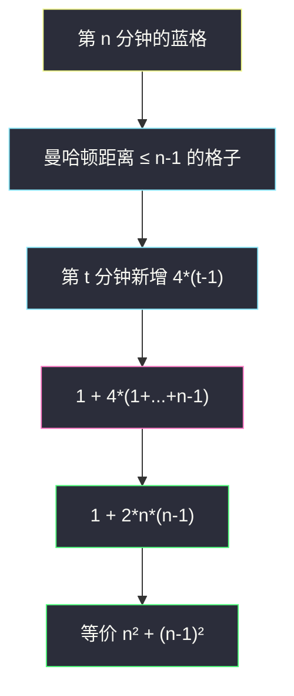
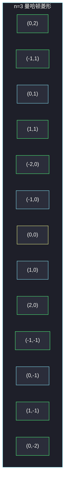

# 统计染色格子数（菱形公式）

## 一、问题描述

无限二维网格，初始全未染色。第 1 分钟把**任意一格**涂蓝；之后每一分钟，所有与蓝色格子**四方向相邻**的未染色格子被涂蓝。返回 `n` 分钟后蓝色格子数目。

> 🔗 LeetCode 2579：https://leetcode.cn/problems/count-total-number-of-colored-cells/
>
> 数据范围：`1 ≤ n ≤ 10^5`。
>
> 📚 灵茶题单：**§7.8 其他**（1356 分）。图形是曼哈顿菱形。第 `t` 分钟新增 `4*(t-1)` 格；总数有闭式 `1 + 2*n*(n-1)`，也等于 `n² + (n-1)²`。`n=10^5` 必须 `O(1)`，不要模拟。

**示例 1**

```
输入：n = 1
输出：1
解释：1 分钟后只有中心 1 格。
```

**示例 2**

```
输入：n = 2
输出：5
解释：中心 1 格加上下左右 4 格。
```

**直观理解**

以第一格为原点，第 `n` 分钟染上的是所有曼哈顿距离 `≤ n-1` 的格子，外形是菱形（正方形旋转 45°）。边长每分钟往四个尖角各长一格，一圈正好多 `4` 的倍数。

---

## 二、暴力解法

用集合存已染色坐标，每分钟把当前所有蓝格的四邻塞进新集合。

```python
class Solution:
    def coloredCells(self, n: int) -> int:
        blue = {(0, 0)}
        dirs = ((1, 0), (-1, 0), (0, 1), (0, -1))
        for _ in range(n - 1):
            nxt = set(blue)
            for x, y in blue:
                for dx, dy in dirs:
                    nxt.add((x + dx, y + dy))
            blue = nxt
        return len(blue)
```

### 🔴 瓶颈在哪里

第 `n` 分钟约有 `2n²` 个格子，每分钟还要扫当前全部蓝格，总时间大约 `O(n³)`，`n=10^5` 不可接受。格子坐标范围也随 `n` 涨，集合内存会爆。必须找递推 / 通项。

---

## 三、优化探索（核心章节）

> 📚 本题在灵茶题单中属于 **§7.8 其他**。网格计数题先画前几分钟，找「每分钟新增多少」，再对等差数列求和。

### 3.1 每分钟新增多少

把第一格当中心：

| 分钟 t | 新增 | 累计 | 形状 |
|--------|------|------|------|
| 1 | 1 | 1 | 单点 |
| 2 | 4 | 5 | 十字 |
| 3 | 8 | 13 | 小菱形 |
| 4 | 12 | 25 | 更大一圈 |

从第 2 分钟起，新增格子正好是菱形的一圈边界：四个方向各 `t-1` 格，共 `4*(t-1)`。第 1 分钟可看成「新增 1，不是 4×0」。于是：

`总数(n) = 1 + Σ_{t=2..n} 4*(t-1) = 1 + 4 * (1+2+…+(n-1))`

`1+2+…+(n-1) = (n-1)n/2`，所以

`总数 = 1 + 4 * (n-1)n / 2 = 1 + 2*n*(n-1)`

另一个几何看法：菱形可以拆成「边长 n 的正方形」叠上「边长 n-1 的正方形」——横着数是 `n + (n-1) + … + 1 + … + (n-1)` 再对竖向对称，整理得 `n² + (n-1)²`。

验证：`n² + (n-1)² = 2n² - 2n + 1`，`1 + 2n(n-1) = 2n² - 2n + 1`，相同。



### 3.2 为什么不能模拟

`n=10^5` 时格子约 `2×10^{10}`，连 `O(n)` 递推 `ans += 4*(t-1)` 循环 `10^5` 次虽能过，但没有必要；公式是 `O(1)`。Python 整数任意精度，`2*n*(n-1)` 不会溢出；Java/C++ 要用 `long`，`n*n` 在 `int` 上 `10^{10}` 已经爆。

### 3.3 一句话核心

> **菱形第 t 圈 4*(t-1) 格，总数 = 1 + 2*n*(n-1) = n² + (n-1)²。**

---

## 四、代码实现

### Python（主解：闭式）

```python
class Solution:
    def coloredCells(self, n: int) -> int:
        return 1 + 2 * n * (n - 1)
```

等价写法，几何拆分更直观：

```python
class Solution:
    def coloredCells(self, n: int) -> int:
        return n * n + (n - 1) * (n - 1)
```

**变量含义**

| 写法 | 含义 |
|------|------|
| `2 * n * (n - 1)` | `4 * (1+…+(n-1))`，从第 2 分钟起新增的总和 |
| `n * n` | 一个边长 n 的轴对齐正方形格点数（几何拆法之一） |
| `(n - 1) * (n - 1)` | 补上菱形多出来的另一层正方形 |

递推版（不推荐，但能对拍）：

```python
class Solution:
    def coloredCells(self, n: int) -> int:
        ans = 1
        for t in range(2, n + 1):
            ans += 4 * (t - 1)
        return ans
```

---

## 五、具体例子演示

**示例 1**：`n = 1`。公式 `1 + 2*1*0 = 1`，或 `1² + 0² = 1`。对拍官方。

**示例 2**：`n = 2`。

| 分钟 t | 新增 4*(t-1) | 累计 |
|--------|----------------|------|
| 1 | 1（中心，不是 0） | 1 |
| 2 | 4 | 5 |

`1 + 2*2*1 = 5`，`2² + 1² = 5`。对拍官方。

**再算 n=3、n=4**（题目配图里的第 3 分钟，任务书未给输出，用公式自洽）：

| n | 代入 1+2n(n-1) | n²+(n-1)² | 逐步累计 |
|---|----------------|-----------|----------|
| 3 | 1+2*3*2=13 | 9+4=13 | 5+8=13 |
| 4 | 1+2*4*3=25 | 16+9=25 | 13+12=25 |
| 5 | 1+2*5*4=41 | 25+16=41 | 25+16=41 |

逐步跟踪 n=4 的每一圈：

| 圈（分钟） | 新增格子 | 备注 |
|------------|----------|------|
| t=1 | 1 | 原点 |
| t=2 | 4 | 上下左右 |
| t=3 | 8 | 四个斜边，每边 2 格 |
| t=4 | 12 | 每边 3 格 |



黄是第 1 分钟，青是第 2 分钟 4 格，绿是第 3 分钟新增 8 格，合计 13。

**边界**：`n=10^5` 时 `1 + 2*10^5*99999 = 19_999_800_001`，Python 直接算；其他语言记得以 64 位整数乘。

---

## 六、复杂度分析

| 方法 | 时间 | 空间 | 说明 |
|------|------|------|------|
| 集合模拟扩散 | `O(n³)` 量级 | `O(n²)` | 超时、超内存 |
| 循环累加每圈 | `O(n)` | `O(1)` | 能过，非必要 |
| 闭式（主解） | `O(1)` | `O(1)` | 必须掌握 |

---

## 七、对比总结

| 维度 | 模拟 | 递推每圈 | 闭式 |
|------|------|----------|------|
| 看出菱形 | 能 | 能 | 能 |
| n=1e5 | 否 | 勉强 | 是 |
| 溢出 | 无（Python） | 同 | Java 要用 long |

**易错点**

1. **第 1 分钟套用 `4*(t-1)` 当 0**：忘记单独加中心 1，答案少 1。公式里的那个 `1+` 就是它。
2. **当成八方向**：题目是四邻，菱形不是正方形（若八方向会是切比雪夫正方形）。
3. **`n*n` 用 32 位整数**：`n=1e5` 时 `n²` 已经 `10^{10}`。
4. **曼哈顿距离写成 `≤ n`**：第 n 分钟半径是 `n-1`。`n=1` 半径 0。
5. **返回新增而不是累计**。

---

## 八、举一反三

| 题目 | 关系 |
|------|------|
| [1030. 距离顺序排列矩阵单元格](https://leetcode.cn/problems/matrix-cells-in-distance-order/) | 同一套曼哈顿层 |
| [463. 岛屿的周长](https://leetcode.cn/problems/island-perimeter/) | 四邻染色 / 边界计数 |
| [885. 螺旋矩阵 III](https://leetcode.cn/problems/spiral-matrix-iii/) | 每层边长按 1,1,2,2,… 涨，类似「按圈走」 |
| [812. 最大三角形面积](https://leetcode.cn/problems/largest-triangle-area/) | 网格几何计数另一支 |
| [223. 矩形面积](https://leetcode.cn/problems/rectangle-area/) | 用公式代替模拟扫格子 |

**思想迁移**

- 扩散 / 层数问题先写 `n=1,2,3,4` 的新增列，能求和就不要 BFS。
- 口诀：**「一圈四个边，总数平方和；n 大用公式。」**
