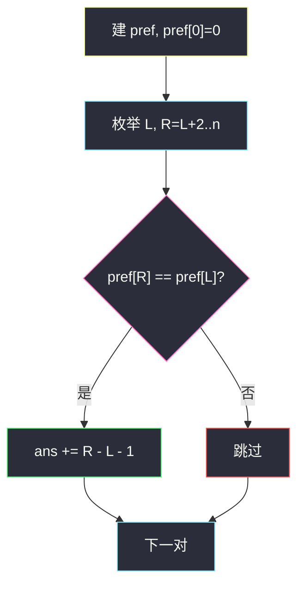
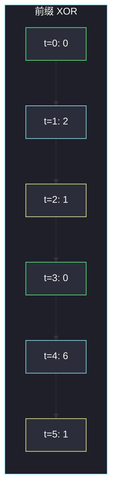

# 形成两个异或相等数组的三元组数目（前缀 XOR 相等 · 中间 j 随便切）

## 一、问题描述

给你整数数组 `arr`。统计下标三元组 `(i, j, k)` 的个数，满足：

- `0 ≤ i < j ≤ k < n`
- `a = arr[i] XOR arr[i+1] XOR … XOR arr[j-1]`
- `b = arr[j] XOR arr[j+1] XOR … XOR arr[k]`
- `a == b`

注意 `j` 可以等于 `k`（右边只含一个数）；左边至少含 `arr[i]`，所以 `j ≥ i+1`。

> 🔗 LeetCode 1442：https://leetcode.cn/problems/count-triplets-that-can-form-two-arrays-of-equal-xor/
>
> 数据范围：`1 ≤ n ≤ 300`，`0 ≤ arr[i] < 2^31`。`O(n²)` 可过。
>
> 📚 灵茶题单：**二、异或（XOR）的性质**（1525 分）。两段 XOR 相等 ⇔ 整段 XOR 为 0 ⇔ 两个前缀 XOR 相等。

**示例 1**

```
输入：arr = [2,3,1,6,7]
输出：4
解释：四个三元组是 (0,1,2)、(0,2,2)、(2,3,4)、(2,4,4)。
```

**示例 2**

```
输入：arr = [1,1,1,1,1]
输出：10
解释：所有长度 ≥ 2 且 XOR 为 0 的段上，中间切点随便选。
```

**直观理解**

`a == b` 两边再 XOR 一次：`a ^ b = 0`，而 `a ^ b` 正好是 `arr[i] ^ … ^ arr[k]`。所以问题变成：有多少 `(i,k)` 使子数组 `[i..k]` 的 XOR 为 0，且这段长度至少 2；对每一对这样的 `(i,k)`，切点 `j` 可以是 `i+1, i+2, …, k` 共 `k-i` 个。

---

## 二、暴力解法

三重循环枚举 `i < j ≤ k`，用前缀 XOR `O(1)` 取出两段比较。

```python
class Solution:
    def countTriplets(self, arr: list[int]) -> int:
        n = len(arr)
        pref = [0] * (n + 1)
        for i, x in enumerate(arr):
            pref[i + 1] = pref[i] ^ x
        ans = 0
        for i in range(n):
            for j in range(i + 1, n):
                for k in range(j, n):
                    a = pref[j] ^ pref[i]
                    b = pref[k + 1] ^ pref[j]
                    if a == b:
                        ans += 1
        return ans
```

`n ≤ 300`，`O(n³)` 大约 2.7×10^7 次，卡着过或超时取决于语言。真正该优化的是最内层：`a==b` 一旦成立，**所有合法 `j` 都成立**，不必逐个 `j` 检查。

### 🔴 瓶颈在哪里

`a == b` 不依赖具体的 `j`，只依赖整段 `[i..k]`。固定两端后，`j` 的贡献是一段连续整数的个数 `k-i`。枚举两端即可 `O(n²)`。

---

## 三、优化探索（核心章节）

> 📚 本题在灵茶题单中属于 **二、异或（XOR）的性质**。前缀 XOR：`XOR[l..r] = pref[r+1] ^ pref[l]`。`pref[0] = 0`。

### 3.1 相等 ⇔ 整段为 0 ⇔ 前缀相等

```
a = pref[j] ^ pref[i]
b = pref[k+1] ^ pref[j]
a == b
⇔ (pref[j] ^ pref[i]) == (pref[k+1] ^ pref[j])
⇔ pref[i] == pref[k+1]     （两边再 XOR pref[j]，j 消掉了）
⇔ XOR[i..k] == 0
```

`j` 从公式里消失：只要整段 XOR 是 0，中间怎么切两段都相等（包括一边特别短）。

约束 `i < j ≤ k` 要求这段至少 2 个元素，即 `k ≥ i+1`。对固定的 `(i,k)`，`j` 有 `k - i` 种取法。

### 3.2 O(n²) 枚举两端

`pref` 下标 `0..n`。枚举 `L = i`、`R = k+1`（`R ≥ L+2`），若 `pref[R] == pref[L]`，答案加 `R - L - 1`（等于 `k - i`）。

### 3.3 哈希 O(n)：次数 + 下标和

枚举右端前缀下标 `R`。所有之前的 `L` 满足 `pref[L] == pref[R]` 的，贡献之和为：

`Σ (R - L - 1) = cnt · (R - 1) - Σ L`

`L = R-1` 时子数组长度 1，贡献 `R-(R-1)-1 = 0`，不必特判排除。边走边把当前 `R` 插入哈希。

主解用更好讲的 `O(n²)`；哈希作加餐。



### 3.4 一句话核心

> **两段 XOR 相等 ⇔ `pref[k+1] == pref[i]`；每个这样的两端贡献 `k-i` 个 `j`。**

---

## 四、代码实现

### Python（主解：O(n²) 枚举两端）

```python
class Solution:
    def countTriplets(self, arr: list[int]) -> int:
        n = len(arr)
        pref = [0] * (n + 1)
        for i, x in enumerate(arr):
            pref[i + 1] = pref[i] ^ x
        ans = 0
        for i in range(n):
            for k in range(i + 1, n):
                if pref[k + 1] == pref[i]:
                    ans += k - i
        return ans
```

**变量含义**

| 写法 | 含义 |
|------|------|
| `pref[t]` | `arr[0] ^ … ^ arr[t-1]` |
| `pref[k+1] == pref[i]` | 子数组 `[i..k]` XOR 为 0 |
| `k - i` | 合法切点 `j` 的个数（`i+1 .. k`） |

### Python（可选：哈希 O(n)）

```python
from collections import defaultdict

class Solution:
    def countTriplets(self, arr: list[int]) -> int:
        cnt = defaultdict(int)
        idx_sum = defaultdict(int)
        cnt[0] = 1
        idx_sum[0] = 0
        pref = ans = 0
        for r, x in enumerate(arr, start=1):
            pref ^= x
            ans += cnt[pref] * (r - 1) - idx_sum[pref]
            cnt[pref] += 1
            idx_sum[pref] += r
        return ans
```

`r` 是前缀下标 `k+1`；`cnt` / `idx_sum` 统计历史上每个前缀值的出现次数和下标和。`n ≤ 300` 时主解更清晰。

---

## 五、具体例子演示

**示例 1**：`arr = [2, 3, 1, 6, 7]`。

前缀 XOR 表：

| 下标 t | arr[t-1] | pref[t] |
|--------|----------|---------|
| 0 | — | 0 |
| 1 | 2 | 2 |
| 2 | 3 | 2^3=1 |
| 3 | 1 | 1^1=0 |
| 4 | 6 | 0^6=6 |
| 5 | 7 | 6^7=1 |

`pref[0] = pref[3] = 0`，`pref[2] = pref[5] = 1`。



绿的一对：`i=0, k=2`（`R=3`），`k-i=2`，两个 `j`：

| (i,j,k) | 左段 | 右段 | XOR |
|---------|------|------|-----|
| (0,1,2) | [2] | [3,1] | 2 与 3^1=2 |
| (0,2,2) | [2,3] | [1] | 1 与 1 |

黄的一对：`i=2, k=4`，`k-i=2`：

| (i,j,k) | 左段 | 右段 | XOR |
|---------|------|------|-----|
| (2,3,4) | [1] | [6,7] | 1 与 6^7=1 |
| (2,4,4) | [1,6] | [7] | 7 与 7 |

逐步枚举所有 `(i,k)`（只列出命中）：

| i | k | pref[i] | pref[k+1] | 相等? | 贡献 k-i | 累计 |
|---|---|--------|-----------|-------|----------|------|
| 0 | 2 | 0 | 0 | 是 | 2 | 2 |
| 2 | 4 | 1 | 1 | 是 | 2 | **4** |

其余 `i<k` 前缀都不等，贡献 0。答案 4，与官方一致。

**示例 2**：`arr = [1,1,1,1,1]`。

| t | pref[t] |
|---|---------|
| 0 | 0 |
| 1 | 1 |
| 2 | 0 |
| 3 | 1 |
| 4 | 0 |
| 5 | 1 |

偶数下标全是 0，奇数下标全是 1。所有「同奇偶、距离 ≥ 2」的前缀对都命中：

| (L, R) | R-L-1 | 含义 |
|--------|-------|------|
| (0,2) | 1 | 一段两个 1 |
| (0,4) | 3 | 四个 1 |
| (1,3) | 1 | |
| (1,5) | 3 | |
| (2,4) | 1 | |
| (3,5) | 1 | |

合计 `1+3+1+3+1+1 = 10`，与官方一致。直觉：`1^1=0`，任意偶数长度子数组 XOR 都是 0；长度为 `2m` 时 `k-i = 2m-1` 个切点。

**哈希走一遍示例 1**（对照可选代码）：

| r | pref | cnt[pref] 旧 | 贡献 `cnt*(r-1)-sum` | 累计 |
|---|------|--------------|----------------------|------|
| 1 | 2 | 0 | 0 | 0 |
| 2 | 1 | 0 | 0 | 0 |
| 3 | 0 | 1（L=0） | 1×2 - 0 = 2 | 2 |
| 4 | 6 | 0 | 0 | 2 |
| 5 | 1 | 1（L=2） | 1×4 - 2 = 2 | 4 |

同样得到 4。

**边界**：`n=1` 无法 `i<j≤k`，答案 0；`arr = [0,0]` → `pref = [0,0,0]`，`(i,k)=(0,1)` 贡献 1，三元组 `(0,1,1)`：左边 `[0]`、右边 `[0]`。

---

## 六、复杂度分析

| 方法 | 时间 | 空间 | 说明 |
|------|------|------|------|
| 三重循环 | `O(n³)` | `O(n)` | `n=300` 勉强 |
| 枚举两端（主解） | `O(n²)` | `O(n)` | 推荐默写 |
| 哈希次数 + 下标和 | `O(n)` | `O(n)` | 平均哈希，常数大一点 |

---

## 七、对比总结

| 维度 | 本题 | 560 和为 k 的子数组 | 2588 美丽子数组 |
|------|------|---------------------|-----------------|
| 前缀含义 | XOR | 加减和 | XOR |
| 命中条件 | `pref[R]==pref[L]`（差为 0） | `pref[R]-pref[L]==k` | `pref[R]==pref[L]` |
| 额外计数 | 每对两端贡献 `R-L-1` 个 j | 每对贡献 1 个子数组 | 每对贡献 1 |
| 长度 | 至少 2 | 至少 1 | 至少 1 |

**易错点**

1. **漏掉 `j==k`**：右段允许长度为 1。
2. **贡献写成 1 而不是 `k-i`**：一对两端对应多个三元组。
3. **前缀下标和数组下标混用**：`pref` 长度 `n+1`，`pref[0]=0`。
4. **以为 `j` 还要满足别的位条件**：`j` 消掉了，任意切都行。
5. **哈希时忘了先插入 `pref[0]=0`**：漏掉从下标 0 开始的段，示例 1 会少 2。

---

## 八、举一反三

| 题目 | 关系 |
|------|------|
| [2588. 统计美丽子数组数目](https://leetcode.cn/problems/count-the-number-of-beautiful-subarrays/) | 子数组 XOR = 0 的个数，一对前缀贡献 1 |
| [560. 和为 K 的子数组](https://leetcode.cn/problems/subarray-sum-equals-k/) | 同一套前缀 + 哈希，运算从 XOR 换成减 |
| [1371. 每个元音包含偶数次的最长子字符串](https://leetcode.cn/problems/find-the-longest-substring-containing-vowels-in-even-counts/) | 前缀 XOR 状态，找最早相同状态 |
| [1915. 最美子字符串的数目](https://leetcode.cn/problems/number-of-wonderful-substrings/) | 前缀位掩码 XOR，允许一位不同 |
| [1310. 子数组异或查询](https://leetcode.cn/problems/xor-queries-of-a-subarray/) | `pref[r+1] ^ pref[l]` 的直接应用 |

**思想迁移**

- XOR 两段相等，先合成一段为 0，再用前缀相等来数。
- 口诀：**「`pref[k+1]==pref[i]` 则整段可切；`j` 有 `k-i` 个。」**
