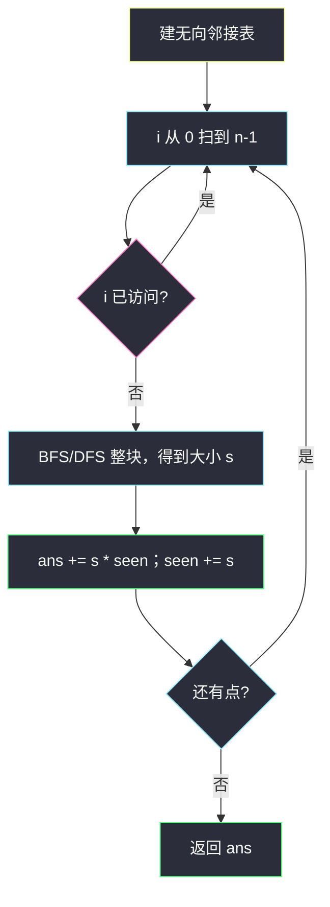
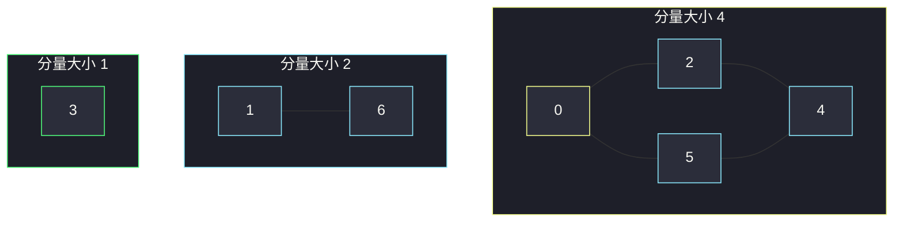

# 统计无法互相到达的点对（连通分量大小）

## 一、问题描述

`n` 个点编号 `0 .. n-1`，无向边 `edges`。求有多少无序点对 `(i, j)`（`i < j`）满足 **i 与 j 不在同一连通分量**（互相走不到）。

> 🔗 LeetCode 2316：https://leetcode.cn/problems/count-unreachable-pairs-of-nodes-in-an-undirected-graph/
>
> 数据范围：`1 ≤ n ≤ 10⁵`，边数 ≤ `2·10⁵`，无重边、无自环。
>
> 📚 灵茶题单：**图论 · §1.1 深度优先搜索（DFS）**（1604 分）。

**示例 1**

```
输入：n = 3, edges = [[0,1],[0,2],[1,2]]
输出：0
三个点一个三角形，全都互相到达。
```

**示例 2**

```
输入：n = 7, edges = [[0,2],[0,5],[2,4],[1,6],[5,4]]
输出：14
分量：{0,2,4,5} 大小 4，{1,6} 大小 2，{3} 大小 1。
跨分量无序对共 14 个。
```

**直观理解**

同一连通块里任意两点都能走到；块与块之间完全隔开。答案 = 所有「分属两块」的无序对个数。不必枚举每一对，只需要每块的 **大小**。

---

## 二、暴力解法

对每个点 `i` 做一次 DFS/BFS，数它到不了多少点，再把所有 `i` 的结果加起来除以 2（无序对算了两遍）。`n = 1e5` 时 `O(n(n+m))` 直接超时。

```python
# 伪代码：for i in range(n): 从 i 遍历，ans += n - 本块大小；最后 ans //= 2
```

### 复杂度

- **时间**：`O(n(n+m))`，1e5 不可用。
- **空间**：`O(n+m)`。

### 🔴 瓶颈在哪里

同一块里每个点看到的「块外点数」都一样。块只扫一遍，记下大小 `s`，贡献就是 `s * (n-s)`，最后别忘了无序所以要处理双倍。

---

## 三、优化探索（核心章节）

> 📚 本题在灵茶题单中属于 **§1.1 DFS**。本质是求每个连通分量大小，再组合计数。Python 递归 DFS 在 `n = 1e5` 会爆栈，主解用 BFS / 迭代 DFS，与 DFS 同复杂度。

### 3.1 公式

全部无序对 `n(n-1)/2`，减去每个分量内部的对：

```
ans = n*(n-1)/2 - Σ s*(s-1)/2
```

等价：对每个分量大小 `s`，块内每点与块外 `n-s` 个点各构成一对，无序所以除 2：

```
ans = Σ s*(n-s) / 2
```

第三种写法不用除法、也不用先拿全体组合数，更不容易想漏：按分量出现顺序，当前块大小 `s`，已经扫过的点数 `seen`，则当前块与旧块之间的点对是 `s * seen`，然后 `seen += s`。

```
ans = 0, seen = 0
for s in sizes:
    ans += s * seen
    seen += s
```

`n ≤ 1e5` 时 `n*(n-1)/2` 约 `5e9`，Python int 随便放；Java 必须用 `long`。

### 3.2 怎么求 sizes

建无向邻接表。`visited` 扫 `0 .. n-1`，碰到没访问的点就 BFS/DFS 一整块，累计块大小。孤立点也是大小 1 的分量。



并查集同样：按边 `union`，最后用根节点计数得到各 `s`，公式相同。

### 3.3 一句话核心

> **先求出每个连通分量大小 s，跨块点对 = 当前块 × 已经见过的点数；块内点对全部可达，不要算进去。**

---

## 四、代码实现

### Python（主解：BFS 分量 + 累计）

```python
from collections import deque

class Solution:
    def countPairs(self, n: int, edges: list[list[int]]) -> int:
        g = [[] for _ in range(n)]
        for a, b in edges:
            g[a].append(b)
            g[b].append(a)

        vis = [False] * n
        ans = 0
        seen = 0
        for i in range(n):
            if vis[i]:
                continue
            q = deque([i])
            vis[i] = True
            s = 0
            while q:
                u = q.popleft()
                s += 1
                for v in g[u]:
                    if not vis[v]:
                        vis[v] = True
                        q.append(v)
            ans += s * seen
            seen += s
        return ans
```

**变量含义**

| 变量 | 含义 |
|------|------|
| `s` | 当前连通分量点数 |
| `seen` | 此前已统计的分量点数之和 |
| `ans` | 跨分量无序点对累计 |

入队即标记，每点进队一次。`ans += s * seen` 只把「当前块 × 旧块」算进去，没有除以 2，也没有双计。

### 并查集（同复杂度）

```python
class Solution:
    def countPairs(self, n: int, edges: list[list[int]]) -> int:
        p = list(range(n))
        sz = [1] * n

        def find(x):
            while p[x] != x:
                p[x] = p[p[x]]
                x = p[x]
            return x

        for a, b in edges:
            ra, rb = find(a), find(b)
            if ra != rb:
                p[ra] = rb
                sz[rb] += sz[ra]

        ans = seen = 0
        for i in range(n):
            if p[i] == i:
                s = sz[i]
                ans += s * seen
                seen += s
        return ans
```

只在根上读 `sz`，每个分量贡献一次。

---

## 五、具体例子演示

### 示例 2（逐步累计）

`n = 7`，边 `0-2, 0-5, 2-4, 1-6, 5-4`。



从下标 0 开始扫：

| 起点 i | BFS 队列过程 | 块大小 s | seen（旧） | ans += s*seen | 新 seen |
|--------|----------------|----------|------------|---------------|---------|
| 0 | `0 → 2,5 → 4`（4 由 2 或 5 入队一次） | 4 | 0 | 0 | 4 |
| 1 | `1 → 6` | 2 | 4 | 8 | 6 |
| 3 | `3` | 1 | 6 | 14 | 7 |

2、4、5 在第一块已被 `vis`，扫到它们时跳过。`i = 1` 才开第二块。

核对：`C(7,2) - C(4,2) - C(2,2) - C(1,2) = 21 - 6 - 1 - 0 = 14`。

再核对 `Σ s(n-s)/2`：`4*3 + 2*5 + 1*6 = 12+10+6 = 28`，除以 2 得 14。与累计写法一致。

### 示例 1

一块大小 3，`seen` 从 0 变成 3，`ans` 一直是 0。

### 全孤立

`n = 4`，无边。四次 BFS 大小都是 1：

- s=1, seen=0 → ans=0, seen=1
- s=1, seen=1 → ans=1, seen=2
- s=1, seen=2 → ans=3, seen=3
- s=1, seen=3 → ans=6, seen=4

即 `C(4,2) = 6`，全部点对都走不到。

---

## 六、复杂度分析

| 方法 | 时间 | 空间 | 说明 |
|------|------|------|------|
| 每点一次遍历 | `O(n(n+m))` | `O(n+m)` | 超时 |
| BFS/DFS 分量（主解） | `O(n+m)` | `O(n+m)` | 每点每边一次 |
| 并查集 | `O(n+m)` | `O(n)` | 近似线性 |

Python 递归 DFS 默认栈约 1000 层，链状 `1e5` 会 `RecursionError`，所以主解不用递归。

---

## 七、对比总结

| 维度 | 每点 BFS | 分量大小 + 计数 |
|------|----------|-----------------|
| 重复工作 | 一块扫 s 遍 | 一块一遍 |
| 公式 | 最后 /2 | `s*seen` 无除法 |
| 大数据 | 不行 | `n,m ~ 1e5` 稳过 |

**易错点**

1. **Java / C++ 用 int 乘 `n*(n-1)`**：溢出，改 64 位。Python 无此问题。
2. **`s*(n-s)` 忘了 /2**：那是有序对，题目要无序。用 `s*seen` 就没有这个问题。
3. **漏孤立点**：没出现在 `edges` 里的点也是大小 1 的分量，必须扫 `0 .. n-1`，不能只扫边的端点。
4. **无向边只加一边**：邻接表要 `a↔b` 都写。
5. **递归 DFS 爆栈**：链或深树在 Python 必炸，改 BFS / 手写栈 / 并查集。
6. **并查集在每个点都加一次 sz**：只能在根上统计，否则同一块贡献多次。

---

## 八、举一反三

| 题目 | 关系 |
|------|------|
| [547. 省份数量](https://leetcode.cn/problems/number-of-provinces/) | 只数分量个数；本题还要用大小做组合 |
| [1971. 寻找图中是否存在路径](https://leetcode.cn/problems/find-if-path-exists-in-graph/) | 问两点是否同块 |
| [2685. 统计完全连通分量的数量](https://leetcode.cn/problems/count-the-number-of-complete-components/) | 同样先求分量，再看块内边数是否 `s(s-1)/2` |
| [841. 钥匙和房间](https://leetcode.cn/problems/keys-and-rooms/) | 有向图从 0 出发能否覆盖；本题无向、要所有块。见 [keys-and-rooms.md](./keys-and-rooms.md) |
| [1319. 连通网络的操作次数](https://leetcode.cn/problems/number-of-operations-to-make-network-connected/) | 分量个数决定最少加几条边 |

同目录 BFS 建模：[打开转盘锁](./open-the-lock.md) 把状态当点求层数；本题把点当点，要的是块大小而不是距离。

**思想迁移**

- 「有多少对互相到不了」先转化成连通分量大小，再组合，不要枚举点对。
- 口诀：**「先量每一块有多大；当前块乘已经见过的点，就是跨块点对。」**
