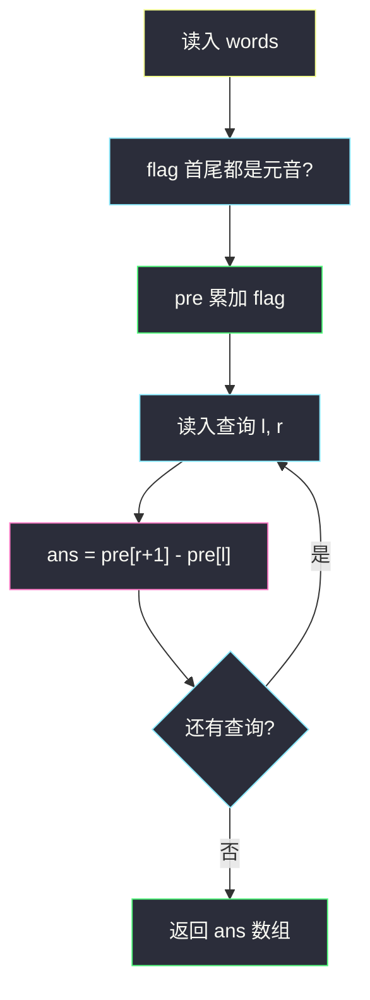
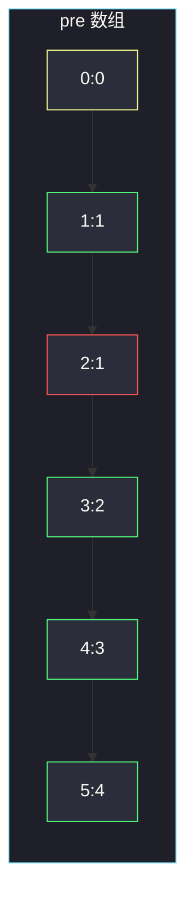

# 统计范围内的元音字符串数

## 一、问题描述

给你下标从 0 开始的字符串数组 `words`，以及若干询问 `queries[i] = [l, r]`。每个询问要统计：下标落在闭区间 `[l, r]` 内、**首尾都是元音**的字符串有多少个。元音只认 `a e i o u`（不含 `y`）。返回与询问一一对应的答案数组。

> 🔗 LeetCode 2559：https://leetcode.cn/problems/count-vowel-strings-in-ranges/
>
> 数据范围：`n, q ≤ 10^5`，每个串长 ≤ 40，串长总和 ≤ `3·10^5`。

**示例 1**

```
输入：words = ["aba","bcb","ece","aa","e"]，queries = [[0,2],[1,4],[1,1]]
输出：[2,3,0]
解释：合格串是 "aba"、"ece"、"aa"、"e"。
      [0,2] 里 "aba"、"ece" → 2；
      [1,4] 里 "ece"、"aa"、"e" → 3；
      [1,1] 里只有 "bcb" → 0。
```

**示例 2**

```
输入：words = ["a","e","i"]，queries = [[0,2],[0,1],[2,2]]
输出：[3,2,1]
解释：三个串都合格。
```

**直观理解**

先给每个位置打 0/1：首尾都是元音记 1，否则记 0。询问变成「一段 0/1 的区间和」。区间和用前缀和 `O(1)` 取。

---

## 二、暴力解法

每个询问扫一遍 `[l, r]`，逐串看首尾：

```python
class Solution:
    def vowelStrings(self, words: List[str], queries: List[List[int]]) -> List[int]:
        vowels = set("aeiou")

        def ok(s: str) -> bool:
            return s[0] in vowels and s[-1] in vowels

        ans = []
        for l, r in queries:
            cnt = 0
            for i in range(l, r + 1):
                if ok(words[i]):
                    cnt += 1
            ans.append(cnt)
        return ans
```

### 复杂度

- **时间**：`O(q · n)`。`n`、`q` 都是 `10^5` 会超时。
- **空间**：`O(1)`（不计答案数组）。

### 🔴 瓶颈在哪里

合格与否只取决于串本身，和询问无关。同一段被反复扫描。预处理成前缀和后，每个询问 `O(1)`。

---

## 三、优化探索（核心章节）

> 📚 本题在灵茶题单中属于 **前缀和 · §1.1 基础**。静态数组上多次问「区间内有多少个满足条件的位置」，先变成 0/1 数组，再 `pre[r+1] - pre[l]`。

### 3.1 0/1 化 + 前缀和

令 `flag[i] = 1` 当且仅当 `words[i]` 首尾都是元音，否则 0。

```
pre[0] = 0
pre[i+1] = pre[i] + flag[i]    （i 从 0 到 n-1）
```

`pre[i]` = 下标 `[0 .. i-1]` 内合格串个数。闭区间 `[l, r]` 的答案：

```
pre[r+1] - pre[l]
```

不要写成 `pre[r] - pre[l-1]`：`l` 可以为 0，且这里 `pre` 多开了一格，右端用 `r+1`。



### 3.2 单字符也要判

长度为 1 时首尾是同一个字符：`"a"` 合格，`"b"` 不合格。用 `s[0]` 和 `s[-1]` 就能覆盖这种情况。不要漏判尾字母。

### 3.3 一句话核心

> **先把每个串变成 0/1，前缀和之后每个询问 `pre[r+1] - pre[l]`。**

---

## 四、代码实现

### Python（主解：前缀和）

```python
class Solution:
    def vowelStrings(self, words: List[str], queries: List[List[int]]) -> List[int]:
        vowels = set("aeiou")
        n = len(words)
        pre = [0] * (n + 1)
        for i, w in enumerate(words):
            add = 1 if w[0] in vowels and w[-1] in vowels else 0
            pre[i + 1] = pre[i] + add
        return [pre[r + 1] - pre[l] for l, r in queries]
```

**变量含义**

| 变量 | 含义 |
|------|------|
| `vowels` | 五个元音的集合，`O(1)` 判断 |
| `pre[i]` | `words[0 .. i-1]` 中合格串个数 |
| `pre[r+1] - pre[l]` | 闭区间 `[l, r]` 的合格个数 |

`words[i]` 只看首尾两个字符，和串长无关，预处理就是 `O(n)`。

---

## 五、具体例子演示

以示例 1：`words = ["aba","bcb","ece","aa","e"]`。

**逐步构造 `pre`**

| i | words[i] | 首 | 尾 | flag | pre（写到 i+1） |
|---|----------|----|----|------|-----------------|
| — | — | — | — | — | `pre[0] = 0` |
| 0 | aba | a | a | 1 | `pre[1] = 0+1 = 1` |
| 1 | bcb | b | b | 0 | `pre[2] = 1+0 = 1` |
| 2 | ece | e | e | 1 | `pre[3] = 1+1 = 2` |
| 3 | aa | a | a | 1 | `pre[4] = 2+1 = 3` |
| 4 | e | e | e | 1 | `pre[5] = 3+1 = 4` |

完整前缀和：`pre = [0, 1, 1, 2, 3, 4]`。



红色描边的 `pre[2]` 停在 1：下标 1 的 `"bcb"` 没贡献。

**三个询问**

| 询问 | 计算 | 结果 |
|------|------|------|
| `[0,2]` | `pre[3] - pre[0] = 2 - 0` | 2 |
| `[1,4]` | `pre[5] - pre[1] = 4 - 1` | 3 |
| `[1,1]` | `pre[2] - pre[1] = 1 - 1` | 0 |

示例 2 三个串全是 1，`pre = [0,1,2,3]`，询问分别是 `3-0`、`2-0`、`3-2`，得到 `[3,2,1]`。

---

## 六、复杂度分析

| 方法 | 时间 | 空间 | 说明 |
|------|------|------|------|
| 每询问扫一遍 | `O(q · n)` | `O(1)` | `10^5` 超时 |
| 前缀和（主解） | `O(n + q)` | `O(n)` | 预处理线性，询问常数 |

---

## 七、对比总结

| 维度 | 暴力 | 前缀和 |
|------|------|--------|
| 每个询问 | 扫区间 | 两次下标相减 |
| 合格判定 | 重复做 | 只做一次，写进 0/1 |
| 下标 | 直接用 `l,r` | 右端要 `r+1`，因为 `pre` 多一格 |

**易错点**

1. **只看了首字母**：题目要首**且**尾。`"abcde"` 首是元音但尾不是，记 0。
2. **`pre[r] - pre[l]`**：少算右端点；正确是 `pre[r+1] - pre[l]`。
3. **把 `y` 当元音**：本题不算。
4. **大写**：题面全是小写，不必 `lower()`。

**模板（§1.1 前缀和区间统计）**

```python
pre[0] = 0
pre[i + 1] = pre[i] + flag[i]
# 闭区间 [l, r]
pre[r + 1] - pre[l]
```

---

## 八、举一反三

| 题目 | 关系 |
|------|------|
| [1310. 子数组异或查询](https://leetcode.cn/problems/xor-queries-of-a-subarray/) | 同款 §1.1：前缀异或，`pre[r+1] xor pre[l]` |
| [848. 字母移位](https://leetcode.cn/problems/shifting-letters/) | 后缀方向的区间累加，仍是 §1.1 前缀差 |
| [303. 区域和检索 - 数组不可变](https://leetcode.cn/problems/range-sum-query-immutable/) | 静态区间和原型 |
| [2090. 半径为 k 的子数组平均值](https://leetcode.cn/problems/k-radius-subarray-averages/) | 定长窗口和，可用同一套 `pre` |
| [523. 连续的子数组和](https://leetcode.cn/problems/continuous-subarray-sum/) | 前缀和升级：再加哈希表 |

**思想迁移**

- 见到「多次询问一段里有多少个满足条件的元素」，先 0/1，再前缀和。
- 口诀：**「合格记 1，前缀多一格；答案永远是右加一减左。」**
