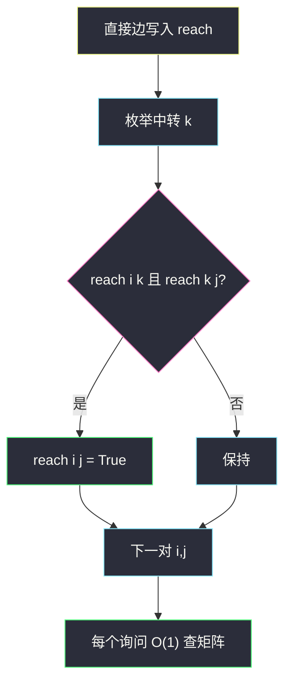
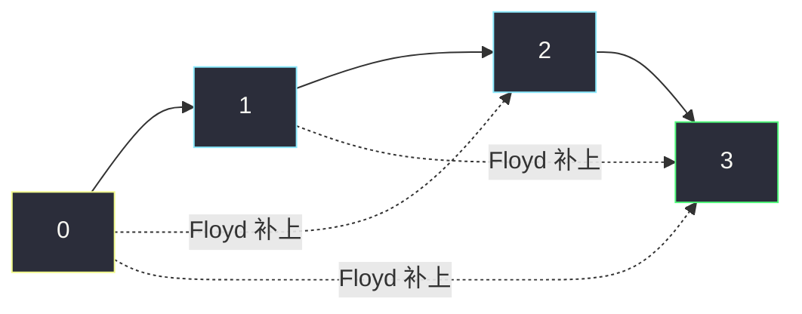

# 课程表 IV（Floyd 传递闭包）

## 一、问题描述

`numCourses` 门课编号 `0 .. n-1`。`prerequisites[i] = [ai, bi]` 表示：**想上 `bi` 必须先上 `ai`**（`ai` 是 `bi` 的直接先修）。先修可以传递：`a` 先于 `b`、`b` 先于 `c`，则 `a` 先于 `c`。图无环。若干询问 `[uj, vj]`：`uj` 是不是 `vj` 的先修（直接或间接）？按询问顺序返回布尔数组。

> 🔗 LeetCode 1462：https://leetcode.cn/problems/course-schedule-iv/
>
> 数据范围：`2 ≤ n ≤ 100`，先修对数至多 `n(n-1)/2`，询问 ≤ `1e4`，`ui ≠ vi`。
>
> 📚 灵茶题单：**§3.2 Floyd**（布尔传递闭包）。`n ≤ 100` 正是 Floyd 舒适区。

边方向以力扣题面为准：`[ai, bi]` 是「先 `ai` 后 `bi`」，建边 `ai → bi`。`reach[u][v] == True` 表示 `u` 能走到 `v`，即 `u` 先于 `v`。

**示例 1**

```
输入：numCourses = 2, prerequisites = [[1,0]], queries = [[0,1],[1,0]]
输出：[false, true]
```

只有 `1 → 0`。0 不是 1 的先修；1 是 0 的先修。

**示例 2**

```
输入：numCourses = 2, prerequisites = [], queries = [[1,0],[0,1]]
输出：[false, false]
```

没有边，互不为先修。

**示例 3**

```
输入：numCourses = 3, prerequisites = [[1,2],[1,0],[2,0]], queries = [[1,0],[1,2]]
输出：[true, true]
```

`1 → 2 → 0` 且 `1 → 0`。1 既先于 0 也先于 2。

**直观理解**

先修关系 = 有向可达。询问多、点少：预处理整张可达矩阵，每次询问 `O(1)`。

---

## 二、暴力解法

每个询问从 `u` 做一次 BFS/DFS，看能不能走到 `v`。询问 `1e4`、边最坏 `O(n²)`，最坏约 `O(q · n²)`，`n=100` 擦边能过，询问一多就冗余：同一对点被反复搜。

```python
from collections import deque
from typing import List

class Solution:
    def checkIfPrerequisite(
        self,
        numCourses: int,
        prerequisites: List[List[int]],
        queries: List[List[int]],
    ) -> List[bool]:
        g = [[] for _ in range(numCourses)]
        for a, b in prerequisites:
            g[a].append(b)
        ans = []
        for u, v in queries:
            vis = [False] * numCourses
            q = deque([u])
            vis[u] = True
            ok = False
            while q:
                x = q.popleft()
                if x == v:
                    ok = True
                    break
                for y in g[x]:
                    if not vis[y]:
                        vis[y] = True
                        q.append(y)
            ans.append(ok)
        return ans
```

正确，但没利用「先修图无环、n 很小、询问很多」。主解改成一次 Floyd（或每个点 DFS 一次）预处理。

### 🔴 瓶颈在哪里

可达性对所有点对只要求一次。Floyd 布尔版：`reach[i][j] |= reach[i][k] and reach[k][j]`。

---

## 三、优化探索（核心章节）

> 📚 本题在灵茶题单中属于 **§3.2 Floyd**。把「松弛距离」换成「或上一条经 k 的通路」。

### 3.1 建边方向

力扣：`[ai, bi]` → 必须先 `ai` 再 `bi` → 边 `ai → bi`（先修指向后修）。

询问「`u` 是不是 `v` 的先修」= `u` 能否到达 `v` = `reach[u][v]`。

反了就全错：示例 1 会把 `[false,true]` 做成 `[true,false]`。不要用「`[a,b]` 表示 b 是 a 的先修」那种记法（那是 207 课程表里另一种常见约定，**本题不是**）。

### 3.2 布尔 Floyd

`reach[i][j]` 初始为直接边。对角线可留 `False`（自己不是自己的先修，询问也保证 `ui ≠ vi`）。

三层循环 `k, i, j`：若 `i` 能到 `k` 且 `k` 能到 `j`，则 `i` 能到 `j`。无环、边权无所谓，只关心有没有路。



小优化：`if not reach[i][k]: continue`，内层 `j` 整行跳过。

也从每个点 DFS/BFS 一次填一行 `reach[u][*]`，时间 `O(n · (n+m))`，`m` 大时和 Floyd 同阶，稀疏时更好。题单这一节练 Floyd，主解写三层循环。

### 3.3 一句话核心

> **边 a→b 表示先 a 后 b；Floyd 做成 0/1 可达矩阵；询问就是查 reach[u][v]。**

---

## 四、代码实现

### Python（主解：Floyd 传递闭包）

```python
from typing import List

class Solution:
    def checkIfPrerequisite(
        self,
        numCourses: int,
        prerequisites: List[List[int]],
        queries: List[List[int]],
    ) -> List[bool]:
        n = numCourses
        reach = [[False] * n for _ in range(n)]
        for a, b in prerequisites:
            reach[a][b] = True
        for k in range(n):
            for i in range(n):
                if not reach[i][k]:
                    continue
                for j in range(n):
                    if reach[k][j]:
                        reach[i][j] = True
        return [reach[u][v] for u, v in queries]
```

不要写 `reach[i][j] = reach[i][j] or (reach[i][k] and reach[k][j])` 时把已有的 `True` 覆盖丢——上面这种「只或上去」不会。Python 里 `or` 赋值也安全，布尔矩阵用 `if` 更直观。

备选：每个 `u` 出发 DFS，把能走到的点标到 `reach[u]`。无环，不用三色，visited 即可。

---

## 五、具体例子演示

用一条链看矩阵怎么被 Floyd 填满。`n=4`，先修 `[0,1],[1,2],[2,3]`，即 `0 → 1 → 2 → 3`。询问会问 `[0,3]` 这种间接关系。

初始（只含直接边），行=起点，列=终点，1 表示可达：

```
      0 1 2 3
    0 0 1 0 0
    1 0 0 1 0
    2 0 0 0 1
    3 0 0 0 0
```

**k = 0**：谁能到 0？没有。矩阵不变。

**k = 1**：`reach[0][1]` 为真，1 能到 2，于是 `0 → 2`。

```
      0 1 2 3
    0 0 1 1 0   ← 多了 0→2
    1 0 0 1 0
    2 0 0 0 1
    3 0 0 0 0
```

**k = 2**：`0` 能到 2、`1` 能到 2；2 能到 3。于是 `0 → 3`、`1 → 3`。

```
      0 1 2 3
    0 0 1 1 1
    1 0 0 1 1
    2 0 0 0 1
    3 0 0 0 0
```

**k = 3**：3 没有出边，不再扩展。闭包完成。`reach[0][3] == True`，0 是 3 的间接先修。



示例 1：直接边 `1→0`。Floyd 没有更长的路。`queries[0]=[0,1]` 查 `reach[0][1]` 为假；`[1,0]` 为真。

示例 3：直接边已经覆盖 `1→0` 和 `1→2`，中转 `k=2` 再确认 `1→2→0`。两问都真。

空先修：矩阵全假，两问都假。互达不会出现——题面保证无环。

**多源汇、支路**

`0→1→3`，`2→3`，`n=4`。Floyd 后 `reach[0][3]`、`reach[2][3]`、`reach[0][1]` 为真；`reach[0][2]`、`reach[2][0]`、`reach[2][1]` 为假。2 和 0 没有祖先后代关系，询问 `[0,2]` 必须是 false，不要因为它们都能到 3 就当成互相先修。

**询问重复、反向成对**

`queries` 可达 `1e4`，同一对可能出现多次，预处理后每次都是 `O(1)`。`[u,v]` 与 `[v,u]` 在无环图上至多一个为真；两个都真意味着有环，本题数据不会给。

**备选：每个点 DFS 填一行**

```python
g = [[] for _ in range(n)]
for a, b in prerequisites:
    g[a].append(b)
reach = [[False] * n for _ in range(n)]

def dfs(src: int, x: int) -> None:
    for y in g[x]:
        if not reach[src][y]:
            reach[src][y] = True
            dfs(src, y)

for u in range(n):
    dfs(u, u)
```

链状图时递归深度 `n≤100` 安全。稀疏图比 Floyd 快，稠密图同阶。题单本节优先记三层 `k,i,j`。

---

## 六、复杂度分析

| 方法 | 时间 | 空间 | 说明 |
|------|------|------|------|
| 每询问 BFS | `O(q · (n+m))` | `O(n+m)` | 能过但不干净 |
| 每点 DFS 预处理 | `O(n(n+m) + q)` | `O(n²)` | 稀疏图更好 |
| Floyd（主解） | `O(n³ + q)` | `O(n²)` | `n=100` 稳定 |

---

## 七、对比总结

| 维度 | 207 课程表 | 本题 |
|------|------------|------|
| 边含义 | 常见也是先修→后修，但有的题解写成相反 | **以示例 1 为准：`[1,0]` 得 `1→0`** |
| 问什么 | 有没有环 / 一种顺序 | 点对是否可达 |
| 算法 | Kahn | Floyd 闭包 |

**易错点**

1. **边反了**：`[ai,bi]` 建成 `bi→ai`，示例 1 立刻错。
2. **当成无向**：先修单向，`reach` 不对称。
3. **Floyd 循环顺序错成 `i,j,k`**：中转必须在最外层（或等价地保证 k 已被「完全作为中转」）。经典写法 `k` 在外。
4. **询问当边权最短路**：只问是否先修，布尔即可，不必 `dist`。
5. **对角线写成 True**：不影响本题询问，但语义上「自己是自己的先修」是错的，别养成习惯。

---

## 八、举一反三

| 题目 | 关系 |
|------|------|
| [207. 课程表](https://leetcode.cn/problems/course-schedule/) | 同一套先修图，问能否上完（无环） |
| [210. 课程表 II](https://leetcode.cn/problems/course-schedule-ii/) | 输出一种拓扑序 |
| [785. 判断二分图](https://leetcode.cn/problems/is-graph-bipartite/) | 图论另一套预处理（染色），对照「先处理再回答」 |
| [802. 找到最终的安全状态](https://leetcode.cn/problems/find-eventual-safe-states/) | 有向图可达 / 入环 |

**思想迁移**

- 点少询问多的「是否可达」→ 传递闭包，Floyd 或 `n` 遍 BFS。
- 有向无环时拓扑 DP 也能推可达，Floyd 更短、不怕以后出现环的变形（有环时闭包仍然表示「能走到」）。
- 口诀：**「先修指向后修；k 在外层或上去；询问直接查矩阵。」**
