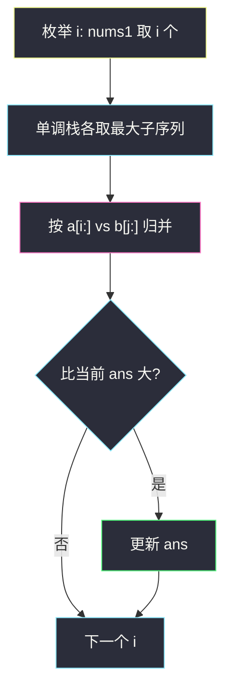
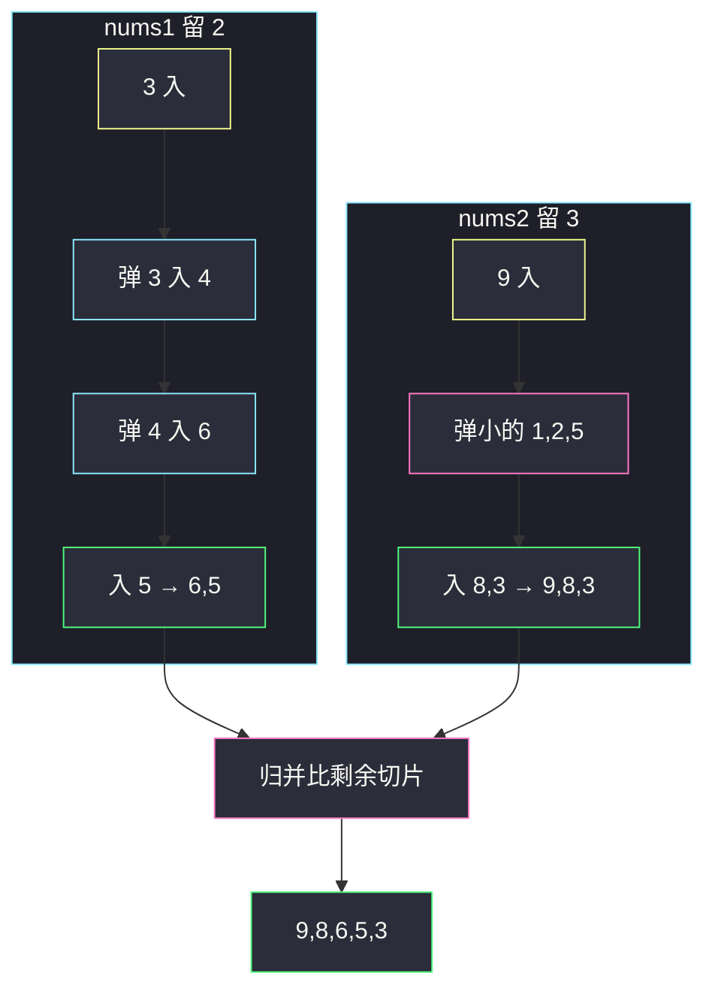

# 拼接最大数（最大子序列 + 按剩余切片归并）

## 一、问题描述

给定两个数字数组 `nums1`、`nums2`（每位是 0–9）和整数 `k`。请从两个数组里一共选出 `k` 个数，**同一数组内相对顺序必须保持**，拼成数值最大的长度为 `k` 的数组并返回。相当于：从 `nums1` 取一段长为 `i` 的子序列、从 `nums2` 取长为 `k-i` 的子序列，再把两段**归并**成一个数组，使结果字典序最大。

> 🔗 LeetCode 321：https://leetcode.cn/problems/create-maximum-number/
>
> 数据范围：`1 <= m, n <= 500`，`0 <= nums1[i], nums2[i] <= 9`，`1 <= k <= m+n`。题目保证没有「数字本身带前导零」的歧义，数组里的 0 就是数位 0。
>
> 📚 灵茶题单：**贪心 · 四、最小字典序**。同节原型是 [#402 移掉 K 位数字](https://leetcode.cn/problems/remove-k-digits/)：单调栈删掉若干位，留下字典序最优的子序列。本题把「删」做成两次，再多一步**不能只比当前位的归并**。

**示例 1**

```
输入：nums1 = [3,4,6,5], nums2 = [9,1,2,5,8,3], k = 5
输出：[9,8,6,5,3]
解释：从 nums1 取 [6,5]，从 nums2 取 [9,8,3]，归并得 [9,8,6,5,3]。
```

**示例 2**

```
输入：nums1 = [6,7], nums2 = [6,0,4], k = 5
输出：[6,7,6,0,4]
解释：必须把两边全部取完。归并时 [6,7] 与 [6,0,4] 比的是剩余切片，不是只比当前的 6。
```

**示例 3**

```
输入：nums1 = [3,9], nums2 = [8,9], k = 3
输出：[9,8,9]
解释：nums1 取 [9]，nums2 取 [8,9]。若 nums1 取 [3,9]、nums2 取 [9]，得到 [9,3,9] 更小。
```

**直观理解**

一个数组里要留 `t` 个数、保持相对顺序，就是「删掉 `len-t` 个」，和高位尽量大的删数贪心一模一样。两个数组则多一个维度：`k` 个数怎么分。枚举从 `nums1` 拿 `i` 个（`nums2` 拿 `k-i` 个），各自取出该长度下的最大子序列，再归并。归并像合并两个有序数组，但比较键是**从当前指针起到末尾的整段**，否则 `[6,7]` 和 `[6,0,4]` 会在两个 6 上随便选，选错就得不到最大数。

---

## 二、暴力解法

枚举所有「从 nums1 选 i 个下标递增的子序列、从 nums2 选 k-i 个」，再枚举所有保持相对顺序的归并穿插方式，取字典序最大。

```python
from itertools import combinations

class Solution:
    def maxNumber(self, nums1: list[int], nums2: list[int], k: int) -> list[int]:
        def subs(a, t):
            return [list(c) for c in combinations(a, t)] if t else [[]]

        n1, n2 = len(nums1), len(nums2)
        ans = []
        for i in range(max(0, k - n2), min(k, n1) + 1):
            for a in subs(nums1, i):
                for b in subs(nums2, k - i):
                    # 在 a、b 的归并路径里再搜最大（指数）
                    def dfs(p, q, path):
                        nonlocal ans
                        if len(path) == k:
                            if path > ans:
                                ans = path[:]
                            return
                        if p < len(a):
                            path.append(a[p])
                            dfs(p + 1, q, path)
                            path.pop()
                        if q < len(b):
                            path.append(b[q])
                            dfs(p, q + 1, path)
                            path.pop()
                    dfs(0, 0, [])
        return ans
```

### 复杂度

- **时间**：子序列组合数 `C(n, t)` 再乘归并路径，指数级。`n = 500` 完全不可用。
- **空间**：递归深度 `k`。

### 🔴 瓶颈在哪里

1. 单数组「长为 t 的最大子序列」其实是确定的，不必枚举所有组合——单调栈删 `n-t` 个即可。
2. 两段序列的最优归并也是确定的：每一步选剩余切片字典序更大的那一侧，不必搜索穿插。
3. 只剩「枚举分配 i」，范围只有 `O(min(k, n1, n2))` 种。

---

## 三、优化探索（核心章节）

> 📚 本题在灵茶题单中属于 **四、最小字典序**。402 是「删 k 位使剩下最小」；这里是「留 t 位使剩下最大」，比较符反过来，栈仍是单调的。两段再按「剩余切片」归并，和归并两个字符串取最大是同一比较。

### 3.1 分配范围

从 `nums1` 取 `i` 个、从 `nums2` 取 `k-i` 个，必须

- `0 ≤ i ≤ n1` 且 `0 ≤ k-i ≤ n2`

整理得：

`i ∈ [max(0, k - n2), min(k, n1)]`

漏掉下界 `k-n2` 会在 `nums2` 不够长时取负数个数；漏掉上界会从 `nums1` 取超过长度。

### 3.2 单数组：长度为 t 的最大子序列

要删 `drop = n - t` 个数。从左到右扫，栈里维持**从高位到低位递减**（非严格：相等不弹，因为后面没有更大的可换）：

- 当前数字 `x` 比栈顶大，且还能删，就弹栈（丢掉一个更小的高位）
- 然后把 `x` 入栈
- 扫完若 `drop` 仍大于 0，栈尾多出来的是较小的低位，截到长度 `t`

这就是 402 的镜像：402 要字典序最小所以弹「栈顶大于当前」；本题要最大所以弹「栈顶小于当前」。

`t = 0` 时直接返回空数组，不要进栈逻辑。

### 3.3 归并：比较剩余切片，不是当前位

两指针 `i, j`，每次把 `a[i:]` 和 `b[j:]` 当两个列表（或两个「数字串」）比大小，大的那边吐一个数。

反例（官方示例 2）：`a = [6,7]`，`b = [6,0,4]`。

- 只比当前位：两边都是 6，若随便先拿 `b`，得到 `[6,6,7,0,4]`，比 `[6,7,6,0,4]` 小。
- 比剩余切片：`[6,7] > [6,0,4]`（第二位 7>0），先拿 `a` 的 6，再 `[7] > [6,0,4]`，拿 7，结果正确。

Python 里列表比较就是逐位、先结束的更短序列更小，正好符合「同样前缀时更长的那段更大」（例如 `[9,8]` vs `[9,8,7]` 应先走后者）。



### 3.4 不变式

- `pick(nums, t)` 的结果是 `nums` 所有长为 `t` 的子序列里字典序最大的那个。
- 归并每一步选出的数，都是「当前两段剩余里，能让最终序列字典序最大的下一个数」。
- 枚举完所有合法 `i` 后，`ans` 是全局字典序最大。

### 3.5 一句话核心

> **枚举从 nums1 取几个；两边各自单调栈留最大子序列；归并时比较 `a[i:]` 和 `b[j:]`，谁大吐谁。**

---

## 四、代码实现

### Python（主解）

```python
class Solution:
    def maxNumber(self, nums1: list[int], nums2: list[int], k: int) -> list[int]:
        def pick(nums: list[int], t: int) -> list[int]:
            if t == 0:
                return []
            drop = len(nums) - t
            st = []
            for x in nums:
                while drop and st and st[-1] < x:
                    st.pop()
                    drop -= 1
                st.append(x)
            return st[:t]          # 还没删够就截掉栈尾

        def merge(a: list[int], b: list[int]) -> list[int]:
            res = []
            i = j = 0
            while i < len(a) or j < len(b):
                if a[i:] > b[j:]:
                    res.append(a[i])
                    i += 1
                else:
                    res.append(b[j])
                    j += 1
            return res

        n1, n2 = len(nums1), len(nums2)
        ans = []
        for i in range(max(0, k - n2), min(k, n1) + 1):
            cand = merge(pick(nums1, i), pick(nums2, k - i))
            if cand > ans:
                ans = cand
        return ans
```

**变量含义**

| 变量 | 含义 |
|------|------|
| `t` / `drop` | 要留的位数 / 还能删几个 |
| `st` | 当前最大子序列（高位在底） |
| `i` | 从 `nums1` 取的个数 |
| `a[i:] > b[j:]` | 剩余切片字典序比较 |

`merge` 在 Python 里每次切片是 `O(k)`，总时间大约 `O(k² · min(n1, n2, k) + (n1+n2)·k)`。`n,k ≤ 500` 可通过。Java 不要真的拷贝切片，改成手写逐位比较。

### Java（同思路，归并手写比较）

```java
class Solution {
    public int[] maxNumber(int[] nums1, int[] nums2, int k) {
        int n1 = nums1.length, n2 = nums2.length;
        int[] ans = new int[k];
        for (int i = Math.max(0, k - n2); i <= Math.min(k, n1); i++) {
            int[] cand = merge(pick(nums1, i), pick(nums2, k - i));
            if (greater(cand, 0, ans, 0)) {
                ans = cand;
            }
        }
        return ans;
    }

    private int[] pick(int[] nums, int t) {
        if (t == 0) {
            return new int[0];
        }
        int drop = nums.length - t;
        int[] st = new int[nums.length];
        int top = 0;
        for (int x : nums) {
            while (drop > 0 && top > 0 && st[top - 1] < x) {
                top--;
                drop--;
            }
            st[top++] = x;
        }
        int[] res = new int[t];
        System.arraycopy(st, 0, res, 0, t);
        return res;
    }

    private int[] merge(int[] a, int[] b) {
        int[] res = new int[a.length + b.length];
        int i = 0, j = 0, p = 0;
        while (i < a.length || j < b.length) {
            if (greater(a, i, b, j)) {
                res[p++] = a[i++];
            } else {
                res[p++] = b[j++];
            }
        }
        return res;
    }

    // 比较 a[i..] 与 b[j..]，前者更大返回 true
    private boolean greater(int[] a, int i, int[] b, int j) {
        while (i < a.length && j < b.length && a[i] == b[j]) {
            i++;
            j++;
        }
        if (j == b.length) {
            return i < a.length;   // b 先结束，a 更长则 a 更大
        }
        if (i == a.length) {
            return false;
        }
        return a[i] > b[j];
    }
}
```

---

## 五、具体例子演示

### 5.1 官方示例 1：枚举 i + 子序列栈 + 归并

`nums1 = [3,4,6,5]`（n1=4），`nums2 = [9,1,2,5,8,3]`（n2=6），`k = 5`。

`i` 范围：`[max(0, 5-6), min(5, 4)] = [0, 4]`。

**`pick(nums1, 2)` 逐步**（留 2，删 2）

| 读到 | drop | 动作 | 栈 |
|------|------|------|-----|
| 3 | 2 | 入 | `[3]` |
| 4 | 1 | 3<4 弹 3，入 4 | `[4]` |
| 6 | 0 | 4<6 弹 4，入 6 | `[6]` |
| 5 | 0 | 不能再删，入 5 | `[6,5]` |

截断后 `[6,5]`。高位 3、4 都被后面更大的 6 换掉。

**`pick(nums2, 3)` 逐步**（留 3，删 3）

| 读到 | drop | 动作 | 栈 |
|------|------|------|-----|
| 9 | 3 | 入 | `[9]` |
| 1 | 3 | 9>1 不弹，入 | `[9,1]` |
| 2 | 2 | 1<2 弹 1，入 2 | `[9,2]` |
| 5 | 1 | 2<5 弹 2，入 5 | `[9,5]` |
| 8 | 0 | 5<8 弹 5，入 8 | `[9,8]` |
| 3 | 0 | 入 | `[9,8,3]` |

得到 `[9,8,3]`。

**归并 `[6,5]` 与 `[9,8,3]`**（每次列出剩余切片）

| a 剩余 | b 剩余 | 比较 | 取出 |
|--------|--------|------|------|
| `[6,5]` | `[9,8,3]` | 6<9 | 9 |
| `[6,5]` | `[8,3]` | 6<8 | 8 |
| `[6,5]` | `[3]` | 6>3 | 6 |
| `[5]` | `[3]` | 5>3 | 5 |
| `[]` | `[3]` | | 3 |

结果 `[9,8,6,5,3]`。

**全部 i 对拍**

| i | pick nums1 | pick nums2 | 归并 |
|---|------------|------------|------|
| 0 | `[]` | `[9,2,5,8,3]` | `[9,2,5,8,3]` |
| 1 | `[6]` | `[9,5,8,3]` | `[9,6,5,8,3]` |
| 2 | `[6,5]` | `[9,8,3]` | **`[9,8,6,5,3]`** |
| 3 | `[4,6,5]` | `[9,8]` | `[9,8,4,6,5]` |
| 4 | `[3,4,6,5]` | `[9]` | `[9,3,4,6,5]` |

字典序最大是 i=2 的 `[9,8,6,5,3]`。i=0 第二位是 2，小于 8；i=3 第三位是 4，小于 6。



### 5.2 官方示例 2：必须比剩余切片

`nums1 = [6,7]`，`nums2 = [6,0,4]`，`k = 5`。

`i ∈ [max(0,5-3), min(5,2)] = [2, 2]`，只有一种：两边全取。`pick` 删 0 个，就是原数组。

归并 `[6,7]` vs `[6,0,4]`：

| a 剩余 | b 剩余 | 谁大 | 取出 | 已写出 |
|--------|--------|------|------|--------|
| `[6,7]` | `[6,0,4]` | a（7>0） | 6 | `[6]` |
| `[7]` | `[6,0,4]` | a（7>6） | 7 | `[6,7]` |
| `[]` | `[6,0,4]` | b | 6 | `[6,7,6]` |
| | `[0,4]` | | 0,4 | `[6,7,6,0,4]` |

若当前位相等就先拿 nums2：第一步拿 b 的 6，变成 `[6]` + 剩余 `[6,7]` 与 `[0,4]`，接着 6 再 7，得到 `[6,6,7,0,4]`，**对拍失败**。这就是不能只比当前位的全部理由。

### 5.3 官方示例 3：分配不同结果不同

`nums1 = [3,9]`，`nums2 = [8,9]`，`k = 3`。`i ∈ [1, 2]`。

| i | pick1 | pick2 | 归并 |
|---|-------|-------|------|
| 1 | `[9]`（删 3） | `[8,9]` | `[9,8,9]` |
| 2 | `[3,9]` | `[9]` | `[9,3,9]` |

`[9,8,9] > [9,3,9]`。`pick(nums1,1)`：读 3 入栈，读 9 时 3<9 且还能删，弹 3 留 9。

### 5.4 `pick` 扫完还要截尾

`[9,8,7,6]` 留 2：全程递减，一次都不弹，`drop` 仍为 2，`st[:2] = [9,8]`。低位 7、6 在栈尾被截掉。忘记 `st[:t]` 会多留数字。

---

## 六、复杂度分析

| 方法 | 时间 | 空间 | 说明 |
|------|------|------|------|
| 枚举子序列 + 搜归并 | 指数 | `O(k)` | 不可用 |
| 枚举 i + 栈 pick + 切片归并（Python 主解） | `O(k² · min(n, k) + k(n1+n2))` | `O(k)` | `n,k ≤ 500` 可通过 |
| 同上，归并改手写逐位比较 | `O(k · min(n,k) · k + k(n1+n2))` 同阶 | `O(k)` | Java 写法，常数更好 |

`pick` 对每个 `i` 扫一遍数组 `O(n1+n2)`；归并比较若每次重建切片，单次归并最坏 `O(k²)`。合法 `i` 至多 `min(n1, n2, k)+1` 个。

---

## 七、对比总结

| 维度 | 402 移掉 K 位 | 本题单数组 pick | 本题整体 |
|------|---------------|-----------------|----------|
| 目标 | 剩下字典序最小 | 剩下字典序最大 | 两段最大再归并 |
| 弹栈 | 栈顶 **大于** 当前 | 栈顶 **小于** 当前 | 两次 pick |
| 比较 | 不需要归并 | — | **剩余切片**，不是当前位 |
| 枚举 | 无 | 无 | 分配 `i` 的区间 |

**易错点**

1. **`i` 范围写成 `0..k`**：`nums2` 可能短于 `k-i`，必须 `max(0, k-n2)`。
2. **归并只比 `a[i]` 和 `b[j]`**：`[6,7]` vs `[6,0,4]` 会错。
3. **pick 弹等号**：`[5,5]` 留 2 若把相等也弹，可能把前面的 5 弹光。本题要最大，相等时留着前面的同样大，后面还可能用得上；弹等号会少数字或打乱个数。最大子序列里相等不弹是安全的。
4. **忘记 `st[:t]`**：递减序列删不完，栈比 `t` 长。
5. **`t=0` 仍去 pick**：`drop=n`，可能把空结果搞乱；直接返回 `[]`。
6. **候选用 `>=` 更新 ans**：相等无所谓；用 `>` 即可。初始 `ans=[]` 比任何长 `k>0` 的数组都小（Python 列表比较）。

**模板（四、最大 / 最小子序列 + 归并）**

```python
# pick: drop = n-t；栈顶 < 当前且还能删则弹；最后 st[:t]
# merge: while 两边还有，a[i:] > b[j:] 则取 a 否则取 b
# i 从 max(0, k-n2) 到 min(k, n1)
```

---

## 八、举一反三

| 题目 | 关系 |
|------|------|
| [402. 移掉 K 位数字](https://leetcode.cn/problems/remove-k-digits/) | 同款单调栈，目标改成字典序最小；本题的 `pick` 是它的「留 t 位最大」镜像 |
| [316. 去除重复字母](https://leetcode.cn/problems/remove-duplicate-letters/) | 单调栈 + 还要保证每个字母出现一次 |
| [670. 最大交换](https://leetcode.cn/problems/maximum-swap/) | 只换一次，不是子序列 |
| [1673. 找出最具竞争力的子序列](https://leetcode.cn/problems/find-the-most-competitive-subsequence/) | 单数组留 k 位、字典序最小，402 近亲 |
| [406. 根据身高重建队列](https://leetcode.cn/problems/queue-reconstruction-by-height/) | 另一个「先局部序列再合并插入」的贪心，无关栈 |

**思想迁移**

- 见到「两个序列里抽 k 个、保持相对顺序、要最大」，先拆成「单序列最大子序列」+「按剩余比较归并」+「枚举分配」。
- 口诀：**「先定各取几个，栈删出最大子序列；归并别看当前位，看剩下整段谁更大。」**
