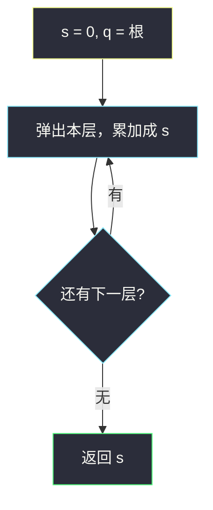
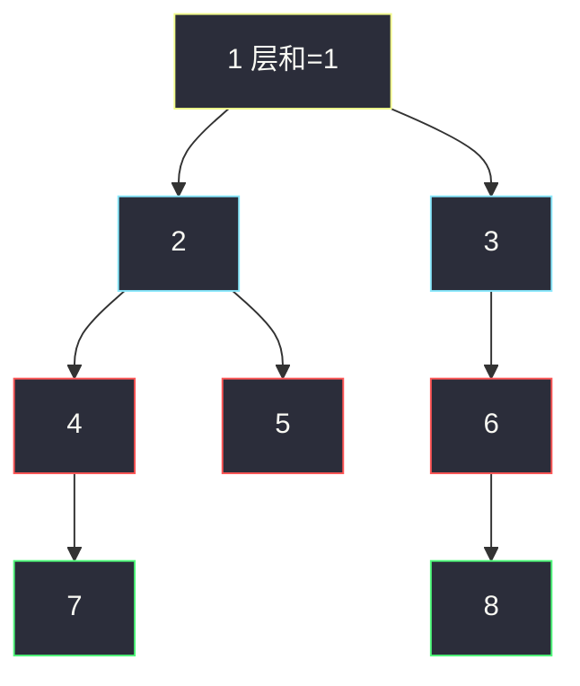

# 层数最深叶子节点的和（BFS 覆盖层和）

## 一、问题描述

给你二叉树根 `root`，返回**层数最深的叶子**节点值之和。不是所有叶子，只是深度最大的那一层上的叶子（最深层上的节点一定都是叶子）。

> 🔗 LeetCode 1302：https://leetcode.cn/problems/deepest-leaves-sum/
>
> 数据范围：节点数 `[1, 10^4]`，`1 <= Node.val <= 100`。
>
> 📚 灵茶题单：**二叉树 · §2.13 二叉树 BFS**（1388 分）。

**示例 1**

```
输入：root = [1,2,3,4,5,null,6,7,null,null,null,null,8]
输出：15
树形：
            1
           / \
          2   3
         / \   \
        4   5   6
       /         \
      7           8
最深层叶子 7 和 8，和为 15。
```

**示例 2**

```
输入：root = [6,7,8,2,7,1,3,9,null,1,4,null,null,null,5]
输出：19
最深层：9+1+4+5 = 19。
```

**直观理解**

最深的那一层，整层都是叶子。BFS 一层一层走，每层覆盖一次「本层和」；队列空了，最后留下的那份和就是答案。不必先量深度再扫第二遍。

同节的 [1161. 最大层内元素和](https://leetcode.cn/problems/maximum-level-sum-of-a-binary-tree/) 是所有层和里取 max；本题是**留下最后一层**。

---

## 二、暴力解法

两遍 DFS：先求最大深度，再把深度等于 `maxDepth` 的节点累加。

```python
class Solution:
    def deepestLeavesSum(self, root: Optional[TreeNode]) -> int:
        def depth(node: Optional[TreeNode]) -> int:
            if node is None:
                return 0
            return max(depth(node.left), depth(node.right)) + 1

        h = depth(root)
        ans = 0

        def dfs(node: Optional[TreeNode], d: int) -> None:
            nonlocal ans
            if node is None:
                return
            if d == h:
                ans += node.val
                return
            dfs(node.left, d + 1)
            dfs(node.right, d + 1)

        dfs(root, 1)
        return ans
```

正确，但树走了两遍，还要把深度定义（节点个数 vs 边数）和调用时的起始 `d` 对齐，容易偏一层。

### 复杂度

- **时间**：`O(n)` 两遍。
- **空间**：`O(h)` 递归栈。

### 🔴 瓶颈在哪里

BFS 本来就按深度推进。每层算完和，下一层会覆盖它；最后一层覆盖完队列就空了，那份和不用再比深度。一遍即可。

---

## 三、优化探索（核心章节）

> 📚 本题在灵茶题单中属于 **二叉树 · §2.13 二叉树 BFS**。与 #1161、#2583 共用 `size` 快照；差别只在层和怎么用：覆盖留下最后一层 / 取 max / 收齐再取第 k 大。

### 3.1 覆盖层和

```
q = [root]
while q 非空:
    s = 0
    对本层每个点:
        s += val，孩子入队
    # 循环结束后若 q 空，s 就是最深层
return s
```

不必判断「是不是叶子」：能进最深层的点，下面已经没有孩子。

### 3.2 DFS 一遍也可以

边走边记 `max_d` 和对应和：更深则重置和，同深则累加。和 BFS 等价，递归栈最坏 `O(n)`。层序题优先 BFS。



### 3.3 一句话核心

> **BFS 每层覆盖 s；队列空了，s 就是最深层叶子和。**

---

## 四、代码实现

### Python（主解：BFS 覆盖）

```python
from collections import deque

class Solution:
    def deepestLeavesSum(self, root: Optional[TreeNode]) -> int:
        q = deque([root])
        s = 0
        while q:
            s = 0
            for _ in range(len(q)):
                node = q.popleft()
                s += node.val
                if node.left:
                    q.append(node.left)
                if node.right:
                    q.append(node.right)
        return s
```

**变量含义**

| 变量 | 含义 |
|------|------|
| `q` | 当前层 |
| `s` | 每一层重新清零再累加；循环结束时是最后一层的和 |

根非空（`n ≥ 1`），不必特判。`s = 0` 写在 `while` 里，每层覆盖。

### 可选：DFS 记最深

```python
class Solution:
    def deepestLeavesSum(self, root: Optional[TreeNode]) -> int:
        ans, max_d = 0, -1

        def dfs(node: Optional[TreeNode], d: int) -> None:
            nonlocal ans, max_d
            if node is None:
                return
            if d > max_d:
                max_d, ans = d, node.val
            elif d == max_d:
                ans += node.val
            dfs(node.left, d + 1)
            dfs(node.right, d + 1)

        dfs(root, 0)
        return ans
```

### Java（可选）

```java
class Solution {
    public int deepestLeavesSum(TreeNode root) {
        Queue<TreeNode> q = new ArrayDeque<>();
        q.offer(root);
        int s = 0;
        while (!q.isEmpty()) {
            s = 0;
            int sz = q.size();
            for (int i = 0; i < sz; i++) {
                TreeNode node = q.poll();
                s += node.val;
                if (node.left != null) q.offer(node.left);
                if (node.right != null) q.offer(node.right);
            }
        }
        return s;
    }
}
```

---

## 五、具体例子演示

示例 1。每层写出队列和层和；最后一层留下。

```
            1
           / \
          2   3
         / \   \
        4   5   6
       /         \
      7           8
```

| 层 | 队列 | 层和 s | 之后队列空? |
|----|------|--------|-------------|
| 1 | `[1]` | 1 | 否 |
| 2 | `[2, 3]` | 2+3=5 | 否 |
| 3 | `[4, 5, 6]` | 4+5+6=15 | 否 |
| 4 | `[7, 8]` | 7+8=**15** | **是 → 答案 15** |

第 3 层和碰巧也是 15，但不是最深。覆盖之后被第 4 层换掉。5 不是叶子，更不会进答案。



红是倒数第二层（和碰巧也是 15，会被覆盖）；绿是最深层 7+8=15，留下当答案。

---

## 六、复杂度分析

| 方法 | 时间 | 空间 | 说明 |
|------|------|------|------|
| 两遍 DFS | `O(n)` | `O(h)` | 先量深再累加 |
| BFS 覆盖（主解） | `O(n)` | `O(w)` 队列 | `w` 为最宽一层 |
| 一遍 DFS 记 max_d | `O(n)` | `O(h)` | 与 BFS 等价 |

---

## 七、对比总结

| 题目 | 层和之后 |
|------|----------|
| [1161. 最大层内元素和](https://leetcode.cn/problems/maximum-level-sum-of-a-binary-tree/) | 全程取 max |
| 本题 #1302 | 覆盖，留下最后一层 |
| [2583. 二叉树中的第 K 大层和](https://leetcode.cn/problems/kth-largest-sum-in-a-binary-tree/) | 收齐再取第 k 大 |

三题 BFS 骨架相同，只换层和的用法。

**易错点**

1. **把所有叶子加起来**：浅层叶子（如示例 1 的 5）不能进答案。
2. **两遍 DFS 深度偏一层**：`depth` 用节点个数时，第二遍起始必须是 1 不是 0，或统一用边数。
3. **`s` 写在 `while` 外面还不清零**：会把所有层加在一起。每层开头 `s = 0`。
4. 不要在内层循环里用变化中的 `q.size()`，先快照。
5. 最深层可能只有一个节点，和就是它自己，没有特殊情况。

---

## 八、举一反三

| 题目 | 关系 |
|------|------|
| [1161. 最大层内元素和](https://leetcode.cn/problems/maximum-level-sum-of-a-binary-tree/) | 同节层和，取 max；见 `maximum-level-sum-of-a-binary-tree.md` |
| [2583. 二叉树中的第 K 大层和](https://leetcode.cn/problems/kth-largest-sum-in-a-binary-tree/) | 同节，收齐层和再选；见 `kth-largest-sum-in-a-binary-tree.md` |
| [104. 二叉树的最大深度](https://leetcode.cn/problems/maximum-depth-of-binary-tree/) | BFS 层数；本题多一步最深层求和 |
| [513. 找树左下角的值](https://leetcode.cn/problems/find-bottom-left-tree-value/) | 最深层从左到右第一个 |
| [1123. 最深叶节点的最近公共祖先](https://leetcode.cn/problems/lowest-common-ancestor-of-deepest-leaves/) | 最深叶子再往上找 LCA |

**思想迁移**

- 「只要最后一层」→ BFS 覆盖；「要每一层」→ 装进数组或边走边更新。
- 口诀：**「一层一和覆盖 s；队列空了，s 就是最深和。」**
