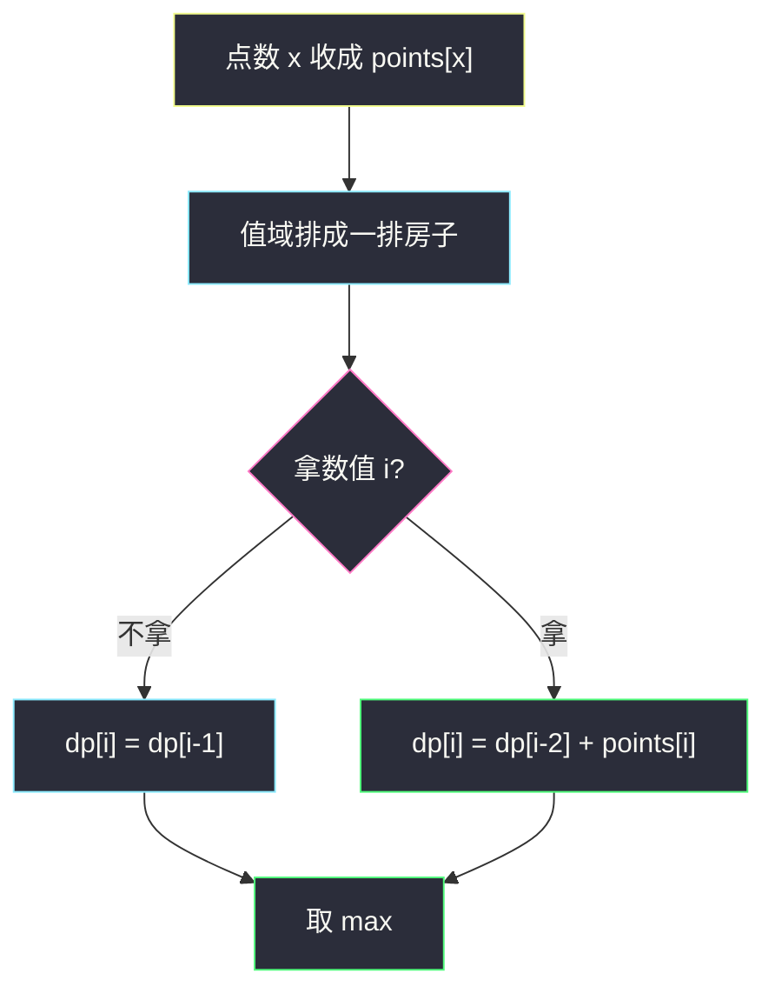
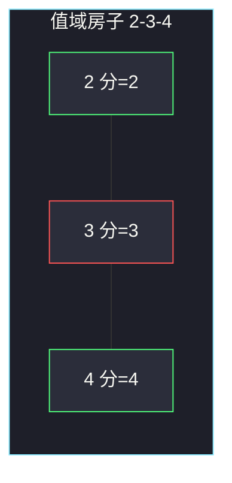

# 删除并获得点数（打家劫舍 · 相邻数字不能一起拿）

## 一、问题描述

数组 `nums`。每次选一个值 `x = nums[i]`，得到 `x` 分，然后删掉：

- 所有等于 `x` 的元素（当前这个已经拿过分，其余相同值**也会被删**——且题目允许你在删之前把每个 `x` 都拿一遍，见下）；
- 所有等于 `x-1` 和 `x+1` 的元素（这些分拿不到）。

操作可重复，直到数组空。求能拿到的最大点数。

题面「删除所有 `x`」容易读成「同值只能拿一次」。正确读法是：**每个出现的 `x` 都能加进得分**（先把所有 `x` 的贡献 `x * cnt[x]` 算进去），但一旦拿了数值 `x`，数值 `x-1` 与 `x+1` 就一张都不能拿。

> 🔗 LeetCode 740：https://leetcode.cn/problems/delete-and-earn/
>
> 数据范围：`1 ≤ n ≤ 2·10^4`，`1 ≤ nums[i] ≤ 10^4`。
>
> 📚 灵茶题单：**§1.2 打家劫舍**。先把相同值收成桶 `points[x] = x * cnt[x]`，再在值域 `1..max` 上做「相邻不能偷」的打家劫舍。

**示例 1**

```
输入：nums = [3,4,2]
输出：6
解释：拿 2 和 4（各一次），得 6。拿 3 只能得 3（4 和 2 都被删）。不是 3+3：数组里只有一个 3。
```

**示例 2**

```
输入：nums = [2,2,3,3,3,4]
输出：9
解释：拿全部三个 3，得 9；2 和 4 被删。若拿两个 2 和一个 4，得 8，更差。
```

**直观理解**

冲突只发生在**数值差 1** 的两档。相同数值不互相冲突，应该全拿或全不拿（全拿一定不差：多出来的是正分）。于是每个整数 `x` 变成一间「屋子」，屋里放着 `points[x]` 金；偷了 `x` 就不能偷 `x-1`、`x+1`——这就是打家劫舍的相邻约束。

---

## 二、暴力解法

每次在剩余多重集合里选一个值，删掉邻居，递归。

```python
from collections import Counter

class Solution:
    def deleteAndEarn(self, nums: list[int]) -> int:
        cnt = Counter(nums)

        def dfs(state: tuple) -> int:
            c = Counter(dict(state))
            if not c:
                return 0
            best = 0
            for x in list(c):
                gain = x * c[x]
                nxt = Counter(c)
                nxt.pop(x, None)
                nxt.pop(x - 1, None)
                nxt.pop(x + 1, None)
                best = max(best, gain + dfs(tuple(sorted(nxt.items()))))
            return best

        return dfs(tuple(sorted(cnt.items())))
```

官方两例能过。不同 `x` 有几十上百种时，子集指数爆炸，`n = 2·10^4` 超时。

### 🔴 瓶颈在哪里

值域只有 `10^4`。相同 `x` 已经捆成一包。剩下只是「对每个值选或不选，不能同时选相邻值」——线性打家劫舍，`O(U)`，`U = max(nums)`。

---

## 三、优化探索（核心章节）

> 📚 本题在灵茶题单中属于 **§1.2 打家劫舍**。模板：`dp[i] = max(dp[i-1], dp[i-2] + w[i])`，`w[i]` 是偷第 `i` 间的收益。本题的「房子」按**数值**排，不是按下标排。

### 3.1 桶

`points[x] = x * 出现次数`。没出现过的 `x` 为 0（相当于一间空房子，偷了不加分，但不挡路——因为 0 与两边 `max` 时自然不会选它来「占坑」）。

选了数值 `x` 就不能选 `x-1`、`x+1`，**可以**选 `x-2`（`x-2` 只和 `x-1` 冲突）。所以冲突图是一条链：`1—2—3—…—U`。

### 3.2 状态

`dp[i]` = 只考虑数值 `0..i`（或 `1..i`）时的最大点数。

- 不拿 `i`：`dp[i-1]`
- 拿 `i`：`points[i] + dp[i-2]`（`i-1` 必须放弃）

`dp[i] = max(dp[i-1], dp[i-2] + points[i])`。

答案 `dp[U]`。滚动两个变量即可。

下标 0 的 `points[0]` 恒为 0（`nums[i] ≥ 1`），从 0 扫到 `U` 少写边界。



### 3.3 和原数组下标打家劫舍的差别

198 题房子按数组下标相邻。本题原数组里 `3` 和 `5` 即使下标相邻也不冲突；冲突只看值。不要对 `nums` 排序后按下标做 198，除非先去重成值域。

### 3.4 一句话核心

> **同值打包成 points[x]；相邻整数不能一起拿，就是打家劫舍。**

---

## 四、代码实现

### Python（主解）

```python
class Solution:
    def deleteAndEarn(self, nums: list[int]) -> int:
        u = max(nums)
        points = [0] * (u + 1)
        for x in nums:
            points[x] += x  # 每个 x 都能得分
        # dp[i] = 只考虑数值 0..i 的最大点数
        prev2, prev1 = 0, 0  # 分别是 dp[i-2], dp[i-1]
        for i in range(u + 1):
            prev2, prev1 = prev1, max(prev1, prev2 + points[i])
        return prev1
```

### 不滚动，便于对拍数组

```python
class Solution:
    def deleteAndEarn(self, nums: list[int]) -> int:
        u = max(nums)
        points = [0] * (u + 1)
        for x in nums:
            points[x] += x
        dp = [0] * (u + 1)
        dp[0] = points[0]
        if u >= 1:
            dp[1] = max(points[0], points[1])
        for i in range(2, u + 1):
            dp[i] = max(dp[i - 1], dp[i - 2] + points[i])
        return dp[u]
```

### Java（最优解）

```java
class Solution {
    public int deleteAndEarn(int[] nums) {
        int u = 0;
        for (int x : nums) {
            u = Math.max(u, x);
        }
        int[] points = new int[u + 1];
        for (int x : nums) {
            points[x] += x;
        }
        int prev2 = 0, prev1 = 0;
        for (int i = 0; i <= u; i++) {
            int cur = Math.max(prev1, prev2 + points[i]);
            prev2 = prev1;
            prev1 = cur;
        }
        return prev1;
    }
}
```

点数上限约 `2·10^4 × 10^4`，`int` 够用。

---

## 五、具体例子演示

### 5.1 官方示例 1：`[3,4,2]` → 6

频次：`2` 一次，`3` 一次，`4` 一次。  
`points = [0, 0, 2, 3, 4]`（下标 0..4）。

逐步填 `dp`（`take = points[i] + dp[i-2]`，`skip = dp[i-1]`）：

| i | points[i] | take | skip | dp[i] | 含义 |
|---|-----------|------|------|-------|------|
| 0 | 0 | 0 | 0 | 0 | 没有 0 |
| 1 | 0 | 0 | 0 | 0 | 没有 1 |
| 2 | 2 | 2 | 0 | **2** | 拿 2 |
| 3 | 3 | 0+3=3 | 2 | **3** | 改拿 3，丢掉 2 |
| 4 | 4 | 2+4=6 | 3 | **6** | 拿 2 和 4，不拿 3 |

答案 6。对拍官方。

路径：数值 4 选了，所以 3 不能选；2 与 4 不相邻，可以一起选。`2+4=6 > 3`。

**不是 `3+3`**：数组只有一个 3，`points[3]=3`。任务书里那句「拿 3 两次」是误读，以官方 6 为准。



绿的 2 和 4 一起拿；红的 3 与两边都相邻，这条最优里不拿。

### 5.2 官方示例 2：`[2,2,3,3,3,4]` → 9

`points[2]=2+2=4`，`points[3]=3×3=9`，`points[4]=4`。

| i | points[i] | take | skip | dp[i] |
|---|-----------|------|------|-------|
| 2 | 4 | 4 | 0 | 4 |
| 3 | 9 | 9 | 4 | **9** |
| 4 | 4 | 4+4=8 | 9 | **9** |

答案 9。拿三个 3，放弃 2 和 4。`8 < 9`，所以不选「两个 2 + 一个 4」。对拍官方。

同值必须整包：不可能「三个 3 只拿两个」还去拿 4——一旦拿了任意一个 3，所有 4 都被删；既然 3 已经选了，剩下的 3 没有邻居可冲突，应全部拿完。

### 5.3 空档（points 为 0）

若数组是 `[1,3]`：`points[1]=1`，`points[2]=0`，`points[3]=3`。中间空房子收益 0，`dp` 会自动允许 1 和 3 一起拿（隔着 2），答案 `4`。这正是「只禁相邻整数」。

---

## 六、复杂度分析

| 方法 | 时间 | 空间 | 说明 |
|------|------|------|------|
| 子集递归 | 指数 | 状态数大 | 超时 |
| 值域打家劫舍（主解） | `O(n + U)` | `O(U)`，滚动后除桶外 `O(1)` | `U ≤ 10^4`，`n ≤ 2·10^4` |

若 `U` 很大而不同值很少，可只对排序后的**出现过的值**做打家劫舍，相邻两值若差大于 1 则没有冲突、直接累加。本题 `U=10^4`，开桶更简单。

---

## 七、对比总结

| 维度 | 198 打家劫舍 | 本题 |
|------|-------------|------|
| 房子 | 数组下标 | 数值 1..U |
| 权重 | `nums[i]` | `x * cnt[x]` |
| 相邻 | 下标差 1 | 数值差 1 |
| 同值 | 各是各的房 | 打成一包 |

**易错点**

1. **同值只加一次 `x`**：必须 `x * cnt`。示例 2 三个 3 是 9 不是 3。
2. **示例 1 当成两个 3**：只有一个 3，答案 6 不是 3。
3. **对原数组按下标做 198**：冲突看值不看位置。
4. **拿了 `x` 还去拿 `x+1`**：桶模型里相邻两档 `max` 已经互斥。
5. **`points[x] += 1` 忘了乘 `x`**：赚的是点数不是次数。

---

## 八、举一反三

| 题目 | 关系 |
|------|------|
| [198. 打家劫舍](https://leetcode.cn/problems/house-robber/) | 同一转移；见 `solutions/base/house-robber.md` |
| [213. 打家劫舍 II](https://leetcode.cn/problems/house-robber-ii/) | 环；见 `solutions/base/house-robber-ii.md` |
| [3186. 施咒的最大总伤害](https://leetcode.cn/problems/maximum-total-damage-with-spell-casting/) | 选了 `x` 不能选 `x-2..x+2`，桶 + 打家劫舍加宽 |
| [337. 打家劫舍 III](https://leetcode.cn/problems/house-robber-iii/) | 树形相邻；见 `solutions/base/house-robber-iii.md` |
| [3147. 从魔法师身上吸取的最大能量](https://leetcode.cn/problems/taking-maximum-energy-from-the-mystic-dungeon/) | 同目录一维 DP：`taking-maximum-energy-from-the-mystic-dungeon.md` |

**思想迁移**

- 冲突若能排成一条链，就收成打家劫舍。
- 口诀：**「同值打包；邻档互斥；max(跳过, 拿+隔一档)。」**
