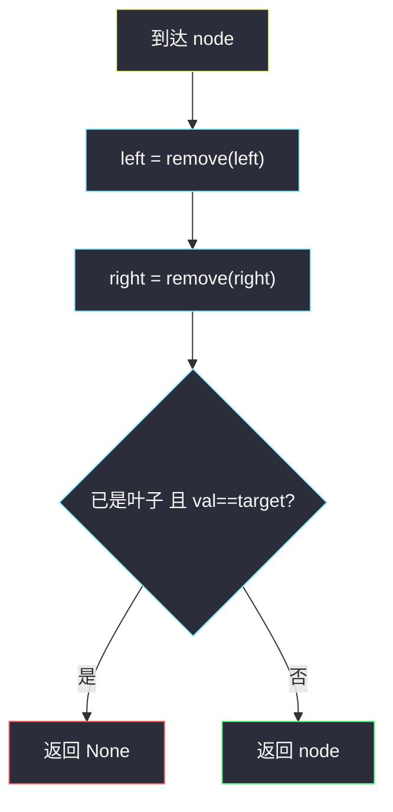
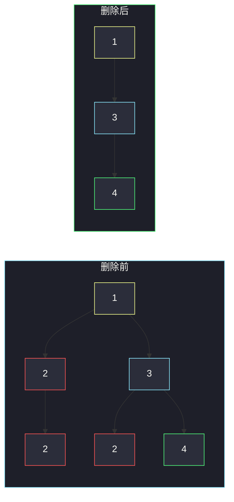

# 删除给定值的叶子节点（后序删点 · 新叶子会再露出来）

## 一、问题描述

给定二叉树根 `root` 和整数 `target`，删掉所有值为 `target` 的**叶子**。删完后父节点可能变成新叶子；若新叶子的值也是 `target`，继续删，直到不能再删。

> 🔗 LeetCode 1325：https://leetcode.cn/problems/delete-leaves-with-a-given-value/
>
> 数据范围：节点数 `[1, 3000]`，`1 ≤ Node.val, target ≤ 1000`。
>
> 📚 灵茶题单：**二叉树 · §2.4 自底向上 DFS：删点**（1407 分）。

**示例 1**

```
输入：root = [1,2,3,2,null,2,4], target = 2
输出：[1,null,3,null,4]
删除过程：
      1                 1                 1
     / \                 \                 \
    2   3                 3                 3
   /   / \               / \                 \
  2   2   4             2   4                 4
先删两片值为 2 的叶子，左边那个 2 变成新叶子，再删一次。
```

**示例 2**

```
输入：root = [1,3,3,3,2], target = 3
输出：[1,3,null,null,2]
树形：
      1                    1
     / \                  /
    3   3                3
   / \                    \
  3   2                    2
右边的 3 是叶子，删掉；左边的 3 还有孩子 2，不是叶子，留下。
```

**直观理解**

只删「当前已经是叶子、且值等于 target」的节点。内部的 target 先不能动——它的孩子删干净之后，它自己才可能变成叶子。所以必须**先处理完左右子树，再看自己**。这就是 §2.4：默认子树已经处理好。

---

## 二、暴力解法

反复整棵扫描：找到所有值为 `target` 的叶子，删掉，再扫，直到某一轮一个都没删。

```python
class Solution:
    def removeLeafNodes(self, root: Optional[TreeNode], target: int) -> Optional[TreeNode]:
        def find_parents(node, parent, mapping):
            if node is None:
                return
            mapping[node] = parent
            find_parents(node.left, node, mapping)
            find_parents(node.right, node, mapping)

        while True:
            parents = {}
            find_parents(root, None, parents)
            leaves = [
                n for n in parents
                if n.left is None and n.right is None and n.val == target
            ]
            if not leaves:
                break
            for leaf in leaves:
                p = parents[leaf]
                if p is None:
                    return None
                if p.left is leaf:
                    p.left = None
                else:
                    p.right = None
        return root
```

链状全是 `target` 时，每轮只剥一层，要剥 `n` 轮，每轮扫整棵树。

### 复杂度

- **时间**：最坏 `O(n²)`。
- **空间**：父指针表 `O(n)`。

`n = 3000` 能过，但同一层信息被扫了很多遍。

### 🔴 瓶颈在哪里

后序一次就能模拟「从下往上剥洋葱」：左右已经删干净，当前点若变成 target 叶子，直接返回 `None`。父节点接到空指针，自然变成更浅的新叶子，轮到它自己再判断。不必外层 while。

---

## 三、优化探索（核心章节）

> 📚 本题在灵茶题单中属于 **二叉树 · §2.4 自底向上 DFS：删点**。先递归左右（子树已处理完），再决定当前节点留下还是变成 `None`。与 [814. 二叉树剪枝](https://leetcode.cn/problems/binary-tree-pruning/) 同骨架，删的条件从「子树不含 1」换成「自己变成了值为 target 的叶子」。

### 3.1 什么时候删自己

当前节点该返回 `None`，当且仅当：

- 左右都已经处理完，并且
- 处理后左右都空（自己现在是叶子），并且
- `node.val == target`

内部节点哪怕值是 `target`，只要剪完后还剩一个孩子，就不能删。

### 3.2 后序骨架

```
node.left  = remove(node.left)     # 子树已经处理好
node.right = remove(node.right)
if 自己是叶子 且 val == target:
    return None                    # 把自己删了
return node
```

必须把返回值接回 `left` / `right`。只 `return None` 而不改父节点的指针，那个叶子还挂在树上。



和 814 的差别：814 在「自己是 0 且两边空」时删（等价于整棵子树不含 1）；本题只看**此刻是不是 target 叶子**。一个非叶子的 target，只要下面还挂着别的值，就得留着当桥。

### 3.3 一句话核心

> **先删左右；自己变成 target 叶子就返回 None，否则留下。**

---

## 四、代码实现

### Python（主解：后序删点）

```python
class Solution:
    def removeLeafNodes(self, root: Optional[TreeNode], target: int) -> Optional[TreeNode]:
        if root is None:
            return None
        root.left = self.removeLeafNodes(root.left, target)
        root.right = self.removeLeafNodes(root.right, target)
        if root.left is None and root.right is None and root.val == target:
            return None
        return root
```

**变量含义**

| 写法 | 含义 |
|------|------|
| `root.left = remove(...)` | 左子删完后可能变空，必须接回来 |
| 三个条件同时成立 | 当前已是 target 叶子，删掉本节点 |

空节点返回 `None`。根若被一层层剥光，函数返回 `None`。

不必单独写「是不是叶子」的预处理：叶子的左右本来就是 `None`，递归回来立刻就能判断。

### Java（可选）

```java
class Solution {
    public TreeNode removeLeafNodes(TreeNode root, int target) {
        if (root == null) return null;
        root.left = removeLeafNodes(root.left, target);
        root.right = removeLeafNodes(root.right, target);
        if (root.left == null && root.right == null && root.val == target) {
            return null;
        }
        return root;
    }
}
```

---

## 五、具体例子演示

**示例 1**：`target = 2`，后序先处理下面的点。

```
开始：                第一轮叶子消失后：     再剥一层：
      1                     1                  1
     / \                     \                  \
    2   3                     3                  3
   /   / \                   / \                  \
  2   2   4                 2   4                  4
```

| 访问（后序） | 节点 | 左右接回来之后 | 决策 |
|--------------|------|----------------|------|
| 1 | 左下 2 | 左右皆空，val=2 | **返回 None** |
| 2 | 左 2 | 左空、右空，val=2 | **返回 None**（孩子刚被删，自己变成新叶子） |
| 3 | 中下 2 | 左右皆空，val=2 | **返回 None** |
| 4 | 4 | 左右皆空，val=4 | 留下 |
| 5 | 右 3 | 左空、右是 4 | 留下（不是叶子） |
| 6 | 根 1 | 左空、右是 3 | 留下 |



红节点最终都被删。左 2 一开始不是叶子，后序处理完孩子之后才变成叶子——这正是「必须自底向上」的原因。

**示例 2**：`target = 3`

| 区域 | 后序结果 |
|------|----------|
| 左下叶子 3 | 删掉 |
| 左下 2 | 不是 target，留下 |
| 左 3 | 右边还有 2，不是叶子，留下 |
| 右 3 | 是叶子且 val=3，删掉 |
| 根 1 | 留下 |

左边那个 3 值等于 target，但删完左孩子后右边还挂着 2，不能删。先序或中序看到「此刻有孩子」就跳过，会漏掉「孩子稍后被删、自己变成叶子」的节点；后序不会。

---

## 六、复杂度分析

| 方法 | 时间 | 空间 | 说明 |
|------|------|------|------|
| 反复整棵找叶子 | `O(n²)` | `O(n)` | 链状每轮剥一层 |
| 后序一遍（主解） | `O(n)` | `O(h)` 递归栈 | 每点进出一次；`n ≤ 3000`，`h ≤ n` |

---

## 七、对比总结

| 维度 | 自顶向下 #1448 | 本题 / #814 自底向上删点 |
|------|----------------|--------------------------|
| 信息方向 | 祖先参数往下 | 孩子返回值往上 |
| 默认假设 | 路上最大值已知 | **子树已经处理好** |
| 删不删 | 不删点 | 归上来再决定自己在不在 |

**易错点**

1. **先看自己再递归**：左右还没删，不能根据「此刻有没有孩子」判断自己会不会变成叶子。必须后序。
2. **返回值没接回去**：`remove(root.left)` 的结果要赋给 `root.left`。
3. **内部的 target 被误删**：删除条件必须带「左右都空」。
4. **链状 target**：示例 3 `[1,2,null,2,null,2]`，要从下往上连删三次，后序一次走完。
5. **整棵树都被剥光**：根最后也变成 target 叶子，返回 `None`，不是返回一个空壳节点。

---

## 八、举一反三

| 题目 | 关系 |
|------|------|
| [814. 二叉树剪枝](https://leetcode.cn/problems/binary-tree-pruning/) | 同节后序删点；条件换成「子树不含 1」。见 `binary-tree-pruning.md` |
| [669. 修剪二叉搜索树](https://leetcode.cn/problems/trim-a-binary-search-tree/) | 后序 + BST 范围，整段子树可直接丢掉 |
| [1110. 删点成林](https://leetcode.cn/problems/delete-nodes-and-return-forest/) | 后序删点，被删节点的孩子成为新树根 |
| [1080. 根到叶路径上的不足节点](https://leetcode.cn/problems/insufficient-nodes-in-root-to-leaf-paths/) | 自底向上：子树最大路径和不够就删 |
| [1448. 统计二叉树中好节点的数目](https://leetcode.cn/problems/count-good-nodes-in-binary-tree/) | 对比：好节点看祖先，信息往下传。见 `count-good-nodes-in-binary-tree.md` |

**思想迁移**

- 删不删取决于「孩子删完后自己长什么样」→ 后序；默认子树已处理完，再问自己留不留。
- 口诀：**「先剪左右；变成 target 叶子则返回空。」**
