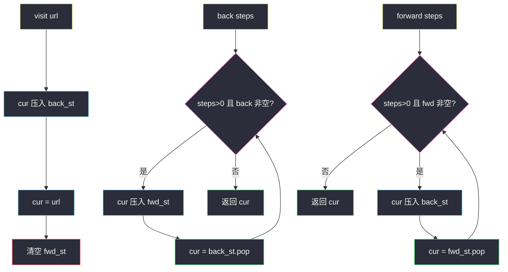
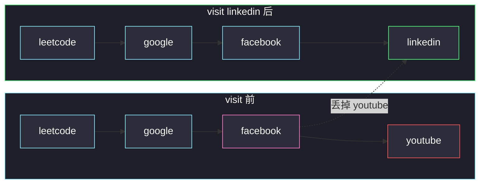

# 设计浏览器历史记录

## 一、问题描述

实现单标签页浏览器的历史：构造时停在 `homepage`，之后支持访问新页面、后退、前进。`visit` 会清掉当前页**之后**的前进记录（和真实浏览器一样：后退若干步再点新链接，原来的前进栈作废）。

请实现 `BrowserHistory`：

| API | 职责 |
|-----|------|
| `BrowserHistory(homepage)` | 当前页 = 首页，历史里还没有任何后退/前进 |
| `visit(url)` | 从当前页跳到 `url`，**清空全部前进记录** |
| `back(steps)` | 尽量后退 `steps` 步（不够就退到头），返回到达的 url |
| `forward(steps)` | 尽量前进 `steps` 步（不够就进到头），返回到达的 url |

> 🔗 LeetCode 1472：https://leetcode.cn/problems/design-browser-history/
>
> 数据范围：url 长度 ≤ 20，`steps ≤ 100`，三种操作合计 ≤ 5000 次。

**示例（官方调用序列）**

```
BrowserHistory("leetcode.com")
visit("google.com")
visit("facebook.com")
visit("youtube.com")
back(1)      → "facebook.com"
back(1)      → "google.com"
forward(1)   → "facebook.com"
visit("linkedin.com")     // youtube 这条前进记录被清掉
forward(2)   → "linkedin.com"   // 不能再前进
back(2)      → "google.com"
back(7)      → "leetcode.com"   // 只能再退 1 步
```

**直观理解**

历史是一条被「当前指针」切开的链：左边是能后退的页，右边是能前进的页。`visit` 等于丢掉右半段再接到新页。两种实现：两个栈，或数组加指针。

---

## 二、暴力解法

每次 `visit` / `back` / `forward` 都拿一个完整字符串列表重切一遍：

```python
class BrowserHistory:
    def __init__(self, homepage: str):
        self.h = [homepage]
        self.i = 0

    def visit(self, url: str) -> None:
        self.h = self.h[: self.i + 1] + [url]
        self.i += 1

    def back(self, steps: int) -> str:
        self.i = max(0, self.i - steps)
        return self.h[self.i]

    def forward(self, steps: int) -> str:
        self.i = min(len(self.h) - 1, self.i + steps)
        return self.h[self.i]
```

语义已经正确，但 `visit` 每次切片复制整段历史。操作 5000、每次复制最坏 `O(操作数)`，能过但不是该用的形态。

### 复杂度

- **visit**：切片复制 `O(当前历史长度)`。
- **back / forward**：`O(1)`。
- **空间**：`O(visit 次数)`。

### 🔴 瓶颈在哪里

真正要维护的不变量只有三块：**后退可走的页、当前页、前进可走的页**。`visit` 只需要丢掉前进那一块。两个栈把这三块变成三个对象；数组加指针则用 `i` 当切分点、截断 `i` 右侧。

---

## 三、优化探索（核心章节）

> 📚 本题在灵茶题单中属于 **栈 · §3.1 基础**。后退 / 前进是典型的「从一端倒到另一端」：一个栈装当前页左边，一个栈装右边。

### 3.1 不变量（两栈）

三个部分：

| 结构 | 含义 | 栈顶 |
|------|------|------|
| `back_st` | 当前页**之前**访问过的页，底旧顶新 | 后退一步会到达的页 |
| `cur` | 正在看的 url | — |
| `fwd_st` | 当前页**之后**还能前进的页 | 前进一步会到达的页 |

任意时刻：把 `back_st`（底→顶）+ `[cur]` + `fwd_st`（顶→底，倒过来）拼起来，就是完整时间线。`fwd_st` 为空 ⇔ 不能再前进。

**`visit(url)`**

1. 当前页变成「历史」，压入 `back_st`；
2. `cur = url`；
3. `fwd_st.clear()` —— 前进分支作废。

**`back(steps)`**：能退则把 `cur` 压进 `fwd_st`，再从 `back_st` 弹出当新的 `cur`，最多 `steps` 次。

**`forward(steps)`**：对称，`cur` 压进 `back_st`，从 `fwd_st` 弹出。



### 3.2 数组 + 指针

`h` 存从首页到最右端的页，`i` 指向当前。不变量：`h[0..i]` 是可到达的过去+现在，`h[i+1..]` 是前进记录。

- `visit`：丢掉 `h[i+1:]`，再 append，`i` 移到末尾；
- `back`：`i = max(0, i - steps)`；
- `forward`：`i = min(len(h)-1, i + steps)`。

丢掉右侧用 `del h[i+1:]`（原地截断），不要每次 `h = h[:i+1]` 整段复制。`back` / `forward` 都是 `O(1)`，`visit` 只和被丢掉的前进长度有关。

### 3.3 一句话核心

> **当前页把历史切成后退栈和前进栈；visit 必须清空前进栈。**

---

## 四、代码实现

### Python（主解：两个栈）

```python
class BrowserHistory:
    def __init__(self, homepage: str):
        self.back_st = []      # 底旧顶新，可后退
        self.cur = homepage
        self.fwd_st = []       # 栈顶 = 下一步前进

    def visit(self, url: str) -> None:
        self.back_st.append(self.cur)
        self.cur = url
        self.fwd_st.clear()

    def back(self, steps: int) -> str:
        while steps and self.back_st:
            self.fwd_st.append(self.cur)
            self.cur = self.back_st.pop()
            steps -= 1
        return self.cur

    def forward(self, steps: int) -> str:
        while steps and self.fwd_st:
            self.back_st.append(self.cur)
            self.cur = self.fwd_st.pop()
            steps -= 1
        return self.cur
```

### Python（数组 + 指针，等价）

```python
class BrowserHistory:
    def __init__(self, homepage: str):
        self.h = [homepage]
        self.i = 0

    def visit(self, url: str) -> None:
        del self.h[self.i + 1 :]
        self.h.append(url)
        self.i += 1

    def back(self, steps: int) -> str:
        self.i = max(0, self.i - steps)
        return self.h[self.i]

    def forward(self, steps: int) -> str:
        self.i = min(len(self.h) - 1, self.i + steps)
        return self.h[self.i]
```

**两栈变量**

| 变量 | 不变量 |
|------|--------|
| `back_st` | 不含当前页；弹一次 = 后退一页 |
| `cur` | 当前 url，任何 API 结束时都有效 |
| `fwd_st` | `visit` 之后必须为空 |

`back` / `forward` 的 `while` 在 `steps` 用尽或栈空时停，符合「最多走 x 步」。

---

## 五、具体例子演示

官方序列。栈从底写到顶；`cur` 单独一列。

| 操作 | 返回 | back_st（底→顶） | cur | fwd_st（底→顶） |
|------|------|------------------|-----|-----------------|
| 构造 leetcode | — | `[]` | leetcode | `[]` |
| visit google | — | `[leetcode]` | google | `[]` |
| visit facebook | — | `[leetcode, google]` | facebook | `[]` |
| visit youtube | — | `[leetcode, google, facebook]` | youtube | `[]` |
| back(1) | facebook | `[leetcode, google]` | facebook | `[youtube]` |
| back(1) | google | `[leetcode]` | google | `[youtube, facebook]` |
| forward(1) | facebook | `[leetcode, google]` | facebook | `[youtube]` |
| visit linkedin | — | `[leetcode, google, facebook]` | linkedin | `[]` |
| forward(2) | linkedin | 不变 | linkedin | `[]`（无法前进） |
| back(2) | google | `[leetcode]` | google | `[linkedin, facebook]` |
| back(7) | leetcode | `[]` | leetcode | `[linkedin, facebook, google]` |

关键两步：

1. **`visit(linkedin)`**：当时 `fwd_st` 里还有 `youtube`，必须清空。此后 `forward(2)` 走不动，返回仍是 linkedin。
2. **`back(7)`**：从 google 只能再退 1 步到首页，多出来的 6 步被 `while` 的栈空条件吃掉。

同一序列的数组视角（`^` 在当前下标）：

```
构造     [leetcode]
               ^
三次 visit [leetcode, google, facebook, youtube]
                                          ^
back 两次 [leetcode, google, facebook, youtube]
                      ^
visit 截断 [leetcode, google, facebook, linkedin]
                                          ^
```

youtube 在截断时丢掉，和清空前进栈是同一件事。



---

## 六、复杂度分析

| 方法 | visit | back / forward | 空间 |
|------|-------|----------------|------|
| 每次切片复制 | `O(历史长度)` | `O(1)` | `O(visit 次数)` |
| 两栈（主解） | `O(前进栈长度)` 清空 | `O(steps)` | `O(visit 次数)` |
| 数组 + 原地截断 | `O(被丢掉的前进长度)` | `O(1)` | `O(visit 次数)` |

`steps ≤ 100`、总操作 5000，两栈的 `O(steps)` 完全可接受。数组写法的 back/forward 更干净。

---

## 七、对比总结

| 维度 | 两栈 | 数组 + 指针 |
|------|------|-------------|
| 当前页 | 单独 `cur` | `h[i]` |
| 丢掉前进 | `fwd_st.clear()` | `del h[i+1:]` |
| 移动 k 步 | 循环弹压 k 次 | 下标加减一次 |
| 和真实浏览器 | 更像「后退键 / 前进键」两个按钮 | 更像一条地址栏历史 |

**易错点**

1. **`visit` 忘记清空前进**：后退后再访问，旧的 youtube 会错误地还能 `forward` 回去。
2. **把当前页也压进 `back_st` 再 `visit` 却没改 `cur`**：栈里会重复、当前页错位。
3. **`back` 越过首页**：必须在栈空时停，不能弹出空栈。
4. **`fwd_st` 方向反了**：后退时应把当前页压进前进栈，这样最近离开的页在栈顶，下一次 `forward` 先回到它。

**模板（§3.1 对顶栈切序列）**

```python
# 左栈 = 当前位置左侧；右栈 = 右侧（栈顶贴着光标）
visit / 写入：左压入当前，换新当前，右栈清空
向左移：当前 → 右栈，左栈弹出 → 当前
向右移：当前 → 左栈，右栈弹出 → 当前
```

---

## 八、举一反三

| 题目 | 关系 |
|------|------|
| [2296. 设计一个文本编辑器](https://leetcode.cn/problems/design-a-text-editor/) | 对顶栈：光标左右各一个栈 |
| [844. 比较含退格的字符串](https://leetcode.cn/problems/backspace-string-compare/) | 同款 §3.1：退格就是弹栈 |
| [2390. 从字符串中移除星号](https://leetcode.cn/problems/removing-stars-from-a-string/) | 邻项消除的栈模拟 |
| [1441. 用栈操作构建数组](https://leetcode.cn/problems/build-an-array-with-stack-operations/) | §3.1 基础：push/pop 序列 |
| [1472 本题](https://leetcode.cn/problems/design-browser-history/) | 设计题：先写清 API 与不变量，再选栈或数组 |

**思想迁移**

- 设计题先写不变量：每个字段在每一种 API 结束时必须满足什么。
- 口诀：**「当前页切开历史；visit 丢掉右边；back / forward 只是把当前页倒到对面那座栈。」**
