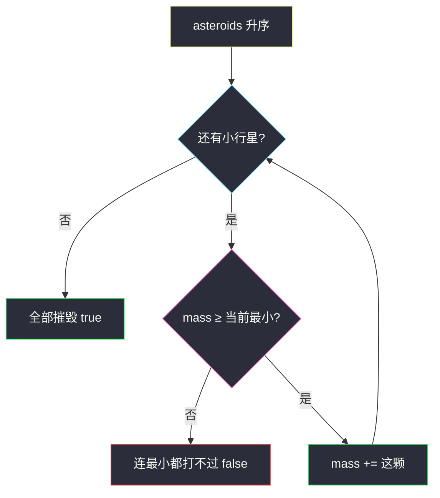
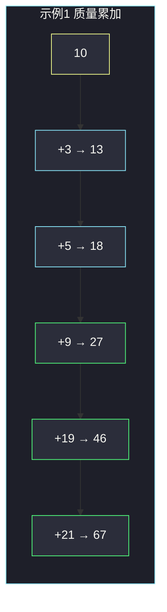

# 摧毁小行星（从最小开始贪心）

## 一、问题描述

行星初始质量是 `mass`，另有一排小行星 `asteroids[i]` 表示第 `i` 颗的质量。你可以**任意重排**碰撞顺序。规则：

- 若当前行星质量 **≥** 这颗小行星，则摧毁它，并且 `mass += asteroids[i]`；
- 否则行星被摧毁，任务失败。

问能否把**全部**小行星都摧毁。

> 🔗 LeetCode 2126：https://leetcode.cn/problems/destroying-asteroids/
>
> 数据范围：`1 ≤ mass ≤ 10^5`，`1 ≤ asteroids.length ≤ 10^5`，`1 ≤ asteroids[i] ≤ 10^5`。质量累加可达约 `10^10`，Python 无忧；Java 必须用 `long`。
>
> 📚 灵茶题单：**§1.1 从最小/最大开始贪心**（1335 分）。

**示例 1**

```
输入：mass = 10, asteroids = [3,9,19,5,21]
输出：true
解释：官方给的一种顺序是 [9,19,5,3,21]：
10→19→38→43→46→67，全部摧毁。
从小到大撞同样成功：3,5,9,19,21 得到 10→13→18→27→46→67。
```

**示例 2**

```
输入：mass = 5, asteroids = [4,9,23,4]
输出：false
解释：即使把 4、4、9 全吃掉，质量也只有 5+4+4+9=22，仍 < 23。
```

**直观理解**

能撞就变重，变重才能撞更大的。最稳的策略是：**永远先撞当前能撞的最小的**。先拿小的给自己增肥，再去碰大的。若连最小的都撞不动，换任何顺序都救不回来。

> 任务书里把示例 1 写成 10→13→18→37→58，这条链漏了质量为 9 的那颗（13+5=18 之后若跳过 9 去撞 19 也能过，但 9 必须被算进去）。下文按官方样例与「升序贪心」对拍。

---

## 二、暴力解法

枚举 `n!` 种排列，每种模拟一遍碰撞。

```python
from itertools import permutations

class Solution:
    def asteroidsDestroyed(self, mass: int, asteroids: list[int]) -> bool:
        for order in permutations(asteroids):
            cur = mass
            ok = True
            for a in order:
                if cur < a:
                    ok = False
                    break
                cur += a
            if ok:
                return True
        return False
```

`n ≤ 10^5`，排列数不可接受。即便剪枝（当前已经撞不动就换下一种），仍过不了。

### 🔴 瓶颈在哪里

提示已经写明：若某颗会撞毁行星，所有比它更大的同样会。所以每一时刻只需要看**剩余里最小的那颗**——能撞就撞，不能撞则全体剩余都撞不动。排序一次即可，不必枚举顺序。

---

## 三、优化探索（核心章节）

> 📚 本题在灵茶题单中属于 **§1.1 从最小/最大开始贪心**：要「攒质量」，从**最小**的小行星开始吃。

### 3.1 局部决策

任意时刻，剩余小行星里最小的是 `m`。

- 若 `mass < m`：最小的都打不过，其余 ≥ `m`，全部打不过，失败。
- 若 `mass ≥ m`：先吃掉 `m` 一定不亏。吃完 `mass` 变大，对后面只更有利。

所以正确顺序就是升序。

### 3.2 为什么「能成功 ⟺ 升序模拟成功」

**升序成功 ⇒ 存在一种顺序成功**：显然。

**存在一种顺序成功 ⇒ 升序也成功**（反证 / 交换）：
假设某最优顺序成功，但升序模拟在第 `i` 颗（已排序）失败，即当时 `mass < asteroids_sorted[i]`。此时尚未吃掉的都 ≥ `asteroids_sorted[i]`，无论什么顺序都吃不动——与「存在成功顺序」矛盾。

因此只需：排序，从小到大依次尝试。



### 3.3 质量会爆掉 32 位整数

最坏：`mass` 初始 `10^5`，再加 `10^5` 个 `10^5`，总和约 `10^10 + 10^5`。Java 的 `int` 最大约 `2×10^9`，必须把 `mass` 放进 `long`。Python 整数任意精度，直接加。

一个具体溢出量级：已经吃掉 30000 颗质量 `10^5` 的小行星后，`cur ≈ 3×10^9`，超过 `int` 上限；后面还有更大的要比较，`int` 一翻成负数就会把「能赢」判成「不能赢」。

### 3.4 可选剪枝

若当前 `cur` 已经 ≥ 剩余里的最大值，后面每颗都一定能吃掉（质量只增不减）。可以提前 `return true`。正确性不变，少做几次加法；排序仍免不了，所以渐近复杂度还是 `O(n log n)`。主解不必写这一刀。

### 3.5 一句话核心

> **升序排序，从小的开始撞；撞不动就 false，全部撞完就 true。累加器用足够大的整数。**

---

## 四、代码实现

### Python（主解）

```python
class Solution:
    def asteroidsDestroyed(self, mass: int, asteroids: list[int]) -> bool:
        asteroids.sort()
        cur = mass
        for a in asteroids:
            if cur < a:
                return False
            cur += a
        return True
```

**变量含义**

| 写法 | 含义 |
|------|------|
| `asteroids.sort()` | 从小到大，保证每步撞的都是剩余最小 |
| `cur` | 行星当前质量（会远超初始 `mass`） |
| `cur < a` | 连最小的都打不过，直接失败 |

### Java（必须 `long`）

```java
class Solution {
    public boolean asteroidsDestroyed(int mass, int[] asteroids) {
        Arrays.sort(asteroids);
        long cur = mass;
        for (int a : asteroids) {
            if (cur < a) {
                return false;
            }
            cur += a;
        }
        return true;
    }
}
```

若写成 `int cur = mass`，中等数据就会溢出成负数，出现「明明质量够、却判失败」或「负数比较乱真」的错。

---

## 五、具体例子演示

**示例 1（升序贪心，对拍官方 `true`）**：
`mass = 10`，`asteroids = [3,9,19,5,21]`。
排序后 `[3, 5, 9, 19, 21]`。

| 步 | 选谁 | 撞前质量 | 比较 | 撞后质量 |
|----|------|----------|------|----------|
| 1 | 3 | 10 | 10 ≥ 3 | 10+3=**13** |
| 2 | 5 | 13 | 13 ≥ 5 | 13+5=**18** |
| 3 | 9 | 18 | 18 ≥ 9 | 18+9=**27** |
| 4 | 19 | 27 | 27 ≥ 19 | 27+19=**46** |
| 5 | 21 | 46 | 46 ≥ 21 | 46+21=**67** |

全部成功，返回 `true`。

官方题解给的顺序 `[9,19,5,3,21]` 是另一条合法路径。两条路逐步对照：

| 贪心升序（实现走这条） | 官方示例顺序 |
|------------------------|--------------|
| 10+3=13 | 10+9=19 |
| 13+5=18 | 19+19=38 |
| 18+9=27 | 38+5=43 |
| 27+19=46 | 43+3=46 |
| 46+21=67 | 46+21=67 |

都摧毁全部，答案都是 `true`。实现固定升序即可，不必还原官方排列。任务书里的 10→13→18→37→58 在 18 之后直接 +19，等于漏撞了 9，对拍时不要用那条链。



**示例 2**：`mass = 5`，`asteroids = [4,9,23,4]`。
排序 `[4, 4, 9, 23]`。

| 步 | 选谁 | 撞前质量 | 比较 | 撞后质量 |
|----|------|----------|------|----------|
| 1 | 4 | 5 | 5 ≥ 4 | 9 |
| 2 | 4 | 9 | 9 ≥ 4 | 13 |
| 3 | 9 | 13 | 13 ≥ 9 | 22 |
| 4 | 23 | 22 | **22 < 23** | 失败 |

无论先撞谁，能吃掉的只有 4、4、9，总和 22 仍小于 23。先去撞 9：5 < 9，立刻失败，更糟。

**卡在「顺序敏感」的成功例**：`mass = 10`，`asteroids = [20, 10]`。
升序先 10 后 20：10≥10 → 20，再 20≥20，成功。
若先撞 20：10<20，失败。存在成功顺序，而错误的「从大到小」会判 false——这就是必须从最小开始的原因。

---

## 六、复杂度分析

| 方法 | 时间 | 空间 | 说明 |
|------|------|------|------|
| 枚举排列 | `O(n! · n)` | `O(n)` | 不可用 |
| 升序贪心（主解） | `O(n log n)` | `O(1)` 额外 | 排序主导，随后线性扫描 |

---

## 七、对比总结

| 维度 | 本题 | [3075. 幸福值最大化](https://leetcode.cn/problems/maximize-happiness-of-selected-children/) | [2554. 范围内选最多整数](https://leetcode.cn/problems/maximum-number-of-integers-to-choose-from-a-range-i/) |
|------|------|------|------|
| 贪心方向 | 从**最小**开始撞 | 从**最大**开始选 | 从**最小**可用数开始加 |
| 目的 | 尽快增肥，解锁大目标 | 让大值少衰减 | 同样预算多塞几个 |
| 失败/停止 | `mass < 当前` | 贡献 ≤ 0 | 再加超 `maxSum` |

**易错点**

1. **从大到小撞**：上面 `[20,10]`、`mass=10` 会假阴性。
2. **Java 用 `int` 累加**：`n=10^5`、每颗 `10^5` 必溢出。
3. **相等不能撞**：题意是 **≥** 就能摧毁，`mass == asteroids[i]` 合法。
4. **把「行星碰撞」735 题的栈模型搬过来**：735 是相向碰撞抵消，本题是单颗行星按顺序吞噬，只排序不栈。
5. **任务书那条 10→13→18→37→58**：漏了 9。对拍应以官方或升序链为准。

---

## 八、举一反三

| 题目 | 关系 |
|------|------|
| [2554. 从一个范围内选择最多整数 I](https://leetcode.cn/problems/maximum-number-of-integers-to-choose-from-a-range-i/) | 同节：从小的开始，能拿就拿 |
| [3075. 幸福值最大化的选择方案](https://leetcode.cn/problems/maximize-happiness-of-selected-children/) | 同节反面：从大的开始 |
| [2587. 重排数组以得到最大前缀分数](https://leetcode.cn/problems/rearrange-array-to-maximize-prefix-score/) | 同节：重排后按序累加，方向是降序 |
| [455. 分发饼干](https://leetcode.cn/problems/assign-cookies/) | 排序后用最小能满足的饼干喂最小胃口 |
| [881. 救生艇](https://leetcode.cn/problems/boats-to-save-people/) | 双指针 + 排序，也是「轻的先配对」 |
| [735. 小行星碰撞](https://leetcode.cn/problems/asteroid-collision/) | 名字像，模型完全不同：栈模拟相向抵消 |

**思想迁移**

- 「当前资源能否解锁下一档」类问题：先处理门槛最低的，用它来抬高资源。
- 口诀：**「升序撞，够就吃，不够就 false；累加用大整数。」**
