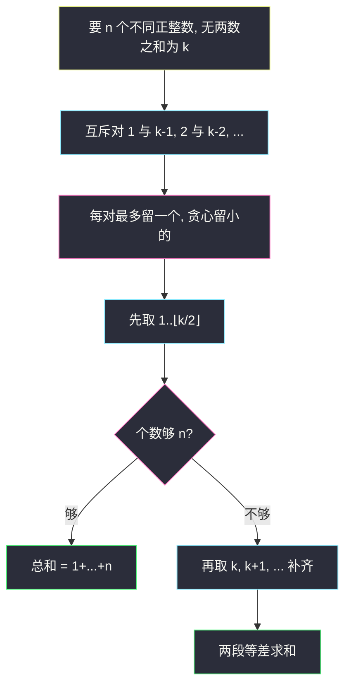
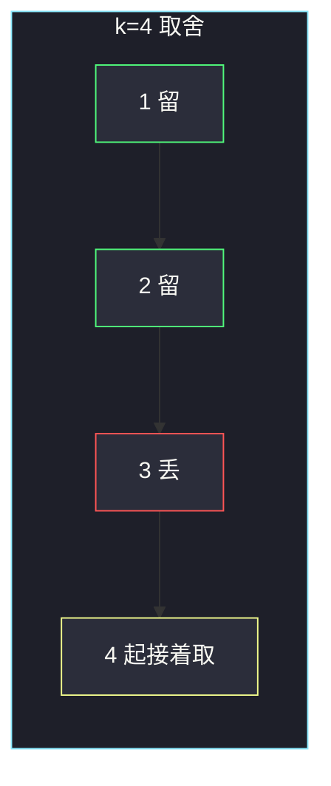

# k-avoiding 数组的最小总和（互斥对贪心）

## 一、问题描述

给你 `n` 和 `k`。由**不同正整数**组成、长度为 `n` 的数组，若不存在两个数之和为 `k`，称为 **k-avoiding**。返回所有这样的数组中，**元素和最小**的那一个的总和。

> 🔗 LeetCode 2829：https://leetcode.cn/problems/determine-the-minimum-sum-of-a-k-avoiding-array/
>
> 数据范围：`1 ≤ n, k ≤ 50`。
>
> 📚 灵茶题单：**§7.8 其他**（1347 分）。互斥对 `(1, k-1), (2, k-2), …` 每对最多选一个；贪心选小的，不够再从 `k` 起往后取。

**示例 1**

```
输入：n = 5, k = 4
输出：18
解释：数组 [1, 2, 4, 5, 6]。不存在两数之和为 4，总和 18。
```

**示例 2**

```
输入：n = 2, k = 6
输出：3
解释：数组 [1, 2]，总和 3。
```

**直观理解**

总和要最小，就该尽量拿最小的正整数：1, 2, 3, …。但有的数成对「打架」：选了 1 就不能选 `k-1`。每对里留小的、丢掉大的，再从不会和任何人配成 `k` 的 `k, k+1, …` 接着补齐长度。

---

## 二、暴力解法

从 1 开始依次尝试加入，用集合记下已选数字；只有 `k - x` 不在集合里才收 `x`。收满 `n` 个数后求和。

```python
class Solution:
    def minimumSum(self, n: int, k: int) -> int:
        vis = set()
        s = 0
        x = 1
        while len(vis) < n:
            if (k - x) not in vis:
                vis.add(x)
                s += x
            x += 1
        return s
```

`n, k ≤ 50`，循环最多走到大约 `n + k/2`，完全能过。这已经是正确贪心，只是还没写成公式。

### 🔴 瓶颈在哪里

复杂度不是问题。值得优化的是看清结构：被跳过的恰好是 `⌊k/2⌋+1 .. k-1` 这一段，前后两段都是连续正整数，和可以用等差数列 `O(1)` 算出来。

---

## 三、优化探索（核心章节）

> 📚 本题在灵茶题单中属于 **§7.8 其他**。本质是「冲突对里贪心留小」——和打家劫舍同一类互斥，但这里每对独立、没有链式相邻。

### 3.1 谁和谁冲突

正整数对 `(x, k-x)` 满足 `x + (k-x) = k`，且 `x ≠ k-x`（否则 `k` 为偶数且 `x = k/2`，两个相同的数，题目要求互不相同，**可以只拿一个 `k/2`**）。

把 `x < k-x` 即 `x < k/2` 的写成对：

| 小的（可贪心保留） | 大的（丢掉） |
|--------------------|--------------|
| 1 | k-1 |
| 2 | k-2 |
| … | … |
| `⌊k/2⌋` | `⌈k/2⌉`（k 奇数时严格大于；k 偶数时等于自身，只保留一个） |

`k` 本身：要找正整数 `y` 使 `y + k = k` ⇒ `y = 0`，不是正整数，所以 **`k` 可以选**。`k+1, k+2, …` 彼此相加 ≥ `2k > k`，和已选的 `1..⌊k/2⌋` 相加 ≥ `k+1 > k`，也不会撞 `k`。

第一段 `1..m`（`m = ⌊k/2⌋`）内部也不会两数之和为 `k`。任取不同的 `i < j ≤ m`：

- `k` 为偶数：最大和是 `m + (m-1) = k/2 + k/2 - 1 = k-1 < k`
- `k` 为奇数：最大和是 `m + (m-1) = (k-1)/2 + (k-3)/2 = k-2 < k`

等于 `k` 的加法只发生在「一小一大」跨过 `k/2` 的配对上，大的那一侧我们整段丢掉了。



### 3.2 公式

令 `m = ⌊k/2⌋`（能安全拿走的最小正整数个数）。

- 若 `n ≤ m`：就是前 `n` 个正整数，和 `n(n+1)/2`。
- 若 `n > m`：先拿 `1..m`，和 `m(m+1)/2`；再拿 `extra = n-m` 个数：`k, k+1, …, k+extra-1`。等差和 = `extra * k + extra*(extra-1)/2`。

跳过的那段 `m+1 .. k-1` 正好是互斥对里较大的那一侧。

### 3.3 一句话核心

> **互斥对留小的：先取 1..⌊k/2⌋，不够再从 k 起往后补。**

---

## 四、代码实现

### Python（主解：O(1) 等差）

```python
class Solution:
    def minimumSum(self, n: int, k: int) -> int:
        m = k // 2
        if n <= m:
            return n * (n + 1) // 2
        extra = n - m
        return m * (m + 1) // 2 + extra * k + extra * (extra - 1) // 2
```

**变量含义**

| 写法 | 含义 |
|------|------|
| `m` | `⌊k/2⌋`，第一段能取的个数 |
| `extra` | 第二段从 `k` 起要补的个数 |
| `extra * k + extra*(extra-1)//2` | `k + (k+1) + … + (k+extra-1)` |

### Python（vis 模拟，便于对拍）

```python
class Solution:
    def minimumSum(self, n: int, k: int) -> int:
        vis = set()
        s, x = 0, 1
        while n:
            if (k - x) not in vis:
                vis.add(x)
                s += x
                n -= 1
            x += 1
        return s
```

---

## 五、具体例子演示

**示例 1**：`n = 5, k = 4`。互斥对 `(1,3)`，`2+2=4` 但数字须不同，2 可留。`m = 2`。

vis 模拟逐步：

| 尝试 x | k-x 已选? | 动作 | 已选 | 剩余 n |
|--------|-----------|------|------|--------|
| 1 | 3 未选 | 收下 | {1} | 4 |
| 2 | 2 未选 | 收下 | {1,2} | 3 |
| 3 | 1 已选 | **跳过** | {1,2} | 3 |
| 4 | 0 未选 | 收下 | {1,2,4} | 2 |
| 5 | -1 未选 | 收下 | {1,2,4,5} | 1 |
| 6 | -2 未选 | 收下 | {1,2,4,5,6} | 0 |

数组 `[1,2,4,5,6]`，和 `18`。公式：`n=5 > m=2`，`extra=3`，`2*3/2 + 3*4 + 3*2/2 = 3+12+3 = 18`。对拍官方。



**示例 2**：`n = 2, k = 6`。`m = 3 ≥ 2`，直接取 `1,2`，和 `3`。不必碰到互斥对 `(1,5)、(2,4)` 里较大的一侧。对拍官方。

**再代入 `n=4, k=5`**（奇数 k）：

互斥对 `(1,4)、(2,3)`，`m=2`。取 `1,2` 再取 `5,6`，和 `14`。

| 段 | 数字 | 部分和 |
|----|------|--------|
| 1..m | 1, 2 | 3 |
| k 起 extra=2 | 5, 6 | 11 |
| 合计 | | 14 |

检查：`1+4=5` 但 4 没拿；`2+3=5` 但 3 没拿；`1+2=3`、`5+6=11` 都不等于 5。

**边界**：`n=1` 答案恒为 1（单元素没有两数之和）。`k=1`：没有任何两正整数之和为 1，答案是 `1+…+n`。`k=2`：`m=1`，可取 1，再从 2 起——等于全体前 n 个正整数（1 与 1 不能各拿一次）。

---

## 六、复杂度分析

| 方法 | 时间 | 空间 | 说明 |
|------|------|------|------|
| vis 从 1 扫 | `O(n + k)` | `O(n)` | 范围 50，能过 |
| 两段等差（主解） | `O(1)` | `O(1)` | 推荐 |

`n、k ≤ 50` 时两种无差别；公式能把「跳过哪一段」说清楚。

---

## 七、对比总结

| 维度 | vis 模拟 | 公式 |
|------|----------|------|
| 正确性 | 贪心逐步 | 同一贪心的闭式 |
| 要默写时 | 不易漏边界 | 注意 `n ≤ m` 分支 |
| 为何从 k 接着取 | 跑着看跳过了 m+1..k-1 | 结构一眼可见 |

**易错点**

1. **丢掉 `k` 本身**：误以为和 k 冲突的数存在。0 不是正整数，`k` 安全。
2. **偶数 k 丢掉 `k/2`**：`k/2 + k/2 = k` 需要两个相同的数，只拿一个合法。
3. **不够时从 `m+1` 接着取**：那正是互斥对的大端，会和已选小数相加得 k。必须跳到 `k`。
4. **两数可以相同**：题目是不同正整数。
5. **求数组却返回了和**：题目只要总和。

---

## 八、举一反三

| 题目 | 关系 |
|------|------|
| [198. 打家劫舍](https://leetcode.cn/problems/house-robber/) | 互斥选一，不过是链式相邻 |
| [15. 三数之和](https://leetcode.cn/problems/3sum/) | 「两数之和为 target」的检测，本题是反过来避开 |
| [167. 两数之和 II](https://leetcode.cn/problems/two-sum-ii-input-array-is-sorted/) | 配对 `(x, k-x)` 同一结构 |
| [2178. 拆分成最多数目的正偶数之和](https://leetcode.cn/problems/maximum-split-of-positive-even-integers/) | 贪心拿最小合法正整数 |
| [2834. 找出美丽数组的最小和](https://leetcode.cn/problems/find-the-minimum-possible-sum-of-a-beautiful-array/) | 同一贪心，n 更大且要对 `10^9+7` 取模 |

**思想迁移**

- 最小和 + 互斥约束：先按从小到大，碰到冲突留小的。
- 口诀：**「成对留小，缺口从 k 补；k 自己能进数组。」**
