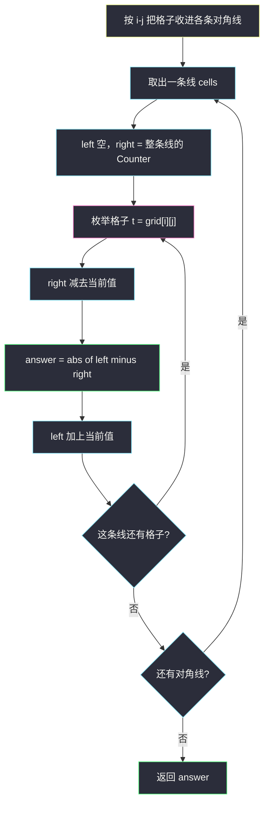
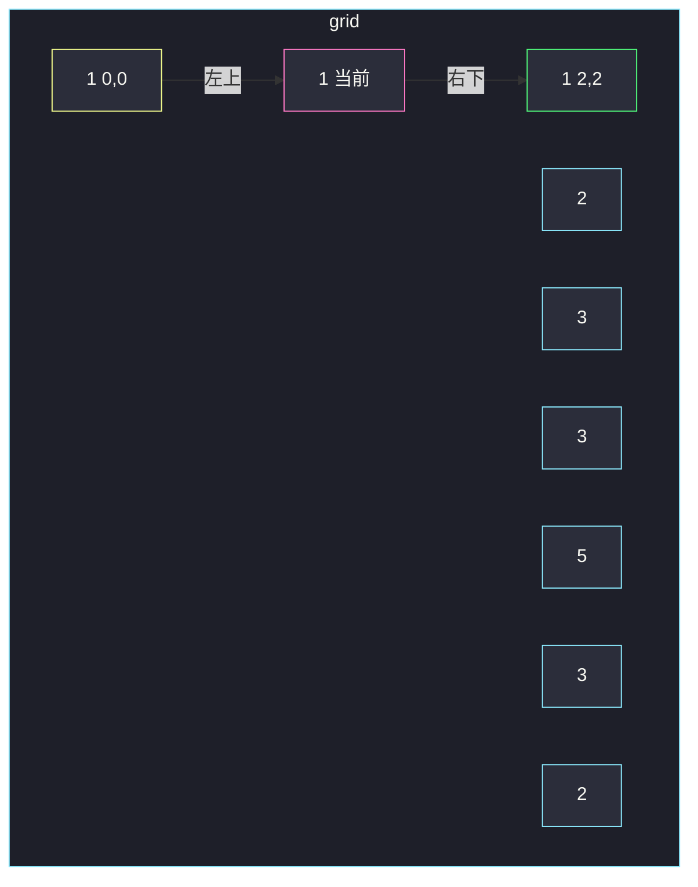

# 对角线上不同值的数量差（按 i-j 分组扫描）

## 一、问题描述

给你 `m × n` 矩阵 `grid`。对每个格子 `(r, c)` 定义：

- `topLeft`：它**左上**对角线上（不含自己）不同值的个数；
- `bottomRight`：它**右下**对角线上（不含自己）不同值的个数。

答案矩阵 `answer[r][c] = |topLeft - bottomRight|`。

对角线沿右下方向走：`(r, c)` 的左上是 `(r-1, c-1)`、`(r-2, c-2)`、…，右下是 `(r+1, c+1)`、…。格子本身不计入任何一侧。

> 🔗 LeetCode 2711：https://leetcode.cn/problems/difference-of-number-of-distinct-values-on-diagonals/
>
> 数据范围：`1 <= m, n, grid[i][j] <= 50`。

**示例 1**

```
输入：grid = [[1,2,3],[3,1,5],[3,2,1]]
输出：[[1,1,0],[1,0,1],[0,1,1]]
```

网格：

```
1  2  3
3  1  5
3  2  1
```

以 `(1,1)` 为例：左上只有 `(0,0)=1`，右下只有 `(2,2)=1`，`|1-1|=0`。

**示例 2**

```
输入：grid = [[1]]
输出：[[0]]
解释：两侧都为空，|0-0|=0。
```

**直观理解**

同一条右下对角线，下标满足 **`i - j` 为常数**。每个格子的答案只取决于这条线上、它左边那一段和右边那一段各自有多少种不同值。按对角线分组，从一端扫到另一端，用哈希计数，避免每个格子都重新走一遍。

---

## 二、暴力解法

每个格子分别向左上、向右下走，用集合去重。

```python
class Solution:
    def differenceOfDistinctValues(self, grid: List[List[int]]) -> List[List[int]]:
        m, n = len(grid), len(grid[0])
        ans = [[0] * n for _ in range(m)]
        for i in range(m):
            for j in range(n):
                s = set()
                x, y = i - 1, j - 1
                while x >= 0 and y >= 0:
                    s.add(grid[x][y])
                    x -= 1
                    y -= 1
                left = len(s)
                s = set()
                x, y = i + 1, j + 1
                while x < m and y < n:
                    s.add(grid[x][y])
                    x += 1
                    y += 1
                ans[i][j] = abs(left - len(s))
        return ans
```

### 复杂度

- **时间**：`O(m · n · (m + n))`，方阵约 `O(n³)`。`n ≤ 50` 能过。
- **空间**：`O(min(m, n))` 集合，外加答案 `O(mn)`。

### 🔴 瓶颈在哪里

同一对角线上相邻格子的左上集合只差一个元素，右下同理。每个格子都从头扫，重复走了很多格子。按 `i - j` 分组后，一条对角线扫两遍（或带两个计数器扫一遍）即可。

---

## 三、优化探索（核心章节）

> 📚 本题在灵茶题单中属于 **§0.3 遍历对角线**。钥匙是下标恒等式：右下方向同一条线 `i - j` 相等；左下 / 右上那族是 `i + j`。本题只用右下族。

### 3.1 分组

行优先遍历时，同一 `i - j` 的格子按「从上到下、从左到右」进入列表，天然就是这条对角线从左上到右下的顺序。

对角线条数 = `m + n - 1`，`i - j` 的范围是 `-(n-1) .. (m-1)`。

### 3.2 一条线上的左右不同数

设这条线的值是 `v[0], v[1], …, v[L-1]`（左上到右下）。格子 `t` 的

```
left  = v[0..t-1] 的不同值个数
right = v[t+1..L-1] 的不同值个数
```

自己不计入。用两个 `Counter`：

- 开始：`left` 空，`right` 装着整条线；
- 处理格子 `t`：先把 `v[t]` 从 `right` 里减掉（现在 `right` 正好是右侧），答案 `|len(left) - len(right)|`，再把 `v[t]` 加进 `left`。

`len(Counter)` 在 count 降到 0 时要 `del`，否则键还在。



### 3.3 两种对角线不要混

`i + j` 是另一族（左下 / 右上）。本题「矩阵对角线」明确是右下，只用 `i - j`。边界格子一侧为空，不同数是 0，不必特判。

### 3.4 一句话核心

> **同一右下对角线 i-j 为常数；线上从左上扫到右下，左右各挂一个哈希计数，答案是两侧不同值个数之差的绝对值。**

---

## 四、代码实现

### Python（主解：按对角线分组）

```python
class Solution:
    def differenceOfDistinctValues(self, grid: List[List[int]]) -> List[List[int]]:
        m, n = len(grid), len(grid[0])
        ans = [[0] * n for _ in range(m)]
        diags = defaultdict(list)
        for i in range(m):
            for j in range(n):
                diags[i - j].append((i, j))     # 行优先 ⇒ 左上到右下

        for cells in diags.values():
            left = Counter()
            right = Counter(grid[i][j] for i, j in cells)
            for i, j in cells:
                v = grid[i][j]
                right[v] -= 1
                if right[v] == 0:
                    del right[v]
                ans[i][j] = abs(len(left) - len(right))
                left[v] += 1
        return ans
```

**变量含义**

| 变量 | 含义 |
|------|------|
| `diags[i-j]` | 这条右下对角线上的格子，已按左上→右下排好 |
| `left` | 当前格严格左上一段的值计数 |
| `right` | 当前格严格右下一段的值计数 |

暴力版在 `n=50` 也能过，分组写法每个格子只处理常数次，更干净，也是 §0.3 要练的手法。

### Java（最优解同款）

```java
class Solution {
    public int[][] differenceOfDistinctValues(int[][] grid) {
        int m = grid.length, n = grid[0].length;
        int[][] ans = new int[m][n];
        Map<Integer, List<int[]>> diags = new HashMap<>();
        for (int i = 0; i < m; i++) {
            for (int j = 0; j < n; j++) {
                diags.computeIfAbsent(i - j, k -> new ArrayList<>()).add(new int[]{i, j});
            }
        }
        for (List<int[]> cells : diags.values()) {
            Map<Integer, Integer> left = new HashMap<>();
            Map<Integer, Integer> right = new HashMap<>();
            for (int[] c : cells) right.merge(grid[c[0]][c[1]], 1, Integer::sum);
            for (int[] c : cells) {
                int v = grid[c[0]][c[1]];
                int rc = right.merge(v, -1, Integer::sum);
                if (rc == 0) right.remove(v);
                ans[c[0]][c[1]] = Math.abs(left.size() - right.size());
                left.merge(v, 1, Integer::sum);
            }
        }
        return ans;
    }
}
```

---

## 五、具体例子演示

`grid = [[1,2,3],[3,1,5],[3,2,1]]`。先盯住格子 `(1,1)` 的两条射线，再整条 `i-j=0` 扫一遍。

### 5.1 格子 `(1,1)` 的左右集合

```
(0,0)=1  (0,1)=2  (0,2)=3
(1,0)=3  (1,1)=1  (1,2)=5
(2,0)=3  (2,1)=2  (2,2)=1
```

`(1,1)` 所在对角线 `i-j=0`：`(0,0) → (1,1) → (2,2)`，值 `1, 1, 1`。

| 侧 | 格子 | 值集合 | 不同个数 |
|----|------|--------|----------|
| 左上 | `(0,0)` | `{1}` | 1 |
| 自己 | `(1,1)` | 不计入 | — |
| 右下 | `(2,2)` | `{1}` | 1 |

`answer[1][1] = |1-1| = 0`。

再看 `(0,0)`：左上空集，右下 `{1, 1}` 不同数 1，答案 1。  
`(2,2)`：左上 `{1, 1}` 不同数 1，右下空，答案 1。  
`(1,2)`：对角线 `i-j=-1`，左上只有 `(0,1)=2`，右下空，答案 1。



### 5.2 整条 `i-j = 0` 的计数器

值序列 `[1, 1, 1]`。

| t | 格子 | 先减 right | left 键 | right 键 | 答案 | 再加 left |
|---|------|------------|---------|----------|------|-----------|
| 0 | (0,0) | `{1:2}` | 空 → 0 | `{1}` → 1 | \|0-1\|=**1** | `{1:1}` |
| 1 | (1,1) | `{1:1}` | `{1}` → 1 | `{1}` → 1 | \|1-1\|=**0** | `{1:2}` |
| 2 | (2,2) | 空 | `{1}` → 1 | 空 → 0 | \|1-0\|=**1** | `{1:3}` |

### 5.3 全表核对

| 格子 | 左上值 | 右下值 | 答案 |
|------|--------|--------|------|
| (0,0) | ∅ | 1,1 | 1 |
| (0,1) | ∅ | 5 | 1 |
| (0,2) | ∅ | ∅ | 0 |
| (1,0) | ∅ | 2 | 1 |
| (1,1) | 1 | 1 | 0 |
| (1,2) | 2 | ∅ | 1 |
| (2,0) | ∅ | ∅ | 0 |
| (2,1) | 3 | ∅ | 1 |
| (2,2) | 1,1 | ∅ | 1 |

得到 `[[1,1,0],[1,0,1],[0,1,1]]` ✓。对拍：随机 `m,n≤8` 的矩阵上，分组计数与每格向两侧扫描结果一致。

---

## 六、复杂度分析

| 方法 | 时间 | 空间 | 说明 |
|------|------|------|------|
| 每格向两侧扫 | `O(mn(m+n))` | `O(mn)` | n=50 可通过 |
| 按 i-j 分组 + 双边计数（主解） | `O(mn)` | `O(mn)` | 每格进一次 Counter |

值域只有 50，哈希键很少，`len(Counter)` 可视为 `O(1)`。

---

## 七、对比总结

| 维度 | 每格扫描 | 对角线分组 |
|------|----------|------------|
| 重复走格子 | 同一条线被走约 L 次 | 每条线走一遍 |
| 识别同一条线 | 手工 ±1 走 | `i - j` 当 key |
| 当前格 | 不要放进 set | 先从 right 减掉再算 |

**易错点**

1. **把当前格算进某一侧**：先减 `right` 再算答案，或扫描时从 `i-1,j-1` 起步。
2. **用了 `i+j`**：那是另一族对角线。
3. **`Counter` 减到 0 不 `del`**：`len` 仍把这个键算进去，不同数虚高。
4. **分组时没按左上→右下**：行优先插入自然有序；若先乱序收集，要再按 `i` 排序。
5. **答案写成 `left - right` 不取绝对值**。

**模板（§0.3 右下对角线）**

```python
diags = defaultdict(list)
for i in range(m):
    for j in range(n):
        diags[i - j].append((i, j))
# 每条线：left 空、right 全放，扫过去更新两侧不同数
```

---

## 八、举一反三

| 题目 | 关系 |
|------|------|
| [1329. 将矩阵按对角线排序](https://leetcode.cn/problems/sort-the-matrix-diagonally/) | 同一 `i-j` 分组，排序后回填 |
| [498. 对角线遍历](https://leetcode.cn/problems/diagonal-traverse/) | 另一族：按 `i+j` 分组，奇偶行决定方向 |
| [1424. 对角线遍历 II](https://leetcode.cn/problems/diagonal-traverse-ii/) | 不规则网格上的 `i+j` 分组 |
| [766. 托普利茨矩阵](https://leetcode.cn/problems/toeplitz-matrix/) | 同一 `i-j` 上值必须相等 |
| [1572. 矩阵对角线元素的和](https://leetcode.cn/problems/matrix-diagonal-sum/) | 主对角线 `i==j` 与副对角线 `i+j==n-1` |

**思想迁移**

- 网格上「沿着右下走」→ 第一反应 `i - j`；「沿着左下走」→ `i + j`。
- 口诀：**「先按对角线把格子收成一维，再在这一维上做前缀 / 后缀统计。」**
