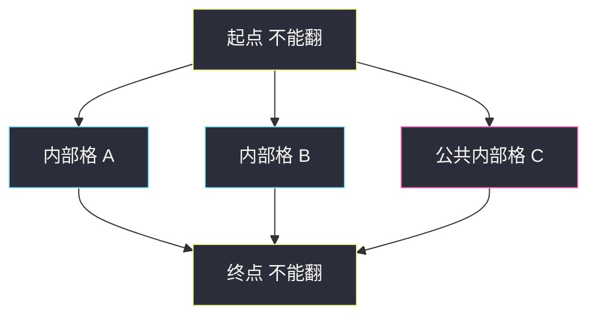
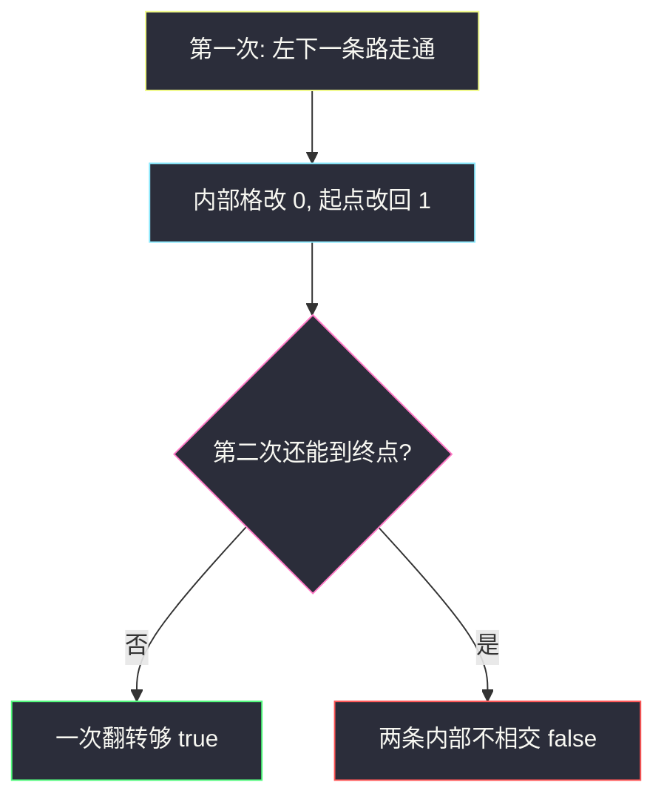

# 二进制矩阵中翻转最多一次使路径不连通（两次 DFS 堵路）

## 一、问题描述

`m × n` 二进制矩阵，只能走值为 `1` 的格子，且每步只能**向下或向右**。问：最多把一个 `1` 翻成 `0`（**不能翻起点 `(0,0)` 和终点 `(m-1,n-1)`**），能否让从起点到终点变得不连通。已经不连通也算成功。

注意：题面允许 `0 ↔ 1` 都翻，但要让路断掉，把 `0` 翻成 `1` 只会多出路，没有用。有效操作只有「删掉一个内部 `1`」或什么都不做。

> 🔗 LeetCode 2556：https://leetcode.cn/problems/disconnect-path-in-a-binary-matrix-by-at-most-one-flip/
>
> 数据范围：`1 ≤ m, n ≤ 1000` 且 `m * n ≤ 10^5`，保证 `grid[0][0] == grid[m-1][n-1] == 1`。
>
> 📚 灵茶题单：**五、综合应用**。

**示例 1**

```
输入：grid = [[1,1,1],[1,0,0],[1,1,1]]
输出：true

1 1 1
1 0 0
1 1 1
```

唯一通路贴着左列再贴底行。把 `(1,0)` 或 `(2,1)` 任一翻成 `0`，起点到终点就断了。

**示例 2**

```
输入：grid = [[1,1,1],[1,0,1],[1,1,1]]
输出：false

1 1 1
1 0 1
1 1 1
```

上右一条、左下一条，内部格子完全不相交。删一个内部点，另一条还在。

**直观理解**

只能右/下，图是 DAG。一次翻转 = 删一个内部点。删一个点就能断，当且仅当不存在两条「内部点不相交」的通路。两条路可以在起终点相交——这两格不能翻。

---

## 二、暴力解法

枚举每一个可以翻转的内部 `1`，翻成 `0` 后 DFS/BFS 看是否还能走到终点；再检查「一次都不翻」时是否已经不连通。

```python
from typing import List

class Solution:
    def isPossibleToCutPath(self, grid: List[List[int]]) -> bool:
        m, n = len(grid), len(grid[0])

        def reachable() -> bool:
            vis = [[False] * n for _ in range(m)]
            def dfs(i: int, j: int) -> bool:
                if i == m - 1 and j == n - 1:
                    return True
                vis[i][j] = True
                for x, y in ((i + 1, j), (i, j + 1)):
                    if 0 <= x < m and 0 <= y < n and grid[x][y] and not vis[x][y] and dfs(x, y):
                        return True
                return False
            return dfs(0, 0)

        if not reachable():
            return True
        for i in range(m):
            for j in range(n):
                if (i == 0 and j == 0) or (i == m - 1 and j == n - 1) or grid[i][j] == 0:
                    continue
                grid[i][j] = 0
                ok = not reachable()
                grid[i][j] = 1
                if ok:
                    return True
        return False
```

每次连通判定 `O(mn)`，枚举内部格再乘一次，总时间 `O((mn)²)`。`mn` 到 `1e5` 会超时。

### 🔴 瓶颈在哪里

不必真的枚举「删哪一个点」。只要回答：内部点不相交的 s-t 路最多有几条？≥ 2 则一次翻转不够；否则够（含本来就不连通）。两次 DFS 就能判定。

---

## 三、优化探索（核心章节）

> 📚 本题在灵茶题单中属于 **五、综合应用**。网格只能右/下，连通性用 DFS 即可；关键是「堵第一条路，看第二条还在不在」。

### 3.1 内部点不相交



- 左图那种 A、B 不相交：删谁都不断。
- 所有路都挤过某一个内部点：删它就断。
- 一条路都没有：已经不连通。

### 3.2 两次 DFS

1. 从 `(0,0)` 沿 `1` 只走下/右。走到终点则存在至少一条路；搜的过程中把走过的格子改成 `0`（相当于把这条路上的内部点堵死）。**起点改回 `1`**（终点到达时直接返回，不会被改掉）。
2. 再从起点搜一次。还能到终点 → 存在另一条不经过「第一次那些内部点」的路 → 一次翻转不够，返回 `false`。
3. 第一次就走不通，或第二次走不通 → 返回 `true`。

优先向下再向右时，第一次会贴着「左下」走出一条路；剩下的 `1` 若还能绕到终点，那就是更靠「上右」的另一条，内部点不相交。失败分支上的格子本就到不了终点，改成 `0` 不影响判断，还省了回溯还原。

只堵成功路径、失败分支回溯成 `1`，答案一样。原地改 0 更短，是默写版。

不能翻起终点：若两条路只在 `(0,0)` / `(m-1,n-1)` 相交（典型 2×2 全 1），内部点割为空，一次翻转删不断，算法第二次仍能走通，返回 `false`，正好。

### 3.3 一句话核心

> **第一次 DFS 堵死一条通路（起点改回 1）；第二次还能到则两条内部不相交，返回 false，否则 true。**

---

## 四、代码实现

### Python（主解：两次 DFS）

```python
from typing import List

class Solution:
    def isPossibleToCutPath(self, grid: List[List[int]]) -> bool:
        m, n = len(grid), len(grid[0])

        def dfs(i: int, j: int) -> bool:
            if i == m - 1 and j == n - 1:
                return True
            grid[i][j] = 0
            for x, y in ((i + 1, j), (i, j + 1)):
                if 0 <= x < m and 0 <= y < n and grid[x][y] and dfs(x, y):
                    return True
            return False

        if not dfs(0, 0):
            return True
        grid[0][0] = 1
        return not dfs(0, 0)
```

默写要点：到达终点先 `return True`，再把当前格写成 `0`；只尝试下、右；第一次成功后只恢复起点。

`m, n ≤ 1000` 但只能右/下，递归深度 `O(m+n)`，LeetCode Python 够用。若本地默认 1000 层不够，可改成显式栈。

---

## 五、具体例子演示

### 示例 1：`true`（一次就能断）

```
1 1 1
1 0 0
1 1 1
```

**第一次 DFS**（优先下再右）

| 步骤 | 当前位置 | 动作 |
|------|----------|------|
| 1 | `(0,0)` | 不是终点，改成 0，往下 |
| 2 | `(1,0)` | 改成 0，往下 |
| 3 | `(2,0)` | 改成 0，往下出界，往右 |
| 4 | `(2,1)` | 改成 0，往右 |
| 5 | `(2,2)` | 终点，返回 true |

走过的内部格已是 0，把起点改回 1：

```
1 1 1
0 0 0
0 0 1
```

**第二次 DFS**

`(0,0)` 往下是 0，只能右走 `(0,1)` → `(0,2)`，再往下是 0、往右出界。走不通。第一次通、第二次不通 → `true`。



### 示例 2：`false`（删一个不断）

```
1 1 1
1 0 1
1 1 1
```

第一次同样贴左下：`(0,0) → (1,0) → (2,0) → (2,1) → (2,2)`。堵完并恢复起点：

```
1 1 1
0 0 1
0 0 1
```

第二次：`(0,0) → (0,1) → (0,2) → (1,2) → (2,2)` 走通。两条内部点不相交 → `false`。

对拍官方两个样例均一致。

**边界再走一遍**

| 网格 | 第一次 | 第二次 | 答案 |
|------|--------|--------|------|
| `[[1]]` | 立刻到终点，格子不改 | 同样立刻到 | `false`（没得翻） |
| `[[1,1]]` / `[[1],[1]]` | 一步到终点 | 还能一步到 | `false`（没有内部格） |
| `[[1],[1],[1]]` | 堵住中间格 | 走不通 | `true`（翻中间） |
| `[[1,1],[1,1]]` | 堵住左下 `(1,0)` | 仍可右再下 | `false`（只在起终点相交） |
| 起点到终点已无路 | 第一次失败 | 不必看 | `true` |

`m * n` 到 `1e5`，两次 DFS 每格常数次，线性能过。枚举翻转那种平方写法过不了。

官方 hint 也是同一句话：能找出两条内部不相交的通路则 `false`，否则总可以（含本来就不连通）。两次 DFS 就是在线性时间内回答「有没有第二条」。

题面写可以 `0` 变 `1`，对「断开」没有帮助：多一条边只会更连通。搜索时不要去枚举「把障碍打开」。

---

## 六、复杂度分析

| 方法 | 时间 | 空间 | 说明 |
|------|------|------|------|
| 枚举翻转再判连通 | `O((mn)²)` | `O(mn)` | `mn = 1e5` 超时 |
| 两次 DFS（主解） | `O(mn)` | `O(m+n)` 递归栈 | 每格最多进两次 DFS |

---

## 七、对比总结

| 维度 | 枚举翻转 | 两次 DFS |
|------|----------|----------|
| 问的是 | 删哪个点 | 有没有第二条不相交的路 |
| 修改格子 | 试完要改回去 | 第一次原地改 0，只恢复起点 |
| 方向 | 仍是只下、右 | 同 |

**易错点**

1. **忘了把起点改回 1**：第二次从 0 出发，永远 false，全判成 true。
2. **把终点也堵死还不恢复**：终点被改成 0 后第二次必失败。主解到达终点先返回，不会改它。
3. **允许往左、往上**：题面只能下、右，多方向会把「不相交」判错。
4. **1×2 / 2×1**：没有内部格可翻，应 `false`。两次都能一步走到终点。
5. **已经不连通**：第一次 DFS 失败直接 `true`，不要再去翻 `0` 变 `1`。

---

## 八、举一反三

| 题目 | 关系 |
|------|------|
| [1568. 使陆地分离的最少天数](https://leetcode.cn/problems/minimum-number-of-days-to-disconnect-island/) | 删 0/1/2 个陆地格让岛不连通，点割 |
| [1970. 你能穿过矩阵的最后一天](https://leetcode.cn/problems/last-day-when-you-can-still-cross/) | 格子逐天变成障碍，二分 + 连通 |
| [1368. 使网格图至少有一条有效路径的最小代价](https://leetcode.cn/problems/minimum-cost-to-make-at-least-one-valid-path-in-a-grid/) | 也是网格通路，边权 0/1，改 0-1 BFS |
| [778. 水位上升的泳池中游泳](https://leetcode.cn/problems/swim-in-rising-water/) | 高度约束下的连通 / 最短路 |

**思想迁移**

- 网格「删最少点断 s-t」→ 内部点不相交路径条数；条数 ≤ 1 时一次删除就够。
- 口诀：**「先堵一条路，起点改回 1；还能再走到就是删不断。」**
