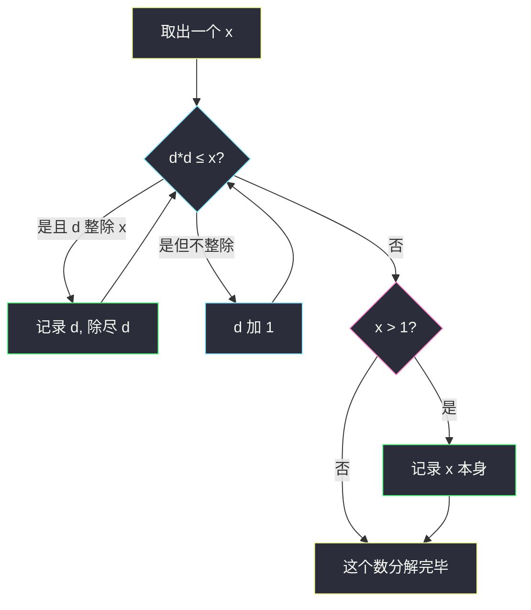
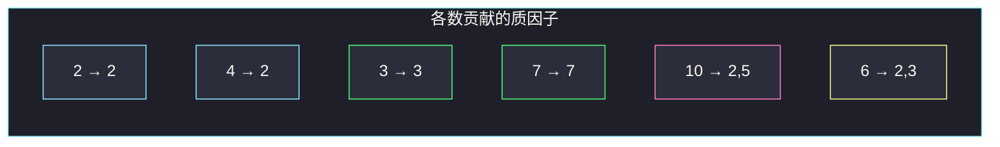

# 数组乘积中的不同质因数数目（试除分解 + 集合去重）

## 一、问题描述

给你一个正整数数组 `nums`，求所有元素乘积 `∏ nums[i]` 的**不同质因数个数**。

例如乘积是 `2^5 × 3^2 × 5 × 7`，不同质因数是 `{2,3,5,7}`，答案为 4。指数不影响计数，只问「有哪些质数出现过」。

> 🔗 LeetCode 2521：https://leetcode.cn/problems/distinct-prime-factors-of-product-of-array/
>
> 数据范围：`1 ≤ nums.length ≤ 10^4`，`2 ≤ nums[i] ≤ 1000`。元素最小是 2，**不会出现 1**。
>
> 📚 灵茶题单：**§1.3 质因数分解**（1413 分）。模板：对每个数试除分解，质因子丢进集合。乘积本身会爆（`1000^10000`），**不要真去乘**。`nums[i] ≤ 1000`，可预处理 1000 以内质数再分解。

**示例 1**

```
输入：nums = [2, 4, 3, 7, 10, 6]
输出：4
解释：乘积 2×4×3×7×10×6 = 10080 = 2^5 × 3^2 × 5 × 7。
不同质因数 2、3、5、7，共 4 个。
```

**示例 2**

```
输入：nums = [2, 4, 8, 16]
输出：1
解释：全部是 2 的幂，乘积 2^10，只有质因数 2。
```

**直观理解**

`a×b` 的质因数 = `a` 的质因数 ∪ `b` 的质因数。整段乘积的不同质因数，就是每个 `nums[i]` 质因数的并集大小。一个个数拆开，往集合里丢即可。

---

## 二、暴力解法

先把所有数乘起来得到 `P`，再对 `P` 做质因数分解。

```python
class Solution:
    def distinctPrimeFactors(self, nums: list[int]) -> int:
        p = 1
        for x in nums:
            p *= x
        primes = set()
        d = 2
        while d * d <= p:
            if p % d == 0:
                primes.add(d)
                while p % d == 0:
                    p //= d
            d += 1
        if p > 1:
            primes.add(p)
        return len(primes)
```

示例 1 乘积 10080，还能拆；`nums` 稍长，`P` 有成千上万位，Python 也能乘，但分解一个巨大整数远慢于「分别拆每个 ≤1000 的数」。这不是该用的做法。

### 🔴 瓶颈在哪里

乘法把 `n` 个数的信息揉成一个大整数，分解复杂度跟 `√P` 走，`P` 指数级。正确方向：分解可分配到每个因子上，每个 `nums[i] ≤ 1000`，试除到 `⌊√x⌋ ≤ 31`，总共大约 `10^4 × 31` 次运算。

---

## 三、优化探索（核心章节）

> 📚 本题在灵茶题单中属于 **§1.3 质因数分解**。试除模板：从 2 起除，能整除就把这个质因子记下来并除尽，最后剩下大于 1 的就是最后一个质因子。

### 3.1 为什么并集就是答案

若 `nums[i] = p1^a1 p2^a2 …`，则 `∏ nums[i]` 里每个 `pj` 的指数是各数对应指数之和。只要某次指数 > 0，这个 `pj` 就算一个不同质因数。所以：

```
答案 = | ⋃_i { nums[i] 的质因数 } |
```

不必关心指数，集合去重即可。

### 3.2 单个数的试除

对 `x`：

1. `d` 从 2 起，只要 `d * d ≤ x`：
   - 若 `x % d == 0`，则 `d` 是质因数（更小的因子已经被除尽，所以 `d` 必为质数），加入集合，并把 `x` 中的 `d` 除尽；
   - `d += 1`。
2. 循环结束若 `x > 1`，剩下的 `x` 本身是质数（例如 7、97）。

`4=2^2` 会在 `d=2` 时除成 1，不会把 4 当质数。`6=2×3`：先吃掉 2 剩下 3，循环因 `d*d=4>3` 结束，把 3 加入。



### 3.3 预处理质数（可选）

`nums[i] ≤ 1000`，质因子不会超过 1000。可以埃氏筛出 `≤ 1000` 的质数表，对每个 `x` 只拿表里的质数去试除，少做合数试除。`√1000 ≈ 31`，朴素试除已经很快，两种都能过。主解用朴素试除，好默写。

### 3.4 一句话核心

> **不要乘。每个数试除拆质因子，丢进同一个 set，最后取大小。**

---

## 四、代码实现

### Python（主解：逐个试除）

```python
class Solution:
    def distinctPrimeFactors(self, nums: list[int]) -> int:
        primes = set()
        for x in nums:
            d = 2
            while d * d <= x:
                if x % d == 0:
                    primes.add(d)
                    while x % d == 0:
                        x //= d
                d += 1
            if x > 1:
                primes.add(x)
        return len(primes)
```

**变量含义**

| 写法 | 含义 |
|------|------|
| `primes` | 全局出现过的质因数 |
| `d * d <= x` | 试除上界 `⌊√x⌋`，边除边缩小 `x` |
| `while x % d == 0` | 把该质因子除尽，避免重复工作 |
| `if x > 1` | 剩下的大质数，如 7、997 |

筛质数再分解的写法（同一答案，量级相同时可换）：

```python
class Solution:
    def distinctPrimeFactors(self, nums: list[int]) -> int:
        pl = []
        vis = [False] * 1001
        for i in range(2, 1001):
            if not vis[i]:
                pl.append(i)
                for j in range(i * i, 1001, i):
                    vis[j] = True
        primes = set()
        for x in nums:
            for p in pl:
                if p * p > x:
                    break
                if x % p == 0:
                    primes.add(p)
                    while x % p == 0:
                        x //= p
            if x > 1:
                primes.add(x)
        return len(primes)
```

---

## 五、具体例子演示

**示例 1**：`nums = [2, 4, 3, 7, 10, 6]`

| x | 试除过程 | 新加入 | 集合 |
|---|----------|--------|------|
| 2 | `d=2`，`2*2>2`，剩 2 | 2 | `{2}` |
| 4 | 4%2==0，除尽变 1 | （2 已有） | `{2}` |
| 3 | 剩 3 | 3 | `{2,3}` |
| 7 | 剩 7 | 7 | `{2,3,7}` |
| 10 | 10%2==0 → 5，剩 5 | 5 | `{2,3,5,7}` |
| 6 | 6%2==0 → 3，剩 3 | （已有） | `{2,3,5,7}` |

答案 4。对拍官方。对应乘积 `2^5 × 3^2 × 5 × 7`，指数被集合抹掉。



粉节点 10 贡献了本题唯一的新质数 5；黄节点 6 的 2、3 都是重复的。

**示例 2**：`[2,4,8,16]`

| x | 质因数 |
|---|--------|
| 2 | 2 |
| 4 | 2 |
| 8 | 2 |
| 16 | 2 |

集合 `{2}`，答案 1。对拍官方。

**逐步拆 10（把试除钉死）**

1. `x=10`，`d=2`，`2*2=4 ≤ 10`，`10%2==0` → 记录 2，`10//2=5`。
2. `5%2 != 0`，`d=3`，`3*3=9 ≤ 5`？否，退出循环。
3. 剩 `x=5>1`，记录 5。

**边界**：数组一个元素 `[2]` 答案 1；`[997]`（1000 内大质数）答案 1；`[6,10,15]` → `{2,3,5}` 答案 3。

---

## 六、复杂度分析

| 方法 | 时间 | 空间 | 说明 |
|------|------|------|------|
| 先乘再分解 | 与 `√(∏ nums[i])` 同阶 | `O(位数)` | 不可用 |
| 逐个试除（主解） | `O(n √M)`，`M=1000` | `O(π(M))` | 约 `n×31` |
| 筛质数再分解 | `O(M log log M + n π(√M))` | `O(M)` | 常数更好，代码稍长 |

`π(1000)=168` 个质数；集合最多 168 个元素。`n ≤ 10^4` 时主解远小于时限。

---

## 七、对比总结

| 维度 | 先乘再拆 | 逐个试除 |
|------|----------|----------|
| 正确性 | 小数据对 | 始终对 |
| 乘积 | `1000^10000` 爆炸 | 不乘 |
| 与 §1.3 关系 | 没用到「分解可分配」 | 标准试除模板 |

**易错点**

1. **真去乘**：小样例侥幸通过，本质错误。
2. **忘记除尽**：`8=2^3` 若只除一次，后面可能把剩余合数当新质因子。
3. **漏掉最后的 `x>1`**：`7、11、97` 不会在循环里被记下来。
4. **把 1 当质数**：本题约束没有 1；若泛化，1 没有质因数，集合不加。
5. **试除写成 `d <= x`**：没把 `x` 缩小、上界也不降，会慢，也可能把 `x` 本身重复处理。用 `d*d <= x`。

---

## 八、举一反三

| 题目 | 关系 |
|------|------|
| [204. 计数质数](https://leetcode.cn/problems/count-primes/) | 埃氏筛，批量列出质数 |
| [263. 丑数](https://leetcode.cn/problems/ugly-number/) | 只含质因子 2/3/5，试除除尽 |
| [650. 两个键的键盘](https://leetcode.cn/problems/2-keys-keyboard/) | 最少操作 = n 的质因子之和 |
| [2507. 使用质因数之和替换后的最小公因数](https://leetcode.cn/problems/smallest-value-after-replacing-with-sum-of-prime-factors/) | 反复做质因数分解 |
| [2584. 分割数组使乘积互质](https://leetcode.cn/problems/split-the-array-to-make-coprime-products/) | 左右乘积的质因子集合不相交 |
| [829. 连续整数求和](https://leetcode.cn/problems/consecutive-numbers-sum/) | 同批 §1.5：从因子个数看方案数 |

**思想迁移**

- 乘积的质因数 = 各因子质因数的并；指数只在「要精确乘积 / 因子个数」时才需要。
- 口诀：**「不乘，拆每个数；能除尽就记，剩下大于 1 也要记。」**
