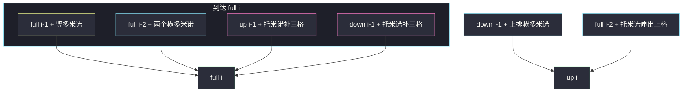
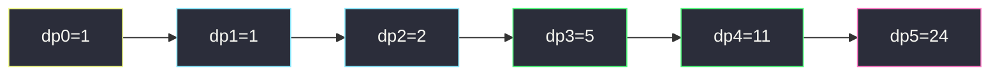

# 多米诺和托米诺平铺（递推 DP · 可矩阵快速幂）

## 一、问题描述

有一块 `2 × n` 的板。你有两种砖：

- **多米诺**：`2 × 1`（竖着正好盖一列；横着要两块叠在一起才盖两列）。
- **托米诺**：L 型，盖恰好 3 格。

问把板**完全铺满**的方案数，结果模 `10^9+7`。砖可以旋转。

> 🔗 LeetCode 790：https://leetcode.cn/problems/domino-and-tromino-tiling/
>
> 数据范围：`1 ≤ n ≤ 1000`。
>
> 📚 灵茶题单：**§11.6 矩阵快速幂优化 DP**。线性递推 `dp[n] = 2*dp[n-1] + dp[n-3]` 之后，本来可以用 `3 × 3` 矩阵把 `n` 推到 `10^18`。本题 `n ≤ 1000`，**线性 DP 足够当主解**；矩阵快速幂放在进阶，不抢戏。

**示例 1**

```
输入：n = 3
输出：5
```

五种铺法：三块竖多米诺；两块横多米诺在左 / 在右；以及两块托米诺拼成 `2 × 3` 的两种朝向。

**示例 2**

```
输入：n = 1
输出：1
解释：只能竖着放一块多米诺。
```

**直观理解**

只有多米诺时就是斐波那契（爬楼梯）。托米诺会「咬住三列」，在右端制造两种 L 型收尾，递推多一项 `dp[n-3]`，系数变成 2。

---

## 二、暴力解法

从左到右找第一块空格，枚举能盖住它的骨牌：竖多米诺、横多米诺、四种 L。为避免同一铺法被不同顺序重复计数，规定骨牌覆盖的最小编号格必须是当前空格（列优先：`编号 = 列*2 + 行`）。

```python
class Solution:
    def numTilings(self, n: int) -> int:
        N = 2 * n

        def idx(r: int, c: int) -> int:
            return c * 2 + r

        def dfs(mask: int) -> int:
            if mask == (1 << N) - 1:
                return 1
            k = 0
            while (mask >> k) & 1:
                k += 1
            c, r = divmod(k, 2)
            ans = 0

            def empty(rr: int, cc: int) -> bool:
                return 0 <= rr < 2 and 0 <= cc < n and ((mask >> idx(rr, cc)) & 1) == 0

            def try_place(cells: list[tuple[int, int]]) -> None:
                nonlocal ans
                if not all(empty(rr, cc) for rr, cc in cells):
                    return
                nxt = mask
                for rr, cc in cells:
                    nxt |= 1 << idx(rr, cc)
                ans += dfs(nxt)

            if r == 0:
                try_place([(0, c), (1, c)])
            try_place([(r, c), (r, c + 1)])
            for cells in (
                [(0, c), (1, c), (0, c + 1)],
                [(0, c), (1, c), (1, c + 1)],
                [(0, c), (0, c + 1), (1, c + 1)],
                [(1, c), (0, c + 1), (1, c + 1)],
            ):
                if (r, c) in cells and min(idx(rr, cc) for rr, cc in cells) == k:
                    try_place(cells)
            return ans

        return dfs(0) % (10**9 + 7)
```

`n = 1 → 1`、`n = 3 → 5`、`n = 4 → 11` 都能对上。状态是 `2^{2n}` 个棋盘，`n = 1000` 完全不可用。

### 🔴 瓶颈在哪里

铺法只依赖「左边已经铺满的列数」，不依赖具体骨牌拼法。`n` 个长度各算一次，线性 DP。

---

## 三、优化探索（核心章节）

> 📚 灵茶 **§11.6 矩阵快速幂优化 DP**：先写出常系数线性递推，再（可选）矩阵加速。本题规模用循环即可。

### 3.1 三状态：列上缺哪一格

`full[i]`：前 `i` 列完全铺满。  
`up[i]`：前 `i-1` 列铺满，第 `i` 列**只有上格**被占。  
`down[i]`：对称，第 `i` 列只有下格被占。



初值：`full[0] = 1`（空板一种）、`full[1] = 1`、`up[1] = down[1] = 0`（一列盖不住 L）。按这个转移填到 `n`，`full[n]` 就是答案。对拍：`n=2 → 2`，`n=3 → 5`，`n=4 → 11`。

### 3.2 压成一条递推

把 `up`/`down` 消掉（或直接数右端形状）得到：

`dp[i] = 2 * dp[i-1] + dp[i-3]`（`i ≥ 3`）

**初值必须含空板**：`dp[0] = 1`，`dp[1] = 1`，`dp[2] = 2`。这样 `i = 3` 时 `2*dp[2] + dp[0] = 4 + 1 = 5`，与官方一致。若把 `dp[0]` 写成 0，会得到 4，**错**。

另一种看法：右端要么竖多米诺（`dp[n-1]`），要么两块横的（`dp[n-2]`），要么两块托米诺夹着一段全铺区域，长度为 `0,1,2,…`，有两种朝向：

`dp[n] = dp[n-1] + dp[n-2] + 2 * (dp[n-3] + dp[n-4] + … + dp[0])`

两边各减一份 `dp[n-1]` 的展开式，就化成 `2*dp[n-1] + dp[n-3]`。

### 3.3 进阶：矩阵快速幂（了解即可）

令向量 `v_i = [dp[i], dp[i-1], dp[i-2]]`，则 `v_i = M * v_{i-1}`，

```
M = [[2, 0, 1],
     [1, 0, 0],
     [0, 1, 0]]
```

`n ≤ 1000` 不必上这个；`n` 到 `10^18` 时才值得 `O(8 log n)` 乘矩阵。

### 3.4 一句话核心

> **空板算 1 种；从第 3 列起 `dp[i] = 2*dp[i-1] + dp[i-3]`，模 10^9+7。**

---

## 四、代码实现

### Python（主解：线性 DP）

```python
class Solution:
    def numTilings(self, n: int) -> int:
        MOD = 10**9 + 7
        # dp[i]: 铺满 2×i 板的方案数；dp[0]=1 表示空板
        dp = [0] * (n + 1)
        dp[0] = 1
        dp[1] = 1
        if n >= 2:
            dp[2] = 2
        for i in range(3, n + 1):
            dp[i] = (2 * dp[i - 1] + dp[i - 3]) % MOD
        return dp[n]
```

只需最近三项时可以三个变量滚动，空间 `O(1)`。

### Java（最优解）

```java
class Solution {
    public int numTilings(int n) {
        final int MOD = 1_000_000_007;
        if (n == 1) {
            return 1;
        }
        long a = 1, b = 1, c = 2; // dp[0], dp[1], dp[2]
        if (n == 2) {
            return 2;
        }
        for (int i = 3; i <= n; i++) {
            long d = (2 * c + a) % MOD;
            a = b;
            b = c;
            c = d;
        }
        return (int) c;
    }
}
```

---

## 五、具体例子演示

### 5.1 官方 `n = 1`、`n = 3`

| i | dp[i] | 怎么来的 |
|---|-------|----------|
| 0 | 1 | 空板 |
| 1 | 1 | 一块竖多米诺 |
| 2 | 2 | 两竖 / 两横 |
| 3 | 5 | `2*2 + 1 = 5` |

`n = 3` 的 5 种：VVV；HH+V；V+HH；两块托米诺「上凸」；两块托米诺「下凸」。对拍官方 5。

### 5.2 继续填到 `n = 5`（逐步跟踪递推）



1. `i = 3`：`2 * dp[2] + dp[0] = 4 + 1 = 5`。
2. `i = 4`：`2 * 5 + dp[1] = 10 + 1 = 11`。
3. `i = 5`：`2 * 11 + dp[2] = 22 + 2 = 24`。

每一步只用到前三项，模数在 `n = 1000` 时才会真正起作用。对拍：官方只给了 1 和 3；4、5 与三状态 DP / 搜索枚举一致。

---

## 六、复杂度分析

| 方法 | 时间 | 空间 | 说明 |
|------|------|------|------|
| 棋盘 DFS | `O(2^{2n})` 量级 | `O(n)` 栈 | 仅能验证小 n |
| 线性 DP（主解） | `O(n)` | `O(n)` 或 `O(1)` | `n ≤ 1000` |
| 矩阵快速幂 | `O(log n)` | `O(1)` | 进阶，本题不必 |

---

## 七、对比总结

| 维度 | 只有多米诺 | 本题 |
|------|------------|------|
| 递推 | `f[i]=f[i-1]+f[i-2]` | `dp[i]=2*dp[i-1]+dp[i-3]` |
| 空板 | 常省掉 dp[0] | **dp[0]=1 必须留下** |
| 加速 | 矩阵 2×2 | 矩阵 3×3 |

**易错点**

1. **`dp[0]` 写成 0**：`n=3` 会得到 4 而不是 5。
2. **模数**：循环里每次 `% (10**9+7)`，不要最后才模。
3. **`n=1` 单独返回时别忘了**：滚动写法如果从 `dp[2]` 起步，要先处理 1、2。
4. **托米诺当成 `1×3` 长条**：L 型不能掰直，否则方案数变成别的序列。

---

## 八、举一反三

| 题目 | 关系 |
|------|------|
| [70. 爬楼梯](https://leetcode.cn/problems/climbing-stairs/) | 只有「竖条」，斐波那契；见 `base/climbing-stairs.md` |
| [509. 斐波那契数](https://leetcode.cn/problems/fibonacci-number/) | 同一类线性递推；见同目录 `fibonacci-number.md` |
| [1137. 第 N 个泰波那契数](https://leetcode.cn/problems/n-th-tribonacci-number/) | 三项递推，和本题一样滚动三个变量 |
| [1411. 给 N×3 网格图涂色](https://leetcode.cn/problems/number-of-ways-to-paint-n-3-grid/) | 列 DP / 轮廓，再矩阵加速 |
| [790. 多米诺和托米诺平铺](https://leetcode.cn/problems/domino-and-tromino-tiling/) | 本题 |

**思想迁移**

- 板子按列推进、砖块跨 1～3 列 → 先写状态，再消元成常系数递推。
- 口诀：**「空板是 1；两项翻倍加三项前。」**
