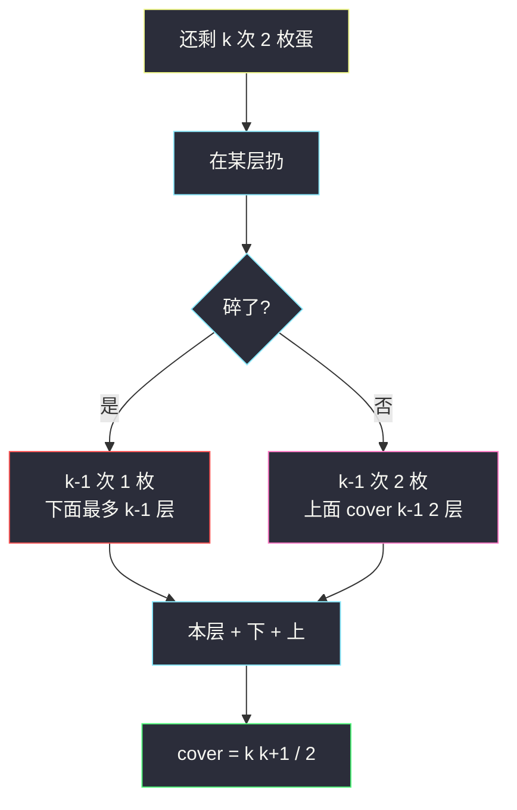
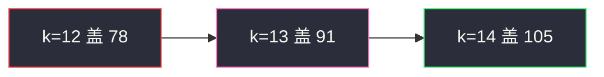

# 鸡蛋掉落-两枚鸡蛋（最坏最少 · 等差策略）

## 一、问题描述

有 `n` 层楼、**恰好 2 枚**鸡蛋。存在临界楼层 `f`（`0 ≤ f ≤ n`）：低于 `f` 扔不碎，大于等于 `f` 会碎。每次在某层扔一枚，碎了就不能再用这枚。要**确定 f**，在**最坏情况**下扔的次数最少是多少？

> 🔗 LeetCode 1884：https://leetcode.cn/problems/egg-drop-with-2-eggs-and-n-floors/
>
> 数据范围：`1 ≤ n ≤ 1000`。
>
> 📚 灵茶题单：**§7.6 多维 DP**。一般 k 枚蛋是 `dp[扔次数][蛋数] = 最多能测多少层`。本题蛋数固定为 2：碎了只剩 1 枚，下面必须线性扫；没碎仍是 2 枚、次数减 1。最优策略下，相邻两次尝试的间隔是等差数列。

**示例 1**

```
输入：n = 2
输出：2
解释：先在 1 层扔：碎了则 f=1（1 次）；不碎再扔 2 层（2 次）。最坏 2 次。
     先在 2 层扔：碎了必须再试 1 层（2 次）。最坏同样 2 次。
```

**示例 2**

```
输入：n = 100
输出：14
解释：14×15/2 = 105 ≥ 100，13×14/2 = 91 < 100。
```

**直观理解**

1 枚蛋只能从 1 楼往上挨层扔，最坏 `n` 次。2 枚蛋时，第一次不能扔太高：碎了下面要线性扫，次数会爆。最优是让「碎了走线性」和「没碎继续用 2 枚」的最坏次数相等。

---

## 二、暴力解法

`dp[i]` = `i` 层楼、2 枚蛋的最少最坏次数。第一次选第 `x` 层（相对当前区间）：

- 碎：下面 `x-1` 层只有 1 枚蛋，还要 `x-1` 次，合计 `1 + (x-1) = x`；
- 没碎：上面 `i-x` 层仍是 2 枚蛋，合计 `1 + dp[i-x]`。

最坏是两者的 max，对 `x` 取 min：

```python
class Solution:
    def twoEggDrop(self, n: int) -> int:
        inf = n + 1
        dp = [0] * (n + 1)
        # dp[i]: i 层、2 枚蛋，最坏情况最少扔几次
        for i in range(1, n + 1):
            best = inf
            for x in range(1, i + 1):
                best = min(best, 1 + max(x - 1, dp[i - x]))
            dp[i] = best
        return dp[n]
```

`n=2 → 2`、`n=100 → 14` 对拍官方。`O(n²)`，`n=1000` 能过，但看不出 14 和三角数的关系。

### 🔴 瓶颈在哪里

最优时每次都应让两个分支的最坏次数一样，于是间隔从大到小是 `k, k-1, …, 1`。覆盖层数是 `k(k+1)/2`。变成：最小的 `k` 满足三角数 ≥ `n`。

---

## 三、优化探索（核心章节）

> 📚 灵茶 **§7.6 多维 DP**。换自变量往往更好写：不是「n 层最少几次」，而是「k 次 2 枚蛋最多测几层」。

### 3.1 次数-蛋数 DP

`cover[k][e]` = 最多 `k` 次扔、`e` 枚蛋，能覆盖的楼层数。在某层扔：

- 碎：还剩 `k-1` 次、`e-1` 枚，下面能测 `cover[k-1][e-1]` 层；
- 没碎：还剩 `k-1` 次、`e` 枚，上面能测 `cover[k-1][e]` 层；
- 本层占用 1 层。

`cover[k][e] = cover[k-1][e-1] + 1 + cover[k-1][e]`。

一枚蛋：`cover[k][1] = k`。两枚：

`cover[k][2] = (k-1) + 1 + cover[k-1][2] = k + cover[k-1][2]`

展开就是 `1+2+…+k = k(k+1)/2`。

求最小 `k` 使 `k(k+1)/2 ≥ n`。



### 3.2 为什么间隔是等差

设总次数预算是 `k`。第一次应留出「碎了之后下面还能扔 `k-1` 次（线性）」，所以第一次扔在第 `k` 层。没碎则还剩 `k-1` 次，下一次间隔 `k-1` 层，以此类推：`k + (k-1) + … + 1`。

`n=100`：第一次 14 层，没碎去 `14+13=27` 层，再 `27+12=39`……最坏沿着这条链扔满 14 次；若中途碎了，下面线性次数也不会超过 14。

### 3.3 一句话核心

> **2 枚蛋、k 次最多测三角数 `k(k+1)/2` 层；找最小 k 盖住 n。**

---

## 四、代码实现

### Python（主解：最小三角数）

```python
class Solution:
    def twoEggDrop(self, n: int) -> int:
        # k 次 2 枚蛋最多覆盖 k*(k+1)/2 层
        k = 0
        while k * (k + 1) // 2 < n:
            k += 1
        return k
```

`k` 大约是 `⌈(-1 + √(1+8n)) / 2⌉`，循环最多约 `√(2n)` 次。`n ≤ 1000` 也可以二分 `k`。

### Java（最优解）

```java
class Solution {
    public int twoEggDrop(int n) {
        int k = 0;
        while (k * (k + 1) / 2 < n) {
            k++;
        }
        return k;
    }
}
```

---

## 五、具体例子演示

### 5.1 官方 `n = 2`

| k | k(k+1)/2 | ≥ 2 ? |
|---|----------|-------|
| 1 | 1 | 否 |
| 2 | 3 | 是 |

答案 2。策略：先扔 2 层（间隔 k=2）。碎了再扔 1 层；没碎则 `f=2` 或再确认更高——总共两层，最坏 2 次。对拍官方。

### 5.2 官方 `n = 100`：逐步加大 k

| k | 覆盖层数 | 说明 |
|---|----------|------|
| 12 | 78 | 不够 |
| 13 | 91 | 还差 9 层 |
| 14 | 105 | **≥ 100** |



逐步：`k=13` 时 `13*14/2=91 < 100`，不能作为答案；`k=14` 时 `14*15/2=105 ≥ 100`，停止。对拍官方 14。

第一次扔在 14 层：碎了则 1～13 层线性，最坏再 13 次，合计 14；没碎则问题变成「86 层、13 次、2 枚」（`13*14/2=91 ≥ 86`），仍然够。

### 5.3 逐步填 `O(n²)` 表（n = 6）

`dp[i] = min over x of 1 + max(x-1, dp[i-x])`。

| i 层 | 试 x=1 | x=2 | x=3 | x=4 | 最优 dp[i] |
|------|--------|-----|-----|-----|------------|
| 1 | 1 | — | — | — | 1 |
| 2 | 2 | 2 | — | — | 2 |
| 3 | 3 | **2** | 3 | — | 2 |
| 4 | 3 | 3 | 3 | 4 | 3 |
| 5 | 4 | 3 | 3 | 4 | 3 |
| 6 | 4 | 4 | **3** | 4 | 3 |

读法：`i=3, x=2` 时碎了下面 1 层要 1 次、没碎上面 1 层 `dp[1]=1`，加本次共 2。`i=6, x=3`：碎了线性 2 次、没碎 `1+dp[3]=3`，最坏 3。这与三角数 `k=3` 覆盖 6 层一致。

### 5.4 `n=100` 的第一次扔点序列

预算 14 次时，间隔从 14 往下减：

`14, 27, 39, 50, 60, 69, 77, 84, 90, 95, 99, 100`

任何一层碎了，下面线性次数加上已经用掉的次数，最坏都不超过 14。对拍官方 14。

---

## 六、复杂度分析

| 方法 | 时间 | 空间 | 说明 |
|------|------|------|------|
| 枚举第一次楼层的 DP | `O(n²)` | `O(n)` | 帮助理解 |
| 递增 k 直到三角数够（主解） | `O(√n)` | `O(1)` | 本题最优 |
| 二分 k | `O(log n)` | `O(1)` | 注意乘法溢出（Java 用 long） |

---

## 七、对比总结

| 维度 | 1 枚蛋 | 2 枚蛋 | k 枚蛋（887） |
|------|--------|--------|---------------|
| 覆盖 | k 层 | 三角数 | 组合数 `C(k, 蛋)` 一类 |
| 碎了 | 游戏结束信息不足 | 改线性搜 | 蛋数减 1 |
| 实现 | 返回 n | 求最小 k | 二分次数或 DP |

**易错点**

1. **当成平均次数**：题目是最坏情况。
2. **第一次扔在 n/2**：平衡的是次数不是楼层，二分会让碎了之后线性过长。
3. **`k(k+1)/2` 用实数直接开方取整不核对**：要验证 `k` 和 `k-1` 哪边刚过 `n`（官方 100 必须 14 不是 13）。
4. **`f` 可以是 0 或 n**：鸡蛋可能在 1 层就碎，也可能到顶都不碎，策略必须覆盖这两种。

---

## 八、举一反三

| 题目 | 关系 |
|------|------|
| [887. 鸡蛋掉落](https://leetcode.cn/problems/super-egg-drop/) | k 枚蛋的一般化，本题是 `k=2` |
| [278. 第一个错误的版本](https://leetcode.cn/problems/first-bad-version/) | 「测临界点」但测试免费且不消耗「蛋」 |
| [875. 爱吃香蕉的珂珂](https://leetcode.cn/problems/koko-eating-bananas/) | 二分答案：最小满足不等式的 k |
| [410. 分割数组的最大值](https://leetcode.cn/problems/split-array-largest-sum/) | 最坏/最小的二分答案框架 |
| [1884. 鸡蛋掉落-两枚鸡蛋](https://leetcode.cn/problems/egg-drop-with-2-eggs-and-n-floors/) | 本题 |

**思想迁移**

- 资源是「次数 × 蛋数」时，改问「这点预算能测多高」，再反推预算。
- 口诀：**「两枚蛋三角数；最小 k 盖住 n。」**
