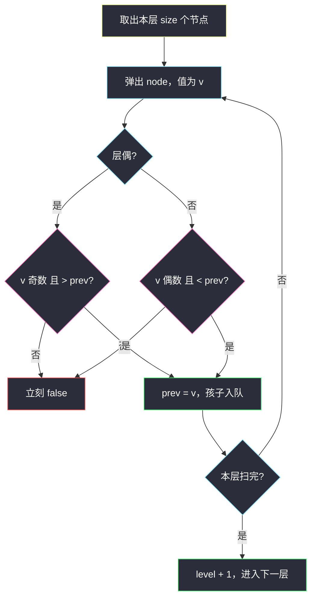
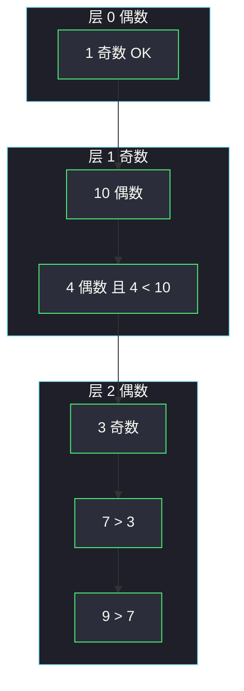

# 奇偶树（层序 BFS · 校验层性质）

## 一、问题描述

给你一棵二叉树的根 `root`。若整棵树同时满足下面两条，就称它是**奇偶树**：

- **偶数层**（根是第 0 层）：节点值必须全是**奇数**，且从左到右**严格递增**。
- **奇数层**：节点值必须全是**偶数**，且从左到右**严格递减**。

满足则返回 `true`，否则 `false`。

> 🔗 LeetCode 1609：https://leetcode.cn/problems/even-odd-tree/
>
> 数据范围：节点数 `[1, 10^5]`，`1 <= Node.val <= 10^6`。
>
> 📚 灵茶题单：**二叉树 · §2.13 二叉树 BFS**（1438 分）。

**示例 1**

```
输入：root = [1,10,4,3,null,7,9,12,8,6,null,null,2]
输出：true
树形：
           1
         /   \
       10     4
      /     /   \
     3     7     9
    / \   /       \
  12   8 6         2
层 0：[1]           奇数、递增
层 1：[10, 4]       偶数、10 > 4
层 2：[3, 7, 9]     奇数、3 < 7 < 9
层 3：[12, 8, 6, 2] 偶数、12 > 8 > 6 > 2
```

**示例 2**

```
输入：root = [5,4,2,3,3,7]
输出：false
树形：
      5
     / \
    4   2
   / \ /
  3  3 7
层 2：[3, 3, 7] 出现 3 == 3，不是严格递增。
```

**直观理解**

「奇偶」管的是**同一层从左到右**的序列，不是父子关系。层序遍历天然按层、从左到右弹出，正好一边走一边校验。这就是 §2.13：BFS 扫一层，在这一层上检查层性质。

---

## 二、暴力解法

先 DFS / BFS 把每一层的值收进数组，再对每层单独扫一遍：

```python
class Solution:
    def isEvenOddTree(self, root: Optional[TreeNode]) -> bool:
        levels: list[list[int]] = []

        def dfs(node: Optional[TreeNode], depth: int) -> None:
            if node is None:
                return
            if depth == len(levels):
                levels.append([])
            levels[depth].append(node.val)
            dfs(node.left, depth + 1)
            dfs(node.right, depth + 1)

        dfs(root, 0)
        for i, row in enumerate(levels):
            for j, v in enumerate(row):
                if i % 2 == 0:
                    if v % 2 == 0 or (j and v <= row[j - 1]):
                        return False
                else:
                    if v % 2 == 1 or (j and v >= row[j - 1]):
                        return False
        return True
```

先序按左右追加，同一层的顺序和层序一致。

### 复杂度

- **时间**：建层 `O(n)`，再扫一遍 `O(n)`，合计 `O(n)`。
- **空间**：存下所有节点值 `O(n)`，外加递归栈 `O(h)`。

### 🔴 瓶颈在哪里

时间已经线性，过不了的是**空间和早停**：不必把整棵树的值都留下；当前层一旦违规可以立刻返回。BFS 队列里本来就只有「当前层 + 下一层」，再加一个「上一个弹出的值」就够比较。

---

## 三、优化探索（核心章节）

> 📚 本题在灵茶题单中属于 **二叉树 · §2.13 二叉树 BFS**。层性质只依赖「这一层从左到右的序列」，用队列按层消费，记录上一节点值做相邻比较。

### 3.1 一层要检查两件事

记当前层号为 `level`（根 = 0），从左到右依次弹出 `v`，上一节点值为 `prev`：

| 层 | 奇偶 | 相邻 |
|----|------|------|
| 偶数 | `v` 为奇数 | `v > prev`（严格增） |
| 奇数 | `v` 为偶数 | `v < prev`（严格减） |

第一层没有 `prev`，只查奇偶。严格比较用 `<` / `>`，相等直接判假（示例 2）。

### 3.2 层序框架：按层切队列



`for _ in range(len(q))` 把当前层和下一层切开。`prev` 只在本层内有效，进入下一层要重置。

### 3.3 `prev` 的初值

每层开始时 `prev = None`，第一个节点只查奇偶。也可以用哨兵：偶数层 `prev = 0`（题目值 ≥ 1，第一个奇数一定 `> 0`）；奇数层 `prev = 10**9 + 1`（值 ≤ `10^6`）。哨兵省一次空判断，语义不如 `None` 直观。

### 3.4 一句话核心

> **BFS 按层走：偶数层「奇且严格增」，奇数层「偶且严格减」；拿上一个弹出的值做相邻比较，违规立刻返回。**

---

## 四、代码实现

### Python（主解：层序 + prev）

```python
class Solution:
    def isEvenOddTree(self, root: Optional[TreeNode]) -> bool:
        q = deque([root])
        level = 0
        while q:
            prev = None
            for _ in range(len(q)):
                node = q.popleft()
                v = node.val
                if level % 2 == 0:
                    if v % 2 == 0 or (prev is not None and v <= prev):
                        return False
                else:
                    if v % 2 == 1 or (prev is not None and v >= prev):
                        return False
                prev = v
                if node.left:
                    q.append(node.left)
                if node.right:
                    q.append(node.right)
            level += 1
        return True
```

**变量含义**

| 变量 | 含义 |
|------|------|
| `q` | 层序队列，循环开始时恰好是当前层 |
| `level` | 当前层号，根为 0 |
| `prev` | 本层上一个弹出的节点值；每层重置 |
| `v` | 当前节点值 |

孩子入队顺序必须先左后右，这样下一层弹出顺序才是「从左到右」。

### Java（可选）

```java
class Solution {
    public boolean isEvenOddTree(TreeNode root) {
        ArrayDeque<TreeNode> q = new ArrayDeque<>();
        q.add(root);
        int level = 0;
        while (!q.isEmpty()) {
            int size = q.size();
            Integer prev = null;
            for (int i = 0; i < size; i++) {
                TreeNode node = q.poll();
                int v = node.val;
                if (level % 2 == 0) {
                    if (v % 2 == 0 || (prev != null && v <= prev)) return false;
                } else {
                    if (v % 2 == 1 || (prev != null && v >= prev)) return false;
                }
                prev = v;
                if (node.left != null) q.add(node.left);
                if (node.right != null) q.add(node.right);
            }
            level++;
        }
        return true;
    }
}
```

---

## 五、具体例子演示

以示例 1 跟踪队列。层 0 弹出 1（奇数，合法），孩子入队后 `q = [10, 4]`。

**层 1（奇数 · 须偶且减）**

| 弹出 | 队列 | prev | 校验 |
|------|------|------|------|
| 开始 | `[10, 4]` | `None` | — |
| 10 | `[4]` → 入 3 → `[4, 3]` | 10 | 10 为偶 |
| 4 | `[3]` → 入 7、9 → `[3, 7, 9]` | 4 | 4 为偶且 `4 < 10` |

**层 2（偶数 · 须奇且增）**

| 弹出 | prev | 校验 |
|------|------|------|
| 3 | 3 | 奇，无 prev；入 12、8 |
| 7 | 7 | 奇且 `7 > 3`；入 6 |
| 9 | 9 | 奇且 `9 > 7`；入 2 |

此时队列 `[12, 8, 6, 2]`。

**层 3（奇数 · 须偶且减）**

| 弹出 | prev | 校验 |
|------|------|------|
| 12 | 12 | 偶 |
| 8 | 8 | 偶且 `8 < 12` |
| 6 | 6 | 偶且 `6 < 8` |
| 2 | 2 | 偶且 `2 < 6` |

全部通过，返回 `true`。

示例 2 在层 2 翻车：队列 `[3, 3, 7]`，弹出第二个 3 时 `3 <= prev=3`，偶数层要求严格递增，立刻 `false`。



---

## 六、复杂度分析

| 方法 | 时间 | 空间 | 说明 |
|------|------|------|------|
| 先收集每层再检查 | `O(n)` | `O(n)` | 存下全部节点值 |
| 层序边走边查（主解） | `O(n)` | `O(w)` 队列宽度 | 最坏满树 `w ≈ n/2`；可早停 |

---

## 七、对比总结

| 维度 | 收集全部层 | 层序 + prev |
|------|------------|-------------|
| 何时发现错误 | 整棵树走完 | 当前节点即可返回 |
| 额外数组 | 每层一份 | 一个 `prev` |
| 模板 | DFS 按深度分桶 | §2.13 标准 BFS 切层 |

**易错点**

1. **「严格」写成 `>=` / `<=` 的反面**：相等不算递增/递减，示例 2 就是 `3 == 3`。
2. **奇偶搞反**：层 0 是偶数层，要的是**奇数值**；层号奇偶和值的奇偶是反过来的。
3. **`prev` 跨层没重置**：上一层最后一个值会污染下一层的第一次比较。
4. **孩子入队顺序**：必须左再右，否则「从左到右」错位。
5. 这不是 BST，左右无大小约定，**不能**靠父子比较代替层内相邻比较。

---

## 八、举一反三

| 题目 | 关系 |
|------|------|
| [1161. 最大层内元素和](https://leetcode.cn/problems/maximum-level-sum-of-a-binary-tree/) | 同款 §2.13 切层；本目录 `maximum-level-sum-of-a-binary-tree.md` 是「层内求和」，本题是「层内校验」 |
| [103. 二叉树的锯齿形层序遍历](https://leetcode.cn/problems/binary-tree-zigzag-level-order-traversal/) | 同样按层奇偶切换方向 |
| [515. 在每个树行中找最大值](https://leetcode.cn/problems/find-largest-value-in-each-tree-row/) | 层序扫一层，维护本层最值 |
| [102. 二叉树的层序遍历](https://leetcode.cn/problems/binary-tree-level-order-traversal/) | 切层骨架，本题在骨架上加判定 |
| [637. 二叉树的层平均值](https://leetcode.cn/problems/average-of-levels-in-binary-tree/) | 切层后做层内聚合 |

**思想迁移**

- 层上有性质（和 / 最大 / 递增 / 奇偶）→ §2.13，`for _ in range(len(q))` 切层。
- 口诀：**「偶层奇且增，奇层偶且减；BFS 带着 prev 比相邻。」**
