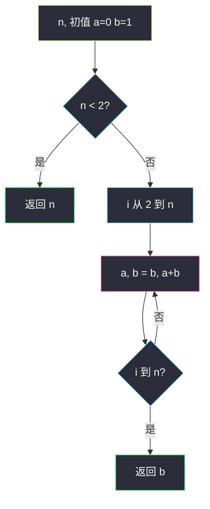
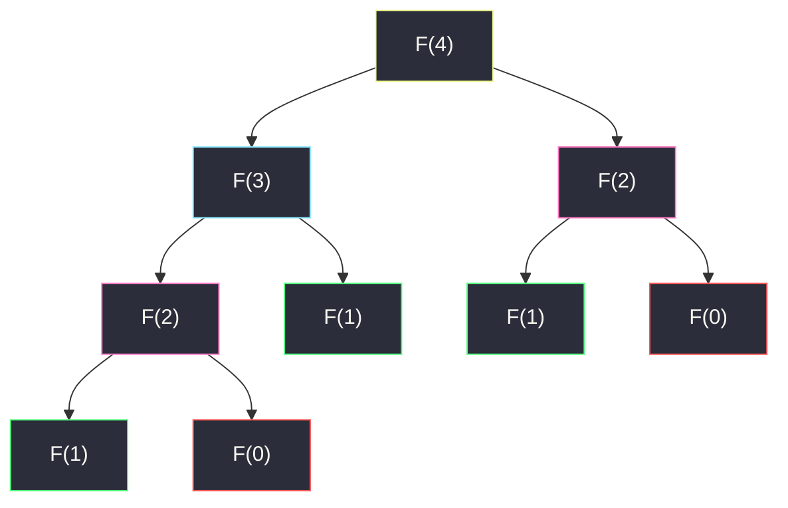
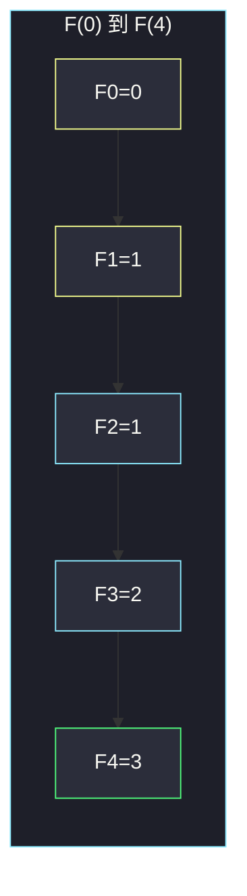

# 斐波那契数（迭代递推 · 矩阵快速幂预告）

## 一、问题描述

斐波那契数列定义：`F(0) = 0`，`F(1) = 1`，对 `n > 1` 有 `F(n) = F(n-1) + F(n-2)`。给定 `n`，返回 `F(n)`。

> 🔗 LeetCode 509：https://leetcode.cn/problems/fibonacci-number/
>
> 数据范围：`0 ≤ n ≤ 30`。
>
> 📚 灵茶题单：**§11.6 矩阵快速幂优化 DP**。本题 `n` 很小，主解写滚动迭代 `O(n)` 即可；矩阵快速幂把转移写成 `2×2` 矩阵的 `n` 次幂，把时间压到 `O(log n)`，是本节真正要迁过去的模板，正文只点到用法、不把证明写满。

**示例 1**

```
输入：n = 2
输出：1
解释：F(2) = F(1) + F(0) = 1 + 0 = 1
```

**示例 2**

```
输入：n = 3
输出：2
解释：F(3) = F(2) + F(1) = 1 + 1 = 2
```

**示例 3**

```
输入：n = 4
输出：3
解释：F(4) = F(3) + F(2) = 2 + 1 = 3
```

**直观理解**

每一项只依赖前两项。从 `0、1` 往右加到第 `n` 项，中间结果全部用得上，没有「选或不选」的分叉。递归树会把同一项算很多遍，迭代把每项只算一次。

---

## 二、暴力解法

直接按定义递归，无记忆化。

```python
class Solution:
    def fib(self, n: int) -> int:
        if n < 2:
            return n
        return self.fib(n - 1) + self.fib(n - 2)
```

`n=4` 能对拍官方。`n=30` 时递归树节点数约 `F(30)` 量级（约 83 万次调用还能过，但再大就爆）。本题范围恰好卡在「能过但学不到线性」。

### 🔴 瓶颈在哪里

`fib(n)` 拆成 `fib(n-1)` 和 `fib(n-2)`，后者又被前者的子树再算一遍。重叠子问题是经典 DP 形态，却没有存结果。主解必须改成自底向上，每个下标只算一次。

---

## 三、优化探索（核心章节）

> 📚 本题在灵茶题单中属于 **§11.6 矩阵快速幂优化 DP**。线性递推 `f(n) = a·f(n-1) + b·f(n-2)` 都可以写成常系数矩阵，再用快速幂。本题先把递推跑对，再把矩阵形态记下来。

### 3.1 递推只要两个滚动变量

令 `a = F(i-2)`，`b = F(i-1)`。下一步：

```
a, b = b, a + b
```

从 `i = 2` 做到 `i = n`，结束时 `b` 就是 `F(n)`。`n < 2` 直接返回 `n`。

这就是最简 DP：状态是「当前位置的值」，转移是「加前一项」，空间把整张 `dp` 表压成两个数。



### 3.2 为什么不要无记忆化递归当主解

递归树里 `F(n-2)` 同时出现在「左子」和「右子」：



粉节点是重复的 `F(2)`。迭代按编号从小到大填，每个编号只出现一次。

### 3.3 进阶：矩阵快速幂 `O(log n)`（本节归属）

把两项捆成列向量，一次转移是乘一个常矩阵：

```
[ F(n)   ]   [ 1  1 ] [ F(n-1) ]
[ F(n-1) ] = [ 1  0 ] [ F(n-2) ]
```

于是 `n ≥ 1` 时：

```
[ F(n)   ]   [ 1  1 ]^{n-1} [ F(1) ]
[ F(n-1) ] = [ 1  0 ]       [ F(0) ]
```

`F(0)=0, F(1)=1`，所以 `F(n)` 等于 `[[1,1],[1,0]]^{n-1}` 的左上角。矩阵乘法结合律成立，快速幂按二进制拆指数：奇数先乘进答案、再平方底，`O(log n)` 次 `2×2` 乘法。`n=0` 单独返回 0。

本题 `n ≤ 30`，迭代已经是常数级；同一模板在 `n` 到 `10^18`、还要取模的题目里才是刚需（如爬楼梯的超大 `n`、矩阵计数 DP）。证明（特征多项式 / 归纳）留给本节后续题，这里只要能把转移写成矩阵。

### 3.4 一句话核心

> **F(n) 只由前两项推出；滚动两个变量线性扫到 n。线性递推可打包成矩阵，快速幂变成 O(log n)。**

---

## 四、代码实现

### Python（主解：迭代）

```python
class Solution:
    def fib(self, n: int) -> int:
        if n < 2:
            return n
        a, b = 0, 1
        for _ in range(2, n + 1):
            a, b = b, a + b
        return b
```

**变量含义**

| 写法 | 含义 |
|------|------|
| `a` | 上上一项 `F(i-2)` |
| `b` | 上一项 `F(i-1)`，循环结束即 `F(n)` |
| `a, b = b, a + b` | 同时更新，避免先改 `a` 丢掉旧值 |

对照（进阶，不作为主解）：矩阵快速幂取 `M^{n-1}` 的 `[0][0]`。`n=0` 仍须特判。

---

## 五、具体例子演示

### 5.1 官方三例：递推表

从 `F(0)=0, F(1)=1` 往右加。每一步只看表里已有的两格。

| i | a = F(i-2) | b = F(i-1) | 新 b = a+b | F(i) |
|---|------------|------------|------------|------|
| 2 | 0 | 1 | 1 | **1** |
| 3 | 1 | 1 | 2 | **2** |
| 4 | 1 | 2 | 3 | **3** |
| 5 | 2 | 3 | 5 | 5 |
| 6 | 3 | 5 | 8 | 8 |

- `n=2`：第一轮结束 `b=1`，对拍官方。
- `n=3`：第二轮 `b=2`，对拍官方。
- `n=4`：第三轮 `b=3`，对拍官方。



黄是初值，青是中间项，绿是 `n=4` 的答案。

### 5.2 边界：n=0 与 n=1

`n < 2` 直接返回 `n`，不要进循环——否则 `a,b` 的语义会从「F(0)、F(1)」错位。`F(0)=0` 对拍定义；`F(1)=1` 同样。

### 5.3 矩阵形态对照（不必手算满）

`n=4`：`M^3` 作用在 `[1, 0]^T` 上，左上角应等于 `F(4)=3`。快速幂步骤：`3 = 2+1`，先平方得到 `M^2`，再乘一次 `M`。结果与递推表同一格，用来确认写法，不是本题提交路径。

---

## 六、复杂度分析

| 方法 | 时间 | 空间 | 说明 |
|------|------|------|------|
| 无记忆化递归 | `O(φ^n)` | `O(n)` 栈 | `φ≈1.618`，主解不用 |
| 记忆化 / 填表 | `O(n)` | `O(n)` | 每个下标一次 |
| 滚动迭代（主解） | `O(n)` | `O(1)` | 两个变量 |
| 矩阵快速幂 | `O(log n)` | `O(1)` | 本节进阶，`2×2` 乘 |

`n ≤ 30` 时主解与矩阵在时间上无差别；空间主解已经是常数。

---

## 七、对比总结

| 维度 | 裸递归 | 迭代 | 矩阵幂 |
|------|--------|------|--------|
| 重叠子问题 | 重复算 | 每个 i 一次 | 不逐项算 |
| n=30 | 勉强 | 瞬间 | 瞬间 |
| n=10^18 | 不可用 | 不可用 | 要这个 |

**易错点**

1. **循环从 0 滚到 n 却返回 `a`**：少滚一轮或多滚一轮，对拍 `n=2→1` 立刻暴露。
2. **先写 `a = b` 再 `b = a + b`**：旧 `a` 丢了。必须并行赋值或引入 `tmp`。
3. **`n=0` 走进循环**：会返回 1。开头特判。
4. **把本题写成递归当主解**：范围能过，模板学歪。
5. **矩阵幂忘了 `n=0`**：`M^{-1}` 不存在，零要单独返回。

---

## 八、举一反三

| 题目 | 关系 |
|------|------|
| [70. 爬楼梯](https://leetcode.cn/problems/climbing-stairs/) | `f(n)=f(n-1)+f(n-2)`，答案是 `F(n+1)` |
| [1137. 第 N 个泰波那契数](https://leetcode.cn/problems/n-th-tribonacci-number/) | 三项滚动，同一骨架 |
| [746. 使用最小花费爬楼梯](https://leetcode.cn/problems/min-cost-climbing-stairs/) | 递推多一个「费用」 |
| [198. 打家劫舍](https://leetcode.cn/problems/house-robber/) | 两项滚动，转移改成 `max` |
| [1220. 统计元音字母序列的数目](https://leetcode.cn/problems/count-vowels-permutation/) | `n` 大、常系数，矩阵快速幂正题 |

**思想迁移**

- 线性递推先写滚动；`n` 变大再打包矩阵。
- 口诀：**「两项滚动线性扫；常系数递推才上矩阵幂。」**
