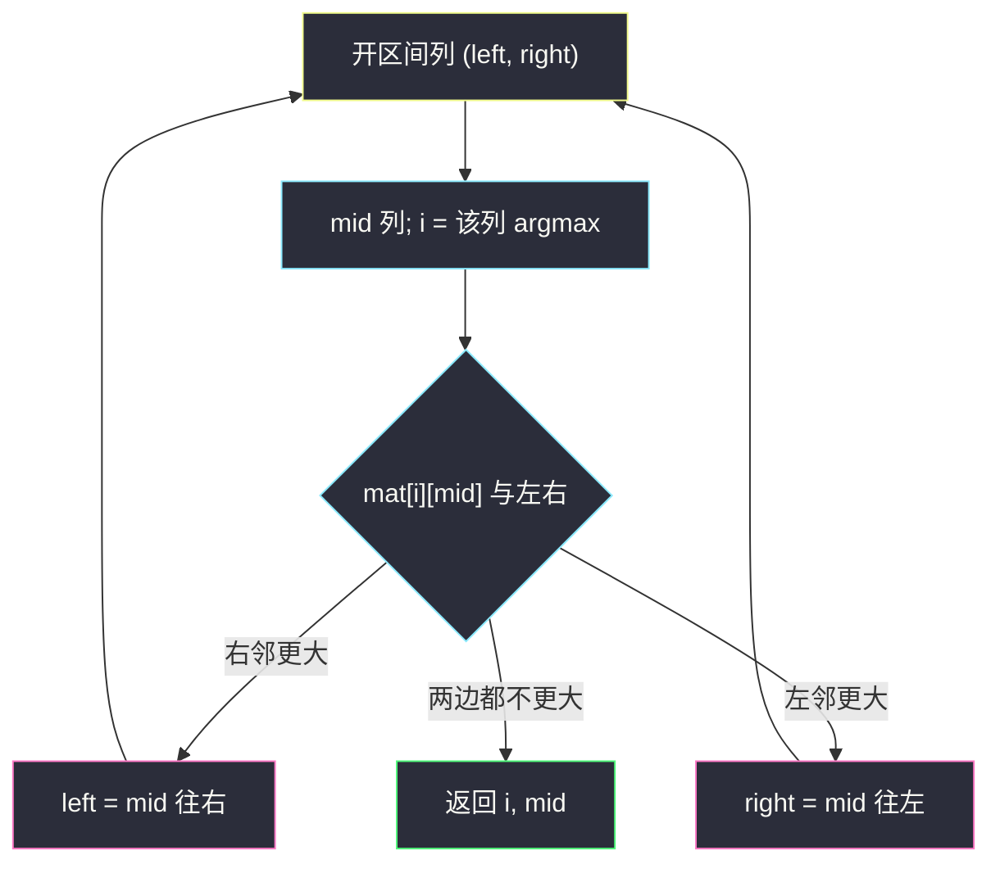
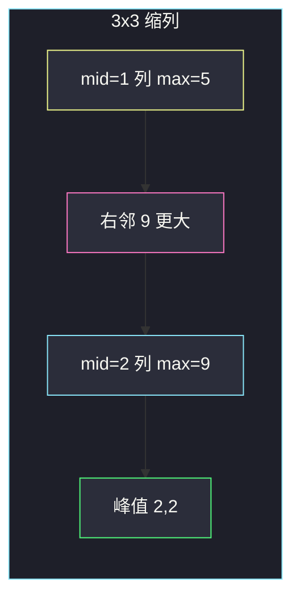

# 寻找峰值 II（二维：对列二分 + 往高处走）

## 一、问题描述

给你一个 `m × n` 的整数矩阵 `mat`。称位置 `(i, j)` 是**峰值**，当且仅当它**严格大于**四个相邻格子（上、下、左、右）。网格边界之外视为 `-1`。

返回**任意一个**峰值的坐标 `[i, j]`。题目保证至少存在一个峰值。进阶：`O(m log n)` 或 `O(n log m)`。

> 🔗 LeetCode 1901：https://leetcode.cn/problems/find-a-peak-element-ii/
>
> 数据范围：`1 <= m, n <= 500`，`1 <= mat[i][j] <= 10^5`，相邻元素可以相等以外的比较按严格大于；保证有解。

**示例 1**

```
输入：mat = [[1,4],[3,2]]
输出：[0,1]
解释：4 大于邻居 1（左）和边界 -1；3 也是峰值。返回任一即可。
```

**示例 2**

```
输入：mat = [[10,20,15],[21,30,14],[7,16,32]]
输出：[1,1]
解释：30 与 32 都是峰值。
```

**示例 3（用于逐步缩列）**

```
输入：mat = [[1,2,1],[3,4,8],[2,5,9]]
输出：[2,2]
解释：9 大于左 5、上 8。从中间列往更高的右侧缩，落到第 2 列。
```

**直观理解**

一维山脉（[852](peak-index-in-a-mountain-array.md)）比 `arr[mid]` 与 `arr[mid+1]`，往高的一侧走。二维没有「整列单峰」，但可以把**一列压成一个代表**：该列最大值所在的格子。它在列内已经高过上下；若再高过左右，就是峰值；否则左边或右边有个严格更大的邻居——**往那一侧缩列**。有限网格里一直往高处走，不会转圈，终点一定是局部峰。

---

## 二、暴力解法

每个格子和四邻比较，找到第一个峰值。

```python
class Solution:
    def findPeakGrid(self, mat: List[List[int]]) -> List[int]:
        m, n = len(mat), len(mat[0])
        dirs = [(-1, 0), (1, 0), (0, -1), (0, 1)]
        for i in range(m):
            for j in range(n):
                ok = True
                for di, dj in dirs:
                    ni, nj = i + di, j + dj
                    nb = mat[ni][nj] if 0 <= ni < m and 0 <= nj < n else -1
                    if mat[i][j] <= nb:
                        ok = False
                        break
                if ok:
                    return [i, j]
        return [0, 0]
```

### 复杂度

- **时间**：`O(mn)`。
- **空间**：`O(1)`。

`m, n ≤ 500` 线性能过。题面进阶要对数因子，面试应展示「对列（或行）二分」。

### 🔴 瓶颈在哪里

全局最大值一定是峰值（四邻都 ≤ 其它格子 ≤ 全局 max，且题目要严格大于——若存在并列全局 max 可能踩坑，本题保证有峰值）。找全局 max 仍是 `O(mn)`。要更快，必须像一维峰值那样**一次比较丢掉半张表**，不能每个格子都问一遍。

---

## 三、优化探索（核心章节）

> 📚 本题在灵茶题单中属于 **04-二分查找 · 四、其他**。一维姊妹篇：[山脉数组的峰顶索引](peak-index-in-a-mountain-array.md)。

本文对**列下标**做开区间二分 `(left, right)`，与 852 同一套：`while left + 1 < right`，只更新 `left = mid` 或 `right = mid`。行方向不二分，只在当前列里线性找最大值（`O(m)`）。总时间 `O(m log n)`。对行二分则是 `O(n log m)`。

### 3.1 一次判定：列内 max 对左右

取 `mid` 列，令 `i = argmax_r mat[r][mid]`（该列最大所在行）。

- 左邻居：`mid==0` 则为 `-1`，否则 `mat[i][mid-1]`；
- 右邻居：`mid==n-1` 则为 `-1`，否则 `mat[i][mid+1]`。

`mat[i][mid]` 已经 ≥ 同列所有格子，因而 ≥ 上下邻居。若它还 `>` 左右邻居，就是峰值，直接返回。

若右邻居更大：当前格不是峰，但右侧存在严格更大的格子。把左半列丢掉：`left = mid`。
若左邻居更大：`right = mid`。
若两侧都更大，往任意更高侧走都对；代码里可以先判断右再判断左。

### 3.2 正确性：往高处走一定有峰

一维 852 靠「山脉唯一峰」。二维没有这个形状，论证换成**上坡路径**：

1. 若 `mat[i][mid] < mat[i][mid+1]`，从 `(i, mid+1)` 出发：只要当前不是峰，四邻里必有一个更大的（否则自己就是峰）。每一步走到更大的格子，值严格增加，格子有限，不能无限走，停止时就是峰值。这条路第一步已经迈进 **mid 以右** 的半边。
2. 会不会走出右半边、跑回左边？第一步在 `mid+1`。若之后走到 `mid` 列，该列任意值 `≤ mat[i][mid] < mat[i][mid+1]`，比路径上已经经过的 `mat[i][mid+1]` 更小，严格上升的路径**不会**走回更小的 `mid` 列。因此峰被关在右半。
3. 对称地，往左缩时峰在左半。

所以：比较列 max 与左右，相当于在二维网格上做了一次「往高处迈步」，并把不含上坡方向的那一半列扔掉。这与 852「升则右、降则左」是同一句话的矩阵版。

例：示例 3 第一轮列 1 的 max 是 5，右邻 9。从格子 `(2,1)` 走到 `(2,2)` 已经严格上升；`(2,2)` 的 9 再没有更大邻居，停下来就是峰。左半列 `[1,3,2]` 被整段丢弃，里面即使有局部凸起（本例没有），也不需要再看——上坡第一步已经进了右半。



### 3.3 开区间边界

列号 ∈ `[0, n-1]`，`left, right = -1, n`。`mid` 落在 `[0, n-1]`，左右邻居用下标判断越界即可，不必像 852 那样把 `right` 设成 `n-1`（这里不强制读 `mid+1` 列的整列，只读一个邻居，越界当 `-1`）。

若某一侧越界，邻居为 `-1`，`mat[i][j] ≥ 1`，边界格不会因为越界邻居而「不够大」。

### 3.4 对行二分是对称的

`mid` 行找该行最大值所在列，与上下邻居比，往更大的一侧缩行。时间 `O(n log m)`。`m` 很小 `n` 很大时对列二分更优，反之对行。实现选一个方向即可。

### 3.5 一句话核心

> **对列二分：列内最大值已经赢了上下；再跟左右比，谁高往谁走。往高处走一定有峰，所以可以把矮的半边列整段扔掉。**

---

## 四、代码实现

### Python（主解：对列开区间二分）

```python
class Solution:
    def findPeakGrid(self, mat: List[List[int]]) -> List[int]:
        m, n = len(mat), len(mat[0])
        left, right = -1, n                 # 列的开区间 (left, right)
        while left + 1 < right:
            mid = (left + right) // 2
            i = max(range(m), key=lambda r: mat[r][mid])
            cur = mat[i][mid]
            left_nb = mat[i][mid - 1] if mid - 1 >= 0 else -1
            right_nb = mat[i][mid + 1] if mid + 1 < n else -1
            if cur < right_nb:
                left = mid                  # 往右更高处
            elif cur < left_nb:
                right = mid               # 往左更高处
            else:
                return [i, mid]          # 严格大于四邻
        return [0, 0]                    # 保证有解，不会走到
```

**变量含义**

| 变量 | 含义 |
|------|------|
| `left`, `right` | 列的开区间；峰值所在列始终在 `(left, right)` 内，直到某次 `mid` 列直接命中 |
| `i` | `mid` 列最大值所在行 |
| `left_nb` / `right_nb` | 同一行左右邻居，越界为 `-1` |

**循环不变量**：`(left, right)` 内存在一个峰值列。命中峰值则提前返回。

### Java（最优解同款）

```java
class Solution {
    public int[] findPeakGrid(int[][] mat) {
        int m = mat.length, n = mat[0].length;
        int left = -1, right = n;
        while (left + 1 < right) {
            int mid = left + (right - left) / 2;
            int i = 0;
            for (int r = 1; r < m; r++) {
                if (mat[r][mid] > mat[i][mid]) i = r;
            }
            int cur = mat[i][mid];
            int leftNb = mid - 1 >= 0 ? mat[i][mid - 1] : -1;
            int rightNb = mid + 1 < n ? mat[i][mid + 1] : -1;
            if (cur < rightNb) left = mid;
            else if (cur < leftNb) right = mid;
            else return new int[] {i, mid};
        }
        return new int[] {0, 0};
    }
}
```

---

## 五、具体例子演示

以示例 3：

```
列    0  1  2
行0   1  2  1
行1   3  4  8
行2   2  5  9
```

`n = 3`，开区间 `(-1, 3)`。逐步缩列：

| 轮 | left | right | mid | 该列（自上而下） | 列 max 位置 | cur | 左邻 | 右邻 | 判定 | 新区间 / 返回 |
|----|------|-------|-----|------------------|------------|-----|------|------|------|----------------|
| 1 | -1 | 3 | 1 | 2,4,5 | (2,1) | 5 | 2 | 9 | 5<9 往右 | `(1, 3)` |
| 2 | 1 | 3 | 2 | 1,8,9 | (2,2) | 9 | 5 | -1 | 9>5 且 9>-1 | **返回 [2,2]** |

`9` 的四邻：左 5、上 8、右/下越界 `-1`，均为严格更小 ✓。

**示例 2 一次命中**：`[[10,20,15],[21,30,14],[7,16,32]]`，`(-1, 3)`，`mid=1`，列 `20,30,16` 的 max 是 30 在 `(1,1)`，左 21、右 14，`30>21` 且 `30>14`，直接 `[1,1]`。不必缩到 32 那一列——**任一峰值即可**。



---

## 六、复杂度分析

| 方法 | 时间 | 空间 | 说明 |
|------|------|------|------|
| 逐格看四邻 | `O(mn)` | `O(1)` | 能过，非进阶 |
| 对列二分 + 列内 max（主解） | `O(m log n)` | `O(1)` | `log n` 次，每次扫 m 行 |
| 对行二分 + 行内 max | `O(n log m)` | `O(1)` | 对称写法 |

---

## 七、对比总结

| 维度 | 852 一维山脉 | 本题二维 |
|------|----------------|----------|
| 比较 | `arr[mid]` vs `arr[mid+1]` | 列 max vs 左右邻居 |
| 峰的个数 | 恰好一个 | 至少一个，返回任一 |
| 往高处走 | 上坡一侧必有唯一峰 | 严格上升路径在半边内结束于某峰 |
| 开区间 | `right = n-1` 防 `mid+1` 越界 | `right = n`，邻居越界当 -1 |

**易错点**

1. **列内随便取一行就和左右比**：必须取**该列最大**，否则上下可能更大，当前格不是峰，往左右缩也没有「列内已经最高」的前提。
2. **当成每行都是山脉**：行不一定单峰，不能对每一行套 852。
3. **返回全局 max 的坐标**：正确但是 `O(mn)`，不是二分。
4. **开闭混用**：缩列时写 `right = mid - 1` 可能把仍含峰的 `mid` 列扔掉（当峰就在 `mid` 且你本应返回时已经走了 elif）。命中峰值要在缩之前 `return`。
5. **与 162/852 的链接**：一维比相邻；二维先把一列收成一个点再比相邻列。细节见 [peak-index-in-a-mountain-array.md](peak-index-in-a-mountain-array.md)。

**模板（开区间 · 对列）**

```python
left, right = -1, n
while left + 1 < right:
    mid = (left + right) // 2
    i = max(range(m), key=lambda r: mat[r][mid])
    cur = mat[i][mid]
    left_nb = mat[i][mid - 1] if mid > 0 else -1
    right_nb = mat[i][mid + 1] if mid + 1 < n else -1
    if cur < right_nb:
        left = mid
    elif cur < left_nb:
        right = mid
    else:
        return [i, mid]
```

---

## 八、举一反三

| 题目 | 关系 |
|------|------|
| [852. 山脉数组的峰顶索引](https://leetcode.cn/problems/peak-index-in-a-mountain-array/) | 一维版，同目录 [peak-index-in-a-mountain-array.md](peak-index-in-a-mountain-array.md) |
| [162. 寻找峰值](https://leetcode.cn/problems/find-peak-element/) | 一维、相邻不等即可，端点可为峰 |
| [1095. 山脉数组中查找目标值](https://leetcode.cn/problems/find-in-mountain-array/) | 先 852 再两侧有序二分 |
| [74. 搜索二维矩阵](https://leetcode.cn/problems/search-a-2d-matrix/) | 也对「行列」做对数查找，但靠的是全局有序而非峰值 |
| [240. 搜索二维矩阵 II](https://leetcode.cn/problems/search-a-2d-matrix-ii/) | 从边角往更有希望的方向走，思想类似「比较后丢掉一行/列」 |

**思想迁移**

- 峰值题的通用句：**往严格更高的邻居走，有限图上必停在峰**。二分是加速这条路的跳步：一次丢掉半行或半列。
- 二维先「聚合」再「和左右比」：列 max 就是聚合。
- 口诀：**「列里取最高，左右谁高往谁缩；上坡不出半边，峰在更高那一侧。」**
