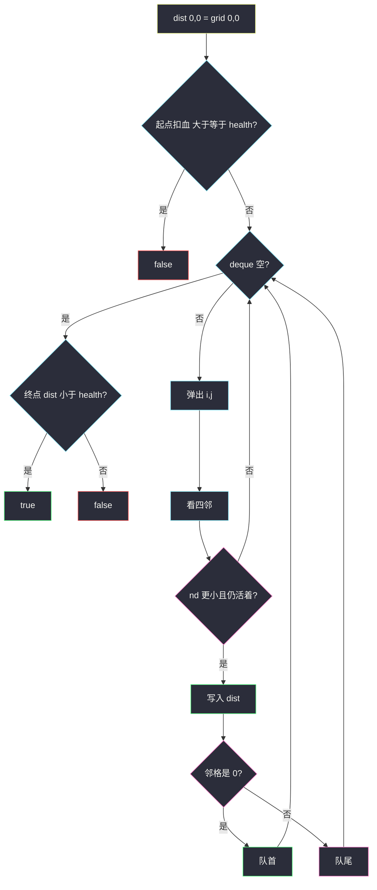

# 穿越网格图的安全路径（0-1 BFS · 最小扣血）

## 一、问题描述

`m × n` 二进制网格 `grid` 和初始健康值 `health`。从 `(0, 0)` 走到 `(m-1, n-1)`，四连通。`grid[i][j] == 1` 是不安全格，**踏入时**健康值减 1；`0` 不扣。任意时刻（含起点、终点）健康值必须是**正数**。能安全到达返回 `true`，否则 `false`。

> 🔗 LeetCode 3286：https://leetcode.cn/problems/find-a-safe-walk-through-a-grid/
>
> 数据范围：`1 ≤ m, n ≤ 50`，`2 ≤ m * n`，`1 ≤ health ≤ m + n`，格子只有 `0/1`。
>
> 📚 灵茶题单：**三、网格图 0-1 BFS**。官方提示即 0-1 BFS。

**示例 1**

```
输入：grid = [[0,1,0,0,0],[0,1,0,1,0],[0,0,0,1,0]], health = 1
输出：true
存在一条全 0 的路，全程不扣血，剩余 1 > 0。
```

**示例 2**

```
输入：grid = [[0,1,1,0,0,0],[1,0,1,0,0,0],[0,1,1,1,0,1],[0,0,1,0,1,0]], health = 3
输出：false
最少要踩 3 个不安全格，需要 health ≥ 4。
```

**示例 3**

```
输入：grid = [[1,1,1],[1,0,1],[1,1,1]], health = 5
输出：true
必须经过中心 0，最少扣 4 点（四个 1 + 一个 0），5 - 4 = 1 > 0。
不经过中心的路径会在终点把血扣到 ≤ 0。
```

**直观理解**

每走一格，要么免费（0），要么扣 1 点血（1）。问的不是步数最短，而是**扣血最少**的路够不够用。边权只有 0/1，用双端队列做 0-1 BFS。起点 `grid[0][0]` 也要扣——站在不安全格上就已经掉血。

---

## 二、暴力解法

DFS / BFS 搜所有简单路径，记录剩余生命。网格 50×50，简单路径指数级，必 TLE。若改成「先到某格就标记 visited」，更会直接算错：步数少的路可能踩了更多 `1`，把「绕路但少扣血」的走法挡住。

```python
# 反例骨架：按步数 BFS + 布尔 visited
q = deque([(0, 0, health - grid[0][0])])
seen[0][0] = True
while q:
    i, j, h = q.popleft()
    for 四邻:
        if 没 visisted:
            seen = True          # 错：先到的未必少扣血
            q.append((ni, nj, h - grid[ni][nj]))
```

### 🔴 瓶颈在哪里

代价是「路径上 1 的个数」，不是步数。普通 BFS 的第一次到达只保证步数最短。要用 0-1 BFS 维护到达每格的**最小扣血** `dist`：走到 `0` 代价 +0 插队首，走到 `1` 代价 +1 入队尾。答案：`dist[终点] < health`（剩余生命 `health - dist > 0`）。

---

## 三、优化探索（核心章节）

> 📚 本题在灵茶题单中属于 **三、网格图 0-1 BFS**。不要用布尔 visited 在入队时锁死格子。

### 3.1 状态与边权

`dist[i][j]` = 到达 `(i, j)` 时已经扣掉的血（含本格）。

- 初值：`dist[0][0] = grid[0][0]`。若 `dist[0][0] >= health`，起点已经没正生命，直接 `false`。
- 从 `(i, j)` 走到 `(ni, nj)`：`nd = dist[i][j] + grid[ni][nj]`。
- 仅当 `nd < dist[ni][nj]` 且 `nd < health` 时更新（死了的路径不必入队）。
- `grid[ni][nj] == 0` → `appendleft`；`== 1` → `append`。

### 3.2 为什么布尔 visited 会错

边权 0 和 1 混在一起时，**先被搜到的格子不一定扣血最少**。必须允许「同一格被更小的 `dist` 再次更新」。0-1 BFS 里也可以「弹出时才标记」——那是因为 deque 保证先弹出的 `dist` 更小。入队就标 `visited` 则不行。



### 3.3 一句话核心

> **边权是踏入该格的 0/1；0 插队首、1 入队尾；用最小扣血而不是布尔 visited；终点扣血小于 health 才算活着。**

---

## 四、代码实现

### Python（主解：0-1 BFS）

```python
from collections import deque
from typing import List

class Solution:
    def findSafeWalk(self, grid: List[List[int]], health: int) -> bool:
        m, n = len(grid), len(grid[0])
        DIRS = ((0, 1), (0, -1), (1, 0), (-1, 0))
        INF = 10 ** 9
        dist = [[INF] * n for _ in range(m)]
        dist[0][0] = grid[0][0]
        if dist[0][0] >= health:
            return False
        q = deque([(0, 0)])
        while q:
            i, j = q.popleft()
            for di, dj in DIRS:
                ni, nj = i + di, j + dj
                if 0 <= ni < m and 0 <= nj < n:
                    nd = dist[i][j] + grid[ni][nj]
                    if nd < dist[ni][nj] and nd < health:
                        dist[ni][nj] = nd
                        if grid[ni][nj] == 0:
                            q.appendleft((ni, nj))
                        else:
                            q.append((ni, nj))
        return dist[m - 1][n - 1] < health
```

`health ≤ m + n ≤ 100`，同一格 `dist` 最多被更新几十次，50×50 完全够。不要把 `visited` 设成「来过就不再进」——那是边权全 1 的 BFS 习惯，本题会错。

**变量含义**

| 写法 | 含义 |
|------|------|
| `dist[i][j]` | 到此格的最少扣血（含本格） |
| `nd < health` | 踏入后仍有正生命才继续 |
| `appendleft` | 邻格是 0，代价不变 |
| `append` | 邻格是 1，扣 1 点 |

### Java（可选）

```java
class Solution {
    private static final int[][] DIRS = {{0, 1}, {0, -1}, {1, 0}, {-1, 0}};

    public boolean findSafeWalk(List<List<Integer>> grid, int health) {
        int m = grid.size(), n = grid.get(0).size();
        int[][] dist = new int[m][n];
        for (int i = 0; i < m; i++) Arrays.fill(dist[i], Integer.MAX_VALUE / 2);
        dist[0][0] = grid.get(0).get(0);
        if (dist[0][0] >= health) return false;
        ArrayDeque<int[]> q = new ArrayDeque<>();
        q.add(new int[]{0, 0});
        while (!q.isEmpty()) {
            int[] cur = q.pollFirst();
            int i = cur[0], j = cur[1];
            for (int[] d : DIRS) {
                int ni = i + d[0], nj = j + d[1];
                if (ni < 0 || ni >= m || nj < 0 || nj >= n) continue;
                int nd = dist[i][j] + grid.get(ni).get(nj);
                if (nd < dist[ni][nj] && nd < health) {
                    dist[ni][nj] = nd;
                    if (grid.get(ni).get(nj) == 0) q.addFirst(new int[]{ni, nj});
                    else q.addLast(new int[]{ni, nj});
                }
            }
        }
        return dist[m - 1][n - 1] < health;
    }
}
```

---

## 五、具体例子演示

示例 1。`health = 1`，只能走 `0`（踩一个 `1` 后扣血 1，剩余 0，非法）。

```
0 1 0 0 0
0 1 0 1 0
0 0 0 1 0
```

**起点** `dist[0][0] = 0`，deque：`[(0,0)]`。

弹出 `(0,0)`：右邻 `(0,1)` 是 1，`nd = 1`，`1 < health` 不成立，丢弃。下邻 `(1,0)` 是 0，`nd = 0`，插队首。

```
deque 左 → 右: [(1,0)]
dist 第一列全是 0 的路被 0 边一路插到队首，优先走完。
```

继续沿左边和下边的 0 前进，可绕到右下角，终点 `dist = 0 < 1`，`true`。全程队尾几乎用不上——没有合法的 `1` 边。

**示例 3** `health = 5`。九格里只有中心是 0。一条合法路：

`(0,0)=1 → (1,0)=1 → (1,1)=0 → (1,2)=1 → (2,2)=1`

扣血 `1+1+0+1+1 = 4`，`4 < 5`。

deque 示意（扣血写在括号里）：

| 操作 | deque（左=小代价） | 说明 |
|------|-------------------|------|
| 初 | `[(0,0)]` dist=1 | 起点已扣 1 |
| 弹出 (0,0) | 四邻都是 1，全入**队尾** | 边权 1 |
| 之后 | 某次走到 (1,1) | 邻格 0，**插队首**，同扣血优先扩展中心 |
| 终点 | dist=4 | `4 < 5` 成功 |

若 `health = 4`：终点剩余 0，`4 < 4` 为假。不要写成 `≤ health`。

示例 2 对拍：最小扣血是 **3**，故 `health = 3` 时 `3 < 3` 为假，官方说「最少需要 4」与 `dist < health` 一致。

**布尔 visited 会错**（对拍）：`grid = [[0,1,1,1,1],[1,0,0,1,0]]`，`health = 3`。最少扣血 2，0-1 BFS 返回 `true`。按步数 BFS、入队就 `seen`，会先沿着第一行走远、用较差生命锁住格子，把底下那条「多走几步但少踩 1」的路挡住，误判 `false`。

---

## 六、复杂度分析

| 方法 | 时间 | 空间 | 说明 |
|------|------|------|------|
| 枚举路径 | 指数 | `O(mn)` | TLE |
| 步数 BFS + 布尔 visited | `O(mn)` | `O(mn)` | 答案可能错 |
| 0-1 BFS（主解） | `O(mn · health)` | `O(mn)` | 每格 dist 最多下降 `health` 次；`health ≤ m+n` |

---

## 七、对比总结

| 维度 | 普通 BFS | 0-1 BFS |
|------|----------|---------|
| 优化目标 | 最少步数 | 最少扣血 |
| visited | 入队即可 | 用 `dist` 松弛，更优才更新 |
| 队 | 只 append | 0 队首 / 1 队尾 |

**易错点**

1. **起点不扣血**：`grid[0][0] == 1` 且 `health == 1` 应是 `false`。
2. **终点剩余 0 仍判成功**：必须严格 `dist < health`。
3. **布尔 visited**：先到的路生命更差，会挡住绕路少扣血的路径。
4. **把边权加在「离开」而不是「踏入」**：邻格的 0/1 才是这一步的代价。
5. **Dijkstra 堆**：能过，但边权 0/1 时 deque 更短、更贴题单。

---

## 八、举一反三

| 题目 | 关系 |
|------|------|
| [1824. 最少侧跳次数](https://leetcode.cn/problems/minimum-sideway-jumps/) | 同款 0-1 BFS；见 `minimum-sideway-jumps.md` |
| [2290. 到达角落需要移除障碍物的最小数目](https://leetcode.cn/problems/minimum-obstacle-removal-to-reach-corner/) | 空格 0、障碍 1，求最少移除 |
| [1368. 使网格图至少有一条有效路径的最小代价](https://leetcode.cn/problems/minimum-cost-to-make-at-least-one-valid-path-in-a-grid/) | 顺箭头 0、改方向 1 |
| [542. 01 矩阵](https://leetcode.cn/problems/01-matrix/) | 边权全 1 的多源 BFS；见 `01-matrix.md` |
| [2812. 找出最安全路径](https://leetcode.cn/problems/find-the-safest-path-in-a-grid/) | 最大化路径最小距离；见 `find-the-safest-path-in-a-grid.md` |

**思想迁移**

- 网格里移动代价只有 0 和 1（扣不扣血、拆不拆墙、改不改方向）→ 0-1 BFS。
- 口诀：**「踏入 1 才扣血；0 插队首；用 dist 不用布尔 visited；终点 dist 小于 health。」**
