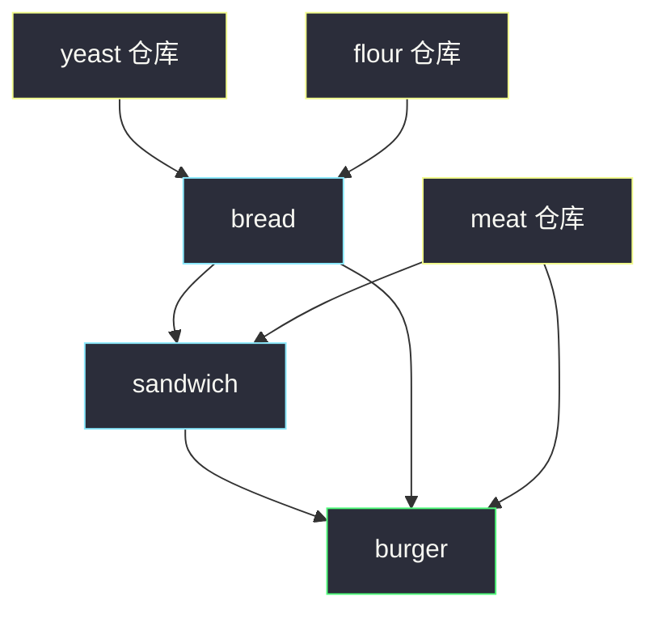
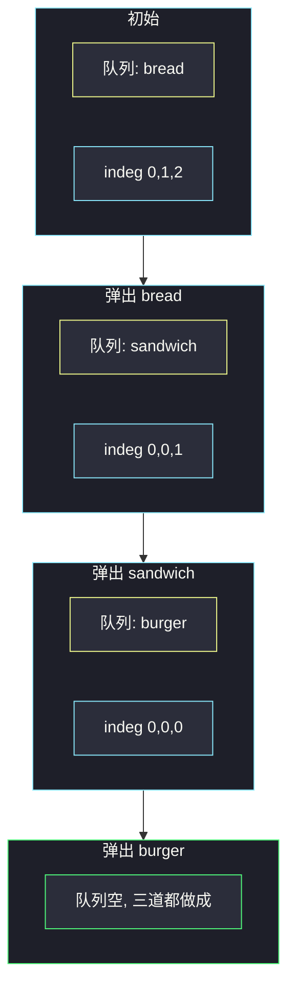

# 从给定原材料中找到所有可以做出的菜（拓扑 Kahn）

## 一、问题描述

有 `n` 道菜：`recipes[i]` 的原料是 `ingredients[i]`。初始仓库是 `supplies`（每种无限）。一道菜的原料里可以再出现另一道菜。两道菜也可能互相把对方当原料。返回所有能做出来的菜，顺序任意。

> 🔗 LeetCode 2115：https://leetcode.cn/problems/find-all-possible-recipes-from-given-supplies/
>
> 数据范围：`1 ≤ n ≤ 100`，每道菜原料数、`supplies` 长度 ≤ 100。菜名、供应名互不相同；同一道菜的原料不重复。
>
> 📚 灵茶题单：**§2.1 拓扑排序**。

**示例 1**

```
输入：recipes = ["bread"], ingredients = [["yeast","flour"]], supplies = ["yeast","flour","corn"]
输出：["bread"]
```

酵母和面粉都在仓库里，面包能做。玉米用不上。

**示例 2**

```
输入：recipes = ["bread","sandwich"], ingredients = [["yeast","flour"],["bread","meat"]], supplies = ["yeast","flour","meat"]
输出：["bread","sandwich"]
```

先做面包，再拿面包和肉做三明治。菜可以当另一道菜的原料。

**示例 3**

```
输入：recipes = ["bread","sandwich","burger"], ingredients = [["yeast","flour"],["bread","meat"],["sandwich","meat","bread"]], supplies = ["yeast","flour","meat"]
输出：["bread","sandwich","burger"]
```

汉堡依赖三明治和面包，拓扑顺序是面包 → 三明治 → 汉堡。

**直观理解**

仓库是「已经有的」。做出来的菜立刻变成新的已有物，可能解锁后面的菜。依赖关系是有向图：`原料菜 → 用到它的菜`。能按拓扑序做完的菜就是答案；缺基础原料或成环的菜永远做不了。

---

## 二、暴力解法

`n ≤ 100`，可以反复扫：每一轮检查每道还没做的菜，原料是否都已在「已有集合」里。做成了就加进集合，直到某一轮一张新菜都做不出来。

```python
from typing import List

class Solution:
    def findAllRecipes(
        self,
        recipes: List[str],
        ingredients: List[List[str]],
        supplies: List[str],
    ) -> List[str]:
        have = set(supplies)
        done = [False] * len(recipes)
        ans = []
        changed = True
        while changed:
            changed = False
            for i, r in enumerate(recipes):
                if done[i]:
                    continue
                if all(x in have for x in ingredients[i]):
                    have.add(r)
                    done[i] = True
                    ans.append(r)
                    changed = True
        return ans
```

最坏每轮只做成 1 道，一共 `n` 轮，每轮扫全部原料，时间大约 `O(n² · L)`（`L` 是单道菜原料数）。能过，但没有把「依赖」建成图，迁不到更大的拓扑题。

### 🔴 瓶颈在哪里

本质是有向图上的依赖消除：入度为 0 的菜现在就能做。Kahn 一遍 `O(n + m)` 扫完。

---

## 三、优化探索（核心章节）

> 📚 本题在灵茶题单中属于 **§2.1 拓扑排序**。把菜当节点，Kahn 队列里装的是「原料已经齐了」的菜。

### 3.1 节点只建「菜」

`supplies` 不是节点，当作初始已有。边只在菜与菜之间：

- 若菜 `A` 的原料里出现了菜 `B`，则 `B → A`（先做出 B，A 的入度才能减一）。
- 入度 = 这道菜还缺几道「菜原料」。
- 原料既不是菜、也不在 `supplies`：这道菜永远做不了，不要放进初始队列（入度无法清零，或直接标不可能）。

非菜且已在仓库里的原料，不占入度——它们一开始就有。



上图里真正进拓扑图的只有三个蓝色/绿色节点；黄框是仓库，只用来判断「非菜原料是否齐」。

### 3.2 Kahn：入度为 0 就能做

1. 建 `name → 下标`，邻接表 `g[i]` = 做出菜 `i` 之后入度会减一的那些菜。
2. 扫描每道菜的原料：菜原料则连边并 `indeg++`；非菜且不在仓库则 `ok[i] = False`。
3. 所有 `ok[i] and indeg[i] == 0` 入队。
4. 弹出 `i`，加入答案；对 `g[i]` 里每个 `j` 做 `indeg[j]--`，减到 0 且 `ok[j]` 则入队。

成环（两道菜互为原料）时两边入度都 ≥ 1，谁也进不了队，答案里不会出现它们。依赖一条不可能的菜时，上游永远不弹出，下游入度清不掉，同样做不出。

### 3.3 一句话核心

> **菜当节点、菜原料连边；入度是还缺的菜数；仓库只用来否决「缺基础原料」的菜。能弹出的都能做。**

---

## 四、代码实现

### Python（主解：Kahn）

```python
from collections import deque
from typing import List

class Solution:
    def findAllRecipes(
        self,
        recipes: List[str],
        ingredients: List[List[str]],
        supplies: List[str],
    ) -> List[str]:
        n = len(recipes)
        idx = {name: i for i, name in enumerate(recipes)}
        have = set(supplies)
        g = [[] for _ in range(n)]
        indeg = [0] * n
        ok = [True] * n
        for i, ings in enumerate(ingredients):
            for x in ings:
                if x in idx:
                    g[idx[x]].append(i)
                    indeg[i] += 1
                elif x not in have:
                    ok[i] = False
        q = deque(i for i in range(n) if ok[i] and indeg[i] == 0)
        ans = []
        while q:
            i = q.popleft()
            ans.append(recipes[i])
            for j in g[i]:
                indeg[j] -= 1
                if ok[j] and indeg[j] == 0:
                    q.append(j)
        return ans
```

`ok[i] = False` 的菜永不入队，依赖它的菜入度减不完。不必把仓库建成图节点。

不要把 `supplies` 里碰巧叫某道菜名的东西当「已经做好的菜」——题面保证 `recipes` 与 `supplies` 值互不相同，不会撞名。

---

## 五、具体例子演示

示例 3。三道菜下标 `0=bread, 1=sandwich, 2=burger`。

| 菜 | 原料 | 菜原料边 | indeg | ok |
|----|------|----------|-------|-----|
| bread | yeast, flour | 无 | 0 | 真（都在仓库） |
| sandwich | bread, meat | bread → sandwich | 1 | 真 |
| burger | sandwich, meat, bread | sandwich → burger，bread → burger | 2 | 真 |

初始队列：`[0]`（只有面包入度为 0）。

| 弹出 | 答案 | 减入度 | indeg | 新入队 | 队列 |
|------|------|--------|-------|--------|------|
| 0 bread | bread | sandwich 1→0；burger 2→1 | `[0,0,1]` | 1 | `[1]` |
| 1 sandwich | bread, sandwich | burger 1→0 | `[0,0,0]` | 2 | `[2]` |
| 2 burger | 三道都有 | 无出边 | `[0,0,0]` | — | 空 |

全部做出。Kahn 的弹出顺序就是一种合法的做菜顺序。



**缺基础原料（示例 4）**

只有 yeast，缺 flour。`ok[bread] = False`，队列空，返回 `[]`。即使误把 indeg 当成 0，也绝不能入队——flour 不是菜，没有任何弹出能「补」上它。

**互相当原料**

`A` 要 `B`，`B` 要 `A`，两边 indeg 都是 1，队列为空。题面说「注意两道菜在它们的原材料中可能互相包含」，就是这个环，Kahn 自然丢弃。

**依赖做不出的菜**

仓库有肉，菜：`bread` 要 flour（缺），`sandwich` 要 bread+肉。bread 的 `ok=False` 不入队，sandwich 的 indeg 停在 1，也做不出。

**三道菜、只有中间能做**

`recipes = ["cake","bread","salad"]`，`ingredients = [["bread"],["flour"],["lettuce"]]`，`supplies = ["flour"]`。bread 入度 0 且 flour 在仓库，先做成；cake 等 bread，随后做成；salad 缺 lettuce，`ok=False`。答案 `["bread","cake"]`（顺序可变）。Kahn 不会因为 salad 做不出而卡死队列——它根本不在图的「可完成」通路上。

**同一原料被多道菜用**

面包做出后，`g[bread]` 可能指向三明治和汉堡两条出边，一次弹出要给所有依赖者减入度。漏掉循环、只减第一个，汉堡会永远留在 indeg=1。

仓库原料无限：两道菜同时要 meat，不必「消耗」一份。`have` 是集合不是计数器。

---

## 六、复杂度分析

| 方法 | 时间 | 空间 | 说明 |
|------|------|------|------|
| 反复扫描 | `O(n² · L)` | `O(n + S)` | `n=100` 能过 |
| Kahn（主解） | `O(n + m)` | `O(n + m)` | `m` 为菜之间的边，至多原料条目数 |

`S` 是 `supplies` 大小。哈希表判「是不是菜 / 在不在仓库」均摊 `O(1)`。

---

## 七、对比总结

| 维度 | 反复扫描 | Kahn |
|------|----------|------|
| 图 | 不建 | 菜 → 依赖它的菜 |
| 缺基础原料 | `all in have` 失败 | `ok=False` 永不入队 |
| 环 | 某一轮不再变化 | 入度清不掉 |

**易错点**

1. **把非菜原料也建成节点**：仓库当超级源点也能写对，但多余；题单练的是「只把菜当节点」。
2. **入度统计了仓库原料**：yeast 不会被「做出」，入度减不掉，面包永远出不了队。
3. **缺 flour 仍按 indeg=0 入队**：会把做不出的菜算进答案。
4. **建成无向图**：依赖有方向，A 用 B 不等于 B 用 A。
5. **做成后忘了当原料**：弹出后必须沿出边减入度，否则只做出入度为 0 的第一层。

---

## 八、举一反三

| 题目 | 关系 |
|------|------|
| [207. 课程表](https://leetcode.cn/problems/course-schedule/) | 标准 Kahn：入度 0 入队，看是否全部弹出 |
| [210. 课程表 II](https://leetcode.cn/problems/course-schedule-ii/) | 弹出顺序就是一种合法序 |
| [802. 找到最终的安全状态](https://leetcode.cn/problems/find-eventual-safe-states/) | 反图 + Kahn，剥掉入环的点 |
| [2115. 本题](https://leetcode.cn/problems/find-all-possible-recipes-from-given-supplies/) | 依赖项有的是节点、有的是外部常量 |

**思想迁移**

- 「A 依赖 B」→ 边 `B → A`，入度记在 A 上。
- 外部已有物（仓库、已解锁技能）不当节点，只用来初始化谁能直接做。
- 口诀：**「菜连菜；缺的基础原料一票否决；队列弹出的就是能做的。」**
