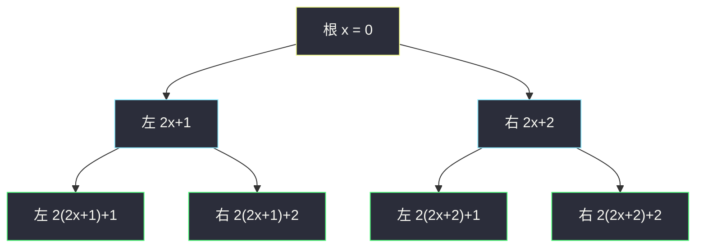
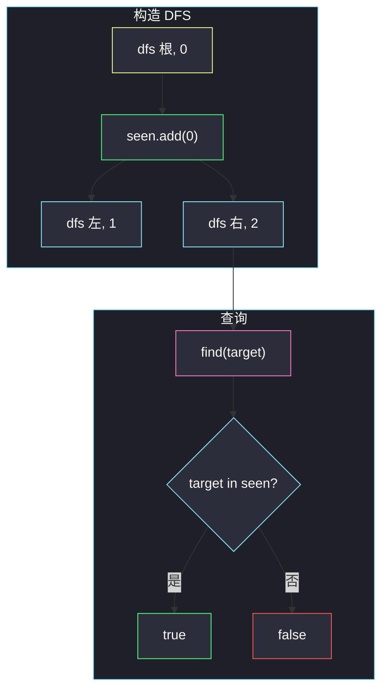

# 在受污染的二叉树中查找元素（还原规则 + 集合查询）

## 一、问题描述

一棵二叉树本来按下述规则填值，但现在所有节点值都被改成了 `-1`（**受污染**）：

- 根的值是 `0`
- 若某节点值为 `x`，则左孩子为 `2 * x + 1`，右孩子为 `2 * x + 2`

请实现 `FindElements`：

- `FindElements(root)`：用这棵被污染的树做初始化，在内部把它**还原**。
- `find(target)`：还原后的树里是否出现过 `target`。

> 🔗 LeetCode 1261：https://leetcode.cn/problems/find-elements-in-a-contaminated-binary-tree/
>
> 数据范围：节点数 `[1, 10^4]`；还原后节点值互不相同；`0 <= target <= 10^6`；`find` 最多调用 `10^4` 次。污染后 `TreeNode.val == -1`。
>
> 📚 灵茶题单：**二叉树 · §2.16 其他**（1440 分）。设计题，核心是「按规则还原 + 支持查询」。

**示例 1**

```
输入：["FindElements","find","find"]
     [[[-1,null,-1]],[1],[2]]
输出：[null, false, true]
还原：
      0
        \
         2
树里只有 0 和 2，没有 1。
```

**示例 2**

```
输入：["FindElements","find","find","find"]
     [[[-1,-1,-1,-1,-1]],[1],[3],[5]]
输出：[null, true, true, false]
还原：
      0
     / \
    1   2
   / \
  3   4
有 1、3，没有 5。
```

**直观理解**

污染只毁掉了数字，**树的形状还在**。形状一旦固定，每个位置的值就被公式唯一确定：根必须是 0，往左走一次 `2x+1`，往右走一次 `2x+2`。构造时把出现过的值丢进集合，`find` 就是成员查询。

---

## 二、暴力解法

构造时按公式把 `node.val` 改回去，每次 `find` 再整棵树 DFS 一遍：

```python
class FindElements:
    def __init__(self, root: Optional[TreeNode]):
        self.root = root
        def recover(node: Optional[TreeNode], x: int) -> None:
            if node is None:
                return
            node.val = x
            recover(node.left, 2 * x + 1)
            recover(node.right, 2 * x + 2)
        recover(root, 0)

    def find(self, target: int) -> bool:
        def dfs(node: Optional[TreeNode]) -> bool:
            if node is None:
                return False
            if node.val == target:
                return True
            return dfs(node.left) or dfs(node.right)
        return dfs(self.root)
```

### 复杂度

- **构造**：`O(n)`。
- **单次 find**：最坏 `O(n)`。
- **空间**：递归栈 `O(h)`。

`find` 最多 `10^4` 次、树最大 `10^4`，合计可达 `10^8` 次节点访问，勉强能过，但每次都从头搜，浪费了「值一旦还原就不再变」这个事实。

### 🔴 瓶颈在哪里

还原后的值集合是**静态**的。把集合在构造期算好，之后每次 `find` 应是哈希查询，而不是再遍历树。

---

## 三、优化探索（核心章节）

> 📚 本题在灵茶题单中属于 **二叉树 · §2.16 其他**。设计题要先钉死 API 不变量，再选「构造期预处理、查询期 O(1)」的结构。

### 3.1 API 不变量（先写清楚再写代码）

1. **形状决定取值**：任意节点的值只取决于它相对根的左右路径，与污染前的旧值无关。
2. **根恒为 0**：`find(0)` 在 `n ≥ 1` 时恒为 `true`。
3. **构造之后树不再变**：多次 `find` 看到的是同一棵还原树。
4. **值唯一**：题目保证还原后没有重复值，用 `set` 不会丢信息。
5. **`target` 可以比树上最大值还大**：不在集合里就返回 `false`，不必特殊处理。

不必真的改写 `node.val`。对查询来说，只需要「出现过哪些整数」。

### 3.2 还原公式



这棵「值树」和堆的下标编号同构：把根看成下标 0 的堆，左 `2i+1`、右 `2i+2`。DFS 或 BFS 都可以，走到一个真实存在的孩子就把算出来的值放进集合。

### 3.3 查询

`find(target)` 等价于 `target in seen`。哈希平均 `O(1)`。`10^4` 次查询相对 `10^4` 个节点，总时间被构造的 `O(n)` 和查询的 `O(q)` 吃掉，远小于暴力每次扫树。

可选：不存集合，根据 `target` 反复 `(x-1)//2` 还原出到根的左右路径，再从根往下走。单次 `O(log target)`，省掉哈希，但实现更绕，默写不如集合直观。

### 3.4 一句话核心

> **形状唯一决定取值：构造时 DFS/BFS 按 0 / 2x+1 / 2x+2 把出现过的值放进 set，find 就是 `target in set`。**

---

## 四、代码实现

### Python（主解：构造期 DFS 填 set）

```python
class FindElements:
    def __init__(self, root: Optional[TreeNode]):
        self.seen: set[int] = set()

        def dfs(node: Optional[TreeNode], x: int) -> None:
            if node is None:
                return
            self.seen.add(x)
            dfs(node.left, 2 * x + 1)
            dfs(node.right, 2 * x + 2)

        dfs(root, 0)

    def find(self, target: int) -> bool:
        return target in self.seen
```

**变量含义**

| 变量 | 含义 |
|------|------|
| `seen` | 还原后出现过的全部节点值 |
| `x` | 当前节点按规则应有的值 |
| `dfs(node, x)` | 节点存在则记录 `x`，再按公式下传给左右 |

空孩子直接返回，不会往集合里写「幽灵值」。不修改原树也可以，`node.val` 留着 `-1` 不影响查询。

BFS 等价写法：队列里放 `(node, x)`，弹出时 `seen.add(x)`，再把非空孩子和对应新值入队。

### Java（可选）

```java
class FindElements {
    private final Set<Integer> seen = new HashSet<>();

    public FindElements(TreeNode root) {
        dfs(root, 0);
    }
    private void dfs(TreeNode node, int x) {
        if (node == null) return;
        seen.add(x);
        dfs(node.left, 2 * x + 1);
        dfs(node.right, 2 * x + 2);
    }
    public boolean find(int target) {
        return seen.contains(target);
    }
}
```

---

## 五、具体例子演示

以示例 2 跟踪构造期 DFS（根 → 左 → 右）以及随后三次 `find`。

```
污染：            还原（值写入 seen）：
      -1                0
     /  \              / \
   -1    -1           1   2
   / \               / \
 -1   -1            3   4
```

| 访问顺序 | 节点（形状） | 传入的 x | seen（加入后） |
|----------|--------------|----------|----------------|
| 1 | 根 | 0 | `{0}` |
| 2 | 根的左 | `2*0+1 = 1` | `{0, 1}` |
| 3 | 左的左 | `2*1+1 = 3` | `{0, 1, 3}` |
| 4 | 左的右 | `2*1+2 = 4` | `{0, 1, 3, 4}` |
| 5 | 根的右 | `2*0+2 = 2` | `{0, 1, 2, 3, 4}` |

查询：

| 调用 | 判断 | 结果 |
|------|------|------|
| `find(1)` | `1 in seen` | `true` |
| `find(3)` | `3 in seen` | `true` |
| `find(5)` | `5 in seen` | `false`（这棵树没有走到「值为 5」的位置） |

示例 1 只有根和右孩子：`seen = {0, 2}`，所以 `find(1)` 为假、`find(2)` 为真。

示例 3 形状是「根 → 右 → 左 → 左」：

```
      0
        \
         2
        /
       5
      /
    11
```

`seen = {0, 2, 5, 11}`，`find(2)` / `find(5)` 为真，`find(3)` / `find(4)` 为假。



---

## 六、复杂度分析

| 方法 | 构造时间 | 单次 find | 空间 | 说明 |
|------|----------|-----------|------|------|
| 还原后每次 DFS | `O(n)` | `O(n)` | `O(h)` | `q` 次查询最坏 `O(nq)` |
| 构造填 set（主解） | `O(n)` | 平均 `O(1)` | `O(n)` 存值 | 总时间 `O(n + q)` |
| 按 target 反推路径再走树 | `O(n)` 或可省 | `O(h)` | `O(1)` 额外 | 默写不如 set |

`n, q ≤ 10^4`，主解完全够用。

---

## 七、对比总结

| 维度 | 每次 DFS 查找 | 预处理 set |
|------|---------------|------------|
| 查询 | 重复遍历 | 哈希成员 |
| 是否改原树 | 通常会改 `val` | 可改可不改 |
| 不变量 | 依赖树上现写的值 | 依赖构造时收集的集合 |

**易错点**

1. **公式写反**：左是 `2x+1`，右是 `2x+2`，和二叉堆下标一致；写成 `2x` / `2x+1` 就全错。
2. **空孩子仍 `add`**：必须先判断 `node is None`，否则会把不存在的位置算进去，`find` 出现假阳性。
3. **以为要按污染前的值恢复**：污染后全是 `-1`，旧值已经没了，只能靠形状。
4. **`find` 里再还原一遍**：构造做一次即可；重复 DFS 是暴力那一档。
5. 还原后值可以很大，但 `target` 上限 `10^6`，用整数哈希没问题，不必开布尔数组到树上最大值。

---

## 八、举一反三

| 题目 | 关系 |
|------|------|
| [297. 二叉树的序列化与反序列化](https://leetcode.cn/problems/serialize-and-deserialize-binary-tree/) | 同样是「形状 ↔ 值」的编解码；本题公式更死 |
| [919. 完全二叉树插入器](https://leetcode.cn/problems/complete-binary-tree-inserter/) | 完全树也用 `2i+1` / `2i+2` 定位孩子 |
| [226. 翻转二叉树](https://leetcode.cn/problems/invert-binary-tree/) | 改形状后若再套本题公式，值会整体换成另一套 |
| [1448. 统计二叉树中好节点的数目](https://leetcode.cn/problems/count-good-nodes-in-binary-tree/) | 自顶向下把祖先信息往下传；本目录 `count-good-nodes-in-binary-tree.md` 传的是 max，本题传的是算好的 `x` |
| [331. 验证二叉树的前序序列化](https://leetcode.cn/problems/verify-preorder-serialization-of-a-binary-tree/) | 另一类「只看结构是否合法」的设计/校验 |

**思想迁移**

- 设计题先写不变量：哪些在构造后不变、查询能依赖什么预处理。
- 口诀：**「根是 0，左 2x+1 右 2x+2；出现过的值进 set，find 看在不在。」**
