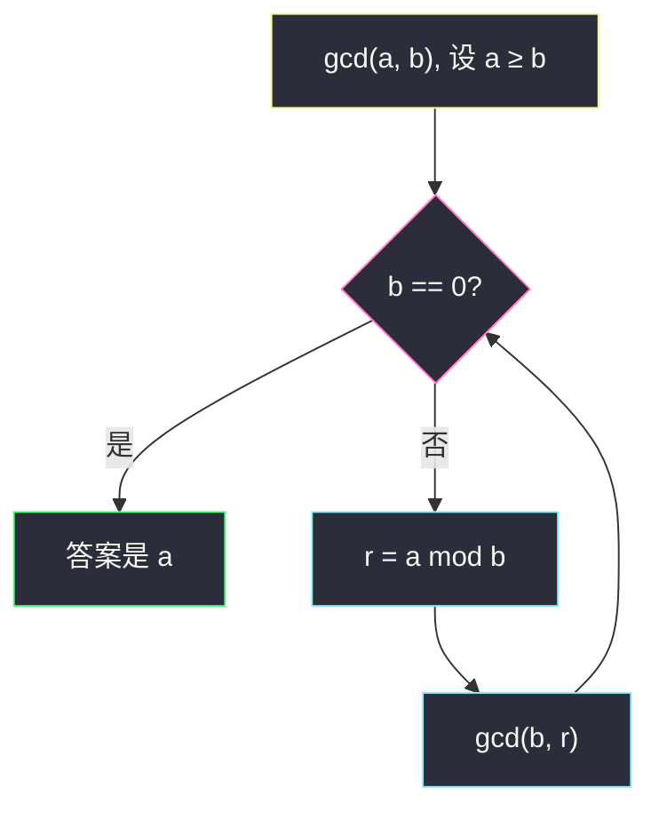
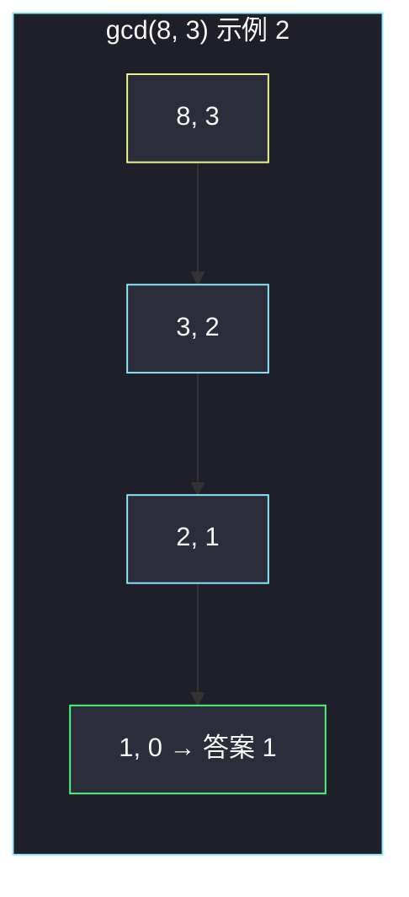

# 找出数组的最大公约数（辗转相除）

## 一、问题描述

给你一个整数数组 `nums`，返回数组中**最小值**与**最大值**的最大公约数（GCD）。

> 🔗 LeetCode 1979：https://leetcode.cn/problems/find-greatest-common-divisor-of-array/
>
> 数据范围：`2 ≤ nums.length ≤ 1000`，`1 ≤ nums[i] ≤ 1000`。
>
> 📚 灵茶题单：**§1.6 最大公约数（GCD）**（1184 分）。只要 `gcd(min, max)`，不必对全体做 gcd。

**示例 1**

```
输入：nums = [2,5,6,9,10]
输出：2
解释：最小是 2，最大是 10，gcd(2, 10) = 2。
```

**示例 2**

```
输入：nums = [7,5,6,8,3]
输出：1
解释：最小是 3，最大是 8，gcd(3, 8) = 1。
```

**直观理解**

题目要的就是「最小那个数」和「最大那个数」的公约数里最大的那个。中间那些数**不参与**这次 gcd。有人会下意识对整个数组求 gcd，那是另一问，答案还可能更小：例如 `[6,10,15]` 里 `gcd(6,15)=3`，但三个数的公约只有 1。

---

## 二、暴力解法

先扫一遍得到 `lo`、`hi`，再从 `lo` 往下试，第一个同时整除两者的就是答案（因为从大往小，第一次命中就是最大的）。

```python
class Solution:
    def findGCD(self, nums: list[int]) -> int:
        lo, hi = min(nums), max(nums)
        for d in range(lo, 0, -1):
            if lo % d == 0 and hi % d == 0:
                return d
        return 1
```

`nums[i] ≤ 1000`，试根最多 1000 次，能过。但没讲清 GCD 是怎么算的，面试期望是辗转相除。

### 🔴 瓶颈在哪里

暴力依赖「枚举约数」。`lo` 很大时线性试除浪费；更关键的是，欧几里得算法用「余数代替原数」把问题规模按对数缩小，才是 §1.6 要练的模板。全体元素的 gcd 也不需要：题目只问两端，扫一遍 min/max 即可。

---

## 三、优化探索（核心章节）

> 📚 本题在灵茶题单中属于 **§1.6 最大公约数（GCD）**。核心就两件事：定位 min/max，再用辗转相除算它们的 gcd。

### 3.1 为什么只看最小和最大

设 `lo = min(nums)`，`hi = max(nums)`。题目定义就是 `gcd(lo, hi)`。

若有人误以为要「数组所有数的 gcd」：记 `g` 为全体 gcd，则 `g` 整除每一个元素，于是 `g | lo` 且 `g | hi`，所以 `g` 整除 `gcd(lo, hi)`，即全体 gcd **≤** `gcd(lo, hi)`。等号不必成立（中间可能少因子）。本题根本不问全体，中间元素可以忽略。

### 3.2 辗转相除

欧几里得：`gcd(a, b) = gcd(b, a mod b)`，直到余数为 0，此时另一个数就是 gcd。

直觉：能同时整除 `a`、`b` 的数，一定能整除 `a - qb`（也就是余数）；反过来，能整除 `b` 和余数的，也能整除 `a = qb + 余数`。公约数集合不变，数字变小。



Python 可直接 `math.gcd`；面试手写循环即可，不必递归。

### 3.3 一句话核心

> **扫一遍取出最小、最大，对这两个数做辗转相除；中间的数不用进 gcd。**

---

## 四、代码实现

### Python（主解：min/max + 辗转相除）

```python
class Solution:
    def findGCD(self, nums: list[int]) -> int:
        lo, hi = min(nums), max(nums)
        while lo:
            hi, lo = lo, hi % lo
        return hi
```

也可以 `from math import gcd` 然后 `return gcd(min(nums), max(nums))`。手写 while 更贴 §1.6。

**变量含义**

| 写法 | 含义 |
|------|------|
| `lo`, `hi` | 当前这一轮的两个数；循环里 `lo` 扮演「较小 / 余数」 |
| `hi % lo` | 余数，下一轮的新 `lo` |
| `lo == 0` | 余数为 0，`hi` 即为 gcd |

循环里交换后不必保证 `hi ≥ lo`：若反了，下一轮 `hi % lo` 会先把大的那份余出来，自动摆正。

---

## 五、具体例子演示

**示例 1**：`nums = [2,5,6,9,10]`。`lo=2`，`hi=10`。

辗转相除逐步：

| 轮 | hi | lo | hi % lo | 下一步 |
|----|----|----|---------|--------|
| 1 | 10 | 2 | 0 | `hi, lo = 2, 0` |
| 结束 | 2 | 0 | — | 返回 2 |

`10 = 5×2 + 0`，2 整除 10，gcd 就是 2。对拍官方输出 2。

也可以看成：2 的约数只有 1 和 2；2 又整除 10，所以最大是 2。

**示例 2**：`nums = [7,5,6,8,3]`。`lo=3`，`hi=8`。

| 轮 | hi | lo | hi % lo | 下一步 |
|----|----|----|---------|--------|
| 1 | 8 | 3 | 2 | `hi, lo = 3, 2` |
| 2 | 3 | 2 | 1 | `hi, lo = 2, 1` |
| 3 | 2 | 1 | 0 | `hi, lo = 1, 0` |
| 结束 | 1 | 0 | — | 返回 1 |

互质。对拍官方输出 1。

**稍长一点的过程**（帮助记住模板，不必出现在本题数据里）：`gcd(48, 18)`。

| 轮 | a | b | a % b |
|----|---|---|-------|
| 1 | 48 | 18 | 12 |
| 2 | 18 | 12 | 6 |
| 3 | 12 | 6 | 0 |

答案 6。每一步数字明显变小，这就是对数级收缩。



**边界**：两个数相等，如 `[4,4]` → `gcd(4,4)=4`；含 1，如 `[1,100]` → 1。`n=2` 时 min/max 就是这两个元素。

---

## 六、复杂度分析

| 方法 | 时间 | 空间 | 说明 |
|------|------|------|------|
| 从 min 往下试除 | `O(n + min)` | `O(1)` | 本题 min ≤ 1000，能过 |
| 对全体辗转相除 | `O(n log U)` | `O(1)` | 答的不是这题 |
| min/max + 辗转相除（主解） | `O(n + log U)` | `O(1)` | 一遍找两端，gcd 极快 |

`U ≤ 1000`。欧几里得最坏大约斐波那契一对，次数仍是 `O(log U)`。

---

## 七、对比总结

| 维度 | 本题 | 全体 gcd | 枚举约数 |
|------|------|----------|----------|
| 参与的数 | 只有 min、max | 每一个 `nums[i]` | min 与 max |
| 典型错误 | 把中间数也 fold 进 gcd | — | 从小往大找，拿到的是最小公约数 |
| 模板 | `gcd(min, max)` | `reduce(gcd, nums)` | `for d in range(lo,0,-1)` |

**易错点**

1. **对全体做 gcd**：`[6,10,15]` 会得到 1，但题目要 `gcd(6,15)=3`。
2. **循环写成 `while hi`**：余数在 `lo` 上，判断 `lo == 0`。
3. **先取模再交换顺序反了**：标准是 `hi, lo = lo, hi % lo`。
4. **空数组 / 单元素**：本题 `n ≥ 2`，但自己测时 `min==max` 要能过。
5. **负数模运算**：本题全是正数；语言若允许负，先取绝对值。

---

## 八、举一反三

| 题目 | 关系 |
|------|------|
| [1071. 字符串的最大公因子](https://leetcode.cn/problems/greatest-common-divisor-of-strings/) | 长度先 gcd，再验证能否整段重复 |
| [914. 卡牌分组](https://leetcode.cn/problems/x-of-a-kind-in-a-deck-of-cards/) | 各数字出现次数的全体 gcd ≥ 2 |
| [365. 水壶问题](https://leetcode.cn/problems/water-and-jug-problem/) | 贝祖：能得到 z 当且仅当 `gcd(x,y)` 整除 z |
| [1979. 本题](https://leetcode.cn/problems/find-greatest-common-divisor-of-array/) | §1.6 入门：定位两个数再 gcd |
| [2543. 判断一个点是否可以到达](https://leetcode.cn/problems/check-if-point-is-reachable/) | 坐标反复除 2 再看 gcd |

**思想迁移**

- 题目写「最小和最大的 GCD」，就不要把数组 fold 一遍。
- 口诀：**「先取出两端，再辗转相除；余数为 0 时另一个就是 gcd。」**
