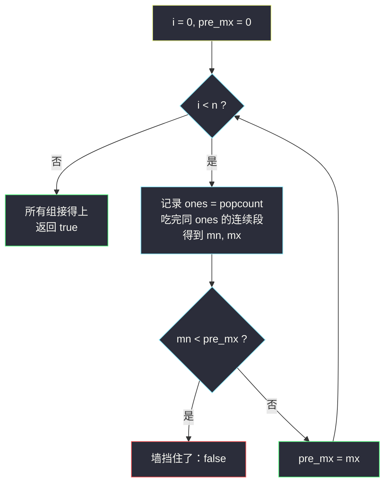
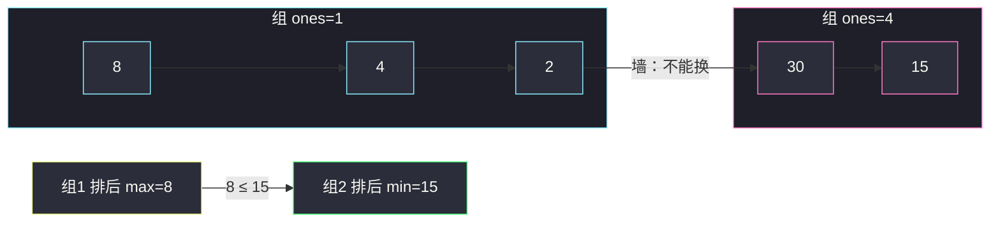

# 判断一个数组是否可以变为有序（分组循环 · 设置位连通块）

## 一、问题描述

给你下标从 0 开始、全是正整数的数组 `nums`。一次操作：如果两个**相邻**元素在二进制下 **1 的个数（设置位 / popcount）相同**，就可以交换它们。可操作任意次（含 0 次）。问能否把数组变成**非降序**。

> 🔗 LeetCode 3011：https://leetcode.cn/problems/find-if-array-can-be-sorted/
>
> 数据范围：`1 <= nums.length <= 100`，`1 <= nums[i] <= 2^8`（n 很小，但分组一遍扫描已是 `O(n)`）。

**示例 1**

```
输入：nums = [8, 4, 2, 30, 15]
输出：true
解释：
8, 4, 2 的二进制分别是 1000、100、10，都只有 1 个 1；
30、15 分别是 11110、1111，都有 4 个 1。
组内可任意交换：先把 [8,4,2] 排成 [2,4,8]，再把 [30,15] 排成 [15,30]，
得到 [2,4,8,15,30]。
```

**示例 2**

```
输入：nums = [1, 2, 3, 4, 5]
输出：true
解释：已经是非降序。
```

**示例 3**

```
输入：nums = [3, 16, 8, 4, 2]
输出：false
解释：3 = 11（两个 1）；后面 16,8,4,2 都只有一个 1。
3 过不去后面那组，而 3 又比组内最小值 2 大，拼起来无法全局非降。
```

**直观理解**

相邻且 popcount 相同才能换，等于：popcount 不同的相邻对是一堵**墙**，墙两边的数永远过不去。墙与墙之间、popcount 相同的连续一段，内部可以用冒泡任意重排。于是问题变成：把数组按 popcount 切成连续段，每段内部排好后，段与段首尾能否接成非降序。本题属于灵神题单 **六、分组循环**。

---

## 二、暴力解法

n ≤ 100，最笨可以按「允许的相邻交换」做 BFS，看能否走到排序后的序列。状态是排列，最坏 `100!`，完全不可用。缩小到「模拟受限冒泡」：从左到右，若 `nums[i] > nums[i+1]` 且 popcount 相同就交换（像冒泡），若逆序但 popcount 不同则失败——多轮之后若有序则成功。

```python
class Solution:
    def canSortArray(self, nums: List[int]) -> bool:
        a = nums[:]
        n = len(a)
        for _ in range(n):                    # 最多 n 轮冒泡
            swapped = False
            for i in range(n - 1):
                if a[i] > a[i + 1]:
                    if a[i].bit_count() != a[i + 1].bit_count():
                        return False          # 墙挡住了必需的交换
                    a[i], a[i + 1] = a[i + 1], a[i]
                    swapped = True
            if not swapped:
                return True
        return True
```

正确性来自：能变成有序 ⇔ 存在一组允许交换把逆序对消掉 ⇔ 受限冒泡能把每个数推到目标位置。

### 复杂度

- **时间**：`O(n^2)` 次比较（冒泡轮数 × n）。本题 n ≤ 100 能过。
- **空间**：`O(n)` 拷贝（可原地）。

### 🔴 瓶颈在哪里

冒泡在重复做「组内排序」。组内排序的**唯一后果**是：这段的最小值会到最左、最大值到最右。组间能否拼接，只取决于「上一组的 max」和「本组的 min」。不必真的交换，扫一遍记下每组 min/max 即可。

---

## 三、优化探索（核心章节）

> 📚 本题在灵茶题单中属于 **六、分组循环**：外层 `while i < n`，内层把「popcount 相同」的连续段吃完；维护 `pre_mx`，若本组 `min < pre_mx` 则无法拼接，返回 `false`，否则 `pre_mx = 本组 max`。

### 3.1 观察特征

| 特征 | 说明 |
|------|------|
| 交换关系 = 相邻 + 同 popcount | 连通块 = **下标连续**且 popcount 相等的一段 |
| 块内可任意排列 | 同 popcount 的相邻交换 = 块内冒泡 |
| 块间不能越墙 | 不同 popcount 的相邻对不能换 |
| 全局非降 | 各块内部排好后，拼接处仍要 `左块 max ≤ 右块 min` |

注意：不是「全局所有 popcount 相同的数都能互换」。`[1, 3, 2]` 里 1 和 2 都是 1 个 1，但中间隔着 popcount=2 的 3，**过不去**。必须按**连续段**切，不能按值域分桶。

### 3.2 判定条件

从左到右处理每一组。设上一组（已排好）的最大值是 `pre_mx`，本组最小值是 `mn`、最大值是 `mx`：

- 若 `mn < pre_mx`：拼接处必逆序，且无法用交换修复 → `false`
- 否则本组排好后右端是 `mx`，令 `pre_mx = mx`，继续

`nums[i] ≥ 1`，`pre_mx` 初值取 `0` 即可（第一组永远通过）。



### 3.3 正确性

- **若返回 true**：每组内部任意排，取升序后，相邻组满足 `pre_max ≤ cur_min`，整段拼接非降，存在操作序列（组内冒泡）。
- **若返回 false**：某组 `min < 上一组 max`。上一组的 max 无论怎么排都在该组右端（组内只能内部换），下一组的 min 无论怎么排都在该组左端，拼接处逆序且隔着墙，无解。

### 3.4 一句话核心

> **按 popcount 切连续段，组内可乱序，组间必须「本组 min ≥ 上一组 max」。**

---

## 四、代码实现

### Python（主解：分组循环）

```python
class Solution:
    def canSortArray(self, nums: List[int]) -> bool:
        n, i, pre_mx = len(nums), 0, 0
        while i < n:
            mn = mx = nums[i]
            ones = nums[i].bit_count()          # 本段设置位数
            i += 1
            while i < n and nums[i].bit_count() == ones:
                mn = min(mn, nums[i])
                mx = max(mx, nums[i])
                i += 1
            if mn < pre_mx:                     # 接不上上一组
                return False
            pre_mx = mx
        return True
```

**变量含义**

| 变量 | 含义 |
|------|------|
| `ones` | 本段每个数的 popcount |
| `mn` / `mx` | 本段最小值 / 最大值 |
| `pre_mx` | 上一组的最大值（排好后的右端） |
| `i` | 下一段段首 |

**循环不变式**：`nums[0..i)` 已按组检查完毕，且这些组各自内部排序后可以拼成非降前缀，该前缀的最大值为 `pre_mx`。

Python 3.10+ 用 `int.bit_count()`；更早版本可写 `bin(x).count("1")`。

### Java

```java
class Solution {
    public boolean canSortArray(int[] nums) {
        int n = nums.length, i = 0, preMx = 0;
        while (i < n) {
            int mn = nums[i], mx = nums[i];
            int ones = Integer.bitCount(nums[i]);
            i++;
            while (i < n && Integer.bitCount(nums[i]) == ones) {
                mn = Math.min(mn, nums[i]);
                mx = Math.max(mx, nums[i]);
                i++;
            }
            if (mn < preMx) return false;
            preMx = mx;
        }
        return true;
    }
}
```

---

## 五、具体例子演示

**示例 1** `nums = [8, 4, 2, 30, 15]`

| 下标 | 值 | 二进制 | popcount |
|------|----|--------|----------|
| 0 | 8 | 1000 | 1 |
| 1 | 4 | 100 | 1 |
| 2 | 2 | 10 | 1 |
| 3 | 30 | 11110 | 4 |
| 4 | 15 | 1111 | 4 |

| 段 | 内容 | ones | mn | mx | 判定 | 更新 pre_mx |
|----|------|------|----|----|------|-------------|
| 1 | [8,4,2] | 1 | 2 | 8 | 2 ≥ 0 | 8 |
| 2 | [30,15] | 4 | 15 | 30 | 15 ≥ 8 | 30 |

两段都过，返回 **true**。组内排成 `[2,4,8]` + `[15,30]`。

**示例 3** `nums = [3, 16, 8, 4, 2]`

| 段 | 内容 | ones | mn | mx | 判定 |
|----|------|------|----|----|------|
| 1 | [3] | 2 | 3 | 3 | 过，pre_mx=3 |
| 2 | [16,8,4,2] | 1 | 2 | 16 | **2 < 3** → false |

3 被墙隔在左边，2 出不去到 3 前面。

**已有序** `[1,2,3,4,5]`：popcount 可能每步都变（1、1、2、1、2），每组长度 1，`mn` 就是自己，单调递增时每次 `mn ≥ pre_mx` 都成立。



---

## 六、复杂度分析

| 方法 | 时间 | 空间 | 说明 |
|------|------|------|------|
| 受限冒泡 | `O(n^2)` | `O(n)` 或 `O(1)` | n ≤ 100 可过 |
| 分组 min/max（主解） | `O(n)` | `O(1)` | 每个元素看一次 popcount |

`bit_count` 对 `≤ 2^8` 的整数是 `O(1)`。

---

## 七、对比总结

| 维度 | 本题 | #2948 交换得到字典序最小数组 | #1356 按 1 的数目排序 |
|------|------|------------------------------|------------------------|
| 能换的条件 | 相邻且 popcount 相同 | `\|a-b\| ≤ limit` 的连通块 | 无（直接自定义排序） |
| 组的定义 | **下标连续**同 popcount | 排序后值域差分连通再映回下标 | 不分组 |
| 组内做什么 | 可任意排，只查与邻组的 min/max | 组内按值排序填回原下标 | — |

**易错点**

1. **按 popcount 全局分桶**：不相邻的同 popcount 不能互换，必须按连续下标切段。
2. **比较方向**：是 `本组 min ≥ 上一组 max`（即 `mn < pre_mx` 则失败），写反成 max/min 会错。
3. **`pre_mx` 要用本组 max 更新**，不是用本组最后一个元素（段内还未排序）。
4. **非降序允许相等**：`mn == pre_mx` 合法，判断写 `<` 不要写成 `<=`。
5. 单元素数组：外层一轮，`mn ≥ 0`，直接 `true`。

**模板（按键切连续段 + 邻段约束）**

```python
i, pre_mx = 0, 0
while i < n:
    mn = mx = nums[i]
    key = nums[i].bit_count()
    i += 1
    while i < n and nums[i].bit_count() == key:
        mn, mx = min(mn, nums[i]), max(mx, nums[i])
        i += 1
    if mn < pre_mx:
        return False
    pre_mx = mx
```

---

## 八、举一反三

| 题目 | 关系 |
|------|------|
| [1356. 根据数字二进制下 1 的数目排序](https://leetcode.cn/problems/sort-integers-by-the-number-of-1-bits/) | 同样看 popcount，但这题**允许任意换位置**，直接排序 |
| [2948. 交换得到字典序最小的数组](https://leetcode.cn/problems/make-lexicographically-smallest-array-by-swapping-elements/) | 「差值 ≤ limit」的连通块内可任意换，组内排序后填回 |
| [777. 在 LR 字符串中交换相邻字符](https://leetcode.cn/problems/swap-adjacent-in-lr-string/) | `XL↔LX`、`RX↔XR`，L/R 不能互相穿过，也是墙 |
| [1502. 判断能否形成等差数列](https://leetcode.cn/problems/can-make-arithmetic-progression-from-sequence/) | 任意重排后的判定（本题是**受限**重排） |
| [2340. 使数组有效的最小相邻交换](https://leetcode.cn/problems/minimum-adjacent-swaps-to-make-a-valid-array/) | 相邻交换次数 = 下标距离，无 popcount 墙 |
| [2038. 如果相邻两个颜色均相同则删除当前颜色](https://leetcode.cn/problems/remove-colored-pieces-if-both-neighbors-are-the-same-color/) | 同批分组循环：连续同色段长决定得分 |

**思想迁移**

- 相邻交换 + 谓词（popcount 相同 / 差值有限）⇒ 先找连通块，再在块内谈排序。
- 问「能否变得有序」往往不需要真正排序，只需要块与块的 min/max 能否衔接。
- 口诀：**「同 1 数才是一块，块内随便排；块间看 min 能不能接住上一块的 max。」**
