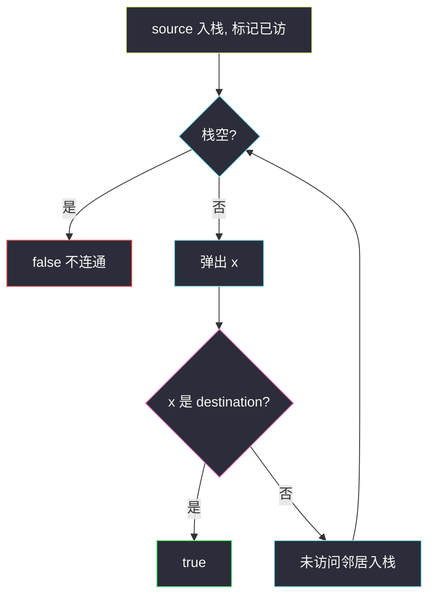

# 寻找图中是否存在路径（邻接表 + DFS）

## 一、问题描述

`n` 个节点编号 `0 .. n-1`，无向边列表 `edges`。问从 `source` 能否走到 `destination`。图不一定连通，可能有多个连通块。

> 🔗 LeetCode 1971：https://leetcode.cn/problems/find-if-path-exists-in-graph/
>
> 数据范围：`1 ≤ n ≤ 2 * 10^5`，`0 ≤ edges.length ≤ 2 * 10^5`。必须 `O(n+m)`。
>
> 📚 灵茶题单：**§1.1 深度优先搜索（DFS）**。

**示例 1**

```
输入：n = 3, edges = [[0,1],[1,2],[2,0]], source = 0, destination = 2
输出：true
```

三个点围成一个三角形，任意两点互通。

**示例 2**

```
输入：n = 6, edges = [[0,1],[0,2],[3,5],[5,4],[4,3]], source = 0, destination = 5
输出：false
```

`0-1-2` 一块，`3-4-5` 一块，从 0 到不了 5。

**直观理解**

无向图连通性：先建邻接表，再从 `source` 走遍能到的点，看有没有 `destination`。`source == destination` 时人已经在终点，直接 `true`（哪怕没有边）。

---

## 二、暴力解法

每次从当前点扫描全部 `edges` 找邻居，再递归。不建图。

```python
from typing import List

class Solution:
    def validPath(self, n: int, edges: List[List[int]], source: int, destination: int) -> bool:
        if source == destination:
            return True
        seen = [False] * n

        def dfs(x: int) -> bool:
            if x == destination:
                return True
            seen[x] = True
            for a, b in edges:
                y = b if a == x else a if b == x else -1
                if y >= 0 and not seen[y] and dfs(y):
                    return True
            return False

        return dfs(source)
```

每走到一个点就扫一遍边表，时间 `O(n · m)`。`n, m` 到 `2e5` 超时。

### 🔴 瓶颈在哪里

邻居查询必须 `O(度)`。预处理邻接表 `O(n+m)`，之后 DFS/BFS/并查集都是线性。

---

## 三、优化探索（核心章节）

> 📚 本题在灵茶题单中属于 **§1.1 深度优先搜索（DFS）**。图论第一问：建图 + 遍历。

### 3.1 建无向图

```python
g = [[] for _ in range(n)]
for a, b in edges:
    g[a].append(b)
    g[b].append(a)
```

每条边写两次。有向题只写一遍，不要混。

### 3.2 遍历



`n` 可达 `2e5`，Python **递归 DFS 会爆栈**。主解用显式栈（仍是 DFS：后入先出）。BFS 换成队列、并查集判是否同一根，结果一样。

入栈时立刻 `seen[y] = True`，避免同一点进栈多次。

### 3.3 一句话核心

> **邻接表存无向边；从 source 走遍连通块，碰到 destination 就 true。**

---

## 四、代码实现

### Python（主解：邻接表 + 迭代 DFS）

```python
from typing import List

class Solution:
    def validPath(self, n: int, edges: List[List[int]], source: int, destination: int) -> bool:
        if source == destination:
            return True
        g = [[] for _ in range(n)]
        for a, b in edges:
            g[a].append(b)
            g[b].append(a)
        seen = [False] * n
        st = [source]
        seen[source] = True
        while st:
            x = st.pop()
            if x == destination:
                return True
            for y in g[x]:
                if not seen[y]:
                    seen[y] = True
                    st.append(y)
        return False
```

并查集也可：每条边 `union`，最后比较 `find(source)` 和 `find(destination)`。连通性题两种都要会。

```python
fa = list(range(n))
def find(x):
    while fa[x] != x:
        fa[x] = fa[fa[x]]
        x = fa[x]
    return x
for a, b in edges:
    fa[find(a)] = find(b)
return find(source) == find(destination)
```

只问「在不在同一块」时并查集更短；要沿边走、输出路径，用 DFS/BFS。本题只问是否，三种都行，题单这一节练 DFS，主解用栈。

---

## 五、具体例子演示

### 示例 1：三角形，`source=0, destination=2`

邻接表：`0: [1,2]`，`1: [0,2]`，`2: [1,0]`。

| 栈（顶在右） | 弹出 | 新入栈 | seen |
|--------------|------|--------|------|
| `[0]` | 0 | 1, 2 | 0,1,2 |
| `[1, 2]` | 2 | — | 碰到终点 |

`true`。若邻居顺序不同，可能先弹 1 再弹 2，一样能到。

### 示例 2：两块，`0 → 5`

```
0 — 1
|
2          3 — 4
           |   |
           5 — +
```

从 0 只能标记 `{0,1,2}`，栈空时没见过 5 → `false`。

`source == destination` 例如 `n=1, edges=[], 0,0`：开头直接 `true`，不要因为没边就判 false。

---

## 六、复杂度分析

| 方法 | 时间 | 空间 | 说明 |
|------|------|------|------|
| 每步扫边表 | `O(n · m)` | `O(n)` | 超时 |
| 邻接表 DFS/BFS（主解） | `O(n+m)` | `O(n+m)` | 每点每边一次 |
| 并查集 | `O(n+m)` 近线性 | `O(n)` | 只问连通、不需要路径 |

---

## 七、对比总结

| 维度 | DFS 栈 | BFS 队列 | 并查集 |
|------|--------|----------|--------|
| 代码 | 和 BFS 只差 pop/popleft | 同 | 先 union 再 find |
| 栈深 | 迭代无递归限制 | 无 | 无 |
| 能还原路径 | 可以记 parent | 更自然 | 只回答是否同块 |

**易错点**

1. **只把边写成单向**：无向图漏了 `g[b].append(a)`，连通性假阴性。
2. **忘了 `source == destination`**：自环/空图会错。
3. **递归 DFS**：`n=2e5` 链状图 Python 必爆栈。
4. **不标记就入栈**：星形图同一点进队指数次。

---

## 八、举一反三

| 题目 | 关系 |
|------|------|
| [547. 省份数量](https://leetcode.cn/problems/number-of-provinces/) | 连通块个数，DFS / 并查集 |
| [200. 岛屿数量](https://leetcode.cn/problems/number-of-islands/) | 网格上的连通块 |
| [841. 钥匙和房间](https://leetcode.cn/problems/keys-and-rooms/) | 有向图从 0 出发能否访完 |
| [323. 无向图中连通分量的数目](https://leetcode.cn/problems/number-of-connected-components-in-an-undirected-graph/) | 1971 改成计数 |

**思想迁移**

- 图论题第一行几乎总是：`g = [[] for _ in range(n)]` 再灌边。
- 口诀：**「先建邻接表；source 等于 destination 直接 true；迭代遍历防爆栈。」**
