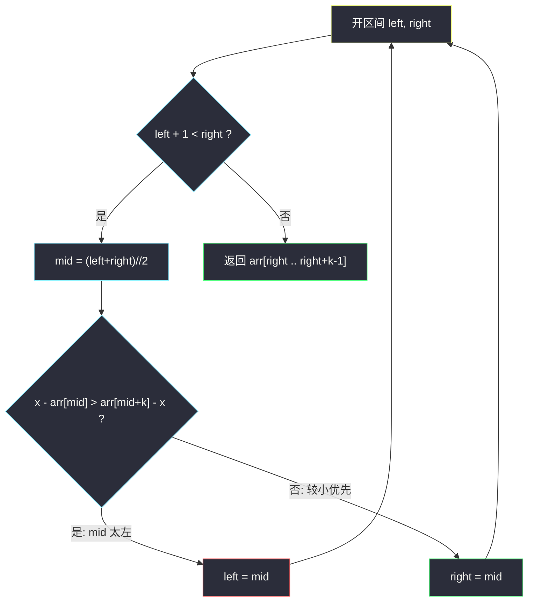
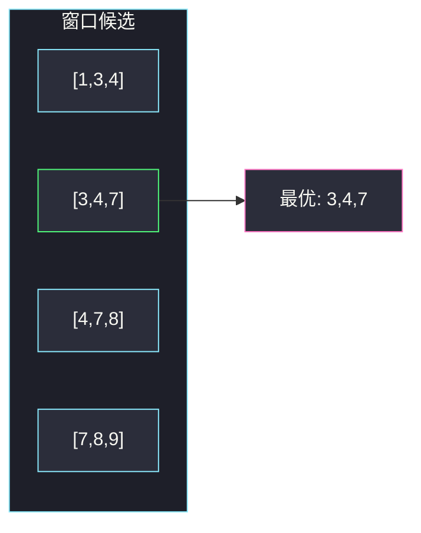

# 找到 K 个最接近的元素（二分窗口左端点）

## 一、问题描述

给定一个**升序**排序的整数数组 `arr`、两个整数 `k` 和 `x`。从 `arr` 中找出最接近 `x` 的 `k` 个数，按**升序**返回。

「接近」用绝对距离 `|a - x|`。距离相同则**较小的数优先**。

> 🔗 LeetCode 658：https://leetcode.cn/problems/find-k-closest-elements/
>
> 数据范围：`1 <= k <= arr.length <= 10^4`，`arr` 已按升序排好，`arr[i]`、`x` 在 `[-10^4, 10^4]`。

**示例 1**

```
输入：arr = [1,2,3,4,5], k = 4, x = 3
输出：[1,2,3,4]
```

**示例 2**

```
输入：arr = [1,2,3,4,5], k = 4, x = -1
输出：[1,2,3,4]
解释：x 在数组左侧外，最接近的 4 个数就是最左边一段。
```

**示例 3**

```
输入：arr = [1,3,4,7,8,9], k = 3, x = 5
输出：[3,4,7]
解释：与 5 的距离分别是 4,2,1,2,3,4。最近的三个是 4（距 1）、3 与 7（距 2 相同取较小的 3）。
```

**直观理解**

数组有序，所以「离 x 最近的 k 个数」一定是一段**长度为 k 的连续窗口**，不会出现「跳过中间、左右各抓几个」——跳过中间等于丢掉更近的、留下更远的。于是问题变成：在所有长度为 k 的窗口里，选出那一段最接近 x 的。返回时窗口本身已升序，直接切片即可。

---

## 二、暴力解法

每个长度为 k 的窗口都算一遍「与 x 的接近程度」，再取最优窗口。比较两个窗口时：先比「距离更大的那一端谁更离谱」，相等则取更靠左的（较小优先）。

更直白的暴力：把所有数按 `(abs(a-x), a)` 排序，取前 k 个再按值排序。

```python
class Solution:
    def findClosestElements(self, arr: List[int], k: int, x: int) -> List[int]:
        picked = sorted(arr, key=lambda a: (abs(a - x), a))[:k]
        return sorted(picked)
```

### 复杂度

- **时间**：`O(n log n)`（全数组排序）。
- **空间**：`O(n)` 存排序后的副本。

`n = 10^4` 能过，但没用上「已有序」，也没有把答案收成「一段窗口」的结构。

### 🔴 瓶颈在哪里

有序数组里长度为 k 的窗口只有 `n - k + 1` 个，相邻窗口只差两端各一个元素。最优窗口的左端点随 x 单调变化——这是二分的信号。暴力排序把已经排好的结构拆掉再排，多付了不必要的 `log n`，也没练到本题的二分模板。

---

## 三、优化探索（核心章节）

> 📚 本题在灵茶题单中属于 **01-滑动窗口与双指针 · §1.2 进阶**。定长窗口的左端点可以用二分定位，不必每个窗口都扫一遍。

本文二分**全程采用开区间 `(left, right)`**：循环条件 `left + 1 < right`，`mid = (left + right) // 2`，更新只写 `left = mid` 或 `right = mid`，结束时 `right` 就是答案左端点。

### 3.1 为什么答案是连续 k 段

设最优集合不是连续段，则中间有个 `arr[j]` 没被选、两侧都有被选的数。把更远的那一侧换成 `arr[j]`，距离不会变差（有序 + 三角关系）。因此最优解可收缩成 `arr[i .. i+k-1]`。

### 3.2 二分的对象是左端点

合法左端点 `i ∈ [0, n-k]`。窗口 `arr[i .. i+k-1]` 与右边紧挨着的下一个窗口 `arr[i+1 .. i+k]` 相比，只差 `arr[i]` 和 `arr[i+k]`：

- 若 `x - arr[mid] > arr[mid+k] - x`，说明 `arr[mid]` 比窗口右侧外面那个数离 x **更远**，左端点太小，应往右：`left = mid`；
- 否则（更近，或距离相等），按题目「较小优先」，应丢掉右边那个更大的数，左端点可以是 `mid` 或更左：`right = mid`。

距离相等时走 `right = mid`，不会把窗口右移——这正是「相同距离取较小」。



### 3.3 开区间边界：`right` 初值必须是 `n-k`

候选左端点是 `0 .. n-k`。若写成 `(left, right) = (-1, n-k+1)`，`mid` 可能取到 `n-k`，此时 `arr[mid+k] = arr[n]` **越界**。

正确：`left, right = -1, n-k`。循环里 `mid` 永远 `< right ≤ n-k`，故 `mid+k ≤ n-1`。循环结束 `right` 可以等于 `n-k`（最优窗口贴在数组最右），但那时已经不再访问 `arr[mid+k]`。

`k = n` 时 `n-k = 0`，`left+1 < right` 一开始就不成立，直接返回整段，正确。

### 3.4 另一条路：先插 x 再两边扩

二分 `x` 的插入位置 `p`（第一个 `≥ x` 的下标），然后双指针从 `p-1` 与 `p` 向两侧扩 k 次，每次选距离更近的一侧（相等取左）。扩完窗口下标 `[L+1, R-1]` 已有序，直接切片。时间同样 `O(log n + k)`，但要单独处理「某一侧先耗尽」。主解用左端点二分，边界更少。

```python
# 思路对照，非正式主解
p = bisect.bisect_left(arr, x)
L, R = p - 1, p
need = k
while need:
    if L < 0:
        R += 1
    elif R >= n or x - arr[L] <= arr[R] - x:
        L -= 1
    else:
        R += 1
    need -= 1
# 答案为 arr[L+1:R]
```

`x - arr[L] <= arr[R] - x` 里的 `<=` 同样落实「相等取左」。

### 3.5 一句话核心

> **有序数组的 k 个最近数 = 长度为 k 的窗口；比较 `arr[mid]` 与 `arr[mid+k]` 谁离 x 更远，远的那侧从窗口里踢掉。开区间二分左端点，相等时不右移。**

---

## 四、代码实现

### Python（主解：二分窗口左端点）

```python
class Solution:
    def findClosestElements(self, arr: List[int], k: int, x: int) -> List[int]:
        n = len(arr)
        left, right = -1, n - k            # 开区间 (left, right)，答案左端点 ∈ [0, n-k]
        while left + 1 < right:
            mid = (left + right) // 2
            if x - arr[mid] > arr[mid + k] - x:
                left = mid                 # mid 这一端更远，窗口右移
            else:
                right = mid                 # 含「距离相等取较小」
        return arr[right:right + k]
```

**变量含义**

| 变量 | 含义 |
|------|------|
| `left`, `right` | 开区间两端，循环不变量：最优左端点 ∈ `(left, right]` 最终落到 `right` |
| `mid` | 当前试探的窗口左端点 |
| `arr[mid+k]` | 当前窗口**右侧外面**的第一个数，用来决定要不要右移一格 |

**循环不变量**：`(left, right]` 内始终包含最优左端点；`mid+k` 下标合法。相等时 `right = mid` 保证不把更小的数挤出窗口。

为何比较不用绝对值：窗口在有序数组上滑动，`arr[mid] ≤ arr[mid+k]` 恒成立。`x - arr[mid]` 是「左端点在 x 左边多远」（x 在更左时为负），`arr[mid+k] - x` 是「右外侧在 x 右边多远」。直接比这两个有向距离，等价于判断「丢掉左端、纳入右外侧」会不会更优。

### Java（最优解同款）

```java
class Solution {
    public List<Integer> findClosestElements(int[] arr, int k, int x) {
        int n = arr.length;
        int left = -1, right = n - k;
        while (left + 1 < right) {
            int mid = left + (right - left) / 2;
            if (x - arr[mid] > arr[mid + k] - x) {
                left = mid;
            } else {
                right = mid;
            }
        }
        List<Integer> ans = new ArrayList<>(k);
        for (int i = right; i < right + k; i++) ans.add(arr[i]);
        return ans;
    }
}
```

---

## 五、具体例子演示

以示例 3：`arr = [1,3,4,7,8,9]`，`k = 3`，`x = 5`。候选左端点 `0,1,2,3`，开区间 `(-1, 3)`。

| 轮 | left | right | mid | arr[mid] | arr[mid+k] | x-arr[mid] | arr[mid+k]-x | 比较 | 新区间 |
|----|------|-------|-----|----------|------------|------------|--------------|------|--------|
| 1 | -1 | 3 | 1 | 3 | 8 | 2 | 3 | 2>3？否 | `(-1, 1)` |
| 2 | -1 | 1 | 0 | 1 | 7 | 4 | 2 | 4>2？是 | `(0, 1)` |
| 结束 | 0 | 1 | — | — | — | — | — | `left+1==right` | 左端点 `right=1` |

窗口 `arr[1..3] = [3,4,7]` ✓。

**贴左（示例 2）**：`arr = [1,2,3,4,5]`，`k = 4`，`x = -1`。`n-k=1`，开区间 `(-1,1)`。

| 轮 | left | right | mid | x-arr[mid] | arr[mid+k]-x | 比较 | 新区间 |
|----|------|-------|-----|------------|--------------|------|--------|
| 1 | -1 | 1 | 0 | -1-1=-2 | 5-(-1)=6 | -2>6？否 | `(-1, 0)` |
| 结束 | -1 | 0 | — | — | — | — | 左端点 0 |

返回 `[1,2,3,4]` ✓。注意这里 `x` 比 `arr[0]` 还小，`x-arr[mid]` 为负，**不要用绝对值**，否则会误判成该右移。

**贴右**：同一数组 `k=4`，`x=6`。`mid=0`：`6-1=5`，`5-6=-1`，`5>-1`，`left=0`，结束 `right=1`，返回 `[2,3,4,5]` ✓。

**示例 1**：`[1,2,3,4,5]`，`k=4`，`x=3`。`(-1,1)`，`mid=0`：`3-1=2`，`5-3=2`，`2>2` 为假（相等不右移），`right=0`，窗口 `[1,2,3,4]` ✓。若误写成 `>=`，会把窗口右移成 `[2,3,4,5]`，丢掉更小的 1，错。



---

## 六、复杂度分析

| 方法 | 时间 | 空间 | 说明 |
|------|------|------|------|
| 按距离全排序 | `O(n log n)` | `O(n)` | 没利用有序 |
| 枚举每个窗口再比 | `O((n-k)·k)` | `O(k)` | k 大时差 |
| 插入点 + 双指针扩 | `O(log n + k)` | `O(k)` 答案 | 边界分叉多 |
| 二分左端点（主解） | `O(log(n-k) + k)` | `O(k)` 答案 | 切片即有序 |

---

## 七、对比总结

| 维度 | 按距离排序 | 二分左端点 |
|------|------------|------------|
| 有序性 | 拆掉再排 | 当作窗口尺子 |
| 返回顺序 | 还要再 sort 一次 | 切片已升序 |
| 相等距离 | 排序 key 第二维 | `>` 不走 `>=`，相等不右移 |

**易错点**

1. **用 `abs` 比较两端**：`x - arr[mid]` 与 `arr[mid+k] - x` 已经带符号地表示「左端偏左多少、右外侧偏右多少」，不要写成两个绝对值再比——相等规则会乱。
2. **`right` 初值写成 `n-k+1`**：`arr[mid+k]` 越界。
3. **循环写成 `left < right` 却 `right = mid-1`**：开闭混用，答案会偏一格。本文只做 `left=mid` / `right=mid`。
4. **返回前再 sort**：窗口本身有序，多此一举还可能掩盖下标错误。
5. **`k = n`**：区间空，直接整段返回，不要进循环去读 `arr[k]`。

**模板（开区间 · 定长窗口左端点）**

```python
left, right = -1, n - k
while left + 1 < right:
    mid = (left + right) // 2
    if x - arr[mid] > arr[mid + k] - x:
        left = mid
    else:
        right = mid
return arr[right:right + k]
```

---

## 八、举一反三

| 题目 | 关系 |
|------|------|
| [34. 在排序数组中查找元素的第一个和最后一个位置](https://leetcode.cn/problems/find-first-and-last-position-of-element-in-sorted-array/) | 同一套开区间，找第一个 / 最后一个满足条件的下标 |
| [209. 长度最小的子数组](https://leetcode.cn/problems/minimum-size-subarray-sum/) | 有序前缀上二分窗口长度；或双指针 |
| [719. 找出第 K 小的数对距离](https://leetcode.cn/problems/find-k-th-smallest-pair-distance/) | 有序数组 + 二分答案，check 用双指针计数 |
| [378. 有序矩阵中第 K 小的元素](https://leetcode.cn/problems/kth-smallest-element-in-a-sorted-matrix/) | 二分值域，利用每行有序计数 |
| [162. 寻找峰值](https://leetcode.cn/problems/find-peak-element/) | 有序性换成「单峰」，比较邻居决定收缩方向 |
| [33. 搜索旋转排序数组](https://leetcode.cn/problems/search-in-rotated-sorted-array/) | 同样一次比较丢掉半边，条件换成哪一段有序 |
| [4. 寻找两个正序数组的中位数](https://leetcode.cn/problems/median-of-two-sorted-arrays/) | 在有序数组上二分切割点，思想同「二分一个边界」 |

**思想迁移**

- 有序 + 定长 k → 先承认答案是一段窗口，再二分**左端点**，不要对每个元素单独排名。
- 比较窗口内外交界的两个数，等于用 `O(1)` 判断「左端该不该加一」，这是 §1.2 把滑窗和二分接起来的典型手法。
- 插入点 + 两边扩适合讲「从 x 附近长出来」；左端点二分适合讲「尺子在轴上滑」。两者答案相同。
- 口诀：**「k 段连续；比 mid 与 mid+k；更远就右移，相等不右移。」**
