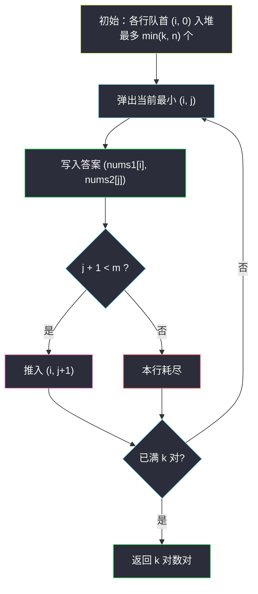
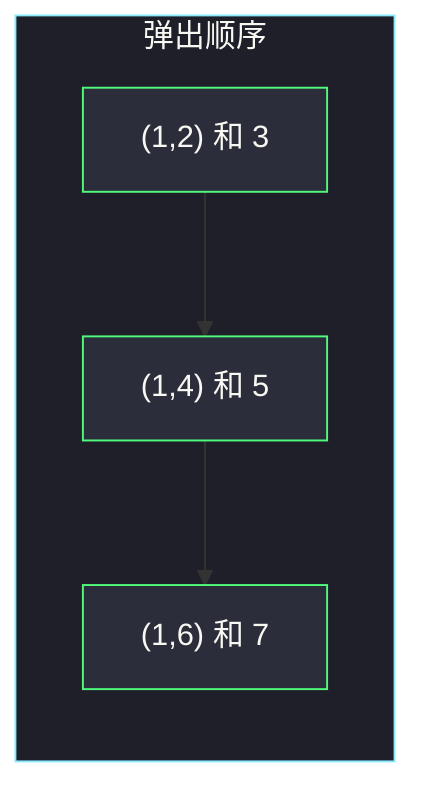
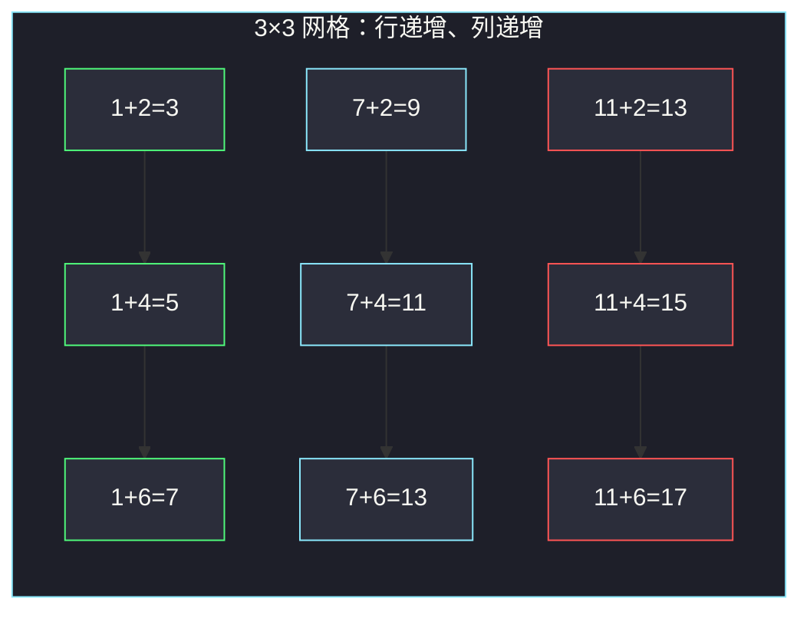

# 查找和最小的 K 对数字（多路归并 · 最小堆）

## 一、问题描述

给定两个**升序**整数数组 `nums1`、`nums2` 和一个整数 `k`，定义一对值 `(u, v)`，其中 `u` 来自 `nums1`，`v` 来自 `nums2`。请找出和最小的 `k` 个数对 `(u1, v1)`、`(u2, v2)` … `(uk, vk)`。返回的数对可以按任意顺序。

> 🔗 LeetCode 373：https://leetcode.cn/problems/find-k-pairs-with-smallest-sums/
>
> 数据范围：`1 <= nums1.length, nums2.length <= 10^5`，`-10^9 <= nums[i] <= 10^9`，`1 <= k <= 10^4`。两数组均非递减。`k` 可能小于 `n * m`，也可能大到等于全部数对个数（此时返回全部）。

**示例 1**

```
输入：nums1 = [1,7,11], nums2 = [2,4,6], k = 3
输出：[[1,2],[1,4],[1,6]]
解释：所有数对和为 3、5、7、9、11、13、13、15、17。最小的三对是 (1,2)、(1,4)、(1,6)。
```

**示例 2**

```
输入：nums1 = [1,1,2], nums2 = [1,2,3], k = 2
输出：[[1,1],[1,1]]
解释：两对 (1,1) 分别来自 nums1 的两个 1。
```

**直观理解**

数对全体构成一张 `n × m` 的网格，格子 `(i, j)` 的值是 `nums1[i] + nums2[j]`。因为两数组都升序，每一行、每一列都递增。要前 k 小，不必生成全部 `n·m` 个格子（`10^10` 量级），只要像「合并 n 条有序链表」那样，用最小堆每次弹出当前最小，再把同一行的下一个推进来。

---

## 二、暴力解法

枚举全部数对，按和排序，取前 k 个：

```python
class Solution:
    def kSmallestPairs(self, nums1: List[int], nums2: List[int], k: int) -> List[List[int]]:
        pairs = [[u, v] for u in nums1 for v in nums2]
        pairs.sort(key=lambda p: p[0] + p[1])
        return pairs[:k]
```

### 复杂度

- **时间**：`O(nm log(nm))`。`n、m` 达 `10^5` 时根本建不出这张表。
- **空间**：`O(nm)`。

### 🔴 瓶颈在哪里

`k ≤ 10^4`，真正需要的只有 k 对。网格右下角那些大和永远进不了答案，生成它们纯属浪费。利用「每行递增」，最小堆维护「每行当前队首」，弹出 k 次即可。

---

## 三、优化探索（核心章节）

> 📚 本题在灵茶题单中属于 **二分算法 · §2.6 第 K 小/大**。第 K 小既可二分答案，也可用堆做多路归并。输出要的是**具体 k 对数对**，堆更直给、更好讲，作主解；文末补一句二分第 K 小。

### 3.1 网格与 n 条有序链

固定 `i`，让 `j = 0, 1, 2, …`，得到第 `i` 行：

```
(nums1[i] + nums2[0]) ≤ (nums1[i] + nums2[1]) ≤ …
```

共 `n` 行有序链。全局第 k 小 = 这 n 路归并时第 k 次弹出的元素。和「合并 k 个有序链表」同一骨架，只是这里是 n 路、只要前 k 个。

### 3.2 堆里放什么、弹出后扩谁

堆元素写成 `(和, i, j)`，表示数对 `(nums1[i], nums2[j])`。初始只把每行队首 `(i, 0)` 入堆——而且最多放 `min(k, n)` 行：第 k 行以后的队首已经不可能挤进前 k（前面至少已有 k 个更小或等可能的队首）。

弹出 `(s, i, j)` 后，同一行的下一个 `(i, j+1)` 入堆（若 `j+1 < m`）。不需要把 `(i+1, j)` 再塞一遍：那一行若该进堆，要么已在初始队首里，要么会从它自己的链上推进来。



### 3.3 为什么不会漏、不会重复

- **不漏**：任意 `(i, j)`（`j > 0`）入堆的前提是 `(i, j-1)` 已弹出。而 `(i, 0)` 一开始就在堆里（或因行号 ≥ k 被裁掉——那一行全体都不可能进入前 k）。弹出顺序按和升序，所以第 t 次弹出就是全局第 t 小。
- **不重复**：每个 `(i, j)` 至多从 `(i, j-1)` 扩展一次。

`k` 可能小于 `n·m`：循环条件是 `堆非空且答案不足 k`，不会去生成剩余数对。

为何第 `k` 行及以后的队首进不了前 k：`nums1` 升序，第 `i` 行队首 `nums1[i]+nums2[0]` 不小于前 `i` 个队首。已经有 k 个更靠前的行在抢前 k 名，后面的行全体（每个元素都 ≥ 自己的队首）都排在这 k 个队首之后。

### 3.4 也可二分答案（§2.6 正统）

「和 ≤ mid 的数对个数」关于 `mid` **单调不减**（左少右多）。左闭右开求最小的 `mid` 使得个数 `≥ k`，这个 `mid` 就是第 k 小的和：

```
count(mid) = Σ_i  bisect_right(nums2, mid - nums1[i])
check(mid) = count(mid) ≥ k     # 左假右真，求最小 mid
```

求出第 k 小的和之后，还得再扫一遍把所有和更小的对收齐，余下用「和恰好等于它」的补到 k 个——**只要值**时二分很干净，**要具体 k 对**时收集阶段比堆啰嗦。本题 `k ≤ 10^4`，堆弹出即得对象，作主解。

### 3.5 一句话核心

> **n 行递增链做 k 路归并：堆里扔各行队首，弹出就输出，再把该行下一个塞回去；最多弹 k 次。**

---

## 四、代码实现

### Python（主解：最小堆）

```python
import heapq

class Solution:
    def kSmallestPairs(self, nums1: List[int], nums2: List[int], k: int) -> List[List[int]]:
        n, m = len(nums1), len(nums2)
        h = [(nums1[i] + nums2[0], i, 0) for i in range(min(k, n))]
        heapq.heapify(h)
        ans = []
        while h and len(ans) < k:
            s, i, j = heapq.heappop(h)
            ans.append([nums1[i], nums2[j]])
            if j + 1 < m:
                heapq.heappush(h, (nums1[i] + nums2[j + 1], i, j + 1))
        return ans
```

**变量含义**

| 变量 | 含义 |
|------|------|
| `h` | 最小堆，元素 `(和, i, j)` |
| `i`, `j` | 当前数对在两数组中的下标 |
| `min(k, n)` | 初始只丢前 k 行的队首，避免 `n = 10^5`、`k = 10^4` 时堆被撑爆 |
| `ans` | 已弹出的数对，长度达到 k 停止 |

**不变式**：堆中每个 `i` 至多一个待处理下标 `j`，且是该行尚未输出的最小者。

### Java（最优解同款）

```java
class Solution {
    public List<List<Integer>> kSmallestPairs(int[] nums1, int[] nums2, int k) {
        int n = nums1.length, m = nums2.length;
        PriorityQueue<int[]> pq = new PriorityQueue<>(
            (a, b) -> Integer.compare(a[0], b[0]));   // {和, i, j}
        int rows = Math.min(k, n);
        for (int i = 0; i < rows; i++) {
            pq.offer(new int[]{nums1[i] + nums2[0], i, 0});
        }
        List<List<Integer>> ans = new ArrayList<>();
        while (!pq.isEmpty() && ans.size() < k) {
            int[] cur = pq.poll();
            int i = cur[1], j = cur[2];
            ans.add(Arrays.asList(nums1[i], nums2[j]));
            if (j + 1 < m) {
                pq.offer(new int[]{nums1[i] + nums2[j + 1], i, j + 1});
            }
        }
        return ans;
    }
}
```

Java 比较器用 `Integer.compare`，两数之和可能是 `-2·10^9`，相减会溢出。

---

## 五、具体例子演示

以示例 1：`nums1 = [1,7,11]`，`nums2 = [2,4,6]`，`k = 3`。初始堆（三行队首）：

`(1+2, i=0, j=0)`、`(7+2, 1, 0)`、`(11+2, 2, 0)` → 堆顶和为 3。

| 步 | 弹出 (i,j) 和 | 写入 | 推入 | 堆内 (和,i,j) |
|----|----------------|------|------|----------------|
| 1 | (0,0) 和 3 | `[1,2]` | (0,1) 和 5 | (5,0,1), (9,1,0), (13,2,0) |
| 2 | (0,1) 和 5 | `[1,4]` | (0,2) 和 7 | (7,0,2), (9,1,0), (13,2,0) |
| 3 | (0,2) 和 7 | `[1,6]` | 本行结束 | — |

已满 3 对，停止。答案 `[[1,2],[1,4],[1,6]]` ✓。后面的 `(7,4)` 和为 11，从未入选。

示例 2：`nums1 = [1,1,2]`，`nums2 = [1,2,3]`，`k = 2`。初始三行队首：

| 步 | 弹出 (i,j) 和 | 写入 | 推入 | 堆内剩余 |
|----|----------------|------|------|----------|
| 1 | (0,0) 和 2 | `[1,1]` | (0,1) 和 3 | (2,1,0), (3,0,1), (3,2,0) |
| 2 | (1,0) 和 2 | `[1,1]` | (1,1) 和 3 | — 已满 k |

两个 `(1,1)` 来自 `nums1` 里两个不同的 1，不是同一格子弹了两遍。





绿格是弹出的前 3 对，红格从未入选。若 `k` 大于 `n·m`（例如两数组各长 2、`k = 10`），堆空了循环结束，返回全部 4 对，不会越界。

---

## 六、复杂度分析

| 方法 | 时间 | 空间 | 说明 |
|------|------|------|------|
| 枚举全部再排序 | `O(nm log(nm))` | `O(nm)` | 空间时间都炸 |
| 最小堆多路归并（主解） | `O(k log min(k, n))` | `O(min(k, n))` | 弹出/推入各 ≤ k 次 |
| 二分第 k 小的和再收集 | `O((n log m) log RANGE)` | `O(k)` | RANGE 为和的值域；收集阶段额外扫 |

堆的对数底是堆大小，初始 `min(k, n)`，过程中也不会超过这个量级（弹出一个最多推一个）。

---

## 七、对比总结

| 维度 | 暴力 | 堆归并 | 二分答案 |
|------|------|--------|----------|
| 要具体数对 | 自然得到 | 弹出即得 | 先定位第 k 小的和，再筛 |
| `k ≪ n·m` | 仍生成全部 | 只走 k 步 | 与 k 几乎无关 |
| 本题约束 | 不可行 | **首选** | 能过，代码更长 |

**易错点**

1. **初始把 `n·m` 个队首都丢进去**：只有 n 个 `(i,0)`；再限制 `min(k,n)`，否则 `n=10^5` 会 TLE / MLE。
2. **弹出后把 `(i+1, j)` 和 `(i, j+1)` 都推**：会重复访问同一格子。只沿 j 方向走，i 方向靠初始队首覆盖。
3. **`k` 大于数对总数**：用 `while h and len(ans) < k`，堆空即停。
4. **Java 用 `a[0] - b[0]` 比较**：和可能溢出，改 `Integer.compare`。
5. **忘记两数组已排序**：堆正确性依赖每行递增；若无序，这套归并不成立。

**模板（n 路有序链取前 k）**

```python
h = [(row[i][0], i, 0) for i in range(min(k, n))]
heapq.heapify(h)
while h and len(ans) < k:
    s, i, j = heapq.heappop(h)
    ans.append(pair)
    if j + 1 < len(row[i]):
        heapq.heappush(h, (row[i][j + 1], i, j + 1))
```

---

## 八、举一反三

| 题目 | 关系 |
|------|------|
| [23. 合并 K 个升序链表](https://leetcode.cn/problems/merge-k-sorted-lists/) | 同一套 k 路堆归并，链在链表上而不是数组行 |
| [378. 有序矩阵中第 K 小的元素](https://leetcode.cn/problems/kth-smallest-element-in-a-sorted-matrix/) | 行、列都递增的网格第 k 小；可堆可二分答案 |
| [786. 第 K 个最小的素数分数](https://leetcode.cn/problems/k-th-smallest-prime-fraction/) | 同样「网格第 k 小」，分数替代和 |
| [719. 找出第 K 小的数对距离](https://leetcode.cn/problems/find-k-th-smallest-pair-distance/) | §2.6 二分答案：只问第 k 小的值，不输出数对 |
| [264. 丑数 II](https://leetcode.cn/problems/ugly-number-ii/) | 多指针生成第 k 小，思想同多路归并 |
| [2386. 找出数组的第 K 大和](https://leetcode.cn/problems/find-the-k-sum-of-an-array/) | 堆扩展到子集和的第 k 大，同一套「弹出再扩邻居」 |
| [167. 两数之和 II - 输入有序数组](https://leetcode.cn/problems/two-sum-ii-input-array-is-sorted/) | 两有序数组上的双指针，只要一对而非前 k 对 |

**思想迁移**

- 「第 k 小」若只要**值**：二分答案 + 计数（§2.6 正统）。若要**具体对象**：堆 / 多路归并更直接。本题输出数对，所以堆当主解、二分当备选。
- 二维递增网格 = n 条有序链；初始只放每条链的头，弹出再续下一个，切忌把整张表塞进堆，也切忌弹出后往两个方向同时扩展（会重复）。
- `k` 与 `n·m` 谁小谁说了算：循环以「堆空或已满 k」双刹车，两种边界都不用特判。
- 口诀：**「每行一条链，队首进小根堆；弹出写答案，同行下一个再排队。」**
