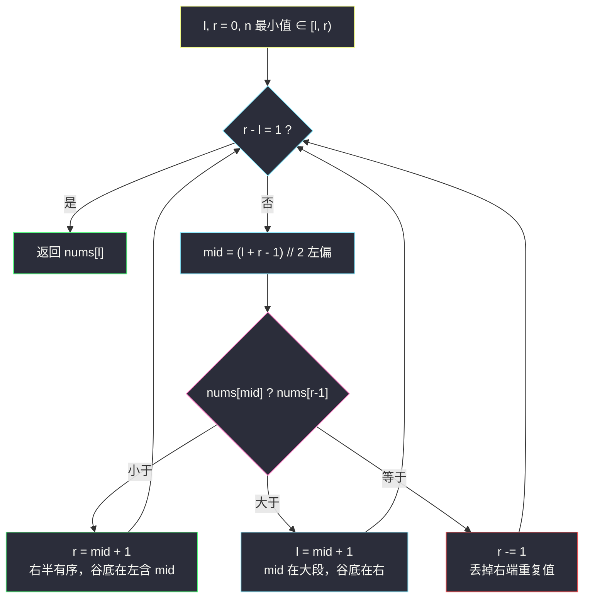
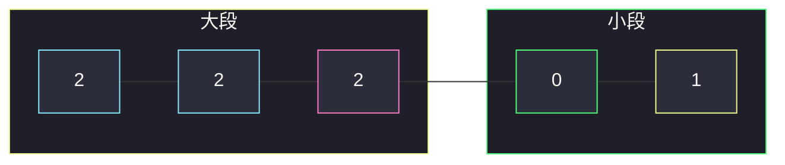
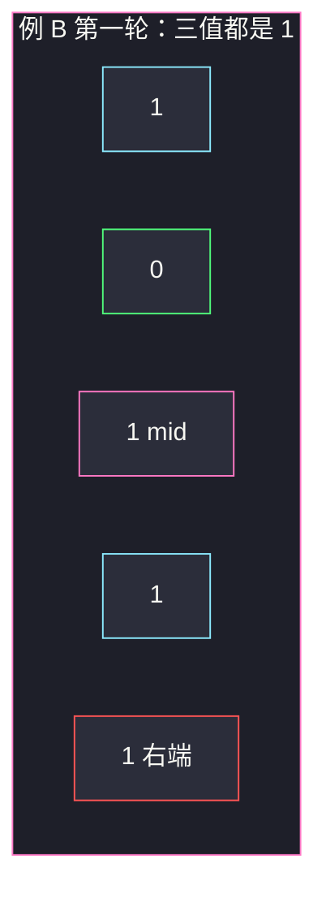

# 寻找旋转排序数组中的最小值 II（含重复 · 与右端比较）

## 一、问题描述

已知一个长度为 n 的数组，原先按**非降序**排列，然后在某个下标处做了未知旋转（例如 `[0,1,1,2,2]` 变成 `[1,2,2,0,1]`）。数组**可能含重复元素**。请找出旋转后数组里的**最小值**。要求尽量用低于线性的时间，但最坏可以是线性。

> 🔗 LeetCode 154：https://leetcode.cn/problems/find-minimum-in-rotated-sorted-array-ii/
>
> 数据范围：`n == nums.length`，`1 <= n <= 5000`，`-5000 <= nums[i] <= 5000`。进阶：尽可能优于 `O(n)`。
>
> 📚 灵茶题单：**二分算法 · 四、其他**（与 #81 / #153 同类）。

**示例 1（无重复，退化为 #153）**

```
输入：nums = [1,3,5]
输出：1
解释：旋转 0 次，最小值在左端。
```

**示例 2（重复，最小值在中后段）**

```
输入：nums = [2,2,2,0,1]
输出：0
解释：原数组 [0,1,2,2,2] 旋转后，断点落在 2 与 0 之间。
```

**示例 3（重复最小值贴在两端）**

```
输入：nums = [0,1,1,0]
输出：0
解释：原数组 [0,0,1,1] 旋转一次，两个 0 分别在开头和末尾。只看一端会漏。
```

**直观理解**

旋转后仍是「一段大的 + 一段小的」拼在一起。无重复时，拿中点跟右端比大小，一定能扔掉一半。有重复时，中点可能和右端**相等**，这一刻无法判断最小值在左还是在右，只能丢掉右端一个元素，最坏退化成 `O(n)`。本题要写透的就是这一支。

---

## 二、暴力解法

扫一遍取最小：

```python
class Solution:
    def findMin(self, nums: List[int]) -> int:
        return min(nums)
```

### 复杂度

- **时间**：`O(n)`。
- **空间**：`O(1)`。

`n ≤ 5000` 必过。本题意义是弄清：**有重复时旋转二分为什么会退化、三值相等时该丢哪一侧、和 #153 只差在哪一行。**

### 🔴 瓶颈在哪里

无重复时每轮都能扔掉一半，`O(log n)`。有重复时存在「中点 = 右端」的死角，那一轮只能扔掉 1 个元素。平均仍很快；全是相同数字时，不看完无法确定最小值有没有更小的（其实全相同则任意元素都是答案，但算法在相等时只能收缩，仍要走到只剩一个）。题目允许这个下界。

---

## 三、优化探索（核心章节）

> 📚 本题在灵茶题单中属于 **二分算法 · 四、其他**，是 [#153 寻找旋转排序数组中的最小值](https://leetcode.cn/problems/find-minimum-in-rotated-sorted-array/) 的重复加强版，与 [#81 搜索旋转排序数组 II](https://leetcode.cn/problems/search-in-rotated-sorted-array-ii/) 同一套「相等无法判断就收缩」。全文坚持左闭右开 `[l, r)`，右端元素是 `nums[r - 1]`。

### 3.1 和右端比：三种关系

候选区间是 `[l, r)`，至少两个元素才继续分。取左偏中点 `mid = (l + r - 1) // 2`（原因见 3.3），与右端 `nums[r - 1]` 比较：

| 关系 | 含义 | 动作 |
|------|------|------|
| `nums[mid] < nums[r - 1]` | `[mid, r)` 非降，最小值不可能在 mid 右侧 | `r = mid + 1`，留下 `[l, mid+1)` |
| `nums[mid] > nums[r - 1]` | 断点在 mid 右侧，左半（含 mid）都偏大 | `l = mid + 1` |
| `nums[mid] == nums[r - 1]` | 无法判断 | `r -= 1`，丢掉右端这一个重复值 |

为什么 `<` 时右半有序：若断点落在 `(mid, r)` 内部，从大段掉进小段，右端应来自小段、mid 来自大段，通常 `nums[mid] > nums[r-1]`。反过来 `nums[mid] < nums[r-1]` 说明从 mid 走到右端没有「大→小」的断点（相等的平台可以有），`[mid, r)` 整体非降，其中最小的就是 `nums[mid]`，所以答案 ≤ `nums[mid]`，右开到 `mid+1`。

为什么 `>` 时答案在右边：mid 还在「大段」里，真正的谷底在它右边。



### 3.2 三值相等：只能丢掉右端

典型死角 `[1,0,1,1,1]`：`l=0, r=5`，`mid=2`，`nums[mid]=1`，`nums[r-1]=1`。左端也是 1。看起来「两边一样齐」，0 可能在左边（本例），也可能在右边（例如 `[1,1,1,0,1]`）。**没有任何局部比较能告诉你该扔哪一半。**

安全策略：丢掉 `nums[r-1]`。它和 `nums[mid]` 相等——

- 若右端不是最小值，丢掉无妨；
- 若右端是最小值，那么 `nums[mid]` 同样是最小值，答案还在剩下的区间里。

这就是「收缩」：每轮只少一个元素。全数组相同则一直相等，做到 `O(n)`。

注意：#81 搜索目标时，三值相等且都不等于 target，可以 **两端各丢一个**（两端都核对过 ≠ target）。本题找的是最小值，左端可能就是唯一的最小（`[0,1,1,1]`），不能盲丢左端。只丢右端。

### 3.3 左偏 mid：长度为 2 时对齐闭区间

闭区间写法大家更眼熟：`l, hi = 0, n-1`，`while l < hi`，`mid = (l+hi)//2`，跟 `nums[hi]` 比。把它翻译成左闭右开 `[l, r)`（`r = hi+1`）时：

- 循环变成 `while l + 1 < r`（还剩两个及以上）；
- 比较对象是 `nums[r - 1]`；
- `hi = mid` 变成 `r = mid + 1`；
- `hi -= 1` 变成 `r -= 1`。

闭区间里长度为 2 时 `mid` 落在**左**元素。若半开区间仍写 `mid = (l+r)//2`，长度为 2 时 `mid` 恰好是右端点，和自己比永远相等，然后 `r -= 1`——若右端更小（`[3,1]`），最小值被扔掉。

所以半开区间必须用**左偏**中点：`mid = (l + r - 1) // 2`，与闭区间的 `(l + (r-1)) // 2` 逐行对应。单篇不要混用 `(l+r)//2` 配 `r -= 1`。

### 3.4 和 #153（无重复）的差别

#153 元素互异：`nums[mid] == nums[r-1]` 只可能发生在「右端就是 mid」（区间已剩一格，循环不会进来）。因此 #153 可以把相等合并进「≤ 则收右」：

```
# 153 无重复，同样左闭右开
if nums[mid] > nums[r - 1]:
    l = mid + 1
else:
    r = mid + 1          # ≤ 都当成右半有序
```

有重复后，`==` 不再蕴涵右半有序（见 `[1,0,1,1,1]`），必须单独 `r -= 1`。**其余两支（> 丢左，< 收右）与 #153 完全相同。** 不要把本题写成三路都减半——那会错。

### 3.5 正常半区有序：一张图

`[2,2,2,0,1]`，第一轮 `mid` 指着第三个 2，右端是 1：`2 > 1`，说明 2 还在大段，谷底在右边，丢掉左侧平台。



### 3.6 一句话核心

> **跟右端比：更小就收右（谷底在左含 mid），更大就丢左；相等只丢右端一个。左闭右开用左偏 mid，避免长度为 2 时自己跟自己比。**

---

## 四、代码实现

### Python（主解）

```python
class Solution:
    def findMin(self, nums: List[int]) -> int:
        l, r = 0, len(nums)                      # 最小值 ∈ [l, r)
        while l + 1 < r:                         # 至少两个元素
            mid = (l + r - 1) // 2               # 左偏，对齐闭区间
            if nums[mid] < nums[r - 1]:
                r = mid + 1                      # 右半有序，留下 mid
            elif nums[mid] > nums[r - 1]:
                l = mid + 1                      # mid 在大段
            else:
                r -= 1                           # 相等：丢掉右端
        return nums[l]
```

**变量含义**

| 变量 | 含义 |
|------|------|
| `[l, r)` | 最小值所在区间，右端元素 `nums[r-1]` |
| `mid` | 左偏中点，保证长度 ≥ 2 时 `mid < r-1` 或与闭区间一致 |
| `r -= 1` | 无法判断时的线性收缩 |

循环写成 `while l + 1 < r`：剩一个元素就停，返回 `nums[l]`。不要改成 `while l < r` 却继续对单元素做 `r -= 1`（会把区间掏空，还要小心返回下标）。

### Java（最优解同款）

```java
class Solution {
    public int findMin(int[] nums) {
        int l = 0, r = nums.length;              // [l, r)
        while (l + 1 < r) {
            int mid = l + (r - l - 1) / 2;       // 左偏
            if (nums[mid] < nums[r - 1]) r = mid + 1;
            else if (nums[mid] > nums[r - 1]) l = mid + 1;
            else r--;
        }
        return nums[l];
    }
}
```

---

## 五、具体例子演示

全程左闭右开，`mid = (l + r - 1) // 2`。

**例 A：正常半区** `nums = [2,2,2,0,1]`，目标 0

| 轮次 | 区间 nums[l:r] | l | r | mid | nums[mid] vs 右端 | 判断 | 新区间 |
|------|----------------|---|---|-----|-------------------|------|--------|
| 1 | `[2,2,2,0,1]` | 0 | 5 | 2 | 2 vs 1 | `>` 丢左 | `[0,1]` 即 `[3,5)` |
| 2 | `[0,1]` | 3 | 5 | 3 | 0 vs 1 | `<` 收右 | `[0]` 即 `[3,4)` |

剩一个，返回 **0** ✓。

**例 B：三值相等，最小值在左半** `nums = [1,0,1,1,1]`

| 轮次 | 区间 | l | r | mid | 比较 | 动作 |
|------|------|---|---|-----|------|------|
| 1 | `[1,0,1,1,1]` | 0 | 5 | 2 | 1 == 1 | `r -= 1` → `[1,0,1,1]` |
| 2 | `[1,0,1,1]` | 0 | 4 | 1 | 0 < 1 | `r = 2` → `[1,0]` |
| 3 | `[1,0]` | 0 | 2 | 0 | 1 > 0 | `l = 1` → `[0]` |

返回 **0** ✓。第一轮若误丢左半，0 就没了。

**例 C：三值相等，最小值在右半（对称死角）** `nums = [1,1,1,0,1]`

| 轮次 | 区间 | l | r | mid | 比较 | 动作 |
|------|------|---|---|-----|------|------|
| 1 | `[1,1,1,0,1]` | 0 | 5 | 2 | 1 == 1 | `r -= 1` → `[1,1,1,0]` |
| 2 | `[1,1,1,0]` | 0 | 4 | 1 | 1 > 0 | `l = 2` → `[1,0]` |
| 3 | `[1,0]` | 2 | 4 | 2 | 1 > 0 | `l = 3` → `[0]` |

返回 **0** ✓。同样的「第一轮相等」，谷底其实在右边——这就是无法判断的含义。

**例 D：重复最小值在两端** `nums = [0,1,1,0]`

| 轮次 | 区间 | l | r | mid | 比较 | 动作 |
|------|------|---|---|-----|------|------|
| 1 | `[0,1,1,0]` | 0 | 4 | 1 | 1 > 0 | `l = 2` → `[1,0]` |
| 2 | `[1,0]` | 2 | 4 | 2 | 1 > 0 | `l = 3` → `[0]` |

返回右端的 0。另一个 0 在左端被扔掉了——允许，因为它们相等，答案值一样。若写成「看到左端是 0 就返回」，会漏掉 `[2,0,1,2]` 这种左端不是最小的情况。

**例 E：长度为 2，检验左偏** `nums = [3,1]`

`l=0, r=2`，`mid = (0+2-1)//2 = 0`（左元素）。`3 > 1`，`l = 1`，返回 1。若误用 `(l+r)//2 = 1`，会自己跟自己比，丢掉 1。

**例 F：全相同** `nums = [2,2,2]`

相等 → `r=2`；再相等 → `r=1`；返回 2。三轮各丢一个右端，`O(n)`。



---

## 六、复杂度分析

| 方法 | 时间 | 空间 | 说明 |
|------|------|------|------|
| 线性 `min` | `O(n)` | `O(1)` | 必过，但不体现旋转结构 |
| 与右端比较 + 相等收缩（主解） | 平均 `O(log n)`，最坏 `O(n)` | `O(1)` | 全相同或交替「相等平台」时退化 |
| #153 无重复版 | `O(log n)` 保证 | `O(1)` | 没有相等支 |

下界：最坏必须 `O(n)`。例如几乎全是 1，只有一个 0 藏在未知位置，相等时给不出方向。

---

## 七、对比总结

| 维度 | #153 无重复 | #154 有重复 | #81 有重复搜索 |
|------|-------------|-------------|----------------|
| 比较对象 | 右端 | 右端 | 左端 / 右端 + target |
| 相等 | 不会发生（或已剩一格） | `r -= 1` | 两端各丢一个（已确认 ≠ target） |
| 最坏 | `O(log n)` | `O(n)` | `O(n)` |

**易错点**

1. **跟左端比却套 #153 的条件**：左端在大段时经常 `nums[l] == nums[mid]`（一长串重复），比右端更早撞上无法判断。本题固定跟右端比更干净。
2. **相等时丢掉左半或右半一整段**：只能丢一个端点。
3. **半开区间用右偏 mid**：长度为 2 的 `[3,1]` 会错。
4. **把 #81 的「两端收缩」搬过来**：左端可能是唯一最小值。
5. **`while l < r` 配单元素仍 `r--`**：区间被掏空，返回值要额外判断。
6. **认为重复最小值只会出现在一端**：`[0,1,1,0]` 两端都是最小。

**模板（旋转数组找最小，含重复，左闭右开）**

```python
l, r = 0, n
while l + 1 < r:
    mid = (l + r - 1) // 2
    if nums[mid] < nums[r - 1]: r = mid + 1
    elif nums[mid] > nums[r - 1]: l = mid + 1
    else: r -= 1
return nums[l]
```

---

## 八、举一反三

| 题目 | 关系 |
|------|------|
| [153. 寻找旋转排序数组中的最小值](https://leetcode.cn/problems/find-minimum-in-rotated-sorted-array/) | 无重复版，相等支可省 |
| [81. 搜索旋转排序数组 II](https://leetcode.cn/problems/search-in-rotated-sorted-array-ii/) | 同「四、其他」，三值相等两端收缩 |
| [33. 搜索旋转排序数组](https://leetcode.cn/problems/search-in-rotated-sorted-array/) | 无重复搜索 |
| [475. 供暖器](https://leetcode.cn/problems/heaters/) | 同批左闭右开模板，见 `heaters.md` |
| [162. 寻找峰值](https://leetcode.cn/problems/find-peak-element/) | 另一类「跟邻居比决定扔哪边」 |

**思想迁移**

- 旋转数组：先选一个**端点**当参照；参照和 mid 相等就失去有序信息，只能线性丢掉参照本身。
- 有无重复的差别集中在**相等这一支**，不要重写另外两支。
- 口诀：**「跟右端比大小，相等只扔右端一个；半开区间中点左偏，两个元素才不会自己比自己。」**
