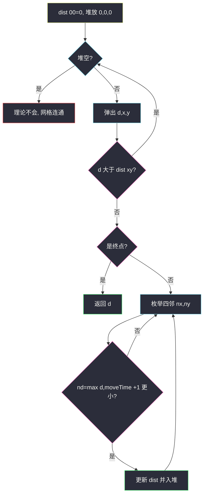
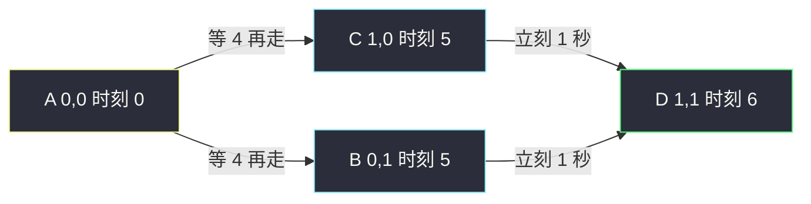

# 到达最后一个房间的最少时间 I（带等待的网格 Dijkstra）

## 一、问题描述

`n × m` 的地牢，格子 `(i, j)` 的开启时刻是 `moveTime[i][j]`：你**最早**在该时刻才能开始往这个房间走。`t = 0` 从 `(0, 0)` 出发，四连通，每次移动恰好 1 秒。进入邻格 `(x, y)` 的时刻是 `max(当前时间, moveTime[x][y]) + 1`。求到达右下角 `(n-1, m-1)` 的最少时间。

> 🔗 LeetCode 3341：https://leetcode.cn/problems/find-minimum-time-to-reach-last-room-i/
>
> 数据范围：`2 ≤ n, m ≤ 50`，`0 ≤ moveTime[i][j] ≤ 1e9`。格子少，但开启时刻很大，不能按「走了几步」当答案。
>
> 📚 灵茶题单：**§3.1 单源最短路：Dijkstra 算法**（建模 BFS / 堆优化，松弛里带等待）。

**示例 1**

```
输入：moveTime = [[0,4],[4,4]]
输出：6
```

在 `t = 4` 从 `(0,0)` 走进 `(1,0)`，`t = 5` 到达；再花 1 秒进 `(1,1)`，`t = 6`。

**示例 2**

```
输入：moveTime = [[0,0,0],[0,0,0]]
输出：3
```

全是 0，不用等，最短就是曼哈顿路径 3 步。

**示例 3**

```
输入：moveTime = [[0,1],[1,2]]
输出：3
```

`(0,0) → (0,1)`：`max(0, 1) + 1 = 2`；再进 `(1,1)`：`max(2, 2) + 1 = 3`。

**直观理解**

边权不是常数 1：隔壁房间还没开，你得在当前格子干等到 `moveTime[邻格]`，再花 1 秒走进去。等待量随「你何时到达门口」变，普通按层 BFS 会错。这是网格上的正权最短路，堆 Dijkstra。

起点特殊：`t = 0` 已经站在 `(0,0)`，**不必**等自己的 `moveTime[0][0]`，`dist[0][0] = 0`。

---

## 二、暴力解法

格子最多 `50 × 50 = 2500`。若把「当前坐标 + 当前时间」当状态 DFS/BFS，时间上限是 `1e9` 量级，状态爆炸。退一步：枚举所有简单路径，每条路上按公式累加等待——路径条数指数级，更不行。

下面这版「按步数 BFS」是最容易误交的暴力：以为走得步数少就更快。

```python
from collections import deque
from typing import List

class Solution:
    def minTimeToReach(self, moveTime: List[List[int]]) -> int:
        n, m = len(moveTime), len(moveTime[0])
        vis = [[False] * m for _ in range(n)]
        q = deque([(0, 0, 0)])  # x, y, time
        vis[0][0] = True
        dirs = ((-1, 0), (1, 0), (0, -1), (0, 1))
        while q:
            x, y, t = q.popleft()
            if x == n - 1 and y == m - 1:
                return t
            for dx, dy in dirs:
                nx, ny = x + dx, y + dy
                if 0 <= nx < n and 0 <= ny < m and not vis[nx][ny]:
                    vis[nx][ny] = True
                    q.append((nx, ny, max(t, moveTime[nx][ny]) + 1))
        return -1
```

示例 1、2、3 碰巧都能过：最短跳数路径也是最优。换一张「绕路少等」的图就错：

```
moveTime = [[0, 100, 0],
            [0,   0, 0]]
```

右上那格要等到 100。若 BFS 先扩展右边，会用时刻 101 走进 `(0,1)` 并 vis 死 `(1,1)`，终点被锁成约 103；真正最优是先往下再往右，3 秒到。**先碰到的格子不是最早到达**，因为边权（等待 + 1）不是均匀的。扩展顺序一变答案就变，这不是「偶尔对」能接受的算法。

### 🔴 瓶颈在哪里

需要按「到达时刻」从小到大扩展，并且同一格只保留更早的到达。这就是 Dijkstra，不是网格 BFS。和站内 [network-delay-time.md](./network-delay-time.md) 同一套堆模板，只是图画在格子上、松弛式带 `max`。

---

## 三、优化探索（核心章节）

> 📚 本题在灵茶题单中属于 **§3.1 单源最短路：Dijkstra 算法**。正权、单源、边权随等待变化，堆优化。

### 3.1 状态与松弛

`dist[x][y]`：到达 `(x, y)` 的最早时刻。初始 `dist[0][0] = 0`，其余无穷。

从 `(x, y)`（已知最早 `d`）走向邻格 `(nx, ny)`：

```text
nd = max(d, moveTime[nx][ny]) + 1
```

- `d ≥ moveTime[nx][ny]`：门已经开了，立刻走，1 秒后到。
- `d < moveTime[nx][ny]`：等到开启时刻再走，到达时刻 = `moveTime[nx][ny] + 1`。

仅当 `nd < dist[nx][ny]` 时更新并入堆。等待量 `max(moveTime[nx][ny] - d, 0)` 非负，边权恒正，Dijkstra 正确。



正权保证：第一次以某个 `d` 弹出终点时，它已是全局最早到达。可以提前 `return d`。

### 3.2 为什么不能普通 BFS

BFS 默认「先入队 = 步数少 = 更优」。本题步数少的路可能卡在一扇晚开的门上，步数多的路一路畅通。必须用优先队列按到达时刻弹出，和 [network-delay-time.md](./network-delay-time.md) 一样跳过过期堆项。

### 3.3 一句话核心

> **网格四连通建图；松弛 `nd = max(d, moveTime[邻]) + 1`；堆 Dijkstra，起点 dist=0 不等自己。**

---

## 四、代码实现

### Python（主解：堆优化 Dijkstra）

```python
from heapq import heappop, heappush
from math import inf
from typing import List

class Solution:
    def minTimeToReach(self, moveTime: List[List[int]]) -> int:
        n, m = len(moveTime), len(moveTime[0])
        dist = [[inf] * m for _ in range(n)]
        dist[0][0] = 0
        h = [(0, 0, 0)]  # d, x, y
        dirs = ((-1, 0), (1, 0), (0, -1), (0, 1))
        while h:
            d, x, y = heappop(h)
            if d > dist[x][y]:
                continue
            if x == n - 1 and y == m - 1:
                return d
            for dx, dy in dirs:
                nx, ny = x + dx, y + dy
                if 0 <= nx < n and 0 <= ny < m:
                    nd = max(d, moveTime[nx][ny]) + 1
                    if nd < dist[nx][ny]:
                        dist[nx][ny] = nd
                        heappush(h, (nd, nx, ny))
        return -1
```

`n, m ≥ 2`，起点不是终点，循环里一定会碰到右下角。过期检查 `d > dist[x][y]` 不能省：同一格可能被多条路更新多次。

不要对 `moveTime[0][0]` 做 `max(0, moveTime[0][0])`——题目规定已经站在起点。

---

## 五、具体例子演示

示例 1：`[[0,4],[4,4]]`。格子记成 A B / C D，D 是终点。

初始：`dist[A]=0`，堆 `[(0, A)]`。

| 弹出 | 过期? | 松弛 | dist | 堆 |
|------|-------|------|------|-----|
| `(0, A)` | 否 | B：`max(0,4)+1=5`；C：`max(0,4)+1=5` | A0 B5 C5 D∞ | `[(5,B),(5,C)]` |
| `(5, B)` | 否 | D：`max(5,4)+1=6`；A 已 0 不更新 | D=6 | `[(5,C),(6,D)]` |
| `(5, C)` | 否 | D：`max(5,4)+1=6` 不更优 | 不变 | `[(6,D)]` |
| `(6, D)` | 否 | 终点，返回 6 | | |

两条路同时刻到 D，答案 6。注意进 B、C 都要等到 4 再走 1 秒，不是走 1 步就到。



**绕路更优（BFS 反例）**

`[[0,100,0],[0,0,0]]`，终点 `(1,2)`。

| 弹出 | 松弛要点 | 终点 dist |
|------|----------|-----------|
| `(0,0,0)` | 下到 `(1,0)` 得 1；右到 `(0,1)` 得 101 | ∞ |
| `(1, 1,0)` | 右到 `(1,1)` 得 2 | ∞ |
| `(2, 1,1)` | 右到 `(1,2)` 得 3 | **3** |
| `(101, 0,1)` | 过期路上的晚到，终点已是 3 | 3 |

先弹出终点时刻 3，直接返回。若用 vis 锁死「第一次走到的格」，会把 `(0,1)` 用 101 钉死，再从那里走下去就错了——所以必须按时刻比大小，不能 vis 一次定终身（除非 vis 的含义是 Dijkstra 的「已确定」，在弹出时才标）。

起点 `moveTime` 再大也无关：你已经在里面了。

示例 3：`[[0,1],[1,2]]`。

| 弹出 | 松弛 | dist |
|------|------|------|
| `(0, 0,0)` | 右：`max(0,1)+1=2`；下：`max(0,1)+1=2` | 右下两格都是 2 |
| `(2, 0,1)` | 下到终点：`max(2,2)+1=3` | 终点 3 |
| `(2, 1,0)` | 右到终点：同样 3 | 不变 |
| `(3, 1,1)` | 返回 3 | |

`moveTime` 终点是 2，你到达门口已经是 2，不用再等，+1 进门。若误写成先 `+1` 再和 2 取 max，会得到 `max(3,2)=3` 碰巧对；把终点改成 10，正确是 `max(2,10)+1=11`，错写会变成 `max(3,10)=10`，少算那 1 秒走路。

---

## 六、复杂度分析

| 方法 | 时间 | 空间 | 说明 |
|------|------|------|------|
| 按步 BFS | `O(nm)` | `O(nm)` | 边权不均，答案错 |
| 堆 Dijkstra（主解） | `O(nm log(nm))` | `O(nm)` | 约 `4nm` 条边，堆里过期项 ≤ 边数 |
| 朴素 `O(V²)` Dijkstra | `O((nm)²)` | `O(nm)` | `V=2500` 也能过，题单练堆 |

二叉堆没有 decrease-key，时间也可看成 `O(E log E)`，`E = O(nm)`。

---

## 七、对比总结

| 维度 | 网格 BFS | 0-1 BFS | 本题 Dijkstra |
|------|---------|---------|---------------|
| 边权 | 全 1 | 只有 0/1 | `等待 + 1`，任意非负 |
| 队列 | 普通队列 | 双端队列 | 小根堆 |
| 本题 | 绕路少等会错 | 权不是 0/1 | 对 |

**易错点**

1. **普通 BFS / vis 一次**：先碰到 ≠ 最早到。
2. **起点也等 `moveTime[0][0]`**：`dist[0][0]` 必须是 0。
3. **松弛写成 `d + 1` 再和 `moveTime` 取 max**：进门时刻是 `max(d, moveTime) + 1`，先 max 再 +1。
4. **不过期跳过**：同一格多次入堆，旧的大 `d` 会把已更新的邻格改坏。
5. **四连通漏判越界**；斜走不算相邻。

默写时对照 [network-delay-time.md](./network-delay-time.md)：堆三元组改成 `(d,x,y)`，出边改成四方向，松弛式换成 `max`。网格没有「不可达返回 -1」的题面要求（四连通总能走到），提前弹出终点即可。

---

## 八、举一反三

| 题目 | 关系 |
|------|------|
| [743. 网络延迟时间](https://leetcode.cn/problems/network-delay-time/) | 同节裸 Dijkstra，站内 [network-delay-time.md](./network-delay-time.md) |
| [3342. 到达最后一个房间的最少时间 II](https://leetcode.cn/problems/find-minimum-time-to-reach-last-room-ii/) | 移动耗时在 1、2 之间交替，状态多一维「走了奇数还是偶数步」 |
| [2577. 在网格图中访问一个格子的最少时间](https://leetcode.cn/problems/minimum-time-to-visit-a-cell-in-a-grid/) | 格子有最早进入时刻，等待时要考虑奇偶（来回浪费 2 秒） |
| [778. 水位上升的泳池中游泳](https://leetcode.cn/problems/swim-in-rising-water/) | 网格最短路，堆按高度 / 时间 |
| [1631. 最小体力消耗路径](https://leetcode.cn/problems/path-with-minimum-effort/) | 边权是高度差绝对值，同样 Dijkstra |

**思想迁移**

- 网格 + 正权（含等待）→ 四连通当图，堆 Dijkstra；权全 1 才退回 BFS。
- 松弛式里的 `max(到达, 开启) + 走一步` 是「带开门时间」的标准写法。
- 口诀：**「起点 dist=0 不等自己；松弛 max(d, 开门)+1；堆弹过期跳过。」**
