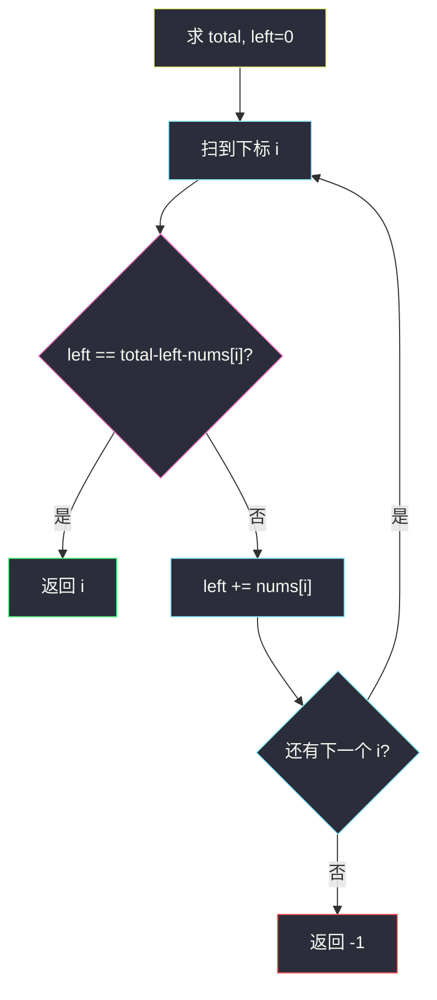
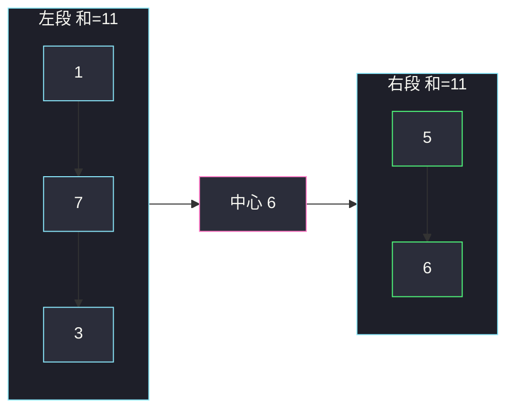

# 寻找数组的中心下标（前后缀和）

## 一、问题描述

给定数组 `nums`，**中心下标**是某个下标 `i`，满足：`i` **左侧**所有数之和等于 **右侧**所有数之和（都不含 `nums[i]` 自己）。左侧或右侧为空时，和视为 `0`。若不存在返回 `-1`；有多个则返回**最左边**那个。

> 🔗 LeetCode 724：https://leetcode.cn/problems/find-pivot-index/
>
> 数据范围：`1 ≤ nums.length ≤ 10^4`，`-1000 ≤ nums[i] ≤ 1000`。
>
> 📚 灵茶题单：**专题：前后缀分解**。先要全体总和 `total`，再从左往右维护左侧和 `left`，右侧自然是 `total - left - nums[i]`。不要写成「只看左右邻居」。

**示例 1**

```
输入：nums = [1,7,3,6,5,6]
输出：3
解释：下标 3 左侧 1+7+3=11，右侧 5+6=11。
```

**示例 2**

```
输入：nums = [1,2,3]
输出：-1
解释：任何下标左右和都不等。
```

**示例 3**

```
输入：nums = [2,1,-1]
输出：0
解释：下标 0 左侧空（和为 0），右侧 1+(-1)=0。
```

**直观理解**

把数组在 `i` 处切开三块：左段、中心元素、右段。问有没有一个切点让左段和等于右段和。中心元素本身不参与比较，所以不是「把数组对半折」，也不是看 `nums[i-1]` 和 `nums[i+1]`。

---

## 二、暴力解法

对每个候选 `i`，再扫一遍左边、一遍右边。

```python
class Solution:
    def pivotIndex(self, nums: list[int]) -> int:
        n = len(nums)
        for i in range(n):
            left = sum(nums[:i])
            right = sum(nums[i + 1 :])
            if left == right:
                return i
        return -1
```

三个官方例都能对拍。每个 `i` 扫 `O(n)`，总共 `O(n²)`。`n=10^4` 顶格会慢，但更重要的是：相邻两次查询的左段只差一个元素，不该从头加。

### 🔴 瓶颈在哪里

`sum(nums[:i])` 和上一轮的左段只差 `nums[i-1]`。全体之和 `total` 固定，右段 = `total - 左段 - nums[i]`，一次减法就能得到。预处理总和 + 滚动左段，变成一遍扫描。

---

## 三、优化探索（核心章节）

> 📚 本题在灵茶题单中属于 **专题：前后缀分解**。模板动作：先吃掉整段信息（这里是 `total`），再在每个分割点用「已扫过的前缀」还原另一侧。

### 3.1 等式只含一个未知量

记 `left` 为 `nums[0..i-1]` 的和（`i=0` 时为 0）。则：

```
right = total - left - nums[i]
要：left == right
即：left == total - left - nums[i]
```

`total` 开头求一次。从左往右扫 `i`，先判断再把 `nums[i]` 加进 `left`——这样判断时 `left` 恰好是「不含自己的左侧」。遇到第一个成立的 `i` 立刻返回，自然是最左边。



### 3.2 分割点画在哪里

下标 `i` 把数组切成三段，比较的是黄段和绿段，粉段（自己）两边都不进：

```
  left 之和          nums[i]         right 之和
[ 0 .. i-1 ]    |       i       |    [ i+1 .. n-1 ]
```

空左、空右都合法，和为 0。所以 `i=0`、`i=n-1` 都要检查，不要从 1 扫到 `n-2`。

### 3.3 一句话核心

> **先求 total，扫 i 时用 left == total - left - nums[i]；先判断再把 nums[i] 加进 left。**

---

## 四、代码实现

### Python（主解）

```python
class Solution:
    def pivotIndex(self, nums: list[int]) -> int:
        total = sum(nums)
        left = 0
        for i, x in enumerate(nums):
            if left == total - left - x:
                return i
            left += x
        return -1
```

**变量含义**

| 写法 | 含义 |
|------|------|
| `total` | 全体之和 |
| `left` | 当前 `i` **左侧**之和（不含 `x`） |
| `total - left - x` | 当前 `i` **右侧**之和 |
| 先 `if` 再 `left += x` | 保证比较时不含自己 |

不必真的开前缀和数组：`left` 就是滚动的 `pre[i]`。

---

## 五、具体例子演示

### 5.1 官方示例 1：nums = [1,7,3,6,5,6]

`total = 28`。逐步跟踪 `left` 与右侧。

| i | x | left（比之前） | right = 28-left-x | 相等? | 之后 left |
|---|---|---------------|-------------------|-------|-----------|
| 0 | 1 | 0 | 27 | 否 | 1 |
| 1 | 7 | 1 | 20 | 否 | 8 |
| 2 | 3 | 8 | 17 | 否 | 11 |
| 3 | 6 | 11 | 11 | **是** | — |

返回 `3`。对拍官方。分割点画在下标 3：



粉是中心，青是左段，绿是右段，两段和都是 11。

### 5.2 官方示例 2：nums = [1,2,3]

`total = 6`。

| i | x | left | right | 相等? |
|---|---|------|-------|-------|
| 0 | 1 | 0 | 5 | 否 |
| 1 | 2 | 1 | 3 | 否 |
| 2 | 3 | 3 | 0 | 否 |

返回 `-1`。对拍官方。注意最后一行左段 `1+2=3`、右段空为 0，并不相等——「最右当中心」不是默认成立。

### 5.3 官方示例 3：nums = [2,1,-1]

`total = 2`。`i=0` 时 `left=0`，`right=2-0-2=0`，相等，返回 `0`。对拍官方。负数合法：右侧 `1+(-1)` 把 2 消掉，空左侧才能配平。

若先 `left += x` 再判断，`i=0` 会变成 `left=2` 去比，错过这个答案。

---

## 六、复杂度分析

| 方法 | 时间 | 空间 | 说明 |
|------|------|------|------|
| 每个 i 再求和 | `O(n²)` | `O(1)` | 暴力 |
| 前缀和数组 | `O(n)` | `O(n)` | `pre[i-1] vs pre[n]-pre[i]` |
| 滚动 left（主解） | `O(n)` | `O(1)` | 一遍 `total` + 一遍扫描 |

元素有负数，不存在「越过答案后 left 更大」的单调性，必须从左扫到右才能取最左。

---

## 七、对比总结

| 维度 | 暴力双 sum | 滚动 left |
|------|------------|-----------|
| 右侧怎么来 | 每次重算 | `total - left - x` |
| 最左答案 | 从左扫自然得到 | 同左，命中即返 |
| 空侧 | 切片为空 | `left=0` 或 `right=0` |

**易错点**

1. **只比较相邻两个数**：中心下标比的是两段**所有**元素。
2. **先累加再判断**：`left` 含了自己，`i=0` 的空左会错。
3. **漏掉两端**：空左/空右是 0，`i=0` 与 `i=n-1` 都是候选。
4. **有多个还继续找最右**：题意要最左，命中即返。
5. **当成「下标左右长度相等」**：是值和，不是位置对称。

---

## 八、举一反三

| 题目 | 关系 |
|------|------|
| [1991. 找到数组的中间位置](https://leetcode.cn/problems/find-the-middle-index-in-array/) | 与 724 同一题 |
| [2270. 分割数组的方案数](https://leetcode.cn/problems/number-of-ways-to-split-array/)（`number-of-ways-to-split-array.md`） | 同样 total + 滚动 left，改成计数、切割在元素之间 |
| [238. 除自身以外数组的乘积](https://leetcode.cn/problems/product-of-array-except-self/)（`product-of-array-except-self.md`） | 和换成积，左右都不含自己 |
| [2574. 左右元素和的差值](https://leetcode.cn/problems/left-and-right-sum-differences/) | 每个 i 都要左右和，同一公式 |
| [1480. 一维数组的动态和](https://leetcode.cn/problems/running-sum-of-1d-array/) | 前缀和本身 |

**思想迁移**

- 「左侧信息 vs 右侧信息、中间元素不参与」→ 先 `total`，再滚前缀。
- 口诀：**「先 total 后 left；先比较再加自己。」**
