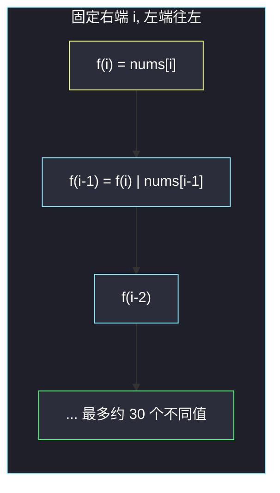
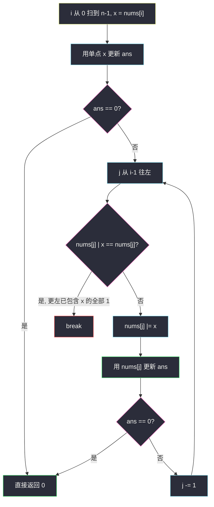
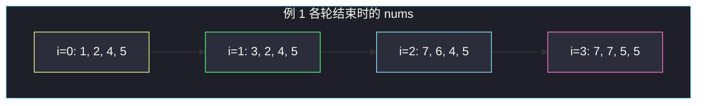

# 找到按位或最接近 K 的子数组（AND/OR LogTrick）

## 一、问题描述

给你一个整数数组 `nums` 和一个整数 `k`。请找一个**非空连续子数组**，使子数组所有元素的按位或（OR）与 `k` 的绝对差尽可能小，返回这个**最小绝对差**。

> 🔗 LeetCode 3171：https://leetcode.cn/problems/find-subarray-with-bitwise-or-closest-to-k/
>
> 数据范围：`1 ≤ n ≤ 10^5`，`1 ≤ nums[i], k ≤ 10^9`。
>
> 📚 灵茶题单：**AND/OR LogTrick**（二期第 11 批）。固定右端点向左扩，OR 只增不减，每个右端点对应的不同 OR 值只有 `O(位数)` 个。本题是新题，站点按该小节写。

**示例 1**

```
输入：nums = [1,2,4,5], k = 3
输出：0
解释：子数组 [1,2] 的按位或是 1|2 = 3，|3-3| = 0，已经是最优。
```

**示例 2**

```
输入：nums = [1,3,1,3], k = 2
输出：1
解释：没有任何子数组的 OR 恰好等于 2。单点 3 给出 |3-2| = 1，已经是最小差。
```

**示例 3**

```
输入：nums = [1], k = 10
输出：9
解释：只有一个子数组 [1]，|1-10| = 9。
```

**直观理解**

按位或只会把 0 变成 1、已经是 1 的位永远不变，所以子数组越长，OR 越大（按位集合只增不减）。要找「某个子数组 OR 离 k 最近」，等价于枚举所有可能出现的子数组 OR 值，取 `|or - k|` 的最小值。暴力枚举全部 `O(n²)` 个子数组会超时。LogTrick 的观察是：固定右端点 `r`，把左端点从 `r` 往左推时，OR 的**不同取值至多约 30 个**（`U ≤ 10^9` 大约 30 位），于是总状态从 `n²` 掉到 `n · 30`。

---

## 二、暴力解法

两重循环：枚举右端 `i`、左端 `j`，维护 `cur |= nums[j]`，更新答案。

```python
class Solution:
    def minimumDifference(self, nums: list[int], k: int) -> int:
        n = len(nums)
        ans = 10**18
        for i in range(n):
            cur = 0
            for j in range(i, -1, -1):
                cur |= nums[j]
                ans = min(ans, abs(cur - k))
                if ans == 0:
                    return 0
        return ans
```

内层从 `i` 往左扩，正好对应「固定右端、OR 单调不减」。正确，但 `n = 10^5` 时 `O(n²)` 超时。

### 🔴 瓶颈在哪里

绝大多数左端点并不会产生新的 OR。例如右端已经是 `7`（二进制 `111`），再往左 OR 任何被 `7` 覆盖的数，结果还是 `7`。真正让 OR **严格变大** 的次数，每个右端点只有几十次。暴力把「相同 OR」反复算了成千上万遍。把这些重复压掉，就是 LogTrick。

不要把主解写成「OR 双指针」。滑窗能随便吐左端，是因为加法/计数可以减回去；OR 少掉一个数时，某位 1 该不该消失，必须知道这一位被几个数贡献过。本题目标又是「离 k 最近」而不是「OR ≥ k」这种单调判定，单一窗口左右指针也选不出该扩还是该缩。主解只走 LogTrick。

---

## 三、优化探索（核心章节）

> 📚 灵茶题单把这类技巧叫做 **AND/OR LogTrick**：对 OR / AND 这类「按位单调」的运算，固定一端、滑动另一端时，不同运算结果的个数是 `O(log U)`，不是 `O(n)`。

### 3.1 OR 往左扩：只增不减

固定右端点 `i`，记 `f(j) = nums[j] | nums[j+1] | … | nums[i]`（`j ≤ i`）。则：

- `f(i) = nums[i]`
- `f(j) = f(j+1) | nums[j]`
- 作为位集合：`f(j)` 包含 `f(j+1)` 的全部 1，可能再多一些 1

所以序列 `f(i), f(i-1), …, f(0)` **按位单调不减**：某位一旦变成 1，再往左不会变回 0。整数意义上也不严格递增（经常连续一段相等），但「严格变大」时至少多了一个 1。

`U ≤ 10^9`，一个数最多 30 个有效二进制位。从 `f(i)` 走到 `f(0)`，1 的个数最多从 0 涨到 30，因此**严格变大至多 30 次**，不同的 `f(j)` 至多 31 个。



### 3.2 集合写法：每个右端保留不同 OR

用一个集合 `ors` 存「以当前 `i` 为右端的所有不同 OR」。从 `i-1` 转移到 `i` 时：旧值全部 `| nums[i]`，再加入单点 `nums[i]`。集合大小始终 ≤ 约 30。

```python
# 思路草稿，不是最终提交版
ors: set[int] = set()
for x in nums:
    ors = {y | x for y in ors}
    ors.add(x)
    # 枚举 ors 里每个值更新 |v - k|
```

这已经是 `O(n log U)`。下面的原地模板把集合「摊」进原数组，少一个哈希表，常数更好，也是灵神常用写法。

### 3.3 原地模板：`nums[j]` 表示 `[j..i]` 的 OR

外层 `i` 从左到右。处理完右端 `i` 之后约定：

- `nums[i]` 仍是原值（单点 `[i..i]`）
- 对 `j < i`，`nums[j]` 已经被改成**原数组**区间 `[j..i]` 的 OR

处理 `i` 时，内层 `j` 从 `i-1` 往 `0` 走，执行 `nums[j] |= x`（`x` 是原 `nums[i]`）。走之前的 `nums[j]` 正是上一轮留下的 `[j..i-1]` 的 OR，OR 上 `x` 就变成 `[j..i]`。

**为什么可以 `break`：** 若 `nums[j] | x == nums[j]`，说明 `x` 的全部 1 已经包含在 `[j..i-1]` 里。更左边的 `j' < j`，其 `[j'..i-1]` 覆盖了 `[j..i-1]`，当然也已经包含 `x` 的全部 1。再往左 OR 不会变，答案也不会变，直接停。



### 3.4 总时间为什么是 `O(n log U)`

对每个固定的下标 `j`，`nums[j]` 在整个算法里**只会加点 1、从不减 1**。每次真正执行 `nums[j] |= x` 且值发生变化，至少多一个 1，该位置最多变 30 次。

内层循环每次要么：

1. **改值**：计入某次「加点 1」，全局最多 `O(n log U)` 次；要么
2. **立刻 break**：每个右端 `i` 最多一次失败探测。

所以内层总迭代次数 `O(n log U)`，不是 `O(n²)`。这就是「每个 `nums[j]` 至多被加点 1 三十次」的摊还。

集合写法每次 `|ors| ≤ 30`，同样是 `O(n log U)`，证明更直观：不同 OR 个数 ≤ 位数。

### 3.5 为什么不能当滑窗吐左端

OR 没有逆运算。`1 | 2 = 3`，丢掉左边的 `1` 后剩下 `2`，但你只看见结果 `3`，不知道第 0 位是不是只有被丢掉的那个 1 在撑着。除非另开 32 个计数器记每位有几个 1，才能在 `O(1)` 里吐左端——那是「最短 OR ≥ k」一类**单调条件**的做法。本题要的是离 `k` 最近，OR 变大可能更近也可能更远，没有「窗口合法 / 非法」的单调性，双指针收缩方向都不存在。所以主解不用双指针。

### 3.6 一句话核心

> **固定右端往左扩，OR 只增不减、不同值只有 `O(log U)` 个；原地把 `nums[j]` 改成 `[j..i]` 的 OR，一旦 `nums[j]` 已包含 `x` 的全部 1 就 break。**

---

## 四、代码实现

### Python（主解：原地 LogTrick）

```python
class Solution:
    def minimumDifference(self, nums: list[int], k: int) -> int:
        ans = 10**18
        for i, x in enumerate(nums):
            ans = min(ans, abs(x - k))
            if ans == 0:
                return 0
            for j in range(i - 1, -1, -1):
                if nums[j] | x == nums[j]:
                    break
                nums[j] |= x
                ans = min(ans, abs(nums[j] - k))
                if ans == 0:
                    return 0
        return ans
```

**变量含义**

| 写法 | 含义 |
|------|------|
| `i, x` | 当前右端点及其原值（单点 OR） |
| `nums[j]`（改之后） | 原数组子数组 `[j..i]` 的按位或 |
| `nums[j] | x == nums[j]` | `x` 的 1 已含在 `[j..i-1]` 中，更左不用走 |
| `ans` | 目前见到的最小 `\|or - k\|` |

会改原数组。若调用方还要用 `nums`，先拷一份。本题只返回一个整数，原地即可。

### Python（等价：set 维护不同 OR）

```python
class Solution:
    def minimumDifference(self, nums: list[int], k: int) -> int:
        ans = 10**18
        ors: set[int] = set()
        for x in nums:
            ors = {y | x for y in ors}
            ors.add(x)
            for v in ors:
                ans = min(ans, abs(v - k))
            if ans == 0:
                return 0
        return ans
```

集合版不改原数组，适合讲「每个右端 ≤ 30 个值」。提交用哪版都行。

### Java（可选）

```java
class Solution {
    public int minimumDifference(int[] nums, int k) {
        int ans = Integer.MAX_VALUE;
        for (int i = 0; i < nums.length; i++) {
            int x = nums[i];
            ans = Math.min(ans, Math.abs(x - k));
            if (ans == 0) {
                return 0;
            }
            for (int j = i - 1; j >= 0; j--) {
                if ((nums[j] | x) == nums[j]) {
                    break;
                }
                nums[j] |= x;
                ans = Math.min(ans, Math.abs(nums[j] - k));
                if (ans == 0) {
                    return 0;
                }
            }
        }
        return ans;
    }
}
```

---

## 五、具体例子演示

**官方示例 1**：`nums = [1, 2, 4, 5]`，`k = 3`。二进制：`1 = 001`，`2 = 010`，`4 = 100`，`5 = 101`。逐步跟踪**原地数组**和 `ans`（对拍输出 0）。

初始：`nums = [1, 2, 4, 5]`，`ans = inf`。

**i = 0，x = 1**

| 动作 | nums | ans |
|------|------|-----|
| 单点 `\|1-3\| = 2` | `[1, 2, 4, 5]` | 2 |
| 内层 `j` 从 -1 起，不进循环 | 同上 | 2 |

含义：目前只看见子数组 `[1]`。

**i = 1，x = 2**

| 动作 | nums | ans |
|------|------|-----|
| 单点 `\|2-3\| = 1` | `[1, 2, 4, 5]` | 1 |
| `j = 0`：`1 \| 2 = 3 ≠ 1`，写入 `nums[0] = 3` | `[3, 2, 4, 5]` | |
| `\|3-3\| = 0` | `[3, 2, 4, 5]` | **0** |

`nums[0] = 3` 正是原区间 `[1,2]` 的 OR。已经最优，代码可直接 `return 0`。下面为了把 LogTrick 走完，假装不提前返回。

**i = 2，x = 4**（若继续）

| 动作 | nums | 说明 |
|------|------|------|
| 单点 `\|4-3\| = 1` | `[3, 2, 4, 5]` | ans 仍 0 |
| `j = 1`：`2 \| 4 = 6 ≠ 2`，`nums[1] = 6` | `[3, 6, 4, 5]` | `[2,4]` 的 OR |
| `j = 0`：`3 \| 4 = 7 ≠ 3`，`nums[0] = 7` | `[7, 6, 4, 5]` | `[1,2,4]` 的 OR |

**i = 3，x = 5**

| 动作 | nums | 说明 |
|------|------|------|
| 单点 `\|5-3\| = 2` | `[7, 6, 4, 5]` | |
| `j = 2`：`4 \| 5 = 5 ≠ 4`，`nums[2] = 5` | `[7, 6, 5, 5]` | `[4,5]` 的 OR |
| `j = 1`：`6 \| 5 = 7 ≠ 6`，`nums[1] = 7` | `[7, 7, 5, 5]` | `[2,4,5]` 的 OR |
| `j = 0`：`7 \| 5 = 7 == 7` | **break** | `[1,2,4]` 已含 5 的全部 1 |

最后一次 break 是 LogTrick 的关键：`7 = 111₂` 已经覆盖 `5 = 101₂`，再往左（这里已经是最左）OR 也不会变。



绿框那一轮 `ans` 变成 0，与官方输出一致。

同一例子的**集合版**逐步：

| i | x | 新 ors（以 i 为右端的不同 OR） | 本轮最小差 |
|---|---|--------------------------------|------------|
| 0 | 1 | `{1}` | 2 |
| 1 | 2 | `{1\|2=3, 2}` = `{3,2}` | **0** |
| 2 | 4 | `{3\|4=7, 2\|4=6, 4}` = `{7,6,4}` | 0 |
| 3 | 5 | `{7\|5=7, 6\|5=7, 4\|5=5, 5}` = `{7,5}` | 0 |

集合大小始终 ≤ 4，远小于 `i+1` 个子数组个数。`i=1` 时出现 3，差为 0。

**官方示例 2**：`nums = [1, 3, 1, 3]`，`k = 2`。

可能的 OR 只有 1 和 3（`1|3=3`），`|1-2|=1`，`|3-2|=1`，答案 1。原地走一遍：

- `i=0, x=1`：ans = 1
- `i=1, x=3`：单点差 1；`j=0`：`1|3=3 ≠ 1`，`nums[0]=3`，差 1
- `i=2, x=1`：单点差 1；`j=1`：`3|1=3 == 3`，**立刻 break**（3 已含 1 的全部位）
- `i=3, x=3`：类似，左边已经全是含 3 的 OR，很快 break

没有差 0，返回 1。对拍官方。

**官方示例 3**：`[1]`，`k=10`。只有单点，ans = 9。内层不跑。对拍官方。

**边界**

- 数组里已有等于 `k` 的元素：第一层单点就把 ans 置 0。
- 全体 OR 仍离 `k` 很远：答案可能来自某个短子数组（OR 小）而不是最长前缀。
- `n=10^5` 且数字都是同一高位：break 极早，接近线性。

---

## 六、复杂度分析

| 方法 | 时间 | 空间 | 说明 |
|------|------|------|------|
| 枚举全部子数组 | `O(n²)` | `O(1)` | `n=10^5` 超时 |
| 集合 LogTrick | `O(n log U)` | `O(log U)` | `\|ors\| ≤ 位数` |
| 原地 LogTrick（主解） | `O(n log U)` | `O(1)` 额外 | 每个下标加点 1 至多 30 次 |
| 错误的 OR 双指针 | 看似 `O(n)` | — | OR 不能随便吐左；「离 k 近」也不单调 |

`U` 取 `max(nums[i], k)` 的数量级，本题 `U ≤ 10^9`，`log U ≈ 30`。

正确性：每个子数组 `[L,R]` 的 OR，会在 `i=R` 那一轮、`j=L` 时被算到（若中途因「已包含」break，说明该 OR 与某个更短的右对齐子数组相同，答案不受影响）。因此所有不同 OR 值都被考虑过。

---

## 七、对比总结

| 维度 | 暴力 | 原地 LogTrick | 集合 LogTrick | OR 滑窗 |
|------|------|---------------|---------------|---------|
| 枚举对象 | 全部 `O(n²)` 段 | 每个右端 `O(log U)` 次改值 | 每个右端一个小 set | 单一窗口 |
| 能否吐左端 | 不需要 | 不需要 | 不需要 | OR 无逆运算 |
| 适用目标 | 任意 | 全体 OR 值都要 | 同左 | 仅单调判定（如 OR ≥ k） |
| 改原数组 | 否 | 是 | 否 | — |

**易错点**

1. **写成双指针求最近**：OR 变大对 `|or-k|` 没有单调方向，不能按「超了就缩」。
2. **break 条件写成 `nums[j] == x`**：必须是 `nums[j] | x == nums[j]`（超集），不是相等。
3. **内层从 0 往右**：会破坏「更左一定已包含」的 break 理由；必须从 `i-1` 往左。
4. **忘记单点**：`ans` 要先用 `x` 更新，再扩左边。
5. **AND 套错模板**：AND 往左扩只减不增（1 变 0），break 条件改成「已经是子集」：`nums[j] & x == nums[j]`。本题是 OR。
6. **Java 溢出**：本题绝对值在 `int` 内；`Integer.MAX_VALUE` 作初值安全，因为差不超过 `10^9`。

**模板**

```text
for i, x in enumerate(nums):
    更新单点
    for j = i-1 .. 0:
        if nums[j] | x == nums[j]: break
        nums[j] |= x
        更新答案
```

AND 版把 `|` 换成 `&`，break 条件对称改写。

---

## 八、举一反三

| 题目 | 关系 |
|------|------|
| [898. 子数组按位或操作](https://leetcode.cn/problems/bitwise-ors-of-subarrays/) | 统计不同 OR 个数，同一套「每个右端 `O(log U)` 个值」 |
| [2411. 按位或最大的最小子数组长度](https://leetcode.cn/problems/smallest-subarrays-with-maximum-bitwise-or/) | 固定右端，找最右的左端使 OR 达到全局最大 |
| [3097. 或值至少为 K 的最短子数组 II](https://leetcode.cn/problems/shortest-subarray-with-or-at-least-k-ii/) | 条件单调，可用 LogTrick 或「位计数滑窗」 |
| [1521. 找到最接近目标值的函数值](https://leetcode.cn/problems/find-a-value-of-a-mysterious-function-closest-to-target/) | AND 版 LogTrick，目标同样是最接近 |
| [3171. 本题](https://leetcode.cn/problems/find-subarray-with-bitwise-or-closest-to-k/) | OR 版最接近 k |

**思想迁移**

- 看到「子数组 OR / AND」+ `n=10^5`，先问：固定一端后不同结果有几个？通常是 `O(log U)`。
- 口诀：**「OR 往左只加 1；相同就 break；每个位置最多加三十次。」**
