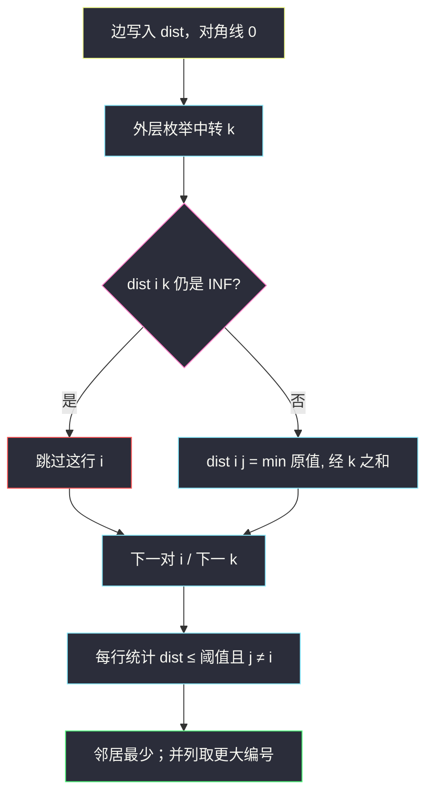

# 阈值距离内邻居最少的城市（Floyd 全源最短路）

## 一、问题描述

`n` 座城市编号 `0 .. n-1`，若干无向带权边 `edges[i] = [from, to, weight]`。给定阈值 `distanceThreshold`：从城市 `x` 出发，能到达且最短路 **≤ 阈值** 的其它城市，叫做 `x` 的邻居。求邻居数 **最少** 的城市；并列时取 **编号最大** 的那座。

> 🔗 LeetCode 1334：https://leetcode.cn/problems/find-the-city-with-the-smallest-number-of-neighbors-at-a-threshold-distance/
>
> 数据范围：`2 ≤ n ≤ 100`，边数 `1 ≤ m ≤ n(n-1)/2`，边权 `1 ≤ weight ≤ 10^4`，`1 ≤ distanceThreshold ≤ 10^4`。图连通性不保证。
>
> 📚 灵茶题单：**图论 · §3.2 Floyd**（1855 分）。`n ≤ 100` 是 Floyd `O(n³)` 的舒适区。

**示例 1**

```
输入：n = 4, edges = [[0,1,3],[1,2,1],[1,3,4],[2,3,1]], distanceThreshold = 4
输出：3

城市 0 的可达（≤4）：1（3）、2（4），3 的最短路是 5，不算。邻居 2 个。
城市 1：0、2、3 全 ≤4。邻居 3 个。
城市 2：0、1、3 全 ≤4。邻居 3 个。
城市 3：1（2）、2（1），到 0 是 5。邻居 2 个。
0 和 3 并列最少，取编号大的 3。
```

**示例 2**

```
输入：n = 5, edges = [[0,1,2],[0,4,8],[1,2,3],[1,4,2],[2,3,1],[3,4,1]], distanceThreshold = 2
输出：0

阈值只有 2。城市 0 只够到 1（距离 2）。其它城市邻居都 ≥2。
0 的邻居最少，直接返回 0。
```

**直观理解**

「阈值内邻居」= 全源最短路矩阵里，每一行有多少个 `j ≠ i` 满足 `dist[i][j] ≤ threshold`。先把所有点对距离算出来，再扫一遍计数、比大小。自己到自己是 0，**不要算进邻居**。

---

## 二、暴力解法

对每个起点跑一遍 Dijkstra（或堆优化），得到该点到其余点的最短路，再数阈值内邻居。`n` 次单源，正确。

```python
import heapq

class Solution:
    def findTheCity(self, n: int, edges: list[list[int]], distanceThreshold: int) -> int:
        g = [[] for _ in range(n)]
        for u, v, w in edges:
            g[u].append((v, w))
            g[v].append((u, w))

        def dijkstra(s: int) -> int:
            dist = [10**18] * n
            dist[s] = 0
            h = [(0, s)]
            while h:
                d, u = heapq.heappop(h)
                if d > dist[u]:
                    continue
                for v, w in g[u]:
                    nd = d + w
                    if nd < dist[v]:
                        dist[v] = nd
                        heapq.heappush(h, (nd, v))
            return sum(1 for j in range(n) if j != s and dist[j] <= distanceThreshold)

        best, ans = n, 0
        for i in range(n):
            cnt = dijkstra(i)
            if cnt <= best:
                best, ans = cnt, i
        return ans
```

`n = 100`、边最坏 `O(n²)` 时，堆 Dijkstra 大约 `O(n · n² log n)`，能过但代码长。题单这一节练的是 Floyd 三层循环。

### 复杂度

- **时间**：`O(n · (n + m) log n)`，稠密图接近 `O(n³ log n)`。
- **空间**：`O(n + m)` 邻接表 + `O(n)` 距离。

### 🔴 瓶颈在哪里

每个起点都要单独松弛一遍。点少、要 **所有点对** 距离时，Floyd 一次 `O(n³)` 把矩阵填满，之后计数是 `O(n²)`，写起来只有三层 `for`。

---

## 三、优化探索（核心章节）

> 📚 本题在灵茶题单中属于 **§3.2 Floyd**。无向带权图，`n ≤ 100`：初始化距离矩阵 → 枚举中转 `k` 松弛 → 按行统计阈值邻居。

### 3.1 距离矩阵

`dist[i][j]` = 当前已知的 `i → j` 最短路。

- 对角线 `dist[i][i] = 0`。
- 无向边写入两个方向；若有重边取更短的那条。
- 其余填一个大于任何简单路径的 INF。最长简单路径 ≤ `(n-1) · 10^4 < 10^6`，INF 取 `10^9` 即可。Python 加法不会溢出；Java 里不要用 `Integer.MAX_VALUE` 直接相加，用 `1_000_000_000` 或先判断是否仍为 INF。

### 3.2 Floyd 松弛

枚举中转点 `k`，再枚举 `i, j`：

```
dist[i][j] = min(dist[i][j], dist[i][k] + dist[k][j])
```

含义：只允许用 `{0,1,...,k}` 当中转时的最短路。`k` 从 0 扫到 `n-1` 之后，就是真正的全源最短路。

顺序必须是 **`k` 在最外层**。`k` 放里面会在「经由 k 的距离还没算完」时误用。

小剪枝：`if dist[i][k] >= INF: continue`，这一行的 `j` 循环可以省掉。



### 3.3 计数与并列

对每个 `i`，`cnt = |{ j | j ≠ i 且 dist[i][j] ≤ distanceThreshold }|`。到不了的点仍是 INF，自然不算邻居。

并列规则是编号 **最大**：扫 `i = 0 .. n-1` 时用 `if cnt <= best: ans = i`（带等号）。用 `<` 会在并列时留下较小编号，示例 1 会错成 0。

### 3.4 一句话核心

> **Floyd 填满全源最短路；每行数 dist ≤ 阈值的格子（不含自己）；邻居最少，并列取最大编号。**

---

## 四、代码实现

### Python（主解：Floyd）

```python
class Solution:
    def findTheCity(self, n: int, edges: list[list[int]], distanceThreshold: int) -> int:
        INF = 10**9
        dist = [[INF] * n for _ in range(n)]
        for i in range(n):
            dist[i][i] = 0
        for u, v, w in edges:
            if w < dist[u][v]:
                dist[u][v] = dist[v][u] = w

        for k in range(n):
            for i in range(n):
                if dist[i][k] == INF:
                    continue
                for j in range(n):
                    nd = dist[i][k] + dist[k][j]
                    if nd < dist[i][j]:
                        dist[i][j] = nd

        best, ans = n, 0
        for i in range(n):
            cnt = 0
            for j in range(n):
                if i != j and dist[i][j] <= distanceThreshold:
                    cnt += 1
            if cnt <= best:
                best, ans = cnt, i
        return ans
```

**变量含义**

| 变量 | 含义 |
|------|------|
| `dist[i][j]` | `i` 到 `j` 的最短路 |
| `k` | 当前允许使用的中转城市 |
| `cnt` | 城市 `i` 的阈值邻居数 |
| `best / ans` | 当前最少邻居、对应编号 |

无向图两个方向都写。`i != j` 必须写：`dist[i][i]` 永远 ≤ 阈值。

### Java（与主解同构）

```java
class Solution {
    public int findTheCity(int n, int[][] edges, int distanceThreshold) {
        final int INF = 1_000_000_000;
        int[][] dist = new int[n][n];
        for (int i = 0; i < n; i++) {
            java.util.Arrays.fill(dist[i], INF);
            dist[i][i] = 0;
        }
        for (int[] e : edges) {
            int u = e[0], v = e[1], w = e[2];
            if (w < dist[u][v]) {
                dist[u][v] = dist[v][u] = w;
            }
        }
        for (int k = 0; k < n; k++) {
            for (int i = 0; i < n; i++) {
                if (dist[i][k] == INF) continue;
                for (int j = 0; j < n; j++) {
                    int nd = dist[i][k] + dist[k][j];
                    if (nd < dist[i][j]) dist[i][j] = nd;
                }
            }
        }
        int best = n, ans = 0;
        for (int i = 0; i < n; i++) {
            int cnt = 0;
            for (int j = 0; j < n; j++) {
                if (i != j && dist[i][j] <= distanceThreshold) cnt++;
            }
            if (cnt <= best) {
                best = cnt;
                ans = i;
            }
        }
        return ans;
    }
}
```

---

## 五、具体例子演示

用示例 1 把 Floyd 每一轮中转后的矩阵写出来。INF 写成 `∞`。行 = 起点，列 = 终点。

图：`0 —3— 1 —1— 2 —1— 3`，另有弦 `1 —4— 3`。


**初始（只含直接边）**

```
       0   1   2   3
    0  0   3   ∞   ∞
    1  3   0   1   4
    2  ∞   1   0   1
    3  ∞   4   1   0
```

**k = 0（经城市 0）**

没有人「先到 0 再出去」能缩短距离：0 的出边只有到 1，而 2、3 到不了 0。矩阵不变。

**k = 1（经城市 1）**

`0` 终于能到 `2`、`3`：

- `dist[0][2] = 3+1 = 4`
- `dist[0][3] = 3+4 = 7`（先走那条长弦，后面还会再短）

对称地 `dist[2][0] = 4`，`dist[3][0] = 7`。

```
       0   1   2   3
    0  0   3   4   7
    1  3   0   1   4
    2  4   1   0   1
    3  7   4   1   0
```

**k = 2（经城市 2）**

`1→2→3` 比直连弦更短：`1+1 = 2 < 4`，于是 `dist[1][3] = 2`。  
`0→2→3`：`4+1 = 5 < 7`，`dist[0][3] = 5`。

```
       0   1   2   3
    0  0   3   4   5
    1  3   0   1   2
    2  4   1   0   1
    3  5   2   1   0
```

**k = 3（经城市 3）**

再经 3 走一圈不会更短，矩阵定格。这就是全源最短路。

**按阈值 4 数邻居（不含自己）**

| 城市 | 到其它点的距离 | ≤4 的个数 |
|------|----------------|-----------|
| 0 | 3, 4, **5** | 2 |
| 1 | 3, 1, 2 | 3 |
| 2 | 4, 1, 1 | 3 |
| 3 | **5**, 2, 1 | 2 |

最少是 2，并列 0 与 3 → 返回 **3**。

示例 2 阈值 2，最终一行（城市 0）只有 `dist[0][1] = 2` 过线，邻居 1 个，必是答案。

---

## 六、复杂度分析

| 方法 | 时间 | 空间 | 说明 |
|------|------|------|------|
| n 次 Dijkstra | `O(n · (n+m) log n)` | `O(n+m)` | 稀疏图更好 |
| Floyd（主解） | `O(n³)` | `O(n²)` | `n=100` 约 1e6 次运算，稳定 |

---

## 七、对比总结

| 维度 | n 次 Dijkstra | Floyd |
|------|---------------|-------|
| 题单考点 | 单源 | 全源三层循环 |
| 默写量 | 堆 + 邻接表 | 矩阵 + 三重 `for` |
| 适用 | 只要若干个源 | 点少、要全部点对 |

**易错点**

1. **把自己算进邻居**：`dist[i][i] = 0 ≤ 阈值`，必须 `j != i`。
2. **并列用了 `<`**：要 `<=` 才能让更大编号覆盖。
3. **只写了一个方向**：无向图必须 `dist[u][v] = dist[v][u]`。
4. **`k` 没放最外层**：Floyd 中转点必须最先枚举。
5. **Java 加法溢出**：`INF + INF` 若用 `Integer.MAX_VALUE` 会变负数，松弛全乱。
6. **重边没取 min**：初始化用 `if w < dist[u][v]`。

---

## 八、举一反三

| 题目 | 关系 |
|------|------|
| [1462. 课程表 IV](https://leetcode.cn/problems/course-schedule-iv/) | 同节 Floyd，把距离换成 0/1 可达 |
| [743. 网络延迟时间](https://leetcode.cn/problems/network-delay-time/) | 只要单源，Dijkstra 即可 |
| [1334 本题](https://leetcode.cn/problems/find-the-city-with-the-smallest-number-of-neighbors-at-a-threshold-distance/) | 全源 + 按行计数 |

同目录：[打开转盘锁](./open-the-lock.md)、[最小基因变化](./minimum-genetic-mutation.md) 是边权全 1 的 BFS，不需要 Floyd。阈值本题边权任意正整数，才上全源最短路。

**思想迁移**

- `n ≤ 100` 且要所有点对信息 → 先写 Floyd。
- 口诀：**「三重循环填距离，按行数阈值邻居；并列记得取大号。」**
