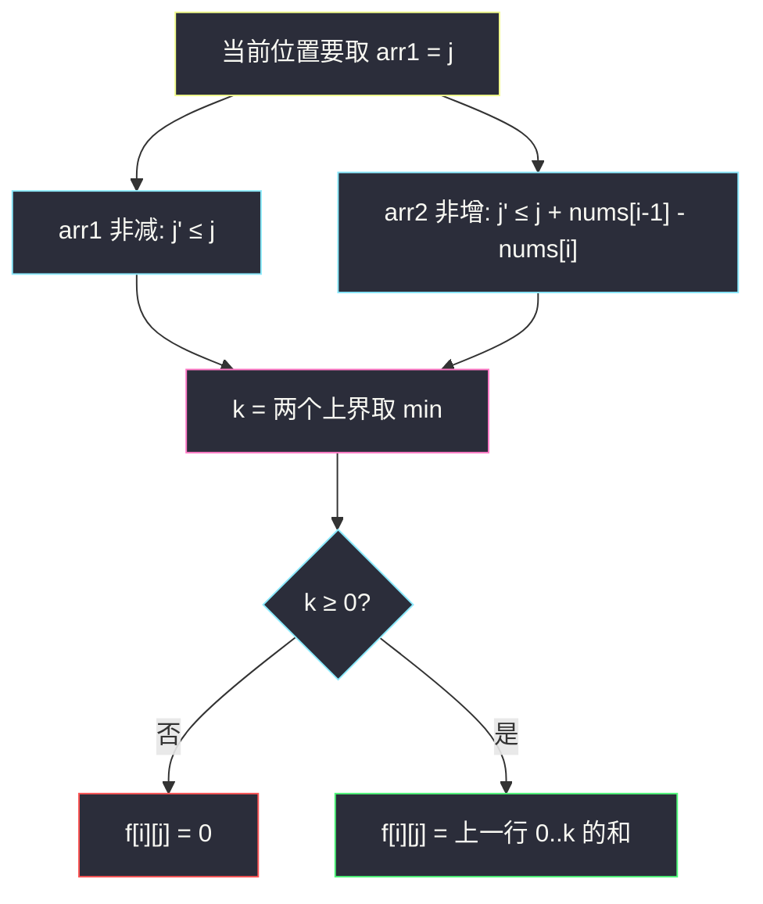
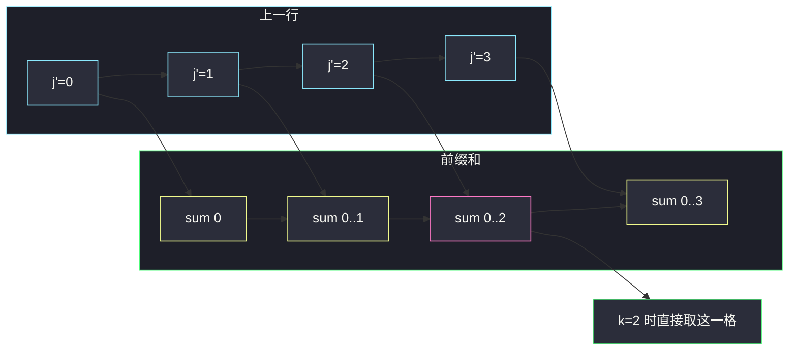

# 单调数组对的数目 I（前缀约束 DP + 前缀和）

## 一、问题描述

给定长度为 `n` 的正整数数组 `nums`。统计有多少对非负整数数组 `(arr1, arr2)` 同时满足：

1. 两者长度都是 `n`；
2. `arr1[i] + arr2[i] == nums[i]`（每个位置拆成两份，份数 ≥ 0）；
3. `arr1` **非递减**：`arr1[0] ≤ arr1[1] ≤ ... ≤ arr1[n-1]`；
4. `arr2` **非递增**：`arr2[0] ≥ arr2[1] ≥ ... ≥ arr2[n-1]`。

答案对 `10^9+7` 取模。

> 🔗 LeetCode 3250：https://leetcode.cn/problems/find-the-count-of-monotonic-pairs-i/
>
> 数据范围：`1 ≤ n ≤ 2000`，`1 ≤ nums[i] ≤ 50`。
>
> 📚 灵茶题单：**§7.6 多维 DP**。位置 `i` × 当前 `arr1[i]` 的取值。`nums[i]` 很小（≤50）是送分点：第二维只有 51 个取值，前缀和优化后总时间 `O(n * m)`，`m = max(nums) ≤ 50`。
>
> ⚠️ 较新的题。同类加强版是 3251（`nums[i]` 到 1000），转移一模一样，只是 `m` 变大。

方法名 `countOfPairs`。

**示例 1**

```
输入：nums = [2,3,2]
输出：4
解释：恰好四对（已对拍穷举）：
  arr1=[0,1,1], arr2=[2,2,1]
  arr1=[0,1,2], arr2=[2,2,0]
  arr1=[0,2,2], arr2=[2,1,0]
  arr1=[1,2,2], arr2=[1,1,0]
```

**示例 2**

```
输入：nums = [5,5,5,5]
输出：126
解释：四个位置和都是 5。arr1 非减会自动迫使 arr2=5-arr1 非增，问题变成：
  0 ≤ a ≤ b ≤ c ≤ d ≤ 5 的整数解个数 = 组合重复 C(6+4-1, 4) = C(9,4) = 126。
```

**直观理解**

每个 `nums[i]` 要劈成左右两半。左半要越来越大（或不减），右半要越来越小（或不增）。两个单调方向是对着的，所以左半不能涨太慢——右半掉不下去的话，左半必须跟着 `nums` 的变化补差额。

---

## 二、暴力解法

每个位置 `arr1[i]` 枚举 `0 .. nums[i]`，`arr2[i] = nums[i] - arr1[i]`，再检查与前一位的两个单调条件。

```python
class Solution:
    def countOfPairs(self, nums: list[int]) -> int:
        MOD = 10**9 + 7
        n = len(nums)

        def dfs(i: int, prev1: int, prev2: int) -> int:
            if i == n:
                return 1
            ans = 0
            for x in range(nums[i] + 1):
                y = nums[i] - x
                if i > 0 and (x < prev1 or y > prev2):
                    continue
                ans = (ans + dfs(i + 1, x, y)) % MOD
            return ans

        return dfs(0, 0, 0)
```

`i=0` 时 `prev` 不起作用（用 `i>0` 短路）。官方两例得到 4 和 126。每个位置最多 51 个分支，`O(m^n)`，`n=2000` 不可用。

### 🔴 瓶颈在哪里

走到位置 `i` 时，真正约束后面的只有「上一格的 `arr1` 取值」（`arr2` 被 `nums` 钉死）。状态是 `(i, j)`，`j = arr1[i]`，一共 `n*(m+1)` 个。暴力在同一状态上重复展开。改成填表，再把「枚举上一格 j'」做成前缀和，内层从 `O(m)` 降到 `O(1)`。

---

## 三、优化探索（核心章节）

> 📚 位置 × 取值。先写出 `j'` 的合法区间，再发现这个区间永远是前缀，于是前缀和。

### 3.1 状态

`f[i][j]` = 只看前缀 `nums[0..i]`，且强制 `arr1[i] = j` 的方案数。合法时 `0 ≤ j ≤ nums[i]`，否则 0。

目标：`sum(f[n-1][j] for j = 0..nums[n-1])`。

### 3.2 边界

`i = 0`：没有「上一格」约束，`j` 从 0 到 `nums[0]` 各 1 种（`arr2[0]` 跟着定）。

```
f[0][j] = 1    (0 ≤ j ≤ nums[0])
f[0][j] = 0    (j > nums[0])
```

### 3.3 转移：两个不等式压成一个上界

从 `arr1[i-1] = j'` 转到 `arr1[i] = j`。`arr2[i-1] = nums[i-1] - j'`，`arr2[i] = nums[i] - j`。

条件 1：`arr1` 非减 ⇒ `j' ≤ j`。

条件 2：`arr2` 非增 ⇒ `nums[i] - j ≤ nums[i-1] - j'`。移项：

```
j' ≤ j + nums[i-1] - nums[i]
```

两边同时成立：

```
j' ≤ min(j, j + nums[i-1] - nums[i])
```

令 `k = min(j, j + nums[i-1] - nums[i])`。还要 `j' ≥ 0`。

- 若 `k < 0`：没有非负的 `j'`，`f[i][j] = 0`。
- 否则：`f[i][j] = sum(f[i-1][j'] for j' = 0..k)`（`j' > nums[i-1]` 的格子本来就是 0）。

`k` 的两种形态有明确含义：

| `nums` 的变化 | `j + nums[i-1] - nums[i]` 相对 `j` | `k` | 谁更紧 |
|----------------|--------------------------------------|-----|--------|
| `nums[i] ≥ nums[i-1]`，和变大 | 更小，差值为负 | `j - (nums[i]-nums[i-1])` | **arr2 非增**更紧：左半必须至少涨这么多，右半才能不升 |
| `nums[i] ≤ nums[i-1]`，和变小 | 更大 | `j` | **arr1 非减**更紧：左半不减即可，右半自然有空间往下掉 |

这就是「对着单调」的全部几何。



### 3.4 前缀和：内层从 O(m) 降到 O(1)

朴素枚举 `j'` 是 `O(m)`，整题 `O(n m^2)`。`n=2000, m=50` 大约 5e6，其实也能过；但区间永远是 `[0, k]` 这种前缀，先对上一行做前缀和 `pref[t+1] = f[i-1][0] + ... + f[i-1][t]`，则

```
f[i][j] = pref[k+1]     (k ≥ 0)
```

一次查询 `O(1)`，总时间 `O(n m)`。这是本题该写的目标复杂度。

`pref` 的长度开到 `m+2`（`m = max(nums)`），`j'` 超过 `nums[i-1]` 的位置保持 0，不必每次按 `nums[i-1]` 截断——`min(k, m)` 取下标即可。



### 3.5 可以滚动

`f[i]` 只依赖 `f[i-1]`。一行数组 + 一个前缀和数组即可。注意：先根据旧 `f` 建好 `pref`，再覆盖 `f`。不要边改 `f` 边累前缀。

### 3.6 一句话核心

> **`f[i][j]`：前 i 位且 arr1[i]=j；j' 只能取前缀 0..k，k=min(j, j+差)，前缀和 O(1) 取。**

---

## 四、代码实现

### Python（主解：滚动 + 前缀和）

```python
class Solution:
    def countOfPairs(self, nums: list[int]) -> int:
        MOD = 10**9 + 7
        n = len(nums)
        m = max(nums)
        f = [0] * (m + 1)
        for j in range(nums[0] + 1):
            f[j] = 1
        for i in range(1, n):
            pref = [0] * (m + 2)
            for j in range(m + 1):
                pref[j + 1] = (pref[j] + f[j]) % MOD
            nf = [0] * (m + 1)
            for j in range(nums[i] + 1):
                k = min(j, j + nums[i - 1] - nums[i])
                if k >= 0:
                    nf[j] = pref[min(k, m) + 1]
            f = nf
        return sum(f[j] for j in range(nums[-1] + 1)) % MOD
```

对拍：`[2,3,2] → 4`，`[5,5,5,5] → 126`。

### Python（二维，便于对照填表）

```python
class Solution:
    def countOfPairs(self, nums: list[int]) -> int:
        MOD = 10**9 + 7
        n = len(nums)
        m = max(nums)
        f = [[0] * (m + 1) for _ in range(n)]
        for j in range(nums[0] + 1):
            f[0][j] = 1
        for i in range(1, n):
            pref = [0] * (m + 2)
            for t in range(m + 1):
                pref[t + 1] = (pref[t] + f[i - 1][t]) % MOD
            for j in range(nums[i] + 1):
                k = min(j, j + nums[i - 1] - nums[i])
                if k >= 0:
                    f[i][j] = pref[min(k, m) + 1]
        return sum(f[n - 1][j] for j in range(nums[-1] + 1)) % MOD
```

**变量含义**

| 变量 | 含义 |
|------|------|
| `f[j]` / `f[i][j]` | 当前（或第 i 位）`arr1 = j` 的方案 |
| `k` | 上一格 `arr1` 允许的最大取值 |
| `pref[t+1]` | 上一行 `0..t` 的方案和 |

### Java（最优解）

```java
class Solution {
    public int countOfPairs(int[] nums) {
        final int MOD = 1_000_000_007;
        int n = nums.length;
        int m = 0;
        for (int x : nums) {
            m = Math.max(m, x);
        }
        int[] f = new int[m + 1];
        for (int j = 0; j <= nums[0]; j++) {
            f[j] = 1;
        }
        for (int i = 1; i < n; i++) {
            int[] pref = new int[m + 2];
            for (int j = 0; j <= m; j++) {
                pref[j + 1] = (pref[j] + f[j]) % MOD;
            }
            int[] nf = new int[m + 1];
            for (int j = 0; j <= nums[i]; j++) {
                int k = Math.min(j, j + nums[i - 1] - nums[i]);
                if (k >= 0) {
                    nf[j] = pref[Math.min(k, m) + 1];
                }
            }
            f = nf;
        }
        long ans = 0;
        for (int j = 0; j <= nums[n - 1]; j++) {
            ans += f[j];
        }
        return (int) (ans % MOD);
    }
}
```

---

## 五、具体例子演示

### 5.1 官方示例 1：必须对拍 4

`nums = [2, 3, 2]`，`m = 3`。`.` 表示 0。

**i = 0，`nums[0]=2`**

| j | 0 | 1 | 2 | 3 |
|---|---|---|---|---|
| f[0] | 1 | 1 | 1 | . |

对应三对半成品：`(0,2)`、`(1,1)`、`(2,0)`。

**i = 1，`nums[1]=3`。差 `nums[0]-nums[1] = -1`。**

`k = min(j, j-1) = j-1`。和变大，arr2 约束更紧，`arr1` 必须至少 +1。

| j | k | 累加上一行 0..k | f[1][j] |
|---|---|-----------------|---------|
| 0 | -1 | 无 | 0 |
| 1 | 0 | 1 | 1 |
| 2 | 1 | 1+1=2 | 2 |
| 3 | 2 | 1+1+1=3 | 3 |

`j=0` 走不通：上一格 `j'≤-1` 不存在。直观上 `arr1` 要从某值不减地变成 0，只能上一格也是 0，但此时 `arr2`：上一格 2，这一格 3，2≥3 不成立。

**i = 2，`nums[2]=2`。差 `3-2 = +1`。**

`k = min(j, j+1) = j`。和变小，arr1 约束更紧。

| j | k | 累加 f[1][0..k] | f[2][j] |
|---|---|-----------------|---------|
| 0 | 0 | 0 | 0 |
| 1 | 1 | 0+1=1 | 1 |
| 2 | 2 | 0+1+2=3 | 3 |

总和 `0+1+3 = 4`，对拍官方。四对还原：

| arr1 | 对应 arr2 | 在表里的归属 |
|------|-----------|--------------|
| `[0,1,1]` | `[2,2,1]` | `f[2][1]` 的那 1 种 |
| `[0,1,2]` | `[2,2,0]` | `f[2][2]` 的 3 种之一 |
| `[0,2,2]` | `[2,1,0]` | `f[2][2]` |
| `[1,2,2]` | `[1,1,0]` | `f[2][2]` |

`f[2][0]=0`：最后一格 `arr1=0` 会迫使前面 `arr1` 全 0，于是 `arr2` 为 `[2,3,2]`，中间 3 比两边大，非增失败。

### 5.2 官方示例 2：必须对拍 126

`nums = [5,5,5,5]`。每个位置和不变，`k = min(j, j+0) = j`。转移退化成「`f[i][j] = sum(f[i-1][0..j])`」，也就是前缀和本身。这正是「非减序列」的经典递推。

| i \ j | 0 | 1 | 2 | 3 | 4 | 5 | 行和 |
|-------|---|---|---|---|---|---|------|
| 0 | 1 | 1 | 1 | 1 | 1 | 1 | 6 |
| 1 | 1 | 2 | 3 | 4 | 5 | 6 | 21 |
| 2 | 1 | 3 | 6 | 10 | 15 | 21 | 56 |
| 3 | 1 | 4 | 10 | 20 | 35 | 56 | **126** |

每一格都是上一行的杨辉前缀（二项式系数）：`f[i][j] = C(i+j, i)`，行和 `C(i+6, i+1)` 一类。最后一行和 `C(9,4)=126`。对拍官方。

组合解释：值域 `{0,1,2,3,4,5}` 六个数，长度 4 的非减序列 = 可重复组合 `C(6+4-1, 4)=126`。

### 5.3 和变大时「必须涨」

`nums = [2,4]`。`k = min(j, j+2-4)=j-2`。

- `j=0,1`：`k<0`，0 种。左半涨不够，右半会从 `2-j'` 升到 `4-j`。
- `j=2`：`k=0`，1 种（上一格只能 0）。对：`(0,2)` 配 `(2,2)`，右半 2≥2，左半 0≤2。
- `j=3`：`k=1`，2 种。
- `j=4`：`k=2`，3 种。

总 6 种。和从 2 到 4，左半至少 +2。

### 5.4 单元素

`nums = [7]`：没有转移，答案 `8`（`arr1` 取 0..7）。边界行独立工作。

---

## 六、复杂度分析

| 方法 | 时间 | 空间 | 说明 |
|------|------|------|------|
| 暴力 DFS | `O(m^n)` | `O(n)` 栈 | 超时 |
| 二维 DP 枚举 j' | `O(n m^2)` | `O(n m)` | m=50 勉强 |
| 前缀和（主解） | `O(n m)` | `O(m)` 滚动 | n≤2000、m≤50 |

`m = max(nums) ≤ 50`，主解大约 `2000×50` 量级。

---

## 七、对比总结

| 维度 | 朴素枚举上一格 | 前缀和 |
|------|----------------|--------|
| 转移 | `j' ≤ k` 循环加 | `pref[k+1]` 一次读 |
| 正确性 | 相同 | 相同 |
| 3251（m≤1000） | 可能紧 | 必要 |

**易错点**

1. **只写 `j' ≤ j`。** 漏掉 arr2 非增。`[2,3,2]` 会多算。
2. **`k < 0` 没判。** 前缀和下标变成负数。必须先置 0。
3. **`j` 枚举到 `m` 而不是 `nums[i]`。** `j > nums[i]` 时 `arr2` 为负，不合法。那些格必须保持 0，否则前缀和会把脏值传给下一行。
4. **先覆盖 `f` 再做前缀和。** 前缀必须基于旧行。
5. **最后漏取模。** 行内每次加已取模，最后 `sum` 仍可能超过模数，再 `%` 一次。
6. **把 arr2 也当自由变量。** 它被 `nums[i]-j` 钉死，状态里只留 `j`。

**模板**

「当前取值 j、上一取值落在某个前缀区间」→ 上一行前缀和。差分数组 / 前缀和是把 `O(m)` 枚举打成 `O(1)` 的常规手法。

---

## 八、举一反三

| 题目 | 关系 |
|------|------|
| [3251. 单调数组对的数目 II](https://leetcode.cn/problems/find-the-count-of-monotonic-pairs-ii/) | 同一转移，`nums[i]≤1000`，前缀和从「能过」变成「必须」 |
| [1420. 生成数组](https://leetcode.cn/problems/build-array-where-you-can-find-the-maximum-exactly-k-comparisons/) | 位置 × 当前值 × 附加状态，内层也能前缀和 |
| [2338. 统计理想数组的数目](https://leetcode.cn/problems/count-the-number-of-ideal-arrays/) | 计数 + 单调/倍数约束 |
| [907. 子数组的最小值之和](https://leetcode.cn/problems/sum-of-subarray-minimums/) | 另一类「相邻约束」计数，用单调栈 |
| [629. K 个逆序对数组](https://leetcode.cn/problems/k-inverse-pairs-array/) | `dp[i][j]` 对上一行做前缀/滑动窗口求和 |
| [2400. 恰好移动 k 步到达某一位置的方法数目](https://leetcode.cn/problems/number-of-ways-to-reach-a-position-after-exactly-k-steps/) | 同属方案数，约束换成步数与奇偶 |

**思想迁移**

- 两个数组被 `a+b=nums[i]` 锁在一起，只给其中一个建状态。
- 口诀：**「左不减、右不增，化成 j' 的前缀；k 为负就是 0。」**
