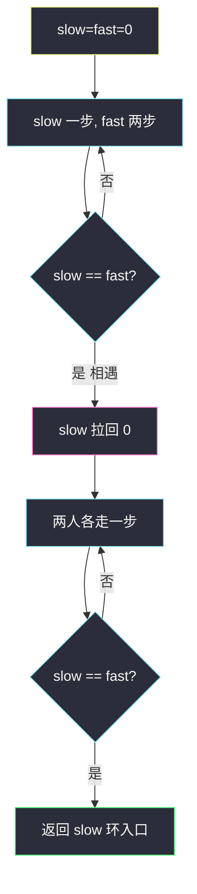

# 寻找重复数（数组当链表 · Floyd 环入口）

## 一、问题描述

给定长度为 `n + 1` 的数组 `nums`，其中每个值都在 `[1, n]`。保证**恰好有一个**数字出现 ≥ 2 次，其余都恰好一次。请找出那个重复数。

进阶约束（面试常卡）：

- **不能改**原数组
- 只用 **`O(1)` 额外空间**
- 时间小于 `O(n²)`

> 🔗 LeetCode 287：https://leetcode.cn/problems/find-the-duplicate-number/
>
> 数据范围：`1 <= n <= 10^5`，`nums.length == n + 1`，`1 <= nums[i] <= n`。重复数可能出现两次或更多。
>
> 📚 灵神题单 **§1.6 快慢指针**。

**示例 1**

```
输入：nums = [1,3,4,2,2]
输出：2
```

**示例 2**

```
输入：nums = [3,1,3,4,2]
输出：3
```

**直观理解**

下标当节点、`nums[i]` 当 `next`：从 `i` 走到 `nums[i]`。值域是 `1..n`，下标有 `0..n`，所以 **0 没有人指向它**，从 0 出发一定先走一段链。重复值 `d` 意味着至少两个下标指向 `d`，于是 `d` 有 ≥ 2 个入度——图里出现环，**环入口就是 `d`**。这和 [142. 环形链表 II](https://leetcode.cn/problems/linked-list-cycle-ii/) 是同一题。

---

## 二、暴力解法

哈希表记出现过的值，第一次撞见的就是答案。`O(n)` 时间，但 **`O(n)` 空间**，不满足进阶。

```python
class Solution:
    def findDuplicate(self, nums: List[int]) -> int:
        seen = set()
        for x in nums:
            if x in seen:
                return x
            seen.add(x)
        return -1
```

排序后再扫相邻相等也可以，但改了数组（或要拷一份，仍费空间）。

### 🔴 瓶颈在哪里

题目把空间卡死成 `O(1)`、数组只读。能用的信息只剩「把值当指针」这一层图结构。

---

## 三、优化探索（核心章节）

> 📚 灵神 **§1.6 快慢指针**：把 `nums` 看成链表，Floyd 先相遇再找入口。不要用哈希当主解。

### 3.1 建图

边 `i → nums[i]`。以 `[1,3,4,2,2]` 为例（下标 0..4，值 1,3,4,2,2）：

```
0 → 1 → 3 → 2 → 4
                ↑   ↓
                └───┘
```

值序列 `1 → 3 → 2 → 4 → 2 → …`。环是 `2 → 4 → 2`，入口 **2** 即重复数。

为何一定有环、且入口是重复值：`n+1` 个点、出度都是 1，值在 `1..n`，点 0 入度为 0。由鸽笼，某个值 `d` 被写了至少两次，即至少两条边指向节点 `d`，`d` 成为环入口（也可能环上还有别的点，但入口只能是那个入度 ≥ 2 的值）。

### 3.2 Floyd 两阶段

**阶段一**：`slow` 一次走一步 `slow = nums[slow]`，`fast` 一次走两步 `fast = nums[nums[fast]]`。有环则必相遇。

**阶段二**：把 `slow` 拉回起点 0，`fast` 停在相遇点，两人每次各走一步，**再次相遇就是入口**。

记链长（0 到入口，不含入口）为 `L`，环长 `C`，相遇时慢指针已经在环里走了 `K` 步（`0 ≤ K < C`）。则：

- 慢走了 `L + K`
- 快走了 `2(L + K)`
- 多走的 `L + K` 必是环长的整数倍：`L + K = mC`（`m ≥ 1`）
- 整理：`L = mC - K = (m-1)C + (C - K)`

`C - K` 正是「从相遇点走到入口」的距离。所以从 0 再走 `L` 步，与从相遇点再走 `L` 步，会在入口碰头。这就是阶段二。

代码里 `slow = fast = 0` 后先各走再比较：0 处两指针相等，但不能当成「已相遇」。



### 3.3 值域二分（可选，不改数组）

在值域 `[1, n]` 上二分。令 `cnt` = 数组里 `≤ mid` 的个数：

- 没有重复时，`1..mid` 恰好 `mid` 个数，`cnt == mid`；
- 重复值 `≤ mid` 时，`cnt > mid`，答案在左半（含 `mid`）；
- 否则答案在右半。

`O(n log n)` 时间、`O(1)` 空间、只读。能过，但不是 §1.6 要练的快慢指针；主解仍用线性 Floyd。

```python
def findDuplicate(nums: List[int]) -> int:
    lo, hi = 1, len(nums) - 1
    while lo < hi:
        mid = (lo + hi) // 2
        cnt = sum(x <= mid for x in nums)
        if cnt > mid:
            hi = mid
        else:
            lo = mid + 1
    return lo
```

### 3.4 一句话核心

> **`i → nums[i]` 成环，重复数就是环入口；快慢相遇后，慢回零再齐步走。**

---

## 四、代码实现

### Python（主解：Floyd）

```python
class Solution:
    def findDuplicate(self, nums: List[int]) -> int:
        slow = fast = 0
        while True:
            slow = nums[slow]
            fast = nums[nums[fast]]
            if slow == fast:
                break
        slow = 0
        while slow != fast:
            slow = nums[slow]
            fast = nums[fast]
        return slow
```

第一段写成 `while True` 再 break：起点 `slow == fast == 0` 若一上来就比，会误判「已相遇」。必须先各走至少一轮。

没有 `None`：值在 `1..n`，下标合法，快指针不会走出数组。重复值出现 3 次以上时，环入口仍是该值，算法不变。

**变量含义**

| 变量 | 含义 |
|------|------|
| `slow` | 一次一步：`slow = nums[slow]` |
| `fast` | 一次两步：`fast = nums[nums[fast]]` |
| 阶段一相等 | 环上某点（不必是入口） |
| 阶段二相等 | 环入口 = 重复数 |

### Java

```java
class Solution {
    public int findDuplicate(int[] nums) {
        int slow = 0, fast = 0;
        do {
            slow = nums[slow];
            fast = nums[nums[fast]];
        } while (slow != fast);
        slow = 0;
        while (slow != fast) {
            slow = nums[slow];
            fast = nums[fast];
        }
        return slow;
    }
}
```

Java 用 `do-while` 同样避开「起点 0==0」。和 Python 的 `while True` 再 break 同一意思。

## 五、具体例子演示

`nums = [1,3,4,2,2]`，边：`0→1`，`1→3`，`2→4`，`3→2`，`4→2`。


**阶段一相遇**（每行是走完该轮之后的位置）

| 轮 | slow 一步 | fast 两步 |
|----|-----------|-----------|
| 1 | 0→1 | 0→1→3 |
| 2 | 1→3 | 3→2→4 |
| 3 | 3→2 | 4→2→4 |
| 4 | 2→4 | 4→2→4 |

`slow == fast == 4`，相遇在 4（环上，不一定是入口）。

**阶段二**：`slow` 拉回 0，`fast` 停在 4。

| 轮 | slow | fast |
|----|------|------|
| 1 | 0→1 | 4→2 |
| 2 | 1→3 | 2→4 |
| 3 | 3→2 | 4→2 |

再次相遇在 **2**，返回 2。对照公式：入口 2，链 `0→1→3→2` 故 `L=3`，环 `2→4→2` 故 `C=2`。相遇点 4 在入口后再 1 步，`K=1`。`L+K=4=2C`，`C-K=1`，从 4 走 1 步到 2，从 0 走 3 步也到 2。

示例 2 `[3,1,3,4,2]`：边 `0→3`，`1→1`（自环，但入度 1 不是入口），`2→3`，`3→4`，`4→2`。从 0 走：`0→3→4→2→3→…`，环 `3→4→2→3`，入口 **3**。`1→1` 是旁支，Floyd 从 0 出发碰不到它。

---

## 六、复杂度分析

| 方法 | 时间 | 空间 | 改数组 | 说明 |
|------|------|------|--------|------|
| 哈希 | `O(n)` | `O(n)` | 否 | 不满足进阶 |
| 排序 | `O(n log n)` | `O(1)` 或 `O(n)` | 通常是 | 不满足只读 |
| 值域二分 | `O(n log n)` | `O(1)` | 否 | 合法备选 |
| Floyd（主解） | `O(n)` | `O(1)` | 否 | 环入口 |

快慢在环上相对速度为 1，阶段一 `O(n)`；阶段二最多再走 `L < n`。

---

## 七、对比总结

| | #142 环形链表 II | #287 |
|--|-----------------|------|
| 节点 | `ListNode` | 下标 `0..n` |
| next | `node.next` | `nums[i]` |
| 无环 / 空 | 可能 | 本题保证有且仅有一个重复 → 必有环 |
| 答案 | 入口节点引用 | 入口下标值（即重复数） |

**易错点**

1. 主解写成 `set`：空间不合格。
2. 阶段一开始就 `while slow != fast`：0==0 直接退出。
3. `fast = nums[fast]` 只走一步，变成两个慢指针，可能永远在环上转圈对不上（相对速度 0）。
4. 把相遇点当成答案：示例 1 相遇在 4，重复数是 2。
5. 改 `nums` 做「归位交换」（把 `x` 放到下标 `x`）：能找出重复，但违反只读。
6. 以为「出现多次」会破坏 Floyd：入度 ≥ 2 的仍然只有那个重复值，入口不变。

---

## 八、举一反三

| 题目 | 关系 |
|------|------|
| [141. 环形链表](https://leetcode.cn/problems/linked-list-cycle/) | 只要阶段一：相遇即有环 |
| [142. 环形链表 II](https://leetcode.cn/problems/linked-list-cycle-ii/) | 阶段二原题，本题是数组版 |
| [202. 快乐数](https://leetcode.cn/problems/happy-number/) | `n → 各位平方和` 当 next，判是否进 1 还是进环 |
| [41. 缺失的第一个正数](https://leetcode.cn/problems/first-missing-positive/) | 能改数组时用归位；本题不能改 |
| [442. 数组中重复的数据](https://leetcode.cn/problems/find-all-duplicates-in-an-array/) | 可改数组，下标取负标记 |
| [268. 丢失的数字](https://leetcode.cn/problems/missing-number/) | `0..n` 缺一个，可用异或；本题是多一个重复 |
| [645. 错误的集合](https://leetcode.cn/problems/set-mismatch/) | 同时找重复与缺失，能改数组时归位 |

**思想迁移**

- 口诀：**「下标当点值当边，重复就是环入口；快慢先撞，慢回零，齐步再遇即答案。」**
