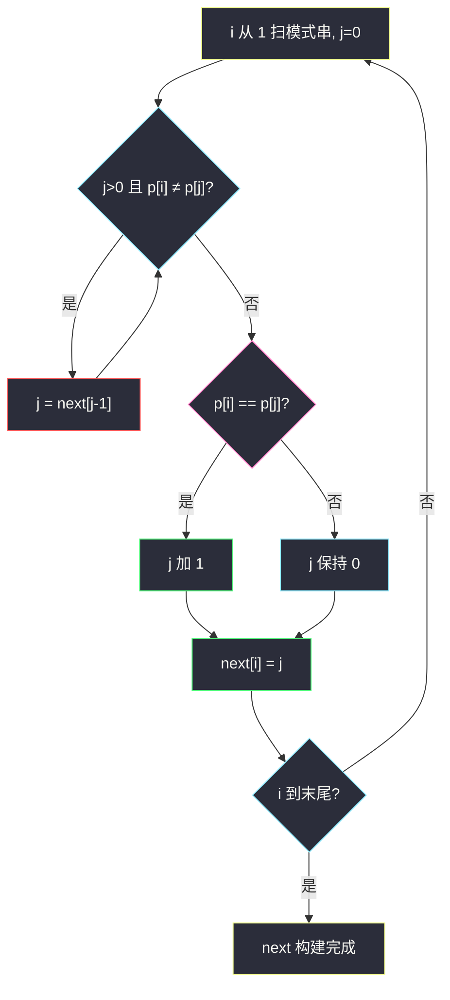
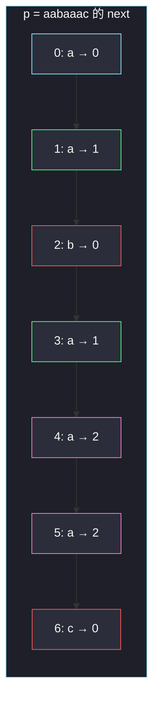

# 找出字符串中第一个匹配项的下标（KMP · next 数组）

## 一、问题描述

给定两个字符串 `haystack` 和 `needle`，在 `haystack` 中找出 `needle` **第一次出现**的下标；不存在则返回 `-1`。`needle` 为空串时返回 `0`。

> 🔗 LeetCode 28：https://leetcode.cn/problems/find-the-index-of-the-first-occurrence-in-a-string/
>
> 数据范围：`0 ≤ needle.length ≤ 10^4`，`0 ≤ haystack.length ≤ 10^4`，只含小写字母。
>
> 📚 灵茶题单：**一、KMP（前缀的后缀）**。模板题。`next[i]` = 模式串 `p[0..i]` 的**最长真前缀且是后缀**的长度；匹配失配时 `j = next[j-1]`，主串指针不回退。Python 的 `str.find` 能过，但正文主解必须手搓 KMP。

**示例 1**

```
输入：haystack = "sadbutsad", needle = "sad"
输出：0
解释：下标 0 和 6 都能匹配，取第一次。
```

**示例 2**

```
输入：haystack = "leetcode", needle = "leeto"
输出：-1
解释：needle 不是 haystack 的子串。
```

**直观理解**

暴力是「主串每个起点尝试对齐模式串」，一旦失配，起点加 1，模式串从头再比，主串上已经比过的字符被浪费。KMP 预先问模式串：我自己的前缀和后缀哪里重叠？失配时模式串滑到重叠处，主串下标 `i` 只增不减。

---

## 二、暴力解法

枚举 `haystack` 的每个起点 `i`，向后比 `m` 个字符。

```python
class Solution:
    def strStr(self, haystack: str, needle: str) -> int:
        n, m = len(haystack), len(needle)
        if m == 0:
            return 0
        for i in range(n - m + 1):
            if haystack[i : i + m] == needle:
                return i
        return -1
```

或对每个 `i` 再套一层 `j` 逐字符比较，最坏 `O(nm)`。官方两例都能过；`n=m=10^4` 且反复失配在最后一位时会顶格。`str.find` 同样能过本题，但学不到 next。

### 🔴 瓶颈在哪里

主串指针在失配后回到 `i+1`，模式串回到 0。其实 `haystack[i..i+j-1]` 已经等于 `needle[0..j-1]`，里面若有「前缀=后缀」，下一轮不必从零比。把这段自重叠信息做成 `next` 数组，匹配变成 `O(n+m)`。

---

## 三、优化探索（核心章节）

> 📚 本题在灵茶题单中属于 **一、KMP（前缀的后缀）**。`next` 描述的就是「真前缀同时又是后缀」的最长长度。构建 `next` 本身也是一次「模式串自己和自己匹配」。

### 3.1 next[i] 是什么

记模式串为 `p`，长度为 `m`。`next[i]` 定义为：

> `p[0..i]` 这个长度为 `i+1` 的串，最长的 **真** 前缀，同时也是它的后缀，这个前缀有多长。

真前缀、真后缀不能取整段自己，所以 `next[i] < i+1`，`next[0] = 0`（单个字符没有真前缀）。

例：`p = "abab"`

| i | p[0..i] | 真前缀 | 真后缀 | 最长相等者 | next[i] |
|---|---------|--------|--------|------------|---------|
| 0 | a | （无） | （无） | — | 0 |
| 1 | ab | a | b | 无 | 0 |
| 2 | aba | a, ab | a, ba | a | 1 |
| 3 | abab | a, ab, aba | b, ab, bab | ab | 2 |

`next = [0, 0, 1, 2]`。读法：已经匹配到下标 3 时若下一格失配，可以退到长度为 2 的前缀 `"ab"`，继续比。

### 3.2 怎么线性求出 next

和匹配同一个骨架：`i` 扫模式串（从 1 起），`j` 表示「当前最长前后缀长度」，也就是「下一个要和 `p[i]` 比的前缀位置」。

```
j = 0
对 i = 1 .. m-1:
    当 j>0 且 p[i] != p[j]:
        j = next[j-1]          # 前缀缩到次长边界
    若 p[i] == p[j]:
        j += 1                 # 前后缀都延长 1
    next[i] = j
```

为什么 `j = next[j-1]` 仍然正确：`p[0..j-1]` 已经是 `p[0..i-1]` 的后缀；它自己的最长边界是 `next[j-1]`，于是更短的前缀 `p[0..next[j-1]-1]` 同样是 `p[0..i-1]` 的后缀。一层层缩短，不会漏掉更短但仍相等的前后缀。



红节点是失配回跳，这就是 KMP 比暴力省掉的那部分。

### 3.3 主串上怎么用 next

`i` 扫 `haystack`（只增不减），`j` 表示「模式串已经对齐了多长」。

- `s[i]==p[j]`：`j += 1`。若 `j==m`，在下标 `i-m+1` 找到。
- 否则若 `j>0`：`j = next[j-1]`，**`i` 不动**，用缩短后的前缀再比 `s[i]`。
- `j==0` 仍不等：`i` 前进，这一位匹配不了任何前缀。

空模式：`m==0`，按题意直接返回 0，不要去建 `next`。

### 3.4 一句话核心

> **next[i] 是 p[0..i] 最长的「既是真前缀又是后缀」的长度；失配时 j 跳到 next[j-1]，i 不回退。**

---

## 四、代码实现

### Python（主解：手搓 KMP）

```python
class Solution:
    def strStr(self, haystack: str, needle: str) -> int:
        n, m = len(haystack), len(needle)
        if m == 0:
            return 0
        nxt = [0] * m
        j = 0
        for i in range(1, m):
            while j > 0 and needle[i] != needle[j]:
                j = nxt[j - 1]
            if needle[i] == needle[j]:
                j += 1
            nxt[i] = j
        j = 0
        for i in range(n):
            while j > 0 and haystack[i] != needle[j]:
                j = nxt[j - 1]
            if haystack[i] == needle[j]:
                j += 1
            if j == m:
                return i - m + 1
        return -1
```

对照（不作为主解）：`return haystack.find(needle)`。空 needle 时 `find` 也返回 0，和题意一致。

**变量含义**

| 写法 | 含义 |
|------|------|
| `nxt[i]` | `needle[0..i]` 的最长边界长度 |
| 构建时的 `j` | 当前候选前后缀长度 |
| 匹配时的 `j` | 模式串已匹配长度 |
| `j = nxt[j-1]` | 失配，滑到次长边界 |
| `i - m + 1` | `j==m` 时窗口左端 |

构建和匹配两段代码几乎同构：一段模式对模式，一段主串对模式。

---

## 五、具体例子演示

### 5.1 构建 next：p = "aabaaac"（把回跳讲清楚）

逐步跟踪 `i / j / next`。初始 `next[0]=0`，`j=0`。

| i | p[i] | j（比之前） | 动作 | 新 j | next[i] |
|---|------|-------------|------|------|---------|
| 1 | a | 0 | p[1]==p[0]，j+1 | 1 | 1 |
| 2 | b | 1 | p[2]=b ≠ p[1]=a，j=next[0]=0；b≠a | 0 | 0 |
| 3 | a | 0 | p[3]==p[0]，j+1 | 1 | 1 |
| 4 | a | 1 | p[4]==p[1]=a，j+1 | 2 | 2 |
| 5 | a | 2 | p[5]=a ≠ p[2]=b，j=next[1]=1；p[5]==p[1]，j+1 | 2 | 2 |
| 6 | c | 2 | c≠b，j=next[1]=1；c≠a，j=next[0]=0；c≠a | 0 | 0 |

`next = [0, 1, 0, 1, 2, 2, 0]`。

第 `i=5` 行最关键：已经有长度为 2 的前后缀 `"aa"`，下一位该对 `p[2]='b'`，实际是 `'a'`。跳到 `next[1]=1`，变成「长度为 1 的前缀 `"a"` 再接这个 `'a'`」，于是新边界是 `"aa"`，`next[5]=2`。若失配时直接 `j=0`，会丢掉这个长度为 2 的边界。



绿是「跟上一位相同、边界+1」；粉是「发生过回跳仍找回边界」；红是边界被清零。

### 5.2 官方示例 1：haystack="sadbutsad", needle="sad"

先建 next。`p="sad"`：

| i | 比较 | next[i] |
|---|------|---------|
| 1 | `'a'≠'s'`，j=0 | 0 |
| 2 | `'d'≠'s'`，j=0 | 0 |

`next = [0, 0, 0]`，无自重叠。匹配：

| i | haystack[i] | j 前 | 比较 | j 后 |
|---|-------------|------|------|------|
| 0 | s | 0 | == p[0] | 1 |
| 1 | a | 1 | == p[1] | 2 |
| 2 | d | 2 | == p[2] | 3 = m |

`j==3`，返回 `i-m+1 = 2-3+1 = 0`。对拍官方。后面 `i=6` 还能再匹配一次，但已经返回第一次。

### 5.3 官方示例 2：haystack="leetcode", needle="leeto"

`p="leeto"`，各位与 `p[0]='l'` 都不等（除了自己），`next = [0,0,0,0,0]`。

| i | 字符 | j 前 | 动作 | j 后 |
|---|------|------|------|------|
| 0 | l | 0 | == p[0] | 1 |
| 1 | e | 1 | == p[1] | 2 |
| 2 | e | 2 | == p[2] | 3 |
| 3 | t | 3 | == p[3] | 4 |
| 4 | c | 4 | c≠o，j=next[3]=0；c≠l | 0 |
| 5 | o | 0 | o≠l | 0 |
| 6 | d | 0 | d≠l | 0 |
| 7 | e | 0 | e≠l | 0 |

`j` 从未到 5，返回 -1。对拍官方。暴力在 `i=0` 比到 `'c'` 才失败，起点改成 1 又从 `'e'` 对 `'l'` 重来；KMP 的 `i` 继续往右，已经匹配的 `"leet"` 只在 `j` 上回退。

### 5.4 空 needle

`m=0`，代码第一行返回 0。与 `"".find("")==0` 一致。

---

## 六、复杂度分析

| 方法 | 时间 | 空间 | 说明 |
|------|------|------|------|
| 枚举起点暴力 | `O(nm)` | `O(1)` | 最坏顶格 |
| `str.find` | 实现相关 | `O(1)` | 能过，不是本课 |
| KMP（主解） | `O(n+m)` | `O(m)` | 建 next `O(m)`，匹配 `O(n)` |

`i` 单调增加，`j` 每次要么 +1 要么沿 next 严格变小，摊还 `O(1)`。空间就是长度为 `m` 的 `next`。

---

## 七、对比总结

| 维度 | 暴力 | KMP |
|------|------|-----|
| 主串指针 | 失配回退 | 只增不减 |
| 预处理 | 无 | next：最长真前后缀 |
| 最坏 | `O(nm)` | `O(n+m)` |
| 空模式 | 单独判断 | 同样单独判断 |

**易错点**

1. **`next[0]` 写成 -1**：那是「失配数组」另一套下标约定。本模板全 0-based，`next[0]=0`，回跳用 `next[j-1]`。
2. **构建从 i=0 开始**：`i` 必须从 1 起，否则自己和自己比会把 `next[0]` 搞乱。
3. **失配写成 `j=0`**：错过次长边界，见 `"aabaaa"` 的 `next[5]`。
4. **找到后还继续**：本题只要第一次，`j==m` 立刻返回。
5. **空 needle 去建 next**：`[0]*0` 能跑，但循环匹配对空模式不自然，开头特判最干净。
6. **把 next 定义成「前缀函数 π[i] 对 p[0..i-1]」**：差一位，抄模板时不要混。

---

## 八、举一反三

| 题目 | 关系 |
|------|------|
| [459. 重复的子字符串](https://leetcode.cn/problems/repeated-substring-pattern/) | `n % (n - next[n-1]) == 0` 且 next 末尾 > 0 |
| [1392. 最长快乐前缀](https://leetcode.cn/problems/longest-happy-prefix/) | 就是 `next[n-1]` 对应的前缀 |
| [214. 最短回文串](https://leetcode.cn/problems/shortest-palindrome/) | 对 `s + '#' + reverse(s)` 求 next |
| [686. 重复叠加字符串匹配](https://leetcode.cn/problems/repeated-string-match/) | 叠加后做 KMP |
| [796. 旋转字符串](https://leetcode.cn/problems/rotate-string/) | `b in (a+a)`，可用 KMP |
| [718. 最长重复子数组](https://leetcode.cn/problems/maximum-length-of-repeated-subarray/) | 同批字符串：连续段用哈希二分，不是 next |

**思想迁移**

- 凡是「已经匹配了一段、失配后想复用」，先问这段的最长边界。
- 口诀：**「next 记最长真前后缀；失配 j 跳 next[j-1]，i 永不回头。」**
