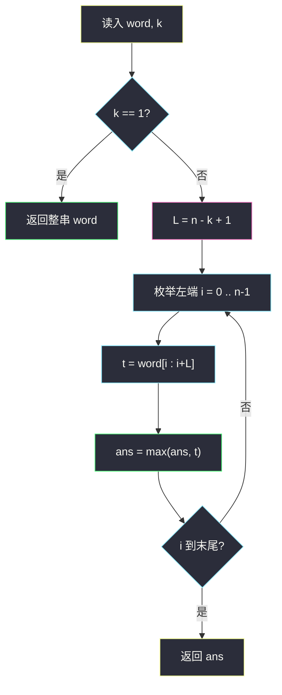
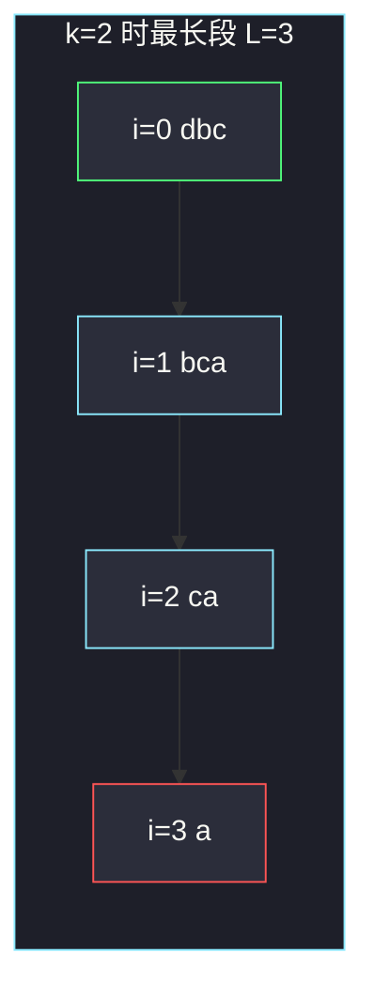

# 从盒子中找出字典序最大的字符串 I（最大段长 / 最大后缀）

## 一、问题描述

给定字符串 `word` 和整数 `numFriends`。每一回合把 `word` 切成 **`numFriends` 段非空连续子串**，切法必须和之前任何回合都不同；切出来的每一段都放进盒子。所有回合结束后，返回盒子里**字典序最大**的那个串。

> 🔗 LeetCode 3403：https://leetcode.cn/problems/find-the-lexicographically-largest-string-from-the-box-i/
>
> 数据范围：`1 ≤ word.length ≤ 5·10³`，只含小写字母，`1 ≤ numFriends ≤ word.length`。`O(n²)` 可过。
>
> 📚 灵茶题单：**五、最小表示法**。最小表示法用 `i/j/k` 双指针找循环串的最小起点；本题不是循环，而是「盒子 = 所有不太长的子串」，再在这些子串里取字典序最大。`numFriends = 1` 时只能切 1 段，答案就是整串。否则最大段长 `L = n - numFriends + 1`，答案等于所有长度 `≤ L` 的子串之 max。也可先求 [#1163 最大后缀](https://leetcode.cn/problems/last-substring-in-lexicographical-order/)，再截到长度 `L`。

**示例 1**

```
输入：word = "dbca", numFriends = 2
输出："dbc"
解释：三种切法 "d"|"bca"、"db"|"ca"、"dbc"|"a"，盒子里最大是 "dbc"。
```

**示例 2**

```
输入：word = "gggg", numFriends = 4
输出："g"
解释：必须切成 4 段，每段只能是单个 "g"。
```

**直观理解**

朋友越多，每人分到的段越碎，盒子里最长的串就越短。朋友只有 1 个时，整串原封不动进盒子，不可能出现真子串。

---

## 二、暴力解法

枚举把 `n-1` 个间隙里选 `numFriends-1` 个切开的所有方案，把每段丢进集合再取 max。`numFriends=1` 时只有一种切法。

```python
class Solution:
    def answerString(self, word: str, numFriends: int) -> str:
        n = len(word)
        box = set()

        def dfs(start: int, left: int) -> None:
            if left == 1:
                box.add(word[start:])
                return
            # 后面还要留 left-1 个非空段
            for end in range(start + 1, n - (left - 1) + 1):
                box.add(word[start:end])
                dfs(end, left - 1)

        dfs(0, numFriends)
        return max(box)
```

`n = 8`、朋友较少时能过官方例。切点组合数是 `C(n-1, k-1)`，再乘上收集子串，`n = 5000` 爆炸。

### 🔴 瓶颈在哪里

盒子里的串看起来很多，其实**不是任意子串都能出现**，能出现的有一个简单的长度上限。抓住上限之后，不必再枚举切法。

---

## 三、优化探索（核心章节）

> 📚 本题在灵茶题单中属于 **五、最小表示法**。本节先把盒子里「究竟有哪些串」说清楚，`O(n²)` 枚举左端即可；真正的 `i/j/k` 最大后缀算法放到 [#1163](https://leetcode.cn/problems/last-substring-in-lexicographical-order/)（`last-substring-in-lexicographical-order.md`），本题复用它的截断结论。

### 3.1 一段最长能有多长

`k = numFriends` 段都非空，其余 `k-1` 段每人至少占 1 个字符，留给「最长那一段」的上限是

`L = n - (k - 1) = n - numFriends + 1`

任何盒子里的串长度都 `≤ L`。反过来：任意一个长度恰好为 `L` 的子串 `word[i:i+L]`，都可以作为其中一段——其余 `n-L = k-1` 个字符各自成段。更短的子串也能作为某段出现（把长度让给别的段）。

所以：

> `k = 1` 时盒子 = `{word}`；`k ≥ 2` 时盒子 = **所有长度 ≤ `L` 的子串**。

「所有长度 ≤ L」里，长度恰好为 L 的子串一定能当某一段：把它当作一块，剩下 `k-1` 个字符各自成段。更短的子串：把同一块切短、把长度让给左右其它段即可，只要左右还各能切出非空段（或它本身贴着串头 / 串尾）。枚举左端时不需要再模拟左右怎么切——字典序只关心这段内容。

`k = 1` 必须单独处理：此时 `L = n`，若仍按「所有长度 ≤ n 的子串」取 max，会变成**最大后缀**，例如 `"ab"` 会错成 `"b"`，而唯一合法切法只有整串 `"ab"`。

### 3.2 固定左端，越长越大

字典序：若 `A` 是 `B` 的真前缀，则 `A < B`（短的更小）。因此**同一个左端点** `i` 出发、长度不超过 `L` 的所有子串里，最长的那个最大，也就是

`word[i : i + L]`

Python 切片在右端超出 `n` 时自动截断，等价于 `word[i : min(n, i+L)]`，即「从 `i` 起尽量取 `L` 个，不够就取到末尾」。

全局答案 = 这些「每个左端的最长合法子串」里的 max。不必再枚举更短的：它们都是某个更长候选的前缀，字典序不会更大。



### 3.3 和最小表示法 / #1163 的关系

最小表示法找的是**循环移位**里字典序最小的起点，双指针 `i`（当前最优）、`j`（挑战者）、`k`（已匹配长度）。把比较方向反过来、去掉「绕回开头」，就变成 [#1163 按字典序排在最后的子串](https://leetcode.cn/problems/last-substring-in-lexicographical-order/)：字典序最大的**后缀**。

`k ≥ 2` 时，所有长度 ≤ `L` 的子串的 max，等于「最大后缀」截断到长度 `L`：若最大后缀从 `i` 开始，答案是 `word[i:i+L]`。正确性：任意子串是某个后缀的前缀；后缀里最大的那个，它的长度为 `min(L, 剩余)` 的前缀，不会输给别的短串。

`n = 5000` 时直接 `max(...)` 更短，作为主解。`O(n)` 版见 1163 题解，把返回值再 `[:L]` 即可。会员题 [3406](https://leetcode.cn/problems/find-the-lexicographically-largest-string-from-the-box-ii/) 把 `n` 提到 `2·10⁵`，同一套截断必须上线性最大后缀，枚举左端会超时。

### 3.4 一句话核心

> **朋友 ≥ 2 时，盒子 = 长度 ≤ n-k+1 的全体子串；每个左端只留最长的，再取 max。k=1 返回整串。**

---

## 四、代码实现

### Python（主解：枚举左端）

```python
class Solution:
    def answerString(self, word: str, numFriends: int) -> str:
        if numFriends == 1:
            return word
        n = len(word)
        L = n - (numFriends - 1)
        return max(word[i : i + L] for i in range(n))
```

**变量含义**

| 写法 | 含义 |
|------|------|
| `numFriends == 1` | 只能切一段，答案是 `word` |
| `L` | 任意一段的最大长度 `n-k+1` |
| `word[i:i+L]` | 从 `i` 出发的最长合法子串 |
| `max(...)` | 字典序最大 |

对照（不作为主解）：先跑 1163 的最大后缀 `s`，再 `return s[:L]`。`k=1` 时不能这么做。

---

## 五、具体例子演示

### 5.1 官方示例 1：`word="dbca"`, `k=2`

`n=4`，`L=4-1=3`。每个左端取长 3（或到末尾）：

| i | `word[i:i+3]` | 说明 |
|---|----------------|------|
| 0 | `"dbc"` | `"d"`、`"db"` 都是它的前缀，更小 |
| 1 | `"bca"` | |
| 2 | `"ca"` | 只剩 2 个字符 |
| 3 | `"a"` | |

`max("dbc","bca","ca","a") = "dbc"`。对拍官方。三种真实切法里出现过 `"dbc"`、`"bca"`、`"ca"`、`"db"`、`"d"`、`"a"`，没有比 `"dbc"` 更大的。



绿是答案；红是短后缀，字典序最小。

### 5.2 官方示例 2：`word="gggg"`, `k=4`

`L=4-3=1`，每个左端只取 1 个字符，全是 `"g"`，答案 `"g"`。若误把 `k=1` 的逻辑用过来会返回整串 `"gggg"`，但 4 个朋友不可能分到长度 4 的段。

### 5.3 必须特判 `k=1`：`word="ab"`, `k=1`

盒子里只有 `"ab"`。若不特判，`L=2`，`max("ab","b")="b"`，**错**。`"b"` 要作为一段出现，至少还得再切出另一段，需要 `k≥2`。

`k=2` 时 `L=1`，答案确实是 `"b"`（切 `"a"|"b"`）。同一字符串，朋友人数一变，答案从整串变成最大字符。

### 5.4 短后缀反而更大：`word="za"`, `k=2`

`L=1`。候选 `"z"`、`"a"`，答案 `"z"`。若有人觉得「尽量取长」，在 `L=1` 时已经不能取 `"za"`——那是 `k=1` 才能进盒子的整串。

再看 `word="ybza"`, `k=2`，`L=3`：

| i | 候选 | 与当前 max 比 |
|---|------|----------------|
| 0 | `"ybz"` | 暂定答案 |
| 1 | `"bza"` | `'b' < 'y'`，丢掉 |
| 2 | `"za"` | `'z' > 'y'`，换答案 |
| 3 | `"a"` | `'a' < 'z'` |

`max` 为 `"za"`：虽然短，但首字符 `z` 大于 `"ybz"` 的 `y`。固定左端越长越大，**不同左端**仍可能短的赢。

切法上 `"za"` 作为最后一段出现：`"yb"|"za"`。其余 `k-1=1` 段刚好吃掉左边两个字符。若误以为「答案长度必须是 L」，会拿走 `"ybz"`，字典序更小。

### 5.5 复用最大后缀：`word="dbca"`, `k=2`

最大后缀是 `"dbca"` 自己（`'d'` 是最大首字符，且更长）。截到 `L=3` 得 `"dbc"`，与枚举左端一致。`k=1` 时若仍截断会错，所以主解把 `k==1` 放在最前面。

---

## 六、复杂度分析

| 方法 | 时间 | 空间 | 说明 |
|------|------|------|------|
| 枚举全部切法 | 指数 | 切出的子串 | `n=5000` 不可用 |
| 枚举左端 + max（主解） | `O(n²)` | `O(n)` 答案串 | 最多 n 次、每次比 `O(n)` 个字符 |
| 最大后缀再截断 | `O(n)` | `O(1)` 额外 | 复用 1163，`k=1` 仍要特判 |

字符串比较在最坏情况（几乎全相同）每次 `O(n)`，总 `O(n²)`，与数据范围匹配。

---

## 七、对比总结

| 维度 | 枚举切法 | 枚举左端 | 最大后缀截断 |
|------|----------|----------|--------------|
| 找哪些串进盒子 | 真的去切 | 用长度公式 | 先找最大后缀 |
| `k=1` | 自然正确 | 必须特判 | 必须特判 |
| 实现量 | DFS 长 | 三行 | 要写双指针 |

**易错点**

1. **`numFriends==1` 忘记特判**：`"ab"` 会错成 `"b"`。
2. **以为答案一定长度恰好为 `L`**：见 5.4，`"za"` 比更长的 `"ybz"` 大。
3. **漏掉末尾短串**：`i` 要走到 `n-1`，不能只枚举 `i ≤ n-L`。短后缀可能是最大字符。
4. **`L` 写成 `n-numFriends`**：少了 `+1`。其余 `k-1` 段各 1 个字符，自己还能留 `n-(k-1)`。
5. **字典序和长度搞反**：同前缀时更长更大，所以固定左端只留最长；不是「越短越大」。
6. **循环最小表示直接套**：本题不是环形，末尾不能接到开头。

---

## 八、举一反三

| 题目 | 关系 |
|------|------|
| [1163. 按字典序排在最后的子串](https://leetcode.cn/problems/last-substring-in-lexicographical-order/)（`last-substring-in-lexicographical-order.md`） | 本题 `k≥2` 的 `O(n)` 做法：最大后缀截到 `L` |
| [3406. 从盒子中找出字典序最大的字符串 II](https://leetcode.cn/problems/find-the-lexicographically-largest-string-from-the-box-ii/) | 同题 `n` 升到 `2·10⁵`，必须走 1163 的 `O(n)` 截断，不能再 `O(n²)` 枚举左端 |
| [1754. 构造字典序最大的合并字符串](https://leetcode.cn/problems/largest-merge-of-two-strings/)（`largest-merge-of-two-strings.md`） | 反复比较两个后缀谁更大，贪心取头 |
| [1160. 拼写单词](https://leetcode.cn/problems/find-words-that-can-be-formed-by-characters/) | 只是名字像，和最大后缀无关 |
| [28. 找出字符串中第一个匹配项的下标](https://leetcode.cn/problems/find-the-index-of-the-first-occurrence-in-a-string/)（`find-the-index-of-the-first-occurrence-in-a-string.md`） | 同批字符串课：KMP 是前缀的后缀，本题是后缀比大小 |

**思想迁移**

- 「切成 k 段非空」→ 最长一段 = `n-k+1`，先把长度上限写出来。
- 口诀：**「一人独吃拿整串；多人分食看最长段，每个起点只留最长再比 max。」**
