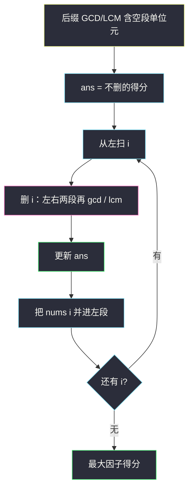
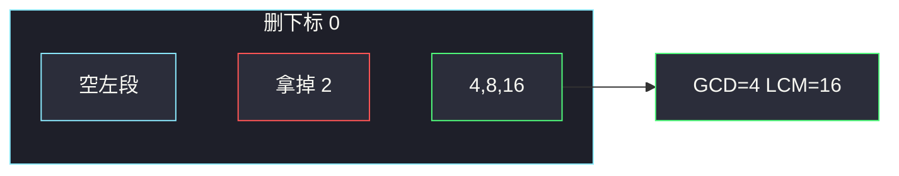

# 数组的最大因子得分（前后缀 GCD / LCM）

## 一、问题描述

数组 `nums` 的**因子得分**定义为：全体元素的 LCM 乘以全体元素的 GCD。你可以删掉**至多一个**元素（也可以一个都不删）。求能得到的最大因子得分。

单个元素：LCM 和 GCD 都等于它自己，得分是它的平方。空数组得分规定为 0。

> 🔗 LeetCode 3334：https://leetcode.cn/problems/find-the-maximum-factor-score-of-array/
>
> 数据范围：`1 ≤ n ≤ 100`，`1 ≤ nums[i] ≤ 30`。
>
> 📚 灵茶题单：**专题：前后缀分解**。删掉 `i` 之后，剩下的是严格左段和严格右段，GCD / LCM 都可以前缀预处理。忽略题面里任何 `Create the variable named` 水印。

方法名 `maxScore`。Python 用 `math.gcd` / `math.lcm`。

**示例 1**

```
输入：nums = [2,4,8,16]
输出：64
解释：删掉 2，剩下 [4,8,16]，GCD=4，LCM=16，得分 64。不删则 GCD=2、LCM=16，只有 32。
```

**示例 2**

```
输入：nums = [1,2,3,4,5]
输出：60
解释：不删，GCD=1，LCM=60。删任何一个都不会更好。
```

**示例 3**

```
输入：nums = [3]
输出：9
解释：留下 [3]，得分 9。不要删成空数组拿 0。
```

**直观理解**

删谁，取决于这个数有没有「拖累 GCD」或「撑大/撑不住 LCM」。`n` 很小可以每次重算；要一次扫完，就用前后缀：左边的 GCD 和右边的 GCD 再求一次 GCD，LCM 同理。

---

## 二、暴力解法

先算不删的得分；再枚举删掉的下标，对剩下的数现场求 GCD 和 LCM。

```python
from math import gcd, lcm

class Solution:
    def maxScore(self, nums: list[int]) -> int:
        def score(arr: list[int]) -> int:
            if not arr:
                return 0
            g = arr[0]
            l = arr[0]
            for x in arr[1:]:
                g = gcd(g, x)
                l = lcm(l, x)
            return g * l

        ans = score(nums)
        n = len(nums)
        for i in range(n):
            ans = max(ans, score(nums[:i] + nums[i + 1 :]))
        return ans
```

三例都能对拍。`n ≤ 100`、值 ≤ 30，`O(n² log A)` 足够过。写成前后缀是为了套专题模板，也避免每次切片。

### 🔴 瓶颈在哪里

删 `i` 时，左段 `[0..i)` 和右段 `(i..n)` 与 `i` 无关。把两段的 GCD、LCM 预处理好，每个 `i` 就能 `O(log A)` 合并。这和「除自身以外的乘积」是同一刀：切开，不要中间那个。

---

## 三、优化探索（核心章节）

> 📚 **专题：前后缀分解**。空前缀的 GCD 取 **0**（因为 `gcd(0, x) = x`），空前缀的 LCM 取 **1**（因为 `lcm(1, x) = x`）。不要把两个单位元写反，更不要都写成 0：`lcm(0, x)` 在 Python 里是 0，会把整段得分清零。

### 3.1 后缀数组

`suf_gcd[i]` = `nums[i], …, nums[n-1]` 的 GCD，`suf_gcd[n] = 0`。  
`suf_lcm[i]` = 同段 LCM，`suf_lcm[n] = 1`。

从右往左：

```
suf_gcd[i] = gcd(nums[i], suf_gcd[i+1])
suf_lcm[i] = lcm(nums[i], suf_lcm[i+1])
```

不删时的得分就是 `suf_gcd[0] * suf_lcm[0]`。

### 3.2 边走边合并左段

再从左往右扫，维护已经路过的左段 `pre_gcd`、`pre_lcm`。轮到 `i` 时，左段是 `[0..i)`（还没把 `nums[i]` 并进去），右段是 `suf_*[i+1]`。

删掉 `i` 的得分：

```
gcd(pre_gcd, suf_gcd[i+1]) * lcm(pre_lcm, suf_lcm[i+1])
```

算完再把 `nums[i]` 并进左段，给下一个 `i` 用。

`n=1` 且「删掉唯一元素」时：`gcd(0, 0)=0`，`lcm(1,1)=1`，得分 0；再和「不删」的平方取 max，得到示例 3 的 9。



### 3.3 值很小说明什么

`nums[i] ≤ 30`，整段 LCM 不会超过 `lcm(1..30)`，大约 `2.3×10^12`，再乘 GCD 仍远小于 64 位。Java 要用 `long`。不必分解质因数，直接 `gcd`/`lcm` 即可。

### 3.4 一句话核心

> **至多删一个 = 不删，或枚举切开点；空段 GCD 用 0、LCM 用 1，左右再合并。**

---

## 四、代码实现

### Python（主解）

```python
from math import gcd, lcm

class Solution:
    def maxScore(self, nums: list[int]) -> int:
        n = len(nums)
        suf_gcd = [0] * (n + 1)
        suf_lcm = [1] * (n + 1)
        for i in range(n - 1, -1, -1):
            suf_gcd[i] = gcd(nums[i], suf_gcd[i + 1])
            suf_lcm[i] = lcm(nums[i], suf_lcm[i + 1])

        ans = suf_gcd[0] * suf_lcm[0]  # 一个都不删
        pre_gcd, pre_lcm = 0, 1
        for i, x in enumerate(nums):
            g = gcd(pre_gcd, suf_gcd[i + 1])
            l = lcm(pre_lcm, suf_lcm[i + 1])
            ans = max(ans, g * l)
            pre_gcd = gcd(pre_gcd, x)
            pre_lcm = lcm(pre_lcm, x)
        return ans
```

`math.lcm` 需要 Python 3.9+。更老的写法是 `a // gcd(a, b) * b`。

### Java（最优解，返回 long）

```java
class Solution {
    public long maxScore(int[] nums) {
        int n = nums.length;
        long[] sufGcd = new long[n + 1];
        long[] sufLcm = new long[n + 1];
        sufLcm[n] = 1;
        for (int i = n - 1; i >= 0; i--) {
            sufGcd[i] = gcd(nums[i], sufGcd[i + 1]);
            sufLcm[i] = lcm(nums[i], sufLcm[i + 1]);
        }
        long ans = sufGcd[0] * sufLcm[0];
        long preGcd = 0, preLcm = 1;
        for (int i = 0; i < n; i++) {
            ans = Math.max(ans, gcd(preGcd, sufGcd[i + 1]) * lcm(preLcm, sufLcm[i + 1]));
            preGcd = gcd(preGcd, nums[i]);
            preLcm = lcm(preLcm, nums[i]);
        }
        return ans;
    }

    private long gcd(long a, long b) {
        return b == 0 ? a : gcd(b, a % b);
    }

    private long lcm(long a, long b) {
        return a / gcd(a, b) * b;
    }
}
```

力扣 Java 签名返回 `long`，不要写成 `int`。

---

## 五、具体例子演示

### 5.1 官方示例 1：`[2,4,8,16]` → 64

从右往左填后缀（空段 `gcd=0, lcm=1`）：

| i | nums[i] | suf_gcd[i] | suf_lcm[i] |
|---|---------|------------|------------|
| 4 | （空） | 0 | 1 |
| 3 | 16 | 16 | 16 |
| 2 | 8 | 8 | 16 |
| 1 | 4 | 4 | 16 |
| 0 | 2 | 2 | 16 |

不删：`2 × 16 = 32`。

再从左扫，删 `i`：

| i | 删除 | 左 gcd/lcm | 右 gcd/lcm | 合并 | 得分 |
|---|------|------------|------------|------|------|
| 0 | 2 | 0 / 1 | 4 / 16 | 4 × 16 | **64** |
| 1 | 4 | 2 / 2 | 8 / 16 | 2 × 16 | 32 |
| 2 | 8 | 2 / 4 | 16 / 16 | 2 × 16 | 32 |
| 3 | 16 | 2 / 8 | 0 / 1 | 2 × 8 | 16 |

max 是 64。删 2 让全体 GCD 从 2 升到 4，LCM 仍是 16。对拍官方。



### 5.2 官方示例 2：不删最好

`[1,2,3,4,5]` 全体 GCD=1、LCM=60，得分 60。删 1 之后仍是 GCD=1、LCM=60；删 5 则 LCM 掉成 12。答案 60。对拍官方。

### 5.3 官方示例 3：不要删空

`[3]`：不删 `3×3=9`；删掉唯一元素得 0。答案 9。对拍官方。

---

## 六、复杂度分析

| 方法 | 时间 | 空间 | 说明 |
|------|------|------|------|
| 每次重算 | `O(n² log A)` | `O(n)` 切片 | `A≤30`，可过 |
| 前后缀（主解） | `O(n log A)` | `O(n)` | 与乘积前后缀同结构 |

---

## 七、对比总结

| 维度 | 除自身乘积 #238 | 本题 |
|------|-----------------|------|
| 合并运算 | 乘法 | GCD 与 LCM 各做一遍 |
| 空段单位元 | 1 | GCD 用 0，LCM 用 1 |
| 决策 | 每个 i 都要答案 | 取「不删 / 删某个 i」的 max |

**易错点**

1. **空数组当合法答案**：`n=1` 必须留下那个数。
2. **LCM 单位元写成 0**：`lcm(0, x)=0`，所有「删端点」都会变成 0。
3. **Java 用 int 存得分**：LCM 上 `10^12`，要 `long`。
4. **只预处理 GCD 忘了 LCM**：两边都要前后缀。
5. **`gcd(0,0)` 害怕**：欧几里得定义下就是 0，对应空数组得分 0，再被「不删」盖掉。

---

## 八、举一反三

| 题目 | 关系 |
|------|------|
| [238. 除自身以外数组的乘积](https://leetcode.cn/problems/product-of-array-except-self/) | 同一刀前后缀；见 `product-of-array-except-self.md` |
| [724. 寻找数组的中心下标](https://leetcode.cn/problems/find-pivot-index/) | 前后缀和 |
| [1979. 找出数组的最大公约数](https://leetcode.cn/problems/find-greatest-common-divisor-of-array/) | 只问 min/max 的 GCD |
| [2447. 最大公因数等于 K 的子数组数目](https://leetcode.cn/problems/number-of-subarrays-with-gcd-equal-to-k/) | 子数组 GCD |
| [2470. 最小公倍数为 K 的子数组数目](https://leetcode.cn/problems/number-of-subarrays-with-lcm-equal-to-k/) | 子数组 LCM |
| [1819. 序列中不同最大公约数的数目](https://leetcode.cn/problems/number-of-different-subsequences-gcds/) | 枚举倍数 + GCD |

**思想迁移**

- 「去掉一个再聚合」优先想前后缀，单位元要按运算分别设。
- 口诀：**「GCD 空是 0，LCM 空是 1；左右一合并，和「不删」比大小。」**
