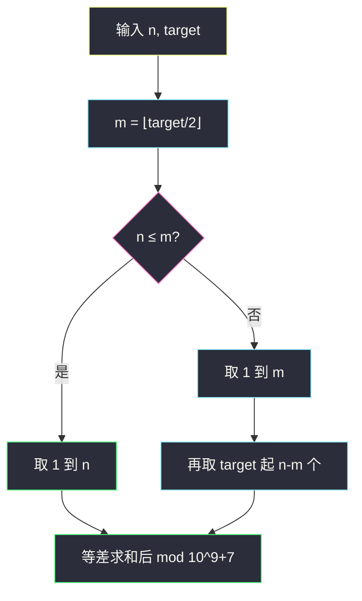
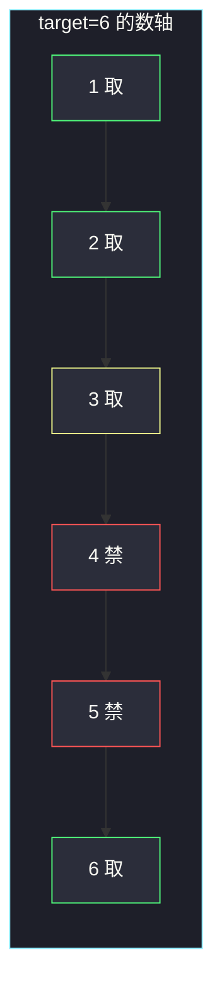

# 找出美丽数组的最小和（配对禁选 + 等差求和）

## 一、问题描述

给你两个正整数 `n` 和 `target`。构造长度为 `n` 的数组 `nums`，要求：

1. 元素都是**互不相同的正整数**；
2. 不存在两个**不同下标** `i`、`j` 使得 `nums[i] + nums[j] == target`。

满足上述条件的数组称为**美丽数组**。返回所有美丽数组中，元素和的最小值，对 `10^9+7` 取模。

> 🔗 LeetCode 2834：https://leetcode.cn/problems/find-the-minimum-possible-sum-of-a-beautiful-array/
>
> 数据范围：`1 ≤ n, target ≤ 10^9`。长度和取值都到十亿，循环构造会超时。
>
> 📚 灵茶题单：**§7.8 其他**（1409 分）。与 [2829. 确定 k-avoiding 数组的最小和](https://leetcode.cn/problems/determine-the-minimum-sum-of-a-k-avoiding-array/) 同一套贪心：先取 `1 .. ⌊target/2⌋`，不够再从 `target, target+1, …` 接着取。本题 `n` 巨大，必须改成 **O(1) 等差数列求和**，并记得取模。

**示例 1**

```
输入：n = 2, target = 3
输出：4
解释：nums = [1, 3]。长度为 2、元素互异、1+3=4≠3。和为 4，可证明最小。
```

**示例 2**

```
输入：n = 3, target = 3
输出：8
解释：nums = [1, 3, 4]。不能同时放 1 和 2（1+2=3）。和 1+3+4=8。
```

**示例 3**

```
输入：n = 1, target = 1
输出：1
解释：nums = [1]，单个元素无法与另一个下标配对，和就是 1。
```

**直观理解**

想让和最小，本能是塞 `1, 2, 3, …`。但 `target` 会把某些数「绑成一对」：选了小的那个，大的那个就不能再选。于是先把互不冲突的小数拿满，缺口再用 `target` 往后的数补——它们已经大到不可能再和已选数字加成 `target`。

---

## 二、暴力解法

从 1 开始往大枚举，能放就放，直到凑够 `n` 个数。用集合记录已经选中的值；准备放 `x` 时，若 `target - x` 已在集合里且 `target - x ≠ x`，则跳过。

```python
class Solution:
    def minimumPossibleSum(self, n: int, target: int) -> int:
        MOD = 10**9 + 7
        used = set()
        x = 1
        s = 0
        while len(used) < n:
            other = target - x
            if other in used and other != x:
                x += 1
                continue
            used.add(x)
            s += x
            x += 1
        return s % MOD
```

官方三例都能对上：`(2,3)→4`，`(3,3)→8`，`(1,1)→1`。但 `n = 10^9` 时循环十亿次，直接超时。

### 🔴 瓶颈在哪里

集合模拟是 `O(n)` 时间和空间。选出的数其实是两段连续区间，每段都可以用等差公式闭式求和，不必一个个数。`n` 到 `10^9` 后，**公式 + 取模**才是这题真正要练的。

---

## 三、优化探索（核心章节）

> 📚 本题在灵茶题单中属于 **§7.8 其他**。模板：互斥对 `(x, target-x)` 里最多选一个；贪心永远选更小的那个。本题再加一步——把「选出的集合」写成两段等差，`O(1)` 求出来。

### 3.1 互斥对长什么样

只关心正整数。能加成 `target` 的无序对是：

| 对 | 说明 |
|----|------|
| `(1, target-1)` | 选 1 就不能选 `target-1` |
| `(2, target-2)` | 选 2 就不能选 `target-2` |
| … | … |
| 若 `target` 为偶数：`(target/2, target/2)` | 题目要求**不同下标**，数组元素又互异，`target/2` 只能出现一次，**可以选** |

因此：

- `1, 2, …, ⌊target/2⌋` 两两之和都 `< target`（最大是 `⌊target/2⌋ + (⌊target/2⌋-1) ≤ target-1`），彼此不冲突。
- `⌊target/2⌋+1, …, target-1` 恰好是上面那些小数的「搭档」，全部禁选。
- `target, target+1, …`：任意两个之和 `≥ 2·target > target`，且与已选小数之和 `> target`，全部安全。

贪心策略于是完全确定：优先取完 `[1, m]`（`m = ⌊target/2⌋`）；若还不够 `n` 个，从 `target` 起再取 `n-m` 个。



### 3.2 闭式求和

记 `m = ⌊target/2⌋`。前 `r` 个正整数之和 `r(r+1)/2`。

- 若 `n ≤ m`：答案就是 `n(n+1)/2`。
- 若 `n > m`：前半 `m(m+1)/2`，后半是首项 `target`、项数 `k = n-m` 的等差：

```
target + (target+1) + … + (target+k-1)
= k * target + 0+1+…+(k-1)
= k * target + k(k-1)/2
```

`n(n+1)` 恒为偶数，直接整除 2。Python 整数任意长，**先算出完整和，最后 `% (10^9+7)`**。不要先模再除 2——模意义下除 2 需要逆元，容易写错。

### 3.3 一句话核心

> **互斥对里只留较小的一半；不够的数从 target 往后接。两段都是等差，O(1) 求和再取模。**

---

## 四、代码实现

### Python（主解：O(1) 等差）

```python
class Solution:
    def minimumPossibleSum(self, n: int, target: int) -> int:
        MOD = 10**9 + 7
        m = target // 2
        if n <= m:
            return n * (n + 1) // 2 % MOD
        s1 = m * (m + 1) // 2
        k = n - m
        s2 = k * target + k * (k - 1) // 2
        return (s1 + s2) % MOD
```

**变量含义**

| 写法 | 含义 |
|------|------|
| `m` | `⌊target/2⌋`，可安全取的最小正整数个数 |
| `s1` | `1+…+m` |
| `k` | 还要从 `target` 起补的个数 |
| `s2` | `target` 起连续 `k` 项之和 |
| `// 2` | 先整除再模，避免模逆 |

`n = target = 10^9` 时 `s2` 大约 `10^18` 量级，Python 没问题。

---

## 五、具体例子演示

**示例 1**：`n=2, target=3`。`m = ⌊3/2⌋ = 1`。`n > m`，先取 `{1}`，再取 1 个从 3 起：`{1,3}`，和 `1+3=4`。对拍官方。

**示例 2**：`n=3, target=3`。`m=1`，`k=2`。

| 段 | 取出 | 和 |
|----|------|----|
| `1..m` | `{1}` | `s1=1` |
| `target` 起 2 个 | `{3,4}` | `s2=2*3+1=7` |

`1+7=8`。数组 `[1,3,4]`。2 被禁，因为 `1+2=3`。对拍官方。

**示例 3**：`n=1, target=1`。`m=0`，`n>m`，`s1=0`，`k=1`，`s2=1*1+0=1`。或理解为「从 1 起取 1 个」。对拍官方。

**再走一遍 `target` 为偶数**（任务书没给，用来钉死「`target/2` 可以留」）：

`n=4, target=6`。配对：`(1,5)`、`(2,4)`，`3+3=6` 但 3 只出现一次所以合法。`m=3`，取 `{1,2,3}` 还差 1 个，从 6 起取 `{6}`。数组 `[1,2,3,6]`，和 12。



黄节点 3 是「自己加自己等于 target」，只留一份即可。红节点 4、5 是 2、1 的搭档。

逐步代入公式：`s1 = 3*4/2 = 6`，`k=1`，`s2=1*6+0=6`，和 `12`。

**边界**

| n | target | m | 数组形态 | 和 |
|---|--------|---|---------|----|
| 1 | 1 | 0 | `[1]` | 1 |
| 2 | 3 | 1 | `[1,3]` | 4 |
| 3 | 3 | 1 | `[1,3,4]` | 8 |
| 4 | 6 | 3 | `[1,2,3,6]` | 12 |
| 3 | 100 | 50 | `[1,2,3]`（还没用到 target） | 6 |

**大数代入（体现 O(1)）**：`n=10, target=5`。`m=2`，先取 `{1,2}`，`k=8`，从 5 起取 8 个数：`5+6+…+12`。

```
s1 = 2*3/2 = 3
s2 = 8*5 + 8*7/2 = 40+28 = 68
和 = 71
```

数组 `[1,2,5,6,7,8,9,10,11,12]`。禁区是 3、4（`1+4=5`，`2+3=5`）。手算 `3+68=71`。若 `n,target` 到 `10^9`，同一公式，只是数字更大，最后 `% 1000000007`。

**取模顺序**：`n=8, target=2` 时和是 `1+2+…+8=36`。先 `8*9//2 % MOD = 36`。若错误地写成 `(8%MOD)*(9%MOD)%MOD` 再除 2，在更大 n 上会碰到「模意义下除 2 要用逆元」。本题 Python 一律先整除再模。

---

## 六、复杂度分析

| 方法 | 时间 | 空间 | 说明 |
|------|------|------|------|
| 集合逐个选取 | `O(n)` | `O(n)` | `n=10^9` 超时 |
| 等差闭式（主解） | `O(1)` | `O(1)` | 两段求和 + 一次取模 |

---

## 七、对比总结

| 维度 | 本题 2834 | 2829 k-avoiding |
|------|-----------|-----------------|
| 禁选条件 | 两数之和 = target | 两数之和 = k |
| 贪心 | 先 `1..⌊target/2⌋` 再从 target 起 | 完全相同 |
| 数据 | n、target 到 `10^9`，要 O(1) + 模 | n ≤ 100，循环即可 |
| 取模 | 必须 | 没有 |

**易错点**

1. **循环构造**：能过样例，大数据 TLE。
2. **丢掉 `target/2`**：偶数 target 时它不和「另一个不同元素」配对，应当留下。
3. **先模再除 2**：`(a * b % MOD) / 2` 在模意义下不等于除 2。Python 用 `a * b // 2 % MOD`。
4. **后半段写成 `m+1` 起**：`m+1` 到 `target-1` 全是禁区，必须从 `target` 起跳。
5. **`n ≤ m` 忘记切分**：这时根本用不到 `target`，直接 `1..n` 求和。

---

## 八、举一反三

| 题目 | 关系 |
|------|------|
| [2829. 确定 k-avoiding 数组的最小和](https://leetcode.cn/problems/determine-the-minimum-sum-of-a-k-avoiding-array/) | 同族：同一贪心，n 很小可以循环，用来理解配对 |
| [1. 两数之和](https://leetcode.cn/problems/two-sum/) | 「两数之和 = target」的查找版，本题是构造版 |
| [167. 两数之和 II](https://leetcode.cn/problems/two-sum-ii-input-array-is-sorted/) | 有序数组上找配对 |
| [15. 三数之和](https://leetcode.cn/problems/3sum/) | 配对禁选推到三元组 |
| [1502. 判断能否形成等差数列](https://leetcode.cn/problems/can-make-arithmetic-progression-from-sequence/) | 等差结构；本题用等差**求和** |

**思想迁移**

- 约束是成对互斥时，贪心「每对留较小的」，再看剩余额度从安全区补。
- 口诀：**「小半段拿满，禁区跳过，从 target 接上；两段公式，最后再模。」**
