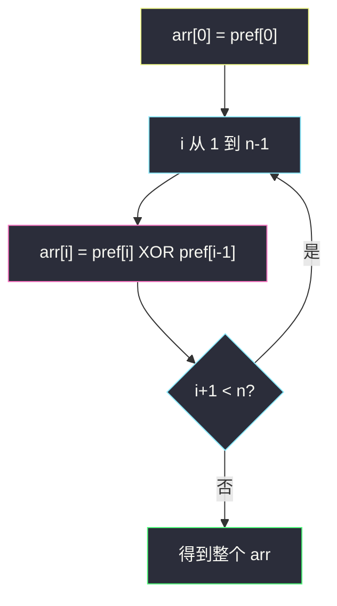
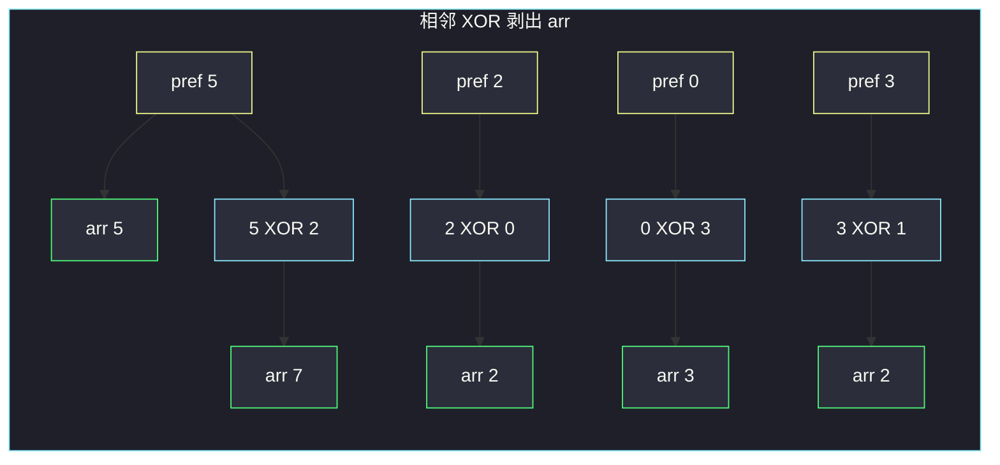

# 找出前缀异或的原始数组（相邻 pref XOR 还原）

## 一、问题描述

给你一个长度为 `n` 的数组 `pref`。原数组 `arr` 满足：

```
pref[i] = arr[0] XOR arr[1] XOR … XOR arr[i]
```

已知 `pref`，还原 `arr`。可以证明答案唯一。

> 🔗 LeetCode 2433：https://leetcode.cn/problems/find-the-original-array-of-prefix-xor/
>
> 数据范围：`1 ≤ pref.length ≤ 10⁵`，`0 ≤ pref[i] ≤ 10⁶`。
>
> 📚 灵茶题单：**二、异或（XOR）的性质**（1367 分）。用到「两次还原」：`pref[i] = pref[i-1] XOR arr[i]`，两边再 XOR 一次 `pref[i-1]`，就把 `arr[i]` 解出来。

**示例 1**

```
输入：pref = [5, 2, 0, 3, 1]
输出：[5, 7, 2, 3, 2]
解释：
  5 = 5
  5 XOR 7 = 2
  5 XOR 7 XOR 2 = 0
  5 XOR 7 XOR 2 XOR 3 = 3
  5 XOR 7 XOR 2 XOR 3 XOR 2 = 1
```

**示例 2**

```
输入：pref = [13]
输出：[13]
解释：只有一个数，arr[0] = pref[0]。
```

**直观理解**

`pref[i]` 是「从头异或到 i」的累积。相邻两项 `pref[i-1]` 与 `pref[i]` 只差一个 `arr[i]`。把这两项再异或一次，中间那一层就剥掉，露出 `arr[i]`。

---

## 二、暴力解法

枚举 `arr[i]` 的每一种可能（`0..10⁶`），检查前缀异或是否等于 `pref`。`n ≤ 10⁵` 不可行。即便利用「答案唯一」逐个猜，没有公式仍是盲搜。

更朴素但正确的 `O(n²)`：假定已经有 `arr[0..i-1]`，用 `pref[i]` 和「前 i 个的逐项异或」反推——仍需要每次重算前缀。

```python
class Solution:
    def findArray(self, pref: list[int]) -> list[int]:
        n = len(pref)
        arr = [0] * n
        arr[0] = pref[0]
        for i in range(1, n):
            acc = 0
            for j in range(i):
                acc ^= arr[j]
            arr[i] = acc ^ pref[i]
        return arr
```

内层每次重算 `arr[0] XOR … XOR arr[i-1]`，而它其实就是 `pref[i-1]`。`O(n²)` 在 `n = 10⁵` 超时。

### 🔴 瓶颈在哪里

`arr[0] XOR … XOR arr[i-1]` 已经被存成 `pref[i-1]` 了。不要重算，直接用相邻两项。

---

## 三、优化探索（核心章节）

> 📚 灵茶题单位运算模板：XOR 两次还原、交换律、结合律。本题是前缀和在异或上的翻版。

### 3.1 前缀异或的定义

记 `pref[-1] = 0`（空前缀）。则：

```
pref[0] = 0 XOR arr[0] = arr[0]
pref[i] = pref[i-1] XOR arr[i]    (i ≥ 1)
```

### 3.2 两次还原

XOR 的关键性质：`a ^ a = 0`，`a ^ 0 = a`，因而 `(x ^ y) ^ y = x`。

对 `pref[i] = pref[i-1] XOR arr[i]` 两边同时 XOR `pref[i-1]`：

```
pref[i] XOR pref[i-1]
  = (pref[i-1] XOR arr[i]) XOR pref[i-1]
  = arr[i] XOR (pref[i-1] XOR pref[i-1])
  = arr[i] XOR 0
  = arr[i]
```

所以：

- `arr[0] = pref[0]`
- `arr[i] = pref[i] XOR pref[i-1]`（`i ≥ 1`）

和「前缀和还原」完全平行：普通前缀和用减法 `arr[i] = s[i] - s[i-1]`；异或没有减法，**减一个数 = 再 XOR 一次**。

区间查询也同一套路：`arr[l] XOR … XOR arr[r] = pref[r] XOR pref[l-1]`（`l=0` 时就是 `pref[r]`）。本题只还原数组，不查区间，但公式同源：公共前缀 XOR 两次变 0，剩下中间那段。



### 3.3 为什么答案唯一

每一步 `arr[i]` 由公式唯一确定，没有分支。从左到右推一遍即可，不必回溯。

### 3.4 一句话核心

> **`arr[0] = pref[0]`；其后每一项 `arr[i] = pref[i] XOR pref[i-1]`。相邻两项一异或，就剥出新加入的那个数。**

---

## 四、代码实现

### Python（主解：相邻 XOR）

```python
class Solution:
    def findArray(self, pref: list[int]) -> list[int]:
        n = len(pref)
        arr = [0] * n
        arr[0] = pref[0]
        for i in range(1, n):
            arr[i] = pref[i] ^ pref[i - 1]
        return arr
```

若允许改输入，可以从右往左原地写：`pref[i] ^= pref[i-1]`（`i` 从 `n-1` 降到 1），`pref[0]` 不动。从左往右原地会覆盖 `pref[i-1]`，下一步就用错。开新数组最不容易写错。

**变量含义**

| 写法 | 含义 |
|------|------|
| `pref[i]` | `arr[0] XOR … XOR arr[i]` |
| `pref[i] ^ pref[i-1]` | 抵消公共前缀，剩下 `arr[i]` |
| `arr[0]` | 与 `pref[0]` 相同，不必 XOR |

---

## 五、具体例子演示

**示例 1**：`pref = [5, 2, 0, 3, 1]`。用 4 位二进制逐步还原（官方样例对拍）。

先列出 pref：

| i | pref[i] | 二进制 |
|---|---------|--------|
| 0 | 5 | `0101` |
| 1 | 2 | `0010` |
| 2 | 0 | `0000` |
| 3 | 3 | `0011` |
| 4 | 1 | `0001` |

还原过程：

| i | 公式 | 位运算 | arr[i] |
|---|------|--------|--------|
| 0 | `arr[0] = pref[0]` | `0101` | **5** |
| 1 | `pref[1] XOR pref[0]` | `0010 XOR 0101 = 0111` | **7** |
| 2 | `pref[2] XOR pref[1]` | `0000 XOR 0010 = 0010` | **2** |
| 3 | `pref[3] XOR pref[2]` | `0011 XOR 0000 = 0011` | **3** |
| 4 | `pref[4] XOR pref[3]` | `0001 XOR 0011 = 0010` | **2** |

得到 `[5, 7, 2, 3, 2]`。

正向复核（XOR 累积应回到 pref）：

| 步 | 累积 x | XOR 上 arr[i] | 新 x | 应等于 pref[i] |
|----|--------|---------------|------|----------------|
| 0 | 0 | 5 | 5 | 5 |
| 1 | 5 | 7 | 2 | 2 |
| 2 | 2 | 2 | 0 | 0 |
| 3 | 0 | 3 | 3 | 3 |
| 4 | 3 | 2 | 1 | 1 |

每一步都对得上。



**示例 2**：`pref = [13]`，循环不进入，`arr = [13]`。

把第 1 步拆开看各位（`5 = 0101₂`，`2 = 0010₂`）：

| 位权 | pref[1] | pref[0] | XOR → arr[1] |
|------|---------|---------|--------------|
| 8 | 0 | 0 | 0 |
| 4 | 0 | 1 | 1 |
| 2 | 1 | 0 | 1 |
| 1 | 0 | 1 | 1 |

拼回 `0111₂ = 7`，与表中 `arr[1]` 一致。

**边界**：`pref` 全 0 → `arr[0]=0`，其后 `0 XOR 0 = 0`，全 0；相邻 pref 相等 → 对应 `arr[i]=0`（新数没改累积）。

---

## 六、复杂度分析

| 方法 | 时间 | 空间 | 说明 |
|------|------|------|------|
| 每次重算前缀 XOR | `O(n²)` | `O(n)` | `n=10⁵` 超时 |
| 相邻 XOR（主解） | `O(n)` | `O(n)` 输出 | 一次遍历 |
| 原地从右往左 | `O(n)` | `O(1)` 额外 | 覆盖 `pref[i]`，需倒序 |

---

## 七、对比总结

| 维度 | 前缀和 | 前缀异或（本题） |
|------|--------|------------------|
| 累积 | `s[i] = s[i-1] + a[i]` | `p[i] = p[i-1] XOR a[i]` |
| 还原 | `a[i] = s[i] - s[i-1]` | `a[i] = p[i] XOR p[i-1]` |
| 区间查询 | `s[r] - s[l-1]` | `p[r] XOR p[l-1]` |
| 单位元 | 0（加法） | 0（XOR） |

**易错点**

1. **从左到右原地 `pref[i] ^= pref[i-1]`**：写完 `pref[i]` 后，下一步要用的「旧 `pref[i]`」已经变成 `arr[i]`，后面全错。开新数组，或倒序原地。
2. **`arr[i] = pref[i] XOR pref[0]`**：那是「第 0 到 i 的区间异或」，等于 `arr[0] XOR … XOR arr[i]` 再 XOR `arr[0]`，不是 `arr[i]`。必须相邻。
3. **漏掉 `arr[0] = pref[0]`**：`i` 从 0 开始且访问 `pref[i-1]` 会越界。
4. **和 1720 题的 `encoded[i] = arr[i] XOR arr[i+1]` 搞混**：那是相邻元素的 XOR 链，还多一个已知的 `arr[0]`（或 `first`）；本题相邻的是**前缀**。
5. **以为要枚举**：答案由公式唯一决定，线性扫一遍。

---

## 八、举一反三

| 题目 | 关系 |
|------|------|
| [1720. 解码异或后的数组](https://leetcode.cn/problems/decode-xored-array/) | `encoded[i] = arr[i] XOR arr[i+1]`，已知 `first=arr[0]` 往后剥 |
| [1734. 解码异或后的排列](https://leetcode.cn/problems/decode-xored-permutation/) | 排列 + 相邻 XOR，先恢复 `arr[0]` 再链式还原 |
| [1310. 子数组异或查询](https://leetcode.cn/problems/xor-queries-of-a-subarray/) | 前缀异或做好后，区间 `[l,r]` = `pref[r] XOR pref[l-1]` |
| [1486. 数组异或操作](https://leetcode.cn/problems/xor-operation-in-an-array/) | 构造再全体 XOR，练手性质 |
| [268. 丢失的数字](https://leetcode.cn/problems/missing-number/) | `0..n` 与数组全体 XOR，缺的留下 |

**思想迁移**

- 前缀结构 + XOR：还原用相邻两项再异或一次；查区间用两端前缀再异或一次。
- 口诀：**「前缀异或还原：第一项照抄，后面相邻两项一异或。」**
