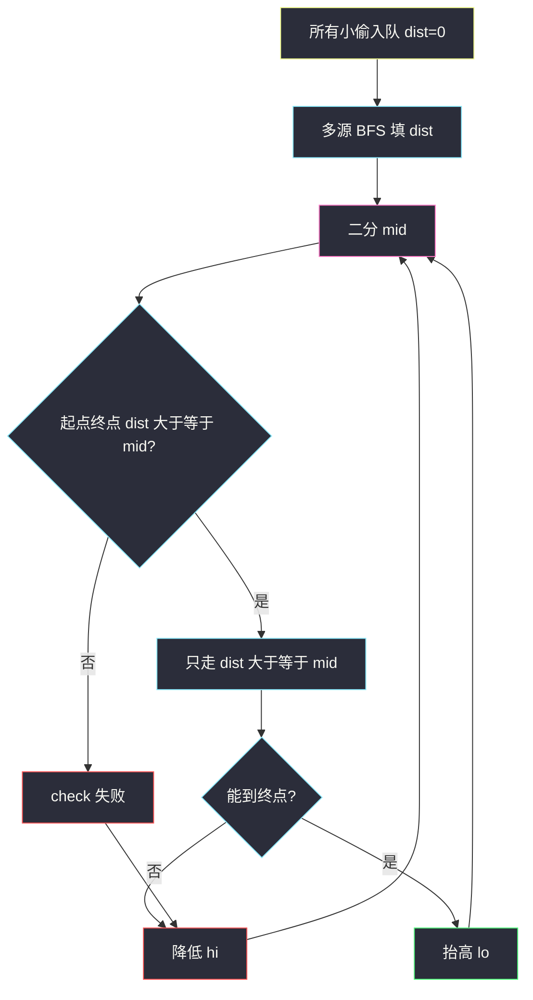
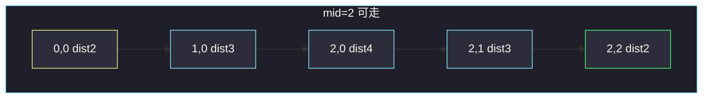

# 找出最安全路径（多源 BFS + 二分安全度）

## 一、问题描述

`n × n` 网格，`1` 是小偷，`0` 是空格。从 `(0, 0)` 走到 `(n-1, n-1)`，四连通，**可以踩小偷格**。

一条路径的**安全系数** = 路径上所有格子「到最近小偷的曼哈顿距离」的**最小值**。求所有路径里，安全系数的**最大值**。

格子 `(a, b)` 与 `(x, y)` 的曼哈顿距离是 `|a-x| + |b-y|`。保证至少有一个小偷。

> 🔗 LeetCode 2812：https://leetcode.cn/problems/find-the-safest-path-in-a-grid/
>
> 数据范围：`1 ≤ n ≤ 400`。
>
> 📚 灵茶题单：**二、网格图 BFS**。官方提示：多源 BFS 算距离 + 二分安全系数。

**示例 1**

```
输入：grid = [[1,0,0],[0,0,0],[0,0,1]]
输出：0
起点、终点都是小偷，路径上最小距离只能是 0。
```

**示例 2**

```
输入：grid = [[0,0,1],[0,0,0],[0,0,0]]
输出：2
小偷在 (0,2)。走左边再往下：路径上每格到小偷的距离 ≥ 2，且无法做到 3。
```

**示例 3**

```
输入：grid = [[0,0,0,1],[0,0,0,0],[0,0,0,0],[1,0,0,0]]
输出：2
两个对角小偷，最优路径的「离贼最近处」仍能保持 2。
```

**直观理解**

先问每个格子「离最近的小偷多远」（和 01 矩阵一模一样，源点换成所有 `1`）。再在这些距离上选一条路，让路上的**最小距离尽量大**——最大化瓶颈。二分这个瓶颈 `mid`，只走 `dist ≥ mid` 的格子，看起点能否到达终点。

---

## 二、暴力解法

枚举 `(0,0)` 到终点的所有路径，对每条路径算 `min(格子到最近小偷的距离)`，取 max。小偷距离若每次现场扫全部 `1`，更慢。`n = 400` 路径数指数级，完全不可用。

```python
# 示意：每条路径现场算曼哈顿，n 稍大即不可行
def dfs(i, j, seen, bottleneck):
    if (i, j) == (n - 1, n - 1):
        return bottleneck
    ans = -1
    for 四邻 未访问:
        d = min 曼哈顿到所有小偷
        ans = max(ans, dfs(ni, nj, seen | {(ni,nj)}, min(bottleneck, d)))
    return ans
```

### 🔴 瓶颈在哪里

两件事要拆开：

1. **到最近小偷的距离**：所有小偷当源，一次多源 BFS，`O(n²)`。
2. **最大化路径最小值**：对答案二分。`check(mid)` = 只走 `dist ≥ mid` 的格子，一次普通 BFS。`mid` 范围 `0 … O(n)`，总时间 `O(n² log n)`。

也可以最大堆 Dijkstra：优先扩展当前瓶颈更大的格子，第一次弹出终点即答案。主解按题单写「多源 BFS + 二分」。

---

## 三、优化探索（核心章节）

> 📚 本题在灵茶题单中属于 **二、网格图 BFS**。第一阶段完全是 01 矩阵模板（见 `01-matrix.md`）；第二阶段是二分 + 连通性 BFS。

### 3.1 阶段一：多源 BFS

所有 `grid[i][j] == 1` 的格子 `dist = 0` 入队，其余 `-1`。弹出后把四邻 `-1` 写成 `当前 + 1`。得到每格到最近小偷的距离。

### 3.2 阶段二：二分 `mid`

路径安全系数 ≥ `mid` ⇔ 存在一条路，路上每格 `dist ≥ mid`。

- `check(mid)`：若起点或终点 `dist < mid`，直接失败。否则从 `(0,0)` BFS，只进入 `dist ≥ mid` 且未访问的格子。
- 二分上界可取 `min(dist[0][0], dist[n-1][n-1])`：路径必含两端。
- 能走就 `lo = mid + 1` 并记下 `ans = mid`，否则 `hi = mid - 1`。



### 3.3 一句话核心

> **所有小偷多源 BFS 得到每格 dist；再二分 mid，只走 dist ≥ mid 的格子看能否从左上到右下。**

---

## 四、代码实现

### Python（主解：多源 BFS + 二分）

```python
from collections import deque
from typing import List

class Solution:
    def maximumSafenessFactor(self, grid: List[List[int]]) -> int:
        n = len(grid)
        DIRS = ((0, 1), (0, -1), (1, 0), (-1, 0))
        dist = [[-1] * n for _ in range(n)]
        q = deque()
        for i in range(n):
            for j in range(n):
                if grid[i][j] == 1:
                    dist[i][j] = 0
                    q.append((i, j))
        while q:
            i, j = q.popleft()
            for di, dj in DIRS:
                ni, nj = i + di, j + dj
                if 0 <= ni < n and 0 <= nj < n and dist[ni][nj] == -1:
                    dist[ni][nj] = dist[i][j] + 1
                    q.append((ni, nj))

        def can(mid: int) -> bool:
            if dist[0][0] < mid or dist[n - 1][n - 1] < mid:
                return False
            seen = [[False] * n for _ in range(n)]
            dq = deque([(0, 0)])
            seen[0][0] = True
            while dq:
                i, j = dq.popleft()
                if i == n - 1 and j == n - 1:
                    return True
                for di, dj in DIRS:
                    ni, nj = i + di, j + dj
                    if 0 <= ni < n and 0 <= nj < n and not seen[ni][nj] and dist[ni][nj] >= mid:
                        seen[ni][nj] = True
                        dq.append((ni, nj))
            return False

        lo, hi = 0, min(dist[0][0], dist[n - 1][n - 1])
        ans = 0
        while lo <= hi:
            mid = (lo + hi) // 2
            if can(mid):
                ans = mid
                lo = mid + 1
            else:
                hi = mid - 1
        return ans
```

`n = 1` 且格子是小偷时，`can(0)` 为真（起点即终点），答案 0。`check` 里普通 BFS 可以布尔 visited：这里边权全 1，只问连通，不求另一套最短路。

**变量含义**

| 写法 | 含义 |
|------|------|
| `dist == 0` 入队 | 小偷，多源 |
| `dist == -1` | 还没被任何小偷烧到 |
| `mid` | 尝试的安全系数 |
| `dist ≥ mid` | 这条路允许走的格子 |

### Java（可选）

```java
class Solution {
    private static final int[][] DIRS = {{0, 1}, {0, -1}, {1, 0}, {-1, 0}};

    public int maximumSafenessFactor(List<List<Integer>> grid) {
        int n = grid.size();
        int[][] dist = new int[n][n];
        ArrayDeque<int[]> q = new ArrayDeque<>();
        for (int i = 0; i < n; i++) {
            Arrays.fill(dist[i], -1);
            for (int j = 0; j < n; j++) {
                if (grid.get(i).get(j) == 1) {
                    dist[i][j] = 0;
                    q.add(new int[]{i, j});
                }
            }
        }
        while (!q.isEmpty()) {
            int[] c = q.poll();
            for (int[] d : DIRS) {
                int ni = c[0] + d[0], nj = c[1] + d[1];
                if (ni >= 0 && ni < n && nj >= 0 && nj < n && dist[ni][nj] < 0) {
                    dist[ni][nj] = dist[c[0]][c[1]] + 1;
                    q.add(new int[]{ni, nj});
                }
            }
        }
        int lo = 0, hi = Math.min(dist[0][0], dist[n - 1][n - 1]), ans = 0;
        while (lo <= hi) {
            int mid = (lo + hi) >>> 1;
            if (can(dist, mid)) { ans = mid; lo = mid + 1; }
            else hi = mid - 1;
        }
        return ans;
    }

    private boolean can(int[][] dist, int mid) {
        int n = dist.length;
        if (dist[0][0] < mid || dist[n - 1][n - 1] < mid) return false;
        boolean[][] seen = new boolean[n][n];
        ArrayDeque<int[]> q = new ArrayDeque<>();
        q.add(new int[]{0, 0});
        seen[0][0] = true;
        while (!q.isEmpty()) {
            int[] c = q.poll();
            if (c[0] == n - 1 && c[1] == n - 1) return true;
            for (int[] d : DIRS) {
                int ni = c[0] + d[0], nj = c[1] + d[1];
                if (ni >= 0 && ni < n && nj >= 0 && nj < n && !seen[ni][nj] && dist[ni][nj] >= mid) {
                    seen[ni][nj] = true;
                    q.add(new int[]{ni, nj});
                }
            }
        }
        return false;
    }
}
```

---

## 五、具体例子演示

示例 2。小偷在 `(0,2)`。多源 BFS 就是从这一个源向外扩（多个小偷则一起入队）。

**阶段一 `dist`**

```
2  1  0
3  2  1
4  3  2
```

第 0 层：`(0,2)`。第 1 层：`(0,1)`、`(1,2)`。第 2 层：`(0,0)`、`(1,1)`、`(2,2)`。以此类推。左下角最远，距离 4。

**阶段二二分**（`hi = min(2, 2) = 2`）

| lo | hi | mid | check | 原因 |
|----|----|-----|-------|------|
| 0 | 2 | 1 | 能 | 几乎全图可走 |
| 0 | 2 | 2 | 能 | 见下图白色格子 |
| 3 | 2 | — | 结束 | `lo > hi`，`ans = 2` |

`mid = 2` 只准走 `dist ≥ 2`：

```
2  .  .
3  2  .
4  3  2
```

BFS：`(0,0) → (1,0) → (2,0) → (2,1) → (2,2)`，连通。  
`mid = 3`：起点 `dist = 2 < 3`，直接失败。



示例 1 两端 `dist = 0`，`hi = 0`，`can(0)` 为真（`mid = 0` 什么格子都能走），答案 0。

---

## 六、复杂度分析

| 方法 | 时间 | 空间 | 说明 |
|------|------|------|------|
| 枚举路径 | 指数 | `O(n²)` | 不可用 |
| 多源 BFS + 二分（主解） | `O(n² log n)` | `O(n²)` | 二分次数 `O(log n)`，每次 BFS `O(n²)` |
| 最大堆 Dijkstra | `O(n² log n)` | `O(n²)` | 最大化路径最小 dist |

---

## 七、对比总结

| 维度 | 只 BFS 步数 | 多源 + 二分 |
|------|------------|-------------|
| 问什么 | 最短路 | 最大化瓶颈 |
| 第一段 | — | 小偷 → 每格 dist |
| 第二段 | — | 二分 mid + 连通 |

**易错点**

1. **安全系数理解反了**：不是路径长度，也不是离小偷的平均距离，是路上 **min** dist。
2. **对每个格子单独扫小偷**：`O(n⁴)`，`n = 400` 必 TLE。必须多源一次。
3. **二分写成最小化**：本题是最大化 `mid`，`check` 成功才抬 `lo`。
4. **`check` 用 DFS 且不标记**：`n = 400` 会爆；连通性用 BFS + `seen`。
5. **禁止走小偷格**：题面允许踩 `1`；`mid = 0` 时这些格必须能走。
6. **曼哈顿手写进 `check`**：`check` 只读已经算好的 `dist`。

---

## 八、举一反三

| 题目 | 关系 |
|------|------|
| [542. 01 矩阵](https://leetcode.cn/problems/01-matrix/) | 阶段一同构（源点换成 0）；见 `01-matrix.md` |
| [1631. 最小体力消耗路径](https://leetcode.cn/problems/path-with-minimum-effort/) | 最小化路径最大边权，同样二分 + BFS |
| [778. 水位上升的泳池中游泳](https://leetcode.cn/problems/swim-in-rising-water/) | 最大化瓶颈的孪生题，二分高度或堆 |
| [417. 太平洋大西洋水流问题](https://leetcode.cn/problems/pacific-atlantic-water-flow/) | 网格连通性；见 `pacific-atlantic-water-flow.md` |
| [3286. 穿越网格图的安全路径](https://leetcode.cn/problems/find-a-safe-walk-through-a-grid/) | 0-1 最短扣血，不是最大化瓶颈；见 `find-a-safe-walk-through-a-grid.md` |

**思想迁移**

- 「每个点到最近的某类格子」→ 那些格子全部入队（`01-matrix.md`）。
- 「最大化路径上的最小值」→ 二分答案 + 删掉不达标的点后看连通。
- 口诀：**「小偷当源写出 dist；二分 mid；只走 dist ≥ mid。」**
