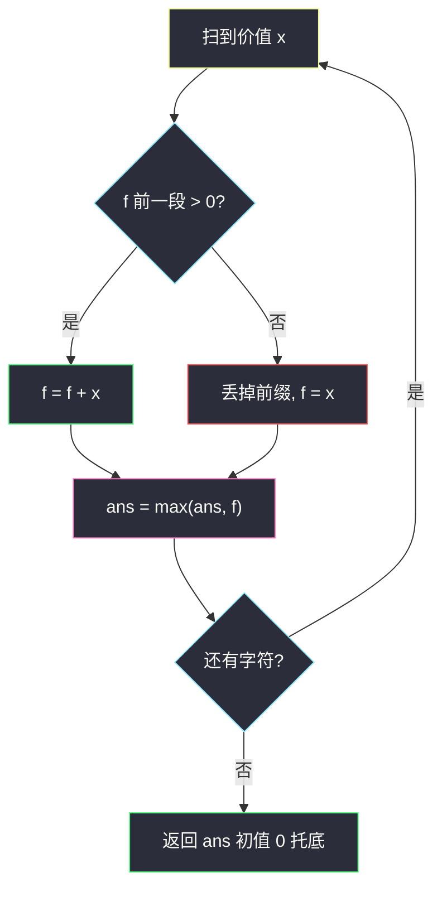
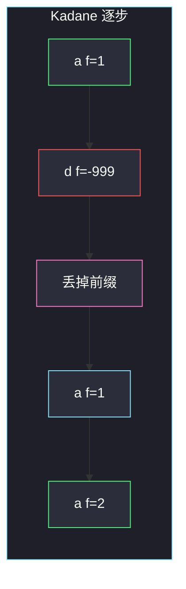

# 找到最大开销的子字符串（Kadane · 最大子段和）

## 一、问题描述

给你字符串 `s`，以及字符互不相同的字符串 `chars` 和等长整数数组 `vals`。

每个字母的**价值**：

- 若该字母出现在 `chars` 里，下标为 `j`，价值 = `vals[j]`（可正可负）；
- 否则价值 = 它在字母表中的位置：`'a'→1`，…，`'z'→26`。

子字符串的开销 = 其中每个字符价值之和。空串开销为 0。返回 `s` 所有子串里的**最大开销**。

> 🔗 LeetCode 2606：https://leetcode.cn/problems/find-the-substring-with-maximum-cost/
>
> 数据范围：`1 ≤ |s| ≤ 10^5`，`s` 与 `chars` 只含小写字母，`|chars| ≤ 26` 且互不相同，`-1000 ≤ vals[i] ≤ 1000`。
>
> 📚 灵茶题单：**§1.3 最大子数组和（最大子段和）**。把 `s` 映射成整数数组后，就是 Kadane；允许空串，答案再和 0 取 max。

官方把 `chars` 定为**字符串**（不是字符列表）。函数签名：`maximumCostSubstring(s, chars, vals)`。

**示例 1**

```
输入：s = "adaa", chars = "d", vals = [-1000]
输出：2
解释：a=1，d=-1000。子串 "aa" 开销 1+1=2 最大。
```

**示例 2**

```
输入：s = "abc", chars = "abc", vals = [-1,-1,-1]
输出：0
解释：每个字母价值都是 -1。没有正开销子串，取空串 0。
```

**直观理解**

字符变成数字以后，连续子串的开销就是连续子数组和。最大连续和用 Kadane：以右端点结尾时，要么接在前一段后面，要么自己单开；当前缀已经是负贡献时丢掉重开。本题空串合法，全程为负就返回 0。

---

## 二、暴力解法

先建 26 格价值表，再枚举所有子串求和。

```python
class Solution:
    def maximumCostSubstring(self, s: str, chars: str, vals: list[int]) -> int:
        cost = [i for i in range(1, 27)]
        for c, v in zip(chars, vals):
            cost[ord(c) - 97] = v
        n = len(s)
        ans = 0
        for i in range(n):
            sm = 0
            for j in range(i, n):
                sm += cost[ord(s[j]) - 97]
                ans = max(ans, sm)
        return ans
```

官方两例都能过。`n=10^5` 时 `O(n²)` 超时。

### 🔴 瓶颈在哪里

固定左端再扫右端时，很多以 `j` 结尾的段被重复算。Kadane 只保留「以当前位置结尾的最大和」，线性扫一遍。

---

## 三、优化探索（核心章节）

> 📚 本题在灵茶题单中属于 **§1.3 最大子数组和（最大子段和）**。模板：`f = max(f, 0) + x`，再 `ans = max(ans, f)`。本题允许空，`ans` 初值 0。

### 3.1 映射成数组

开一个长度 26 的表，默认 `cost[0]=1 … cost[25]=26`，再用 `chars`/`vals` 覆盖。`s` 变成 `arr[i] = cost[s[i]-'a']`。

示例 1：`arr = [1, -1000, 1, 1]`。

### 3.2 Kadane：以右端点分类

设 `f` = 以当前下标结尾的最大子段和。

- 前面那段和已经 `≤ 0`：接上只会更差，丢掉，`f = x`；
- 否则接上：`f = f + x`。

合并成一句：`f = max(f, 0) + x`。全程维护 `ans = max(ans, f)`。允许空串时 `ans` 从 0 起：若所有 `f` 都是负数，答案停在 0。

这和 53 题「必须选一段非空」的差别只在初值：53 要用 `ans = -∞` 或先吃第一个元素；本题官方规定无正开销则 0。



红节点是「负前缀扔掉」——Kadane 比暴力省掉的正是这些不会成为最优左端的位置。

### 3.3 一句话核心

> **字母映射成价值数组后做 Kadane；允许空串，ans 从 0 起步，全负就返回 0。**

---

## 四、代码实现

### Python（主解）

```python
class Solution:
    def maximumCostSubstring(self, s: str, chars: str, vals: list[int]) -> int:
        cost = list(range(1, 27))
        for c, v in zip(chars, vals):
            cost[ord(c) - 97] = v
        ans = 0
        f = 0
        for ch in s:
            x = cost[ord(ch) - 97]
            f = max(f, 0) + x
            ans = max(ans, f)
        return ans
```

不必真正建出 `arr`，扫 `s` 时查表即可。

**变量含义**

| 写法 | 含义 |
|------|------|
| `cost[0..25]` | 字母 a..z 的价值 |
| `f` | 以当前字符结尾的最大开销 |
| `max(f, 0) + x` | 前缀非正则接上，否则单开 |
| `ans` 初值 0 | 空串托底；全负时就是答案 |

### Java（最优解）

```java
class Solution {
    public int maximumCostSubstring(String s, String chars, int[] vals) {
        int[] cost = new int[26];
        for (int i = 0; i < 26; i++) {
            cost[i] = i + 1;
        }
        for (int i = 0; i < chars.length(); i++) {
            cost[chars.charAt(i) - 'a'] = vals[i];
        }
        int ans = 0, f = 0;
        for (int i = 0; i < s.length(); i++) {
            int x = cost[s.charAt(i) - 'a'];
            f = Math.max(f, 0) + x;
            ans = Math.max(ans, f);
        }
        return ans;
    }
}
```

---

## 五、具体例子演示

### 5.1 官方示例 1：逐步跟踪 max_ending

`s = "adaa"`，`chars = "d"`，`vals = [-1000]`。价值序列 `arr = [1, -1000, 1, 1]`。`ans=0`，`f=0`。

| 步 | 字符 | x | f 计算 | f | ans |
|----|------|---|--------|---|-----|
| 0 | a | 1 | max(0,0)+1 | 1 | 1 |
| 1 | d | -1000 | max(1,0)+(-1000) | -999 | 1 |
| 2 | a | 1 | max(-999,0)+1 | 1 | 1 |
| 3 | a | 1 | max(1,0)+1 | 2 | 2 |

`i=1` 吃到 `d` 后 `f` 掉到 -999，下一位必须丢掉这段前缀，从第二个 `'a'` 单开。最后 `"aa"` 的和 2 就是答案。对拍官方。



红是负贡献把当前段打穿，粉是「弃段重开」，绿是最终最大开销。

### 5.2 官方示例 2：全负返回 0

`arr = [-1,-1,-1]`。

| 步 | x | f | ans |
|----|---|---|-----|
| 0 | -1 | -1 | 0 |
| 1 | -1 | -1 | 0 |
| 2 | -1 | -1 | 0 |

每一步 `max(f,0)+x` 都等于 `x` 本身（负数），`ans` 从未被抬高，停在 0。对拍官方。若按 53 题「必须非空」会返回 -1，本题不允许。

### 5.3 中间一段正、两边负

`s = "zaz"`，`chars = "az"`，`vals = [-5, 10]` → 价值 `[-5, 10, -5]`（未出现的字母才走 1..26；这里 a、z 都被覆盖）。

| 步 | x | f | ans |
|----|---|---|-----|
| 0 | -5 | -5 | 0 |
| 1 | 10 | 10 | 10 |
| 2 | -5 | 5 | 10 |

最优是单独一个 `'a'`，开销 10；接上后面的 `-5` 变成 5，不如不接。Kadane 用 `ans` 记住了峰值 10。

---

## 六、复杂度分析

| 方法 | 时间 | 空间 | 说明 |
|------|------|------|------|
| 枚举子串 | `O(n²)` | `O(1)` 外加 26 格表 | 超时 |
| Kadane（主解） | `O(n)` | `O(1)` | 价值表 26，可忽略 |

`|s|` 与 `|chars|` 都扫一遍，`chars` 最多 26。

---

## 七、对比总结

| 维度 | 53 最大子数组和 | 本题 |
|------|-----------------|------|
| 数组来源 | 直接给 | 字母映射 |
| 空段 | 不允许 | 允许，全负回 0 |
| 递推 | 同一句 `max(f,0)+x` | 同模板，`ans` 初值不同 |

**易错点**

1. **全负返回数组最大值**：那是 53。本题空串合法，必须和 0 取 max。
2. **没覆盖的字母价值写成 0**：默认是字母表位置 1..26，不是 0。
3. **`chars` 当 list 用**：力扣签名是 `String` / `str`，用 `zip(chars, vals)` 即可。
4. **Kadane 写成最大子序列**：子串必须连续，不能跳过中间的负字母却留下两边。
5. **`f` 初值用第一个元素、`ans` 用 `-∞`**：会在「第一格就是很大的负数」时交出负答案。

---

## 八、举一反三

| 题目 | 关系 |
|------|------|
| [53. 最大子数组和](https://leetcode.cn/problems/maximum-subarray/) | §1.3 模板题；不允许空 |
| [1749. 任意子数组和的绝对值的最大值](https://leetcode.cn/problems/maximum-absolute-sum-of-any-subarray/) | 同专题：同时跑最大段与最小段 |
| [918. 环形子数组的最大和](https://leetcode.cn/problems/maximum-sum-circular-subarray/) | Kadane + 总和 − 最小段 |
| [1186. 删除一次得到子数组最大和](https://leetcode.cn/problems/maximum-subarray-sum-with-one-deletion/) | 多一个「删/不删」状态 |
| [1191. K 次串联后最大子数组之和](https://leetcode.cn/problems/k-concatenation-maximum-sum/) | 把数组重复后再 Kadane |
| [3147. 从魔法师身上吸取的最大能量](https://leetcode.cn/problems/taking-maximum-energy-from-the-mystic-dungeon/) | 同批：必须跳到尽头，**不能**用 Kadane 丢后缀 |

**思想迁移**

- 连续段的最大和：负前缀一定扔掉。
- 口诀：**「映射成数组，Kadane 扫一遍；空串合法，ans 从 0 起。」**
