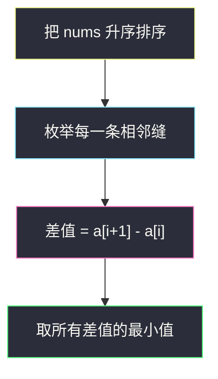
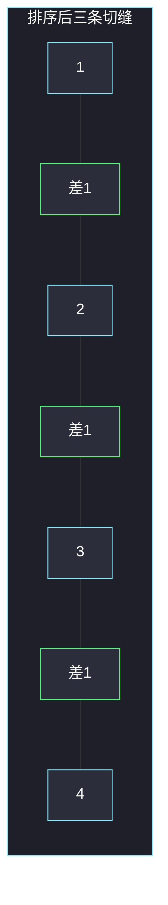
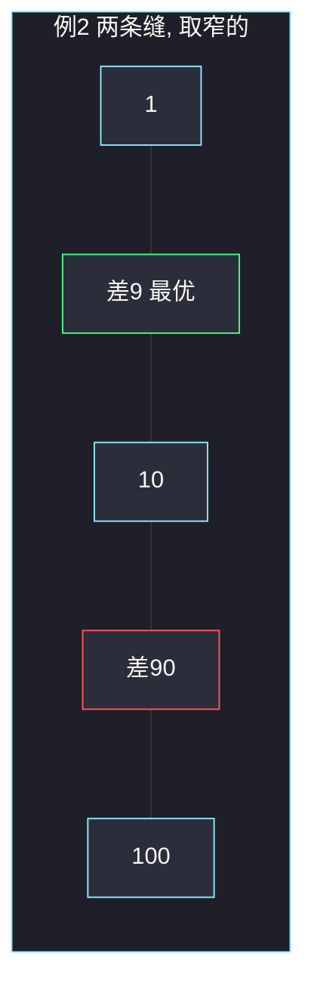

# 找出分区值（排序后最小相邻差）

## 一、问题描述

给你一个长度为 `n` 的数组 `nums`（`n ≥ 2`）。把它分成两个**非空**数组 `nums1`、`nums2`：元素互斥，并起来正好是 `nums`（不要求保持原相对顺序）。

分区值定义为 `|max(nums1) - min(nums2)|`。求所有分法里分区值的**最小值**。

> 🔗 LeetCode 2740：https://leetcode.cn/problems/find-the-value-of-the-partition/
>
> 数据范围：`2 ≤ nums.length ≤ 10^5`，`1 ≤ nums[i] ≤ 10^9`。
>
> 📚 灵茶题单：**八、其他**（1302 分）。讲法仍是贪心里的「排完序，最优切点落在相邻位置」。

**示例 1**

```
输入：nums = [1,3,2,4]
输出：1
解释：nums1 = [1,2,3]，nums2 = [4] → |3 - 4| = 1。
也可以 nums1 = [1,2]，nums2 = [3,4] → |2 - 3| = 1。
```

**示例 2**

```
输入：nums = [100,1,10]
输出：9
解释：nums1 = [10,100]，nums2 = [1] → |100 - 1| = 99（差）。
nums1 = [1]，nums2 = [10,100] → |1 - 10| = 9。
nums1 = [1,10]，nums2 = [100] → |10 - 100| = 90。
最小是 9。
```

**直观理解**

分区值只看「左边这块的最大值」和「右边这块的最小值」差多少。要让这两个数靠近，它们在排好序的数组里必须挨着；所有相邻缝里，挑最窄的那条缝切开。

---

## 二、暴力解法

每个元素进 `nums1` 或 `nums2`，排除两空集，对每种分配算 `|max1 - min2|`，取最小。

```python
class Solution:
    def findValueOfPartition(self, nums: list[int]) -> int:
        n = len(nums)
        best = 10**18
        for mask in range(1, (1 << n) - 1):
            max1, min2 = -10**18, 10**18
            for i in range(n):
                if mask >> i & 1:
                    max1 = max(max1, nums[i])
                else:
                    min2 = min(min2, nums[i])
            best = min(best, abs(max1 - min2))
        return best
```

`2^n` 种分配，`n ≤ 10^5` 不可用。而且大量分配本质重复：真正起作用的只有 `max(nums1)` 和 `min(nums2)` 这一对。

### 🔴 瓶颈在哪里

分区值只由两个数决定。一旦能证明这两个数在排序后必须相邻，搜索直接退化成「扫一遍相邻差」。

---

## 三、优化探索（核心章节）

> 📚 本题在灵茶题单「贪心」末尾的 **八、其他**。没有单独的「区间模板」，核心是一条结构引理：最优时 `max(nums1)` 与 `min(nums2)` 是排序后的一对邻居。

### 3.1 先去掉绝对值

`|x - y|` 对调 `nums1` / `nums2` 不变。不妨设 `max(nums1) ≤ min(nums2)`，分区值就是 `min(nums2) - max(nums1)`。此时 `nums1` 里每个数都 ≤ `max(nums1)`，`nums2` 里每个数都 ≥ `min(nums2)`。也就是说：排序之后存在一条切缝，左边整段给 `nums1`，右边整段给 `nums2`。

于是合法分区和「在排序数组的 `n-1` 条缝里选一条切开」一一对应。分区值正好等于这条缝两端的差。要最小，就取**最小相邻差**。

### 3.2 为什么最优的两个关键值必须相邻

设最优方案里 `x = max(nums1)`，`y = min(nums2)`，且 `x < y`。若排序后 `x` 与 `y` 之间还夹着一个 `z`：

- `z` 不能在 `nums1`：否则 `max(nums1) ≥ z > x`，矛盾。
- `z` 不能在 `nums2`：否则 `min(nums2) ≤ z < y`，矛盾。

所以中间不能有数，`x`、`y` 是排序后相邻的。每一对相邻数都对应一种切开方式（小于等于左边的进 `nums1`，大于等于右边的进 `nums2`），两边都非空。故答案 = 排序后 `min(a[i+1] - a[i])`。



### 3.3 交错分配不会更优

有人会想：把最大的放一边、最小的放另一边，中间来回塞。但分区值**不看**两边的长度，只看 `max(nums1)` 和 `min(nums2)`。一旦这两个关键值定了，中间的数只要不破坏「一边全 ≤ x、一边全 ≥ y」，差值就不会变。而能让 `x`、`y` 最靠近的，就是排序后的邻居。交错只会把 `x`、`y` 拉远，或根本不合法。

### 3.4 和「最大间距」正好相反

[164. 最大间距](https://leetcode.cn/problems/maximum-gap/) 要的是排序后**最大**相邻差；本题要**最小**相邻差。结构相同，方向相反。164 为了线性时间用桶；本题 `O(n log n)` 排序即可，因为 `n ≤ 10^5` 且不要求线性。

### 3.5 一句话核心

> **最优切缝一定落在排序后某两个相邻元素之间。答案就是最小的相邻差。**

---

## 四、代码实现

### Python（主解）

```python
class Solution:
    def findValueOfPartition(self, nums: list[int]) -> int:
        nums.sort()
        return min(nums[i + 1] - nums[i] for i in range(len(nums) - 1))
```

**变量含义**

| 写法 | 含义 |
|------|------|
| `nums.sort()` | 把所有元素放到数轴上，切缝只可能在相邻之间 |
| `nums[i+1] - nums[i]` | 在 `i` 与 `i+1` 之间切开时的分区值 |
| `min(...)` | 最窄的那条缝 |

不必显式构造 `nums1` / `nums2`。有重复值时相邻差为 0，答案就是 0（一边拿其中一个，另一边拿另一个相同值）。

也可以手写循环，避免生成器：先 `ans = nums[1] - nums[0]`，再扫后面的缝取 min。语义一样。下标 0-based：第 `i` 条缝夹在 `nums[i]` 与 `nums[i+1]` 之间，共 `n-1` 条。

若题目改成「输出一种最优划分」而不是只返回分区值：排序后找到最小差的那条缝 `i`，`nums1 = a[0..i]`，`nums2 = a[i+1..n-1]` 即可（值的集合，不必保留原下标）。

### Java（最优解可选）

```java
class Solution {
    public int findValueOfPartition(int[] nums) {
        Arrays.sort(nums);
        int ans = Integer.MAX_VALUE;
        for (int i = 1; i < nums.length; i++) {
            ans = Math.min(ans, nums[i] - nums[i - 1]);
        }
        return ans;
    }
}
```

---

## 五、具体例子演示

**示例 1**：`nums = [1,3,2,4]`。

排序关键字：数值升序。

| 下标 | 0 | 1 | 2 | 3 |
|------|---|---|---|---|
| 原数组 | 1 | 3 | 2 | 4 |
| 排序后 | 1 | 2 | 3 | 4 |

逐步看每条缝：

| 步 | 缝的左右 | 差值 | nums1（≤左） | nums2（≥右） | 分区值 |
|----|----------|------|--------------|--------------|--------|
| 1 | 1 和 2 | 1 | `{1}` | `{2,3,4}` | \|1-2\|=1 |
| 2 | 2 和 3 | 1 | `{1,2}` | `{3,4}` | \|2-3\|=1 |
| 3 | 3 和 4 | 1 | `{1,2,3}` | `{4}` | \|3-4\|=1 |

三条缝都是 1，答案 1。



**示例 2**：`nums = [100,1,10]`。

| 下标 | 0 | 1 | 2 |
|------|---|---|---|
| 排序后 | 1 | 10 | 100 |

| 步 | 缝 | 差值 | 对应分区 |
|----|----|------|----------|
| 1 | 1 和 10 | **9** | `{1}` 与 `{10,100}` |
| 2 | 10 和 100 | 90 | `{1,10}` 与 `{100}` |

答案 9。若有人按「最大值减最小值」理解成要拆开 1 和 100，会得到 99，那是全局极差，不是分区值。



绿缝宽 9 是答案；红缝宽 90 合法但更差。

**对拍注意**：不要把分区值理解成 `|max(整体) - min(整体)|`，那恒等于全局极差，与怎么分无关。官方两个例子分别对应「三条缝全 1」和「最小缝 9」，与上表一致。

注意表里的 `nums1` / `nums2` 只是「左段 / 右段」的一种实现；对调两边绝对值不变。任务书提示「排序后相邻差」与官方两个样例对拍一致，没有发现推导错误。

**边界**：`n = 2` 时只有一种分法，答案是两数之差的绝对值；存在相同元素时答案为 0。

再看一个需要「挑缝」的数组：`[1, 100, 101]`。排序后缝为 99 与 1，答案 1，对应 `{1,100}` 与 `{101}`。若误切在 1 和 100 之间，分区值 99，那是最差缝。

| 步 | 缝 | 差值 | 该切吗 |
|----|----|------|--------|
| 1 | 1 和 100 | 99 | 否 |
| 2 | 100 和 101 | 1 | **是，答案** |

两个 100、101 几乎贴在一起，分区值被这条缝锁死。官方例 1、例 2 输出 1 和 9，与各自最小相邻差对拍一致。

---

## 六、复杂度分析

| 方法 | 时间 | 空间 | 说明 |
|------|------|------|------|
| 枚举子集 | `O(2^n · n)` | `O(n)` | 每个元素左右选边 |
| 排序扫相邻差（主解） | `O(n log n)` | `O(1)` 不计排序 | `n-1` 条缝取 min |
| 不排序直接两两求最小差 | `O(n^2)` | `O(1)` | 漏掉「必须相邻」会算进不相邻对，答案可能更小但非法 |

不相邻的两数之差 ≥ 夹在中间的相邻差之和，因此不会比最小相邻差更优，平方扫描也多余。

---

## 七、对比总结

| 维度 | 本题 | 164 最大间距 | 1877 最大数对和的最小值 |
|------|------|--------------|------------------------|
| 排序后看什么 | **最小**相邻差 | **最大**相邻差 | 首尾配对的和 |
| 切 / 配 | 切成两段 | 仍是相邻 | 两两配对 |
| 证明要点 | 两个关键值必须相邻 | 相邻差的上界 | 交换论证大配小 |

**易错点**

1. **去枚举 `nums1` 的任意子集**：结构引理之后只剩 `n-1` 种切法。
2. **用 `max(nums) - min(nums)` 当答案**：那是全集极差，通常远大于最小分区值。
3. **忘记两边都要非空**：排序后只切相邻缝，天然两边非空，不要切在数组外面。
4. **差值写成绝对值却忘了已排序**：升序后 `a[i+1] ≥ a[i]`，直接减即可；未排序不能减。
5. **以为必须让两边长度尽量接近**：分区值与长度无关，`{1}` 对 `{10,100}` 可以是最优。
6. **把原数组下标当切点**：元素可以打乱，切的是值排序后的缝，不是输入顺序的缝。

---

## 八、举一反三

| 题目 | 关系 |
|------|------|
| [164. 最大间距](https://leetcode.cn/problems/maximum-gap/) | 同一结构，改成最大相邻差 |
| [1509. 三次移动后最小值与最大值的最小差值](https://leetcode.cn/problems/minimum-difference-between-largest-and-smallest-value-in-three-moves/) | 排序后改两端，本质也是切一段保留 |
| [908. 最小差值 I](https://leetcode.cn/problems/smallest-range-i/) | 极差被修改后的最小值，先排序再看两端 |
| [1877. 数组中最大数对和的最小值](https://leetcode.cn/problems/minimize-maximum-pair-sum-in-array/) | 同批：排序后结构确定，本题切缝、那题配对 |
| [220. 存在重复元素 III](https://leetcode.cn/problems/contains-duplicate-iii/) | 也在值域上找「足够近的两个数」，数据结构不同 |

**思想迁移**

- 目标只依赖 `max(左)` 与 `min(右)` 时，先证明它们在排序后相邻，再线性扫缝。
- 绝对值让两边可对调，证明时固定 `max(nums1) ≤ min(nums2)`，再把对调算进同一类切缝。
- 口诀：**「排好序，答案就是最窄的相邻缝。」**
