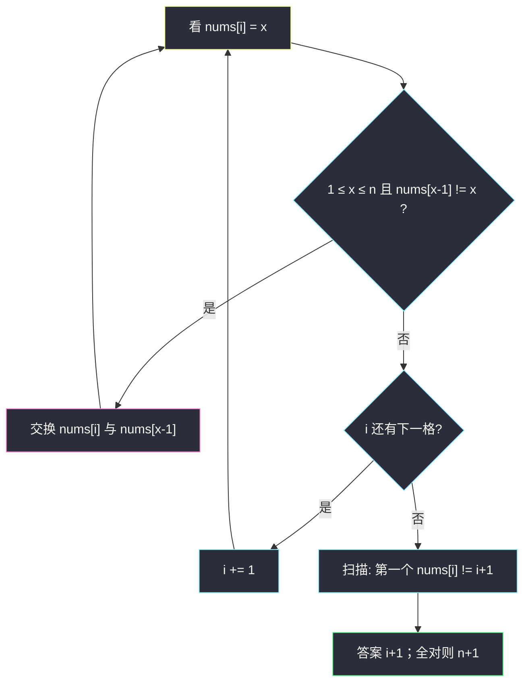
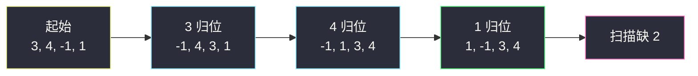

# 缺失的第一个正数（原地修改 · 交换归位）

## 一、问题描述

给你一个**未排序**的整数数组 `nums`，请找出其中没有出现的**最小正整数**。

必须在 **`O(n)` 时间**、**`O(1)` 额外空间**内完成（可以修改原数组）。

> 🔗 LeetCode 41：https://leetcode.cn/problems/first-missing-positive/
>
> 数据范围：`1 <= nums.length <= 10^5`，`-2^31 <= nums[i] <= 2^31 - 1`。

**示例 1**

```
输入：nums = [1,2,0]
输出：3
解释：1、2 都在，最小缺的正数是 3。
```

**示例 2**

```
输入：nums = [3,4,-1,1]
输出：2
解释：1、3、4 在，缺 2。
```

**示例 3**

```
输入：nums = [7,8,9,11,12]
输出：1
解释：连 1 都没有。
```

**直观理解**

答案一定落在 `[1, n+1]`：长度为 `n` 的数组最多装下 `n` 个不同正数；若 `1..n` 全到齐，缺的就是 `n+1`，否则缺的是 `1..n` 里最小的那个。于是数组本身可以当哈希表：下标 `i` 这个「盒子」专门存放值 `i+1`。把每个落在 `[1, n]` 里的 `x` 交换到下标 `x-1`，再扫一遍，第一个「盒子里不是该有的数」的位置 `i` 就对应答案 `i+1`。这是灵神 **§3.5 原地修改**。

---

## 二、暴力解法

### 做法 A：排序后扫描

```python
class Solution:
    def firstMissingPositive(self, nums: List[int]) -> int:
        nums.sort()
        miss = 1
        for x in nums:
            if x == miss:
                miss += 1
            elif x > miss:
                break
        return miss
```

时间 `O(n log n)`，不满足 `O(n)`。遇到负数、零、重复正数时 `miss` 停着不动，逻辑是对的。

### 做法 B：哈希集合

```python
class Solution:
    def firstMissingPositive(self, nums: List[int]) -> int:
        s = set(nums)
        for i in range(1, len(nums) + 2):
            if i not in s:
                return i
        return -1  # 不可达：最差缺 n+1
```

时间 `O(n)`，但集合要 `O(n)` 额外空间，违背 `O(1)` 空间。它把「答案 ∈ `[1, n+1]`」说得很清楚，原地做法就是把这张表塞进原数组。

### 复杂度

- **排序**：时间 `O(n log n)`，空间视语言 `O(1)` 或 `O(n)`。
- **哈希表**：时间 `O(n)`，空间 `O(n)`。

### 🔴 瓶颈在哪里

时间或空间总有一项超标。真正能同时满足的，是**用下标当键、用格子里的值当「是否出现」**——键的范围恰好是 `1..n`，和数组长度咬合。

---

## 三、优化探索（核心章节）

> 📚 本题在灵茶题单中属于 **03-原地修改 · §3.5**（无评分）。把值 `x ∈ [1, n]` 交换到下标 `x - 1`；再线性扫描找第一个 `nums[i] != i + 1`，答案是 `i + 1`；若全对则 `n + 1`。重复值、越界值（≤ 0 或 > n）不参与归位。

### 3.1 答案范围

长度为 `n`：

- 若 `1, 2, …, n` 都出现，最小缺的正数是 `n + 1`；
- 否则最小缺的正数 `≤ n`。

所以只需关心 `1..n` 谁在谁不在。`0`、负数、`n+1` 及以上对答案没有「占坑」作用，当作垃圾。

### 3.2 下标即哈希

约定：下标 `i`（0-based）对应正整数 `i+1`。目标排列形态：

```
下标:  0    1    2   ...  n-1
应放:  1    2    3   ...  n
```

对每个位置 `i`，若 `nums[i] = x` 且 `x ∈ [1, n]`，而 `nums[x-1] != x`（目的地还不是 `x`），就把 `nums[i]` 与 `nums[x-1]` 交换。交换后新的 `nums[i]` 可能又是一个待归位的数，所以要用 **`while` 而不是 `if`**，直到当前格非法或已经归位。

**为什么 `nums[x-1] != x` 而不是 `i != x-1`：**

- `i != x-1` 只说明「当前格不该放这个 x」，但目的地可能**已经是 x**（重复值）。若仍交换，两个 x 来回对调，**死循环**。
- `nums[x-1] != x`：目的地已经是 x 就停——当前这个多余的 x 随便待着，当垃圾即可。



### 3.3 正确性

归位阶段结束后，对任意 `x ∈ [1, n]`：

- 若 `x` 至少出现一次，则下标 `x-1` 上一定是 `x`。因为每次发现一个尚未归位的 `x` 就会把它换过去，且一旦到了就不再被合法交换搬走（搬走的条件是「目的地不是 x」，而它自己就是 x）。垃圾和重复只会留在「主人不在」的格子里，或与其它垃圾互换。
- 若 `x` 从未出现，下标 `x-1` 上一定不是 `x`。

因此从左到右第一个 `nums[i] != i+1` 就是最小的缺失正数。全部相等则缺 `n+1`。

时间：每个位置的值至多被换到「正确盒子」一次，之后要么停要么当垃圾，总交换次数 `O(n)`。

### 3.4 符号标记法（等价，可选）

另一条 `O(1)` 空间路：先把非正数改成 `n+1`，再对每个 `x = abs(nums[i])`，若 `x ∈ [1, n]`，把 `nums[x-1]` 改成负数表示「x 出现过」；最后第一个仍为正的下标即答案。正确，但有「先改写再看绝对值」的坑，且值域含负数时要先清场。交换归位更贴合 §3.5「把元素放到该在的下标」。主解用交换。

### 3.5 Python 交换的下标陷阱

**禁止**写成：

```python
nums[i], nums[nums[i] - 1] = nums[nums[i] - 1], nums[i]
```

Python 赋值左侧按从左到右求地址：先给 `nums[i]` 赋了新值，再计算 `nums[nums[i]-1]` 时 `nums[i]` 已经变了，写到错误下标。必须先记下目的地：

```python
j = nums[i] - 1
nums[i], nums[j] = nums[j], nums[i]
```

### 3.6 一句话核心

> **把 1..n 各自送回下标 x-1；重复与越界跳过；第一个空盒子的编号就是缺的正数。**

---

## 四、代码实现

### Python（主解：原地交换归位）

```python
class Solution:
    def firstMissingPositive(self, nums: List[int]) -> int:
        n = len(nums)
        for i in range(n):
            while 1 <= nums[i] <= n and nums[nums[i] - 1] != nums[i]:
                j = nums[i] - 1                 # 先记下目的地
                nums[i], nums[j] = nums[j], nums[i]
        for i in range(n):
            if nums[i] != i + 1:
                return i + 1
        return n + 1
```

**变量含义**

| 变量 | 含义 |
|------|------|
| `n` | 数组长度，答案上界是 `n+1` |
| `i` | 当前处理 / 扫描的下标 |
| `j = nums[i]-1` | 值 `nums[i]` 应去的下标 |

**循环不变式（归位双重循环）**：`while` 结束时，要么 `nums[i]` 不在 `[1, n]`，要么 `nums[nums[i]-1] == nums[i]`（该值已有一个副本坐在正确盒子里）。

### 可选：符号标记（同样 `O(n)` / `O(1)`）

不想交换、愿意先清场时：把非正数改成 `n+1`，再用负号把「x 出现过」打在下标 `x-1` 上。

```python
class Solution:
    def firstMissingPositive(self, nums: List[int]) -> int:
        n = len(nums)
        for i in range(n):
            if nums[i] <= 0:
                nums[i] = n + 1
        for x in nums:
            v = abs(x)
            if 1 <= v <= n:
                nums[v - 1] = -abs(nums[v - 1])
        for i in range(n):
            if nums[i] > 0:
                return i + 1
        return n + 1
```

`abs` 是因为同一 `x` 可能出现多次，格子可能已经是负的。主解仍推荐交换：更贴合「值回到下标」，也不依赖「先把负数赶走」。

### Java（最优解同款）

```java
class Solution {
    public int firstMissingPositive(int[] nums) {
        int n = nums.length;
        for (int i = 0; i < n; i++) {
            while (nums[i] >= 1 && nums[i] <= n && nums[nums[i] - 1] != nums[i]) {
                int j = nums[i] - 1;
                int tmp = nums[i];
                nums[i] = nums[j];
                nums[j] = tmp;
            }
        }
        for (int i = 0; i < n; i++) {
            if (nums[i] != i + 1) {
                return i + 1;
            }
        }
        return n + 1;
    }
}
```

Java 里 `nums[i], nums[nums[i]-1] = ...` 没有元组赋值，本来就要用临时变量，反而不会踩 Python 那个坑。注意 `while` 条件里两次读 `nums[i]`，交换后下轮会用新值，这是故意的。

---

## 五、具体例子演示

### 5.1 逐步交换：`[3,4,-1,1]`，`n = 4`

目标：下标 0,1,2,3 分别应放 1,2,3,4。

**i = 0**，`nums = [3, 4, -1, 1]`

| 步 | 当前 nums[0] | 合法？ | 动作 | 交换后 |
|----|--------------|--------|------|--------|
| 1 | 3 | 3∈[1,4]，下标 2 上是 -1 ≠ 3 | 与下标 2 交换 | `[-1, 4, 3, 1]` |
| 2 | -1 | 越界 | 停 | |

**i = 1**，`nums = [-1, 4, 3, 1]`

| 步 | 当前 nums[1] | 合法？ | 动作 | 交换后 |
|----|--------------|--------|------|--------|
| 1 | 4 | 4∈[1,4]，下标 3 上是 1 ≠ 4 | 与下标 3 交换 | `[-1, 1, 3, 4]` |
| 2 | 1 | 1∈[1,4]，下标 0 上是 -1 ≠ 1 | 与下标 0 交换 | `[1, -1, 3, 4]` |
| 3 | -1 | 越界 | 停 | |

**i = 2**，`nums[2] = 3`，目的地下标 2 已是 3，停。

**i = 3**，`nums[3] = 4`，已归位，停。

扫描：`nums[0]=1` ✓，`nums[1]=-1 ≠ 2` → 返回 **2** ✓。



### 5.2 重复值不会死循环：`[1, 1]`

`n = 2`。`i = 0`：`nums[0]=1`，目的地下标 0 已是 1，`nums[0] == nums[0]`，while 不进。`i = 1`：`nums[1]=1`，目的地下标 0 已是 1，`nums[0] == 1`，**不交换**。扫描：`nums[0]=1` ✓，`nums[1]=1 ≠ 2` → 返回 2。若误写成「只要 `i != x-1` 就换」，两个 1 会永远对打。

### 5.3 全越界：`[7,8,9,11,12]`

`n = 5`，所有值 > 5，一次交换都不发生。扫描 `nums[0]=7 ≠ 1` → 返回 **1** ✓。

### 5.4 满员：`[1,2,0]`

`1`、`2` 已在下标 0、1；`0` 非法。扫描第三格 `0 ≠ 3` → 返回 **3** ✓。若输入是 `[1,2,3]`，扫描全过，返回 `n+1 = 4`。

### 5.5 单元素

| 输入 | 归位后 | 答案 |
|------|--------|------|
| `[1]` | `[1]` | 2 |
| `[2]` | `[2]`（2>1，不换） | 1 |
| `[-1]` | `[-1]` | 1 |

---

## 六、复杂度分析

| 方法 | 时间 | 空间 | 说明 |
|------|------|------|------|
| 排序 | `O(n log n)` | `O(1)` 或 `O(n)` | 超时于「必须线性」 |
| 哈希集合 | `O(n)` | `O(n)` | 空间超标 |
| 原地交换（主解） | `O(n)` | `O(1)` 额外 | 每个数最多归位一次 |
| 符号标记 | `O(n)` | `O(1)` 额外 | 需处理原负数 |

「`O(1)` 额外」允许修改输入；若面试禁止改原数组，只能哈希，并说明约束冲突。

---

## 七、对比总结

| 维度 | 本题 | #268 丢失的数字 | #448 找到所有消失的数字 |
|------|------|-----------------|-------------------------|
| 值域 | 任意 32 位整数 | `[0, n]` 缺一个 | `[1, n]` 可缺多个 |
| 手段 | 交换归位 | 异或 / 求和 / 下标 | 同样下标哈希（常标记负号） |
| 答案 | 最小缺失正数 | 唯一缺失 | 全部缺失 |

同目录 `remove-duplicates-from-sorted-array.md` 也是 §3.5：用写指针覆盖；本题是「按值找下标」的交换，不是快慢指针。

**易错点**

1. **死循环**：重复值必须用 `nums[nums[i]-1] != nums[i]` 当刹车，不能只用 `i != nums[i]-1`。
2. **Python 链式交换求值顺序**：先 `j = nums[i]-1` 再换。
3. **用 `if` 换一次**：`[4, -1, 1, 3]` 这类链式错位，一格要连换多次才能把「换进来的新值」处理完。
4. **范围写成 `1..n-1`**：`n` 自己也要归到下标 `n-1`。
5. **扫描写成找 `nums[i] == 0`**：垃圾可能是 99 也可能是 -3，判定标准是 `!= i+1`。
6. **`n = 1` 漏测**：`[1] → 2`，`[2] → 1`。
7. 先把负数改成 0 再交换不是必须；越界在 `while` 条件里直接跳过更干净。

**模板（§3.5 值归下标）**

```python
n = len(nums)
for i in range(n):
    while 1 <= nums[i] <= n and nums[nums[i] - 1] != nums[i]:
        j = nums[i] - 1
        nums[i], nums[j] = nums[j], nums[i]
for i in range(n):
    if nums[i] != i + 1:
        return i + 1
return n + 1
```

---

## 八、举一反三

| 题目 | 关系 |
|------|------|
| [268. 丢失的数字](https://leetcode.cn/problems/missing-number/) | `[0, n]` 缺一个，可用异或，不必原地哈希 |
| [448. 找到所有数组中消失的数字](https://leetcode.cn/problems/find-all-numbers-disappeared-in-an-array/) | `[1, n]` 列出全部缺失，符号标记或同样归位 |
| [442. 数组中重复的数据](https://leetcode.cn/problems/find-all-duplicates-in-an-array/) | 归位后「格子里不是自己」或负号第二次碰上即重复 |
| [287. 寻找重复数](https://leetcode.cn/problems/find-the-duplicate-number/) | 不能改数组时走 Floyd 环；能改则归位 |
| [645. 错误的集合](https://leetcode.cn/problems/set-mismatch/) | 一个重复 + 一个缺失，归位后对照下标 |
| [26. 删除有序数组中的重复项](https://leetcode.cn/problems/remove-duplicates-from-sorted-array/) | 同属 §3.5（`remove-duplicates-from-sorted-array.md`），手段是写指针不是交换 |

**思想迁移**

- 「值的范围和下标范围对齐」⇒ 数组当哈希表，键不用真哈希。
- 交换归位处理重复的标准刹车：目的地已经是这个值就停。
- 口诀：**「x 送到 x-1；重复不换防空转；第一个空盒就是缺的正数。」**
