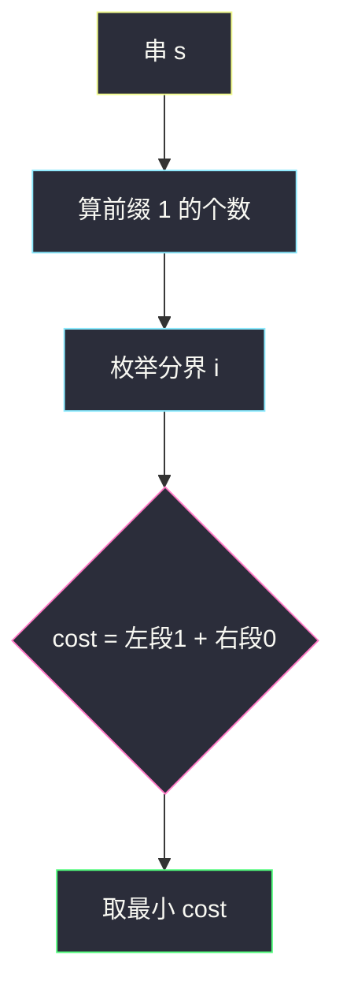
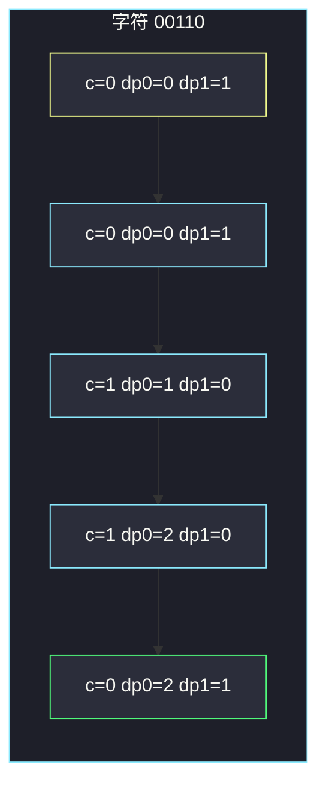

# 将字符串翻转到单调递增（前后缀分解 / 一维 DP）

## 一、问题描述

二进制串 `s`。一次翻转把某个 `'0'` 变成 `'1'`，或反过来。希望最终串**单调递增**：若干个 0（可以为空）后面接若干个 1（可以为空），即全 0、全 1、或 `000…0111…1`。求最少翻转次数。

> 🔗 LeetCode 926：https://leetcode.cn/problems/flip-string-to-monotone-increasing/
>
> 数据范围：`1 ≤ s.length ≤ 10^5`，只含 `'0'`/`'1'`。
>
> 📚 灵茶题单：**专题：前后缀分解**。合法串被一个分界点劈开：左边必须全是 0，右边必须全是 1。分界左侧的每个 1 翻一次，右侧的每个 0 翻一次。预处理前缀 1 个数、后缀 0 个数后，枚举分界 `O(n)`。

**示例 1**

```
输入：s = "00110"
输出：1
解释：翻最后一个 0，得到 "00111"。
```

**示例 2**

```
输入：s = "010110"
输出：2
解释：一种办法是翻成 "011111"。
```

**示例 3**

```
输入：s = "00011000"
输出：2
解释：翻成 "00000000" 或把后半段收成 1，最少两次。
```

**直观理解**

单调递增二进制串只有 `n+1` 种形态（分界可以在 0 到 n 之间）。不用搜索翻转哪些位，只要决定「从哪一位开始全是 1」。

---

## 二、暴力解法

枚举分界 `i`（左边 `s[0..i)` 变 0，右边 `s[i..n)` 变 1），每次扫描计数。

```python
class Solution:
    def minFlipsMonoIncr(self, s: str) -> int:
        n = len(s)
        ans = n
        for i in range(n + 1):
            cost = 0
            for j in range(i):
                if s[j] == "1":
                    cost += 1
            for j in range(i, n):
                if s[j] == "0":
                    cost += 1
            ans = min(ans, cost)
        return ans
```

三道官方例都对。`n = 10^5` 时 `O(n²)` 超时。

### 🔴 瓶颈在哪里

每个分界的代价是「左段 1 的个数 + 右段 0 的个数」，而左段 1 就是前缀，右段 0 就是后缀。扫一遍前缀即可 `O(n)`。

---

## 三、优化探索（核心章节）

> 📚 灵茶 **专题：前后缀分解**：答案形态被下标 `i` 唯一决定。`cost(i) = ones(s[0..i)) + zeros(s[i..n))`。`ones` 用前缀和，`zeros(右) = 右段长度 − 右段 1 的个数`。

### 3.1 枚举分界

`pre1[k]` = `s[0..k)` 里 1 的个数。则

`cost(i) = pre1[i] + (n - i) - (pre1[n] - pre1[i])`

`i = 0` 是整串变 1（只翻 0）；`i = n` 是整串变 0（只翻 1）。



### 3.2 等价 DP

从左往右看每一位，它要么仍停在「0 段」，要么已经进入「1 段」（进了就不能回去）。

- `dp0`：前缀已经处理完，目前仍全是 0 的最少翻转。
- `dp1`：前缀已经是合法单调串、且最后一位是 1 的最少翻转。

当前字符 `c`：

- 继续 0 段：`ndp0 = dp0 + (c == '1')`（是 1 就要翻掉）。
- 进入 / 留在 1 段：`ndp1 = min(dp0, dp1) + (c == '0')`（是 0 就要翻成 1；可以从 0 段切过来）。

答案 `min(dp0, dp1)`。滚动两个变量即可。

### 3.3 一句话核心

> **枚举「从哪开始全是 1」：左边每个 1 翻一次，右边每个 0 翻一次。**

---

## 四、代码实现

### Python（主解：前缀和枚举分界）

```python
class Solution:
    def minFlipsMonoIncr(self, s: str) -> int:
        n = len(s)
        pre1 = [0] * (n + 1)
        for i, c in enumerate(s):
            pre1[i + 1] = pre1[i] + (c == "1")
        ans = n
        for i in range(n + 1):
            left1 = pre1[i]
            right0 = (n - i) - (pre1[n] - pre1[i])
            ans = min(ans, left1 + right0)
        return ans
```

### Python（等价：滚动 DP）

```python
class Solution:
    def minFlipsMonoIncr(self, s: str) -> int:
        # dp0 / dp1：处理完当前前缀，结尾仍在 0 段 / 已进入 1 段的最少翻转
        dp0 = dp1 = 0
        for c in s:
            ndp0 = dp0 + (c == "1")
            ndp1 = min(dp0, dp1) + (c == "0")
            dp0, dp1 = ndp0, ndp1
        return min(dp0, dp1)
```

### Java（最优解：滚动 DP）

```java
class Solution {
    public int minFlipsMonoIncr(String s) {
        int dp0 = 0, dp1 = 0;
        for (int i = 0; i < s.length(); i++) {
            char c = s.charAt(i);
            int ndp0 = dp0 + (c == '1' ? 1 : 0);
            int ndp1 = Math.min(dp0, dp1) + (c == '0' ? 1 : 0);
            dp0 = ndp0;
            dp1 = ndp1;
        }
        return Math.min(dp0, dp1);
    }
}
```

---

## 五、具体例子演示

### 5.1 官方 `"00110"`：逐步填分界表

`pre1 = [0, 0, 0, 1, 2, 2]`（`n=5`，共两个 1）。

| 分界 i | 左段 | 右段 | 左 1 | 右 0 | cost |
|--------|------|------|------|------|------|
| 0 | 空 | 00110 | 0 | 3 | 3 |
| 1 | 0 | 0110 | 0 | 1 | 1 |
| 2 | 00 | 110 | 0 | 1 | 1 |
| 3 | 001 | 10 | 1 | 1 | 2 |
| 4 | 0011 | 0 | 2 | 1 | 3 |
| 5 | 00110 | 空 | 2 | 0 | 2 |

最小是 1，对应翻成 `01111` 或 `00111`。对拍官方。

### 5.2 同一串用 DP 逐步走



1. `'0'`：留在 0 段不用翻 `dp0=0`；切到 1 段要把 0 翻成 1，`dp1=1`。
2. `'0'`：仍是 `dp0=0`，`dp1=1`。
3. `'1'`：0 段必须翻掉这个 1 → `dp0=1`；1 段不用翻，可从 `dp0=0` 切过来 → `dp1=0`。
4. `'1'`：`dp0=2`，`dp1=0`（保持 1 段）。
5. `'0'`：`dp0=2`；1 段要把 0 翻掉 → `dp1=1`。

`min(2,1)=1`，与分界表一致。

### 5.3 官方 `"010110"`：分界表

`pre1 = [0, 0, 1, 1, 2, 3, 3]`。

| 分界 i | 左 1 | 右 0 | cost |
|--------|------|------|------|
| 0 | 0 | 3 | 3 |
| 1 | 0 | 2 | 2 |
| 2 | 1 | 2 | 3 |
| 3 | 1 | 1 | 2 |
| 4 | 2 | 1 | 3 |
| 5 | 3 | 1 | 4 |
| 6 | 3 | 0 | 3 |

最小 2。对拍官方。一种最优：`i=1` 翻成 `011111`（翻两个 0）。

### 5.4 官方 `"00011000"`

共两个 1。`i=n` 把整串变 0，代价 2；若想保留后半段为 1，尾部三个 0 都要翻，代价更大。最小 2。对拍官方。

---

## 六、复杂度分析

| 方法 | 时间 | 空间 | 说明 |
|------|------|------|------|
| 每个分界再扫一遍 | `O(n²)` | `O(1)` | `n=10^5` 超时 |
| 前缀和枚举分界 | `O(n)` | `O(n)` | 主解 |
| 滚动 DP | `O(n)` | `O(1)` | 与主解等价 |

---

## 七、对比总结

| 维度 | 前后缀 | DP |
|------|--------|-----|
| 决策 | 显式枚举切一刀 | 每位选留在 0 段或进 1 段 |
| 空间 | 前缀数组 | 两个变量 |
| 易讲性 | 更直观 | 更省空间 |

**易错点**

1. **分界漏掉 `i=0` / `i=n`**：全 1、全 0 都合法。
2. **右段 0 的个数算成右段 1**：公式是 `长度 − 1 的个数`。
3. **DP 里 1 段不能从「未来」切回 0 段**：`ndp0` 只能来自 `dp0`，不能 `min(dp0, dp1)`。
4. **空串**：本题 `n ≥ 1`，不用处理。

---

## 八、举一反三

| 题目 | 关系 |
|------|------|
| [2483. 商店的最少代价](https://leetcode.cn/problems/minimum-penalty-for-a-shop/) | 同一专题：左开右关的代价拆前后缀；见同目录 `minimum-penalty-for-a-shop.md` |
| [1653. 使字符串平衡的最少删除次数](https://leetcode.cn/problems/minimum-deletions-to-make-string-balanced/) | `a…ab…b` 形态，删除代替翻转 |
| [1525. 字符串的好分割数目](https://leetcode.cn/problems/number-of-good-ways-to-split-a-string/) | 枚举分割点 + 前后缀集合；见 `number-of-good-ways-to-split-a-string.md` |
| [1664. 生成平衡数组的方案数](https://leetcode.cn/problems/ways-to-make-a-fair-array/) | 删一个下标后的奇偶前后缀；见 `ways-to-make-a-fair-array.md` |
| [926. 将字符串翻转到单调递增](https://leetcode.cn/problems/flip-string-to-monotone-increasing/) | 本题 |

**思想迁移**

- 合法结果只有「一刀切开」的形态时，枚举刀口 + 前缀统计。
- 口诀：**「左翻 1、右翻 0；切 n+1 刀取最小。」**
