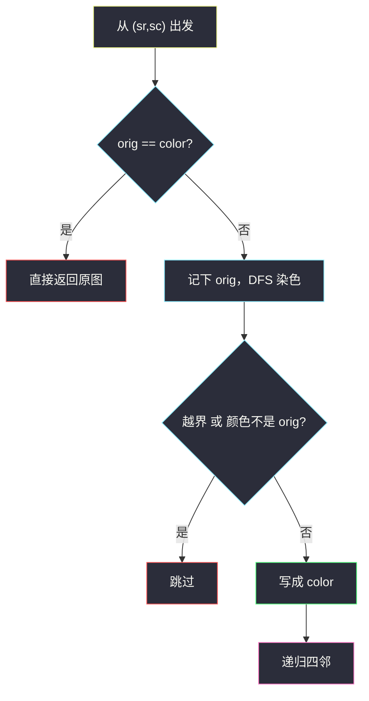
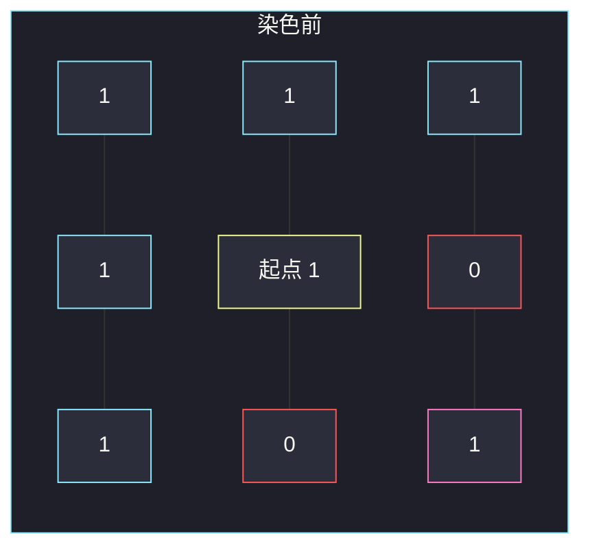

# 图像渲染（四连通染色 · Flood Fill）

## 一、问题描述

给定 `m × n` 的整数图像 `image`，以及起点 `(sr, sc)` 和新颜色 `color`。从 `image[sr][sc]` 出发，把**与起点原始颜色相同、四连通**的整块改成 `color`，返回改完后的图像。

四连通 = 上、下、左、右，不含对角线。

> 🔗 LeetCode 733：https://leetcode.cn/problems/flood-fill/
>
> 数据范围：`1 ≤ m, n ≤ 50`，像素值与 `color` 落在 `[0, 2^16)`。
>
> 📚 灵茶题单：**一、网格图 DFS**。

**示例 1**

```
输入：image = [[1,1,1],[1,1,0],[1,0,1]]，sr = 1, sc = 1, color = 2
输出：[[2,2,2],[2,2,0],[2,0,1]]

起点 (1,1) 原始色 1。与它四连通的 1 全部改成 2。
右下角 (2,2) 是 1，但只对角相邻，不算连通，保持 1。
```

**示例 2**

```
输入：image = [[0,0,0],[0,0,0]]，sr = 0, sc = 0, color = 0
输出：[[0,0,0],[0,0,0]]
起点颜色已经等于 color，图像不变。
```

**直观理解**

画图软件的油漆桶：点一下，把同一色块灌成新颜色。网格上就是「从起点 DFS / BFS，只走进颜色仍等于原始色的格子」。

---

## 二、暴力解法

反复扫整张图：若某格颜色是原始色、且四邻里已有新颜色（或就是起点），就把它改掉。直到某一轮没有任何格子变化。

```python
class Solution:
    def floodFill(self, image: List[List[int]], sr: int, sc: int, color: int) -> List[List[int]]:
        orig = image[sr][sc]
        if orig == color:
            return image
        m, n = len(image), len(image[0])
        DIRS = ((0, 1), (0, -1), (1, 0), (-1, 0))
        image[sr][sc] = color
        changed = True
        while changed:
            changed = False
            for i in range(m):
                for j in range(n):
                    if image[i][j] != orig:
                        continue
                    for di, dj in DIRS:
                        ni, nj = i + di, j + dj
                        if 0 <= ni < m and 0 <= nj < n and image[ni][nj] == color:
                            image[i][j] = color
                            changed = True
                            break
        return image
```

每一轮最坏扫 `O(mn)`，连通块直径可达 `O(mn)`，时间 `O((mn)²)`。

### 🔴 瓶颈在哪里

连通块是一张图，从起点走一遍就能染完。反复全图扫描是在用「扩散一层」模拟 BFS，多付了平方。

---

## 三、优化探索（核心章节）

> 📚 本题在灵茶题单中属于 **一、网格图 DFS**。模板：方向数组 + 边界检查 + 访问标记（这里用「改成新颜色」当 visited）。

### 3.1 先记下原始色

`orig = image[sr][sc]`。之后只染 `image[i][j] == orig` 的格子。

若 `orig == color`：**直接返回**。否则「改成 color」不会改变格子，DFS 会把同一格反复进入，无限递归。

### 3.2 方向数组

```
DIRS = ((0, 1), (0, -1), (1, 0), (-1, 0))  # 右、左、下、上
```

走到 `(ni, nj)` 前检查 `0 ≤ ni < m` 且 `0 ≤ nj < n`。出界或颜色不是 `orig` 就停。

### 3.3 染色即标记

把当前格写成 `color` 再递归四邻。新颜色 ≠ `orig`（已排除相等的情况），不会二次进入。不必另开 `visited`。



### 3.4 一句话核心

> **记下起点原色；原色已是新色则返回；否则 DFS 把四连通同色块改掉。**

---

## 四、代码实现

### Python（主解：原地 DFS）

```python
from typing import List

class Solution:
    def floodFill(self, image: List[List[int]], sr: int, sc: int, color: int) -> List[List[int]]:
        orig = image[sr][sc]
        if orig == color:
            return image
        m, n = len(image), len(image[0])
        DIRS = ((0, 1), (0, -1), (1, 0), (-1, 0))

        def dfs(i: int, j: int) -> None:
            if not (0 <= i < m and 0 <= j < n) or image[i][j] != orig:
                return
            image[i][j] = color
            for di, dj in DIRS:
                dfs(i + di, j + dj)

        dfs(sr, sc)
        return image
```

**变量含义**

| 写法 | 含义 |
|------|------|
| `orig` | 起点原始颜色，连通块的「门票」 |
| `DIRS` | 右左下上四个单位向量 |
| 写成 `color` | 染色 + 标记已访问 |

BFS 等价：`deque` 从 `(sr, sc)` 出发，出队后染四邻。网格小，DFS 更短，优先默写这一版。

---

## 五、具体例子演示

**示例 1**：`orig = 1`，`DIRS` 顺序为右、左、下、上。DFS 染色顺序：

| 步 | 格子 | 动作 |
|----|------|------|
| 1 | (1,1) | 起点，写成 2。右邻 (1,2) 是 0，跳过 |
| 2 | (1,0) | 左邻是 1，写成 2 |
| 3 | (2,0) | 从 (1,0) 往下，写成 2 |
| 4 | (0,0) | 从 (1,0) 往上，写成 2 |
| 5 | (0,1) | 从 (0,0) 往右，写成 2 |
| 6 | (0,2) | 从 (0,1) 往右，写成 2 |

回到 (1,1) 时下邻 (2,1) 是 0、上邻 (0,1) 已是 2。结束。

```
染色前：          染色后：
1 1 1             2 2 2
1 1 0             2 2 0
1 0 1             2 0 1
```



黄是起点；青格会被染成 2；红格是 0；粉格 (2,2) 颜色是 1，但不四连通，保持 1。

**示例 2**：`orig == color == 0`，函数开头直接返回，零次递归。

---

## 六、复杂度分析

| 方法 | 时间 | 空间 | 说明 |
|------|------|------|------|
| 反复全图扩散 | `O((mn)²)` | `O(1)` 额外 | 每轮只推进一层 |
| DFS / BFS（主解） | `O(mn)` | `O(mn)` 最坏递归栈 / 队列 | 每格进出常数次；`m, n ≤ 50` |

---

## 七、对比总结

| 维度 | 本题 | 岛屿面积 `max-area-of-island.md` |
|------|------|----------------------------------|
| 连通条件 | 颜色等于 `orig` | 格子值是 1 |
| 标记 | 改成 `color` | 改成 0 |
| 额外判断 | `orig == color` 要提前返回 | 无岛返回 0 |

**易错点**

1. **忘记 `orig == color` 提前返回**：会无限递归。
2. **先改色再记 `orig`**：`orig` 已经变成新色，连通块找不到。必须先存。
3. **走对角线**：题目只要四连通。(2,2) 就是用来卡这个的。
4. **出界检查漏了**：`ni, nj` 先判范围再读 `image`。

---

## 八、举一反三

| 题目 | 关系 |
|------|------|
| [695. 岛屿的最大面积](https://leetcode.cn/problems/max-area-of-island/) | 同节 DFS；连通块计数，见 `max-area-of-island.md` |
| [200. 岛屿数量](https://leetcode.cn/problems/number-of-islands/) | 同模板，连通块个数而不是改色 |
| [1034. 边框着色](https://leetcode.cn/problems/coloring-a-border/) | Flood Fill 后只给「连通块边界」上色 |
| [130. 被围绕的区域](https://leetcode.cn/problems/surrounded-regions/) | 从边界灌水，见 `surrounded-regions.md` |

**思想迁移**

- 网格连通块 = 图的 DFS / BFS；方向数组一次写对，后面所有网格题共用。
- 口诀：**「先存原色；同色才走；改色当 visited。」**
