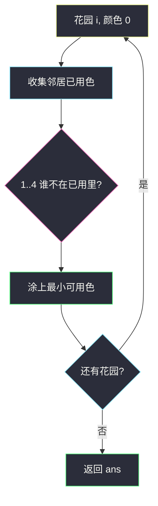

# 不邻接植花（度 ≤ 3 的贪心染色）

## 一、问题描述

`n` 个花园编号 `1 .. n`。`paths[i] = [x, y]` 是双向相邻。每个花园至多 3 条路。要在每个花园种 1、2、3、4 四种花之一，相邻不同色。保证有解。返回任一合法数组 `answer`，`answer[i]` 是花园 `i+1` 的花色。

> 🔗 LeetCode 1042：https://leetcode.cn/problems/flower-planting-with-no-adjacent/
>
> 数据范围：`1 ≤ n ≤ 1e4`，边数 ≤ `2e4`。无自环。最大度 ≤ 3。
>
> 📚 灵茶题单：**九、其他**。不是回溯搜 4^n，是「度小于色数 ⇒ 贪心永远有色可涂」。

**示例 1**

```
输入：n = 3, paths = [[1,2],[2,3],[3,1]]
输出：[1,2,3]
```

三角形，三种不同色即可。`[1,2,4]` 等也对。

**示例 2**

```
输入：n = 4, paths = [[1,2],[3,4]]
输出：[1,2,1,2]
```

两个不相交的边，每对内部不同色，不同连通块互不影响。

**示例 3**

```
输入：n = 4, paths = [[1,2],[2,3],[3,4],[4,1],[1,3],[2,4]]
输出：[1,2,3,4]
```

K4 完全图，四个点两两相邻，刚好用满 4 色。

**直观理解**

每个点最多 3 个邻居，邻居最多占用 3 种颜色，4 种里至少剩 1 种。按任意顺序给点涂还没用过的最小颜色，不必回溯。

---

## 二、暴力解法

每个花园试 4 色，和已涂邻居冲突就换，失败则回溯。最坏 `O(4^n)`，`n=1e4` 不可用。图不是「必须搜」的那种着色——色数大于最大度，贪心完备。

```python
from typing import List

class Solution:
    def gardenNoAdj(self, n: int, paths: List[List[int]]) -> List[int]:
        g = [[] for _ in range(n)]
        for x, y in paths:
            g[x - 1].append(y - 1)
            g[y - 1].append(x - 1)
        ans = [0] * n

        def dfs(i: int) -> bool:
            if i == n:
                return True
            used = {ans[j] for j in g[i]}
            for c in range(1, 5):
                if c not in used:
                    ans[i] = c
                    if dfs(i + 1):
                        return True
                    ans[i] = 0
            return False

        dfs(0)
        return ans
```

逻辑对，但完全没必要：下面证明每个点第一次选色就不会失败。

### 🔴 瓶颈在哪里

最大度 `Δ ≤ 3`，可用色 `4 ≥ Δ+1`。顺序贪心：当前点邻居已用色 ≤ 3，集合 `{1,2,3,4}` 里必有空位。一遍 `O(n+m)`。

---

## 三、优化探索（核心章节）

> 📚 本题在灵茶题单中属于 **九、其他**。和图论染色、二分图（785）同一家族，但本题色数给得宽，不用检查「是不是二分」。

### 3.1 为什么不用回溯

给花园 `i` 染色时，至多 3 个邻居。无论它们是否已染色：

- 未染色：不占颜色；
- 已染色：最多 3 种不同色。

所以 `{1,2,3,4}` 至少有一种邻居没用过。选其中任意一种（通常选最小）即可往下走，**不会卡死**，也就不用撤销。

这不是四色定理（平面图 4 色很难），只是「`Δ+1` 色对任何图都能贪心涂完」的特例。

### 3.2 涂色顺序

按编号 `0 .. n-1` 扫一遍足够。连通块、孤立点都不用特判：孤立点邻居空，直接涂 1。

邻接表下标要减一：花园从 1 编号，答案数组从 0。边双向。



### 3.3 一句话核心

> **度 ≤ 3、色有 4；看邻居用过哪些，挑 1–4 里剩的那个。一遍过，不回溯。**

---

## 四、代码实现

### Python（主解：顺序贪心）

```python
from typing import List

class Solution:
    def gardenNoAdj(self, n: int, paths: List[List[int]]) -> List[int]:
        g = [[] for _ in range(n)]
        for x, y in paths:
            g[x - 1].append(y - 1)
            g[y - 1].append(x - 1)
        ans = [0] * n
        for i in range(n):
            used = {ans[j] for j in g[i]}
            for c in range(1, 5):
                if c not in used:
                    ans[i] = c
                    break
        return ans
```

`used` 里会混进 `0`（邻居尚未染色），`c` 从 1 开始，0 不影响。邻居最多 3 个，用数组标记也可以：

```python
ban = [False] * 5
for j in g[i]:
    if ans[j]:
        ban[ans[j]] = True
for c in range(1, 5):
    if not ban[c]:
        ans[i] = c
        break
```

不要写成「必须恰好 4 种都用上」：示例 1 三个点只用 3 色合法。不要检查二分图：奇数环（示例 1）照样能 4 色。

---

## 五、具体例子演示

示例 1。花园 1、2、3 组成环。全部 `ans` 先为 0。

| 点（0-index） | 邻居 | 邻居已用 | 选色 | ans |
|---------------|------|----------|------|-----|
| 0 花园1 | 1, 2 | `{0}` | 1 | `[1,0,0]` |
| 1 花园2 | 0, 2 | `{1,0}` | 2 | `[1,2,0]` |
| 2 花园3 | 1, 0 | `{2,1}` | 3 | `[1,2,3]` |

逐步看：涂点 2 时邻居已经占用 1 和 2，最小空位是 3。若选 4 也对，题目要任一方案。


示例 2。两对孤立边。点 0 涂 1，点 1 邻居占用 1 故涂 2；点 2 无已涂邻居涂 1；点 3 邻居点 2 为 1，涂 2。得到 `[1,2,1,2]`。

示例 3。K4 逐步占用色：

| 点 | 已涂邻居的颜色 | 1–4 里空位 | 选定 |
|----|----------------|------------|------|
| 0 | 无 | 1,2,3,4 | 1 |
| 1 | 1 | 2,3,4 | 2 |
| 2 | 1,2 | 3,4 | 3 |
| 3 | 1,2,3 | 4 | 4 |

第四个点度正好 3，四种花用满。再多一种相邻就涂不了，但题面禁止度 ≥ 4。

**最大度用满**

一个点三个邻居已经是 1、3、4 时，只能涂 2。贪心循环 `1..4` 会跳过占用色，落到 2。这就是题面提示说的情况，不会出现「四种都被占」。

**孤立花园**

`n=1, paths=[]`，答案 `[1]`。循环一次，`used` 空，选 1。`n` 个互不相连的花园会得到全 1，合法：没有相邻约束。

**涂色顺序不影响「能涂完」**

把花园按 `n-1 .. 0` 倒着涂，K4 会得到另一组颜色，例如 `[4,3,2,1]` 或类似。题只要任一合法方案。不要为了「字典序最小」再套一层搜索——没有这层要求。

**邻接表里的 0**

`used = {ans[j] for j in g[i]}` 在邻居还没涂时包含 0。`c` 从 1 跑到 4，0 不会被当成「花 0 已占用」。若写成 `for c in range(4)` 从 0 开始，会把 0 涂进答案，提交直接错。

**多连通块**

示例 2 两对边互不影响。贪心不会在块与块之间「借用」颜色约束，也不需要先做连通分量。这和 785 二分图不同：那边必须在每个分量里各自 BFS 染色。本题每个点局部看邻居即可。

---

## 六、复杂度分析

| 方法 | 时间 | 空间 | 说明 |
|------|------|------|------|
| 回溯 4 色 | `O(4^n)` | `O(n+m)` | 不必要 |
| 顺序贪心（主解） | `O(n+m)` | `O(n+m)` | 每点看 ≤3 邻居 |

`used` 用哈希集，每点 `O(Δ)`，`Δ≤3` 当常数。没有额外全局状态，空间就是邻接表。

保证有解：不必写失败分支；合法数据下 `1..4` 一定能 `break`。本地对拍若 `ans[i]` 仍为 0，优先查建图是否漏了反向边（漏邻居会漏约束，不一定把颜色涂成 0，但可能产出冲突方案）。

---

## 七、对比总结

| 维度 | 785 二分图 | 本题 |
|------|------------|------|
| 色数 | 2 | 4 |
| 是否一定能涂 | 不一定（奇数环） | 一定（`Δ+1` 色） |
| 失败怎么办 | 返回 false | 不会失败 |
| 算法 | BFS 染色冲突检测 | 扫点取未用色 |

**易错点**

1. **花园编号 1-based**：邻接表和下标都要 `-1`，答案不要错位。
2. **边只加一个方向**：相邻必须双边都看到已用色。
3. **回溯模板直接套**：能过小数据，`n=1e4` 会 TLE。
4. **当成必须用四种花**：合法解可以只用 1、2。
5. **从 0 开始涂色**：花的种类是 1..4。
6. **先给邻居全涂完再给自己**：没必要；顺序扫时未涂邻居自然不占色。

---

## 八、举一反三

| 题目 | 关系 |
|------|------|
| [785. 判断二分图](https://leetcode.cn/problems/is-graph-bipartite/) | 2 色贪心，但要检测冲突 |
| [886. 可能的二分划分](https://leetcode.cn/problems/possible-bipartition/) | 互相讨厌 = 相邻不同组，仍是二分图 |
| [207. 课程表](https://leetcode.cn/problems/course-schedule/) | 另一类「图上约束」，用拓扑不是染色 |
| [276. 栅栏涂色](https://leetcode.cn/problems/paint-fence/) | 线性相邻限制，DP 而不是图染色 |

**思想迁移**

- `Δ+1` 种颜色：任意图都能贪心涂完，不必回溯。
- 2 色才需要二分图判定；4 色 + 度 3 是送分。
- 口诀：**「邻居最多三种色；1 到 4 里捡剩的；涂完即答案。」**
