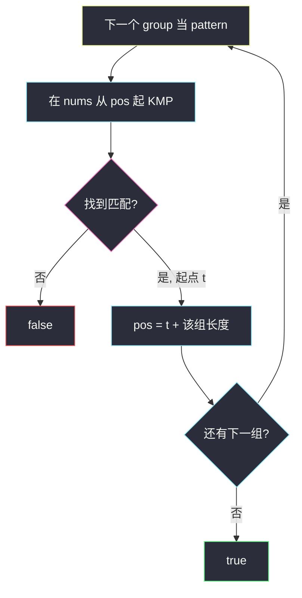
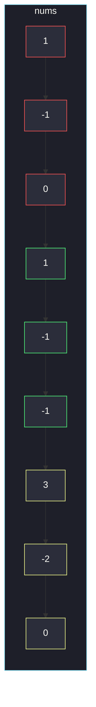

# 通过连接另一个数组的子数组得到一个数组（顺序 KMP）

## 一、问题描述

二维数组 `groups`（长度 `m`）和一维数组 `nums`。问能否从 `nums` 里选出 **m 段互不重叠** 的子数组，依次等于 `groups[0]`、`groups[1]`、…、`groups[m-1]`。段与段之间可以有空隙，但相对顺序必须与 `groups` 一致。

> 🔗 LeetCode 1764：https://leetcode.cn/problems/form-array-by-concatenating-subarrays-of-another-array/
>
> 数据范围：`1 ≤ m ≤ 10^3`，`groups` 总元素 ≤ `10^3`，`1 ≤ nums.length ≤ 10^3`，元素绝对值 ≤ `10^7`。
>
> 📚 灵茶题单：**§1 KMP（前缀的后缀）**。在 `nums` 上从左到右依次把每个 `group` 当 pattern 匹配；匹配成功后指针跳到这段末尾，再匹配下一组。不能重叠、不能换序。

**示例 1**

```
输入：groups = [[1,-1,-1],[3,-2,0]], nums = [1,-1,0,1,-1,-1,3,-2,0]
输出：true
解释：groups[0] 匹配 nums[3..5]，groups[1] 匹配 nums[6..8]，不相交且顺序正确。
```

**示例 2**

```
输入：groups = [[10,-2],[1,2,3,4]], nums = [1,2,3,4,10,-2]
输出：false
解释：两段都能在 nums 里找到，但 [10,-2] 出现在 [1,2,3,4] 后面，顺序反了。
```

**示例 3**

```
输入：groups = [[1,2,3],[3,4]], nums = [7,7,1,2,3,4,7,7]
输出：false
解释：若用 nums[2..4] 匹配第一组，剩下 [4,7,7] 拼不出 [3,4]；若让 [3,4] 去抢 nums[4]，会与第一组重叠。
```

**直观理解**

`groups` 是要按剧本出现的几段「镜头」，`nums` 是胶片。镜头之间可以有废片，但不能穿帮重叠，也不能把后面的镜头剪到前面。

---

## 二、暴力解法

从左到右处理每个 group：在 `nums[pos:]` 上朴素扫描第一个匹配位置。`n` 与 pattern 总长都 ≤ 1000，朴素 `O(n · |p|)` 累加仍是 `O(n²)` 级，能过。

```python
class Solution:
    def canChoose(self, groups: list[list[int]], nums: list[int]) -> bool:
        pos = 0
        n = len(nums)
        for g in groups:
            m = len(g)
            found = -1
            for i in range(pos, n - m + 1):
                if nums[i : i + m] == g:
                    found = i
                    break
            if found < 0:
                return False
            pos = found + m
        return True
```

### 🔴 瓶颈在哪里

数据范围够小，朴素能过。要对齐 §1，应把「在剩余后缀上找 pattern」换成 KMP：失配时用 `nxt` 跳，避免指针只回退 1 格。贪心选**最左**匹配是对的——越早结束，后面剩余越长。

---

## 三、优化探索（核心章节）

> 📚 本题在灵茶题单中属于 **§1 KMP（前缀的后缀）**。标准「文本里找 pattern」做 m 次，文本起点每次接到上一次匹配的右端。

### 3.1 为什么最左匹配就够

若 `groups[i]` 在剩余段有多个出现位置，选更靠右的只会让给后面的空间变短，不会让「后面某组从不可行变可行」。提示 2：能匹配时选第一处，留给后续的后缀最长。因此外层对 groups 扫一遍、内层找 earliest match，没有回头重试。

### 3.2 KMP：nxt 与匹配指针 j

对当前 pattern `p`：

- `nxt[i]` = `p[0..i]` 的最长真前缀且等于真后缀的长度
- 文本下标 `i` 从 `start` 走到 `n-1`，`j` 是已经匹配的 pattern 前缀长度
- `nums[i] == p[j]` 则 `j += 1`；`j == len(p)` 时在 `i - len(p) + 1` 处命中
- 失配且 `j > 0` 时 `j = nxt[j-1]`，不必把 `i` 回退

数组元素当「字符」比，值域很大没关系，KMP 只要求相等性。



### 3.3 一句话核心

> **按 groups 顺序，每次在剩余 nums 上 KMP 找最左匹配，命中后指针跳到这段后面；中途找不到就 false。**

---

## 四、代码实现

### Python（主解：逐组 KMP）

```python
class Solution:
    def canChoose(self, groups: list[list[int]], nums: list[int]) -> bool:
        def build_nxt(p: list[int]) -> list[int]:
            m = len(p)
            nxt = [0] * m
            j = 0
            for i in range(1, m):
                while j and p[i] != p[j]:
                    j = nxt[j - 1]
                if p[i] == p[j]:
                    j += 1
                nxt[i] = j
            return nxt

        def find(p: list[int], start: int) -> int:
            m = len(p)
            if m == 0:
                return start
            nxt = build_nxt(p)
            j = 0
            for i in range(start, len(nums)):
                while j and nums[i] != p[j]:
                    j = nxt[j - 1]
                if nums[i] == p[j]:
                    j += 1
                if j == m:
                    return i - m + 1
            return -1

        pos = 0
        for g in groups:
            t = find(g, pos)
            if t < 0:
                return False
            pos = t + len(g)
        return True
```

`nums[i : i+m] == g` 的朴素版见第二章，默写 KMP 时 `nxt` 用「前后缀长度」这一档即可（与 `next[0] = -1` 的写法等价）。

**变量含义**

| 写法 | 含义 |
|------|------|
| `nxt[i]` | `p[0..i]` 最长真前后缀长度 |
| `j` | 当前已匹配的 pattern 前缀长度 |
| `i` | 文本（nums）下标 |
| `pos` | 下一组允许的最早起点（上一段的右端开区间） |

---

## 五、具体例子演示

**示例 1**：`groups = [[1,-1,-1],[3,-2,0]]`，`nums = [1,-1,0,1,-1,-1,3,-2,0]`。

第一组 `p = [1,-1,-1]`。自匹配：`1,-1,-1` 没有任何真前缀等于真后缀，`nxt = [0, 0, 0]`。从 `start = 0` 逐步走 `i / j`：

| i | nums[i] | 失配处理 | j 变化 | 含义 |
|---|---------|----------|--------|------|
| 0 | 1 | 相等 | 0 → 1 | 吃到 p[0] |
| 1 | -1 | 相等 | 1 → 2 | 吃到 p[1] |
| 2 | 0 | `0 != p[2](-1)`，`j=nxt[1]=0`，再比 `0 != p[0]` | 2 → 0 | 开头那段 `[1,-1,0]` 不是目标 |
| 3 | 1 | 相等 | 0 → 1 | 重新咬住 |
| 4 | -1 | 相等 | 1 → 2 | |
| 5 | -1 | 相等 | 2 → 3 = m | **命中起点 3** |

`pos` 跳到 `3+3=6`。第二组 `p = [3,-2,0]`，`nxt = [0,0,0]`，从 i=6：

| i | nums[i] | j 变化 |
|---|---------|--------|
| 6 | 3 | 0 → 1 |
| 7 | -2 | 1 → 2 |
| 8 | 0 | 2 → 3 = m，命中起点 6 |

两组接龙成功，true。对拍官方。



红节点是第一次咬了两口又在 `0` 上掉下来的前缀；绿是 `groups[0]`；黄是 `groups[1]`。中间的 `0` 是允许的空隙。

**示例 2**：`groups = [[10,-2],[1,2,3,4]]`，`nums = [1,2,3,4,10,-2]`。第一组最左匹配在下标 4，`pos = 6` 已经到末尾，第二组找不到，false。若颠倒 groups 顺序本可以，但题目不允许。对拍官方 false。

**示例 3**：`groups = [[1,2,3],[3,4]]`，`nums = [7,7,1,2,3,4,7,7]`。第一组最左匹配下标 2，`pos = 5`，剩余 `[4,7,7]` 对不上 `[3,4]`。共享 `nums[4]=3` 会重叠，非法。对拍官方 false。

**边界**：`groups` 只有一组且等于整个 `nums` → true；某一组比剩余后缀还长 → false。

---

## 六、复杂度分析

| 方法 | 时间 | 空间 | 说明 |
|------|------|------|------|
| 朴素逐组扫描 | `O(n · Σ\|g\|)` | `O(1)` 额外 | `n` 与总长均 ≤ 1000，能过 |
| 逐组 KMP（主解） | `O(n · m + Σ\|g\|)` 量级 | `O(max \|g\|)` | 每组建 nxt + 从当前 pos 扫到末尾 |

最坏每组都从很早的 pos 扫到结尾（一直找不到再失败），文本可能被扫多轮，仍远小于 10⁶。空间只为当前 pattern 存 `nxt`。

---

## 七、对比总结

| 维度 | 朴素双指针 | KMP |
|------|------------|-----|
| 失配后 | i 只前进 1，pattern 从头比 | `j` 跳到 `nxt[j-1]` |
| 本题范围 | 够用 | 对齐 §1 模板 |
| 重叠 | 外层 `pos = t + \|g\|` 禁止重叠 | 同左，与 KMP 内部的「pattern 自重叠」不是一回事 |

KMP 的 nxt 允许 **pattern 内部** 重叠地加速匹配；**两组之间** 仍然硬性不重叠——命中后 `pos` 直接加 `len(g)`，不会从命中区间内部开始下一组。

**易错点**

1. **匹配成功后 `pos = t+1`**：那会允许重叠，示例 3 会误判 true。
2. **不按 groups 顺序、全局搜所有组**：示例 2 会误判 true。
3. **在整段 nums 上找而忘记 start**：前面用过的前缀不能再用。
4. **`nxt` 建错成字符串模板却拿来比 int**：模板通用，只是把 `s[i]` 换成 `p[i]`。
5. **找到任意匹配而不是最左**：本题最左是正确贪心；找最右会让后续更挤，可能假阴性。

---

## 八、举一反三

| 题目 | 关系 |
|------|------|
| [28. 找出字符串中第一个匹配项的下标](https://leetcode.cn/problems/find-the-index-of-the-first-occurrence-in-a-string/) | 单次 KMP，本题是「多次、且匹配区间左闭右开接龙」 |
| [459. 重复的子字符串](https://leetcode.cn/problems/repeated-substring-pattern/) | `nxt` 的周期推论 |
| [1392. 最长快乐前缀](https://leetcode.cn/problems/longest-happy-prefix/) | `nxt[n-1]` 就是答案 |
| [686. 重复叠加字符串匹配](https://leetcode.cn/problems/repeated-string-match/) | 文本不够就复制，再 KMP |
| [187. 重复的 DNA 序列](https://leetcode.cn/problems/repeated-dna-sequences/) | 同属字符串①：哈希看「出现两次」；本题 KMP 看「按序出现」 |

**思想迁移**

- 多段 pattern 要保序、不重叠：外层贪心最左，内层单模式匹配（朴素或 KMP）。
- 口诀：**「一组一组从左啃；KMP 找最早命中，pos 跳到段尾再往下。」**
