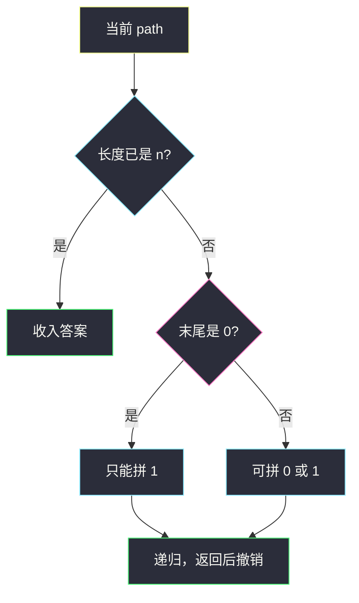
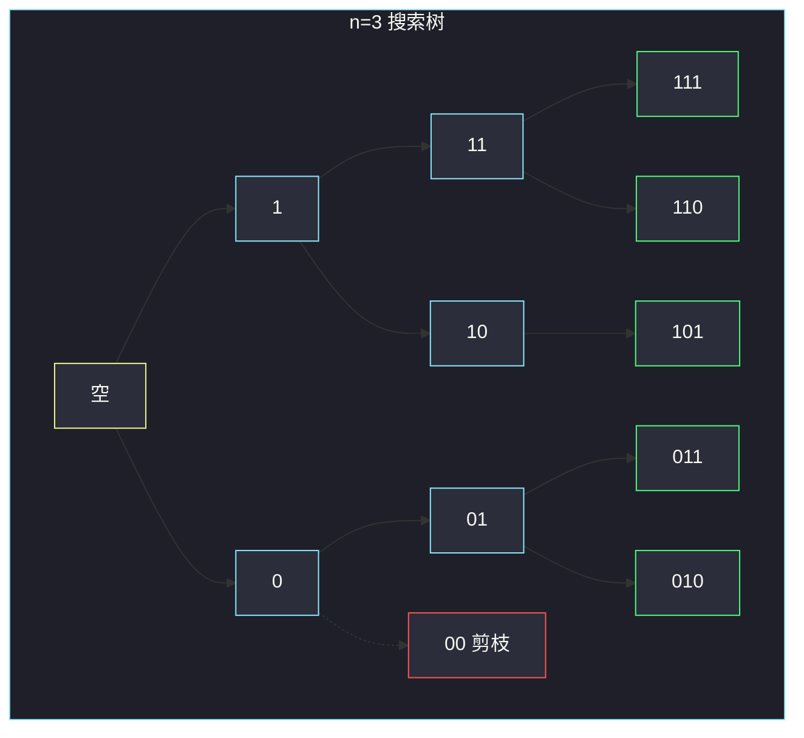

# 生成不含相邻零的二进制字符串（末位约束回溯）

## 一、问题描述

给定正整数 `n`，请生成所有长度为 `n` 的二进制字符串，使得**没有相邻的两个 `0`**（等价：每个长度为 2 的子串都至少含一个 `1`）。返回任意顺序。

> 🔗 LeetCode 3211：https://leetcode.cn/problems/generate-binary-strings-without-adjacent-zeros/
>
> 📚 灵神题单：**回溯 · §4.7 搜索**
>
> 数据范围：`1 ≤ n ≤ 18`。

**示例 1**

```
输入：n = 3
输出：["010","011","101","110","111"]
解释：长度为 3 的 8 个串里，"000"、"001"、"100" 含有 "00"，不合法。
```

**示例 2**

```
输入：n = 1
输出：["0","1"]
解释：单字符谈不上相邻，两个都合法。
```

**直观理解**

从左往右填 0/1。若上一位是 `1`（或还没有上一位），下一位 0、1 都行；若上一位是 `0`，下一位**只能填 1**。这就是 §4.7 的「做选择 → 递归 → 撤销」：非法选择根本不进递归，不必生成后再过滤。

合法串数量是斐波那契：`a(1)=2, a(2)=3, a(n)=a(n-1)+a(n-2)`（末位 1 可接任意合法 n−1 前缀；末位 0 则倒数第二必须是 1）。`n = 18` 时 `a(18)=6765` 条，枚举完全可接受。

---

## 二、暴力解法

生成全部 `2^n` 个二进制串，丢掉含 `"00"` 的。`n ≤ 18`，`2¹⁸ = 262144`，能过，但做了大量废功：一旦出现 `00`，后面 `n-i` 位怎么填都救不回来。

```python
class Solution:
    def validStrings(self, n: int) -> List[str]:
        ans = []
        for mask in range(1 << n):
            s = format(mask, f"0{n}b")
            if "00" not in s:
                ans.append(s)
        return ans
```

### 复杂度

- **时间**：`O(n · 2^n)`（每个掩码扫一遍字符串）。
- **空间**：`O(n · a(n))` 存答案，`a(n)` 为合法条数。

### 🔴 瓶颈在哪里

合法选择在每一位是局部的：只看「现在末尾是不是 0」。回溯按这个约束长串，搜索树大小就是 `O(a(n))` 量级，而不是 `2^n`。`n = 18` 时从 `2^18=262144` 降到 `a(18)=6765` 条路径。

---

## 三、优化探索（核心章节）

> 📚 对齐灵神 **§4.7 搜索**：当前位置有 2 个候选（填 0 / 填 1），但受「不能相邻 0」约束，有的分支直接剪掉。标准骨架是「选 → 递归 → 撤销」。

### 3.1 选择规则

路径用列表或字符串 `path` 表示已经填好的前缀。

- 若 `path` 为空，或 `path[-1] == '1'`：可追加 `'0'` 或 `'1'`
- 若 `path[-1] == '0'`：只能追加 `'1'`

`len(path) == n` 时收进答案。

撤销：递归返回后 `path.pop()`（若用字符串拼接，每次生成新串，可省略 pop，代价是更多短串拷贝；`n = 18` 两种都行。默写推荐列表 + pop）。



### 3.2 迭代扩展

从长度 1 的 `["0","1"]` 开始，每一轮只在旧串后面接合法的一位：一律可接 `1`；末位是 `1` 时再接一个 `0`。`n-1` 轮后即全部长度 `n` 的合法串。和回溯生成的集合相同，只是按层扩张（BFS 式），没有递归栈。

### 3.3 一句话核心

> **末尾是 0 只能再拼 1；末尾是 1（或空串）可拼 0 或 1。做选择、递归、撤销。**

---

## 四、代码实现

### Python（主解：回溯）

```python
class Solution:
    def validStrings(self, n: int) -> List[str]:
        ans: List[str] = []
        path: List[str] = []

        def dfs() -> None:
            if len(path) == n:
                ans.append("".join(path))
                return
            # 总能填 1
            path.append("1")
            dfs()
            path.pop()
            # 空串或末尾是 1 才能填 0
            if not path or path[-1] == "1":
                path.append("0")
                dfs()
                path.pop()

        dfs()
        return ans
```

**变量含义**

| 变量 | 含义 |
|------|------|
| `path` | 当前正在构造的前缀 |
| `ans` | 长度已达 `n` 的合法串 |
| 先 1 后 0 | 只影响输出顺序，不影响集合 |

### 可选：迭代扩展

```python
class Solution:
    def validStrings(self, n: int) -> List[str]:
        cur = ["0", "1"]
        for _ in range(n - 1):
            nxt = []
            for s in cur:
                nxt.append(s + "1")
                if s[-1] == "1":
                    nxt.append(s + "0")
            cur = nxt
        return cur
```

`n = 1` 时循环 0 次，直接返回 `["0","1"]`。

---

## 五、具体例子演示

`n = 3`，按主解「先 1 后 0」展开。每一步写出当前 `path`。

**从空串出发**

```
"" ─┬─ 拼 1 → "1"
    └─ 拼 0 → "0"
```

**前缀 `"1"`**（末尾 1，0/1 都能拼）

```
"1" ─┬─ "11" ─┬─ "111" ✓
     │        └─ "110" ✓
     └─ "10" ─┬─ "101" ✓
              └─ "100" ✗ 剪掉：末尾已是 0，不再拼 0
```

**前缀 `"0"`**（末尾 0，只能拼 1）

```
"0" ── "01" ─┬─ "011" ✓
             └─ "010" ✓
     （没有 "00…" 分支）
```

得到 `111, 110, 101, 011, 010`。与示例集合相同（顺序因先 1 后 0 而不同，题面允许）。

| 步 | path | 选择 | 下一 path | 备注 |
|----|------|------|-----------|------|
| 1 | `""` | 1 | `"1"` | 空串两种都行 |
| 2 | `"1"` | 1 | `"11"` | |
| 3 | `"11"` | 1 | `"111"` | 收进答案 |
| 4 | `"11"` | 0 | `"110"` | 收进答案 |
| 5 | `"1"` | 0 | `"10"` | |
| 6 | `"10"` | 1 | `"101"` | 不能再拼 0 |
| 7 | `""` | 0 | `"0"` | |
| 8 | `"0"` | 1 | `"01"` | 不能拼 0 |
| 9 | `"01"` | 1 / 0 | `"011"` / `"010"` | 两个答案 |



对拍暴力：掩码过滤得到的集合同样是这 5 个串。

---

## 六、复杂度分析

| 方法 | 时间 | 空间 | 说明 |
|------|------|------|------|
| 枚举 `2^n` 再过滤 | `O(n · 2^n)` | `O(n · a(n))` | n≤18 能过 |
| 回溯 / 迭代扩展（主解） | `O(n · a(n))` | 递归 `O(n)` + 答案 | `a(n)` 约斐波那契，`a(18)=6765` |

`a(n) = a(n-1) + a(n-2)`，`a(1)=2`，`a(2)=3`。构造每个串要 `O(n)` 拼接，故乘 `n`。输出本身就要这么大，无法更低。

---

## 七、对比总结

| 维度 | 先生成再过滤 | 约束回溯 |
|------|--------------|----------|
| 搜索树 | 满二叉树 `2^n` | 非法边不长 |
| 与 §4.7 | 不是搜索剪枝 | 选/不选（这里是选 0 / 选 1） |
| `n=1` | 特殊也成立 | 空 path 两种选择 |

**易错点**

1. **第一位不能填 0**：第一位没有「左边的 0」，0 和 1 都合法。
2. **忘记撤销**：`path.append` 后必须 `pop`，否则后续分支共用脏前缀。
3. **用 `'00' not in path` 事后检查却仍去搜 0 接 0**：能过但浪费；应在选择处剪。
4. **迭代版 `n=1` 还去循环**：`range(n-1)` 为 0 次，保持 `["0","1"]` 即可，不要写成从空串扩。
5. **要求字典序**：题面顺序任意；若OJ 对拍本地集合，用 `set` 比。

**模板（§4.7 做选择 → 递归 → 撤销）**

```python
path.append(x)
dfs()
path.pop()
```

本题的「不能选」写在 `if` 里：末尾为 0 时不把 0 压进去。

---

## 八、举一反三

| 题目 | 关系 |
|------|------|
| [22. 括号生成](https://leetcode.cn/problems/generate-parentheses/) | 同样按约束长串（左括号数、右括号数），回溯骨架相同 |
| [967. 连续差相同的数字](https://leetcode.cn/problems/numbers-with-same-consecutive-differences/) | 下一位必须与末位差为 k，也是「末位决定选择」 |
| [784. 字母大小写全排列](https://leetcode.cn/problems/letter-case-permutation/) | 每位 1～2 个选择，无剪枝的搜索 |
| [600. 不含连续 1 的非负整数](https://leetcode.cn/problems/non-negative-integers-without-consecutive-ones/) | 计数字位 DP，约束对偶（本题是连续 0） |
| [198. 打家劫舍](https://leetcode.cn/problems/house-robber/) | 「不能相邻」的计数/最值版；本题是把方案全部列出来 |

**思想迁移**

- 生成型搜索先写清「这一位的合法字符集」，非法选择不要进递归。
- 口诀：**「末尾 0 只能跟 1；末尾 1 随便跟；拼上去、递归、再弹掉。」**
