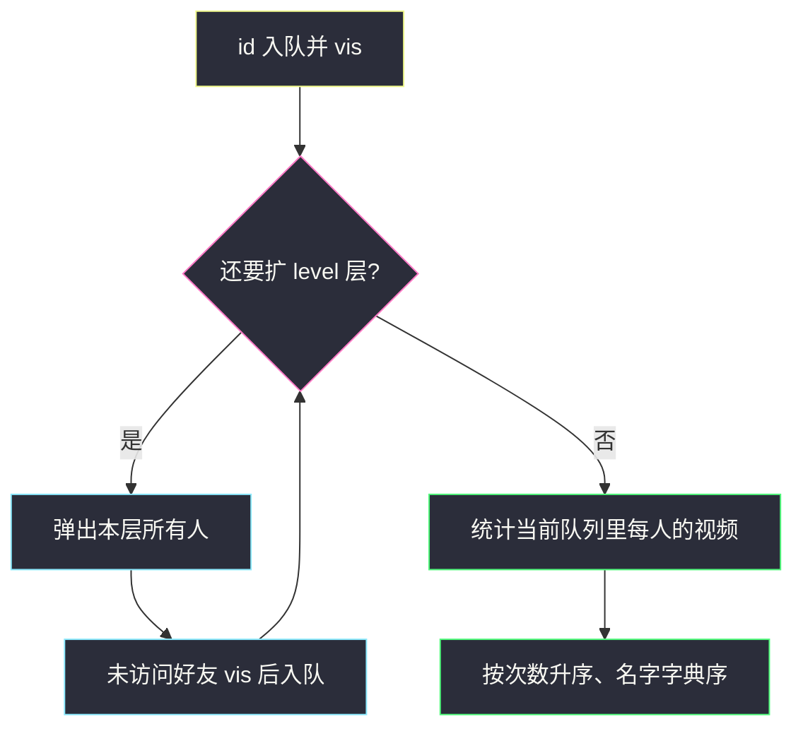
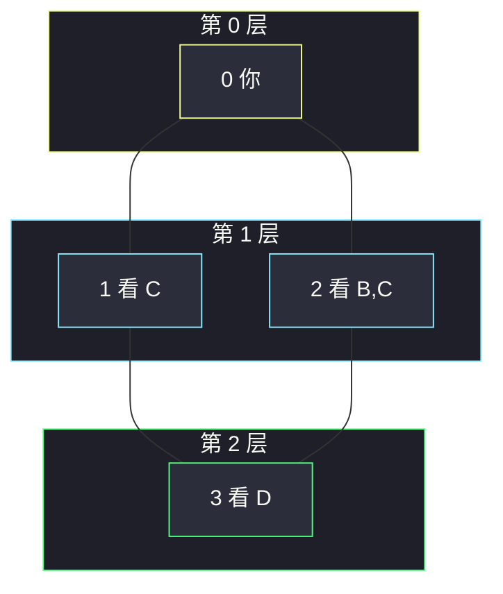

# 获取你好友已观看的视频（BFS 到第 k 层再计数）

## 一、问题描述

`n` 个人，编号 `0 .. n-1`。`friends[i]` 是 i 的好友列表（无向：i 是 j 的好友则 j 也是 i 的）。`watchedVideos[i]` 是 i 看过的视频名。给定你的 `id` 和整数 `level`，找出 **最短距离恰好为 level** 的那些人看过的全部视频，按出现次数升序；次数相同按名字字典序。

> 🔗 LeetCode 1311：https://leetcode.cn/problems/get-watched-videos-by-your-friends/
>
> 数据范围：`2 ≤ n ≤ 100`，`1 ≤ level < n`，视频名长度 ≤ 8。好友关系对称。
>
> 📚 灵茶题单：**图论 · §1.2 广度优先搜索（BFS）**（1653 分）。

**示例 1**

```
输入：watchedVideos = [["A","B"],["C"],["B","C"],["D"]]
     friends = [[1,2],[0,3],[0,3],[1,2]], id = 0, level = 1
输出：["B","C"]
距离 1：好友 1 看 C，好友 2 看 B、C。次数 B=1、C=2，次数少的在前。
```

**示例 2**

```
输入：同上，id = 0, level = 2
输出：["D"]
距离 2 只有 3 号，看过 D。
```

**直观理解**

好友图是无向图。从 `id` 做 BFS，第 `level` 层的人就是「level 级好友」。只收集 **这一层** 的视频，不要把更近的人看过的混进来。同一层两个人看了同一个视频，次数加 2。层内的人用 `visited` 去重，避免从两条路径把同一个人算两次。

官方数据 `level ≥ 1`；算法上 `level = 0` 就是你自己看过的视频，写法不用改。

---

## 二、暴力解法

DFS 带当前深度，深度等于 `level` 时把视频加进计数器。DFS **不保证** 第一次到达某点就是最短路：可能先绕远路以深度 `level` 走到一个其实更近的人，错误地收了他的视频；也可能同一人被两条深度同为 `level` 的路径加两次。要额外维护 `dist[]`，第一次到达才更新——那已经是 BFS 在做的事。

```python
# 伪代码：dfs(u, d)；d==level 时 cnt.update(videos[u])
# 必须 dist[u] 记录最短，否则会把近的人当成 level 级。
```

### 复杂度

- **时间**：不记最短时指数；记下之后仍不如按层 BFS 干净。
- **空间**：递归栈 `O(n)`。

### 🔴 瓶颈在哪里

「最短距离 = k」是 BFS 的定义。按层扩展，扩 `level` 轮后队列里剩的就是答案人群。

---

## 三、优化探索（核心章节）

> 📚 本题在灵茶题单中属于 **§1.2 BFS**。`friends` 已是邻接表；从 id 走恰好 level 层，对队列里的人统计视频再排序。

### 3.1 按层走 level 步

```
q = [id]，标记 id 已访问
重复 level 次：
    把当前队列里的人全部弹出，把未访问的好友入队
结束后 q 里就是距离恰好为 level 的人
```

入队即 `visited`：保证每个人出现在 **最早** 的那一层。近路的好友不会在更远的层再出现。

同层去重也靠它：A 的两个好友都认识 B 时，B 只进队一次，视频不会按「路径条数」翻倍。题目要的是「这些人看过什么」，按人收集，不是按路径收集。

`friends` 已经是无向邻接表，不用根据边再建图。

不要把「level 以内」的视频并起来：0 自己看的 A、B 在 level=1 时必须丢掉。BFS 按层扩张天然把更近的人留在更早的队列快照里，扩完 level 轮后它们已经出队。

### 3.2 计数与排序

`Counter` 扫这些人的 `watchedVideos`。排序键 `(次数, 名字)`：次数升序，次数相同名字升序。

一个人列表里同一视频出现两次会加两次；题面样例没有这种数据，按「出现几次算几次」写即可。



### 3.3 规模

`n ≤ 100`，BFS `O(n+m)`，视频总数 ≤ `100*100`，排序可忽略。

### 3.4 一句话核心

> **从自己 BFS 恰好 level 层，层内 vis 去重；只统计这一层的视频，按次数再按名字排序。**

---

## 四、代码实现

### Python（主解：按层 BFS）

```python
from collections import Counter, deque

class Solution:
    def watchedVideosByFriends(
        self,
        watchedVideos: list[list[str]],
        friends: list[list[int]],
        id: int,
        level: int,
    ) -> list[str]:
        n = len(friends)
        q = deque([id])
        vis = [False] * n
        vis[id] = True
        for _ in range(level):
            for _ in range(len(q)):
                u = q.popleft()
                for v in friends[u]:
                    if not vis[v]:
                        vis[v] = True
                        q.append(v)

        cnt = Counter()
        for u in q:
            cnt.update(watchedVideos[u])
        return sorted(cnt.keys(), key=lambda x: (cnt[x], x))
```

**变量含义**

| 变量 | 含义 |
|------|------|
| `vis` | 已经出现在某一层（最短距离已确定） |
| `q` | 循环结束后 = 距离恰好 `level` 的人 |
| `cnt` | 这些人对每个视频名的出现次数 |

外层循环次数就是 `level`：走 1 步得到 1 级好友，走 2 步得到 2 级。不要写成 `while dist < level` 却把 `dist` 跟节点绑错。

参数名 `id` 会盖住内置函数，LeetCode 签名如此，提交时保持即可。

### Java（可选）

```java
class Solution {
    public List<String> watchedVideosByFriends(
            List<List<String>> watchedVideos, int[][] friends, int id, int level) {
        int n = friends.length;
        ArrayDeque<Integer> q = new ArrayDeque<>();
        boolean[] vis = new boolean[n];
        q.add(id);
        vis[id] = true;
        for (int k = 0; k < level; k++) {
            int sz = q.size();
            for (int i = 0; i < sz; i++) {
                int u = q.poll();
                for (int v : friends[u]) {
                    if (!vis[v]) {
                        vis[v] = true;
                        q.add(v);
                    }
                }
            }
        }
        Map<String, Integer> cnt = new HashMap<>();
        for (int u : q) {
            for (String w : watchedVideos.get(u)) {
                cnt.merge(w, 1, Integer::sum);
            }
        }
        List<String> ans = new ArrayList<>(cnt.keySet());
        ans.sort((a, b) -> {
            int d = cnt.get(a) - cnt.get(b);
            return d != 0 ? d : a.compareTo(b);
        });
        return ans;
    }
}
```

---

## 五、具体例子演示

好友图是正方形：

```
0 — 1
|   |
2 — 3
```

`watchedVideos`：0:`A,B`　1:`C`　2:`B,C`　3:`D`。

### level = 1（示例 1）

| 层 | 队列 | 新 vis |
|----|------|--------|
| 0 | `[0]` | `{0}` |
| 扩 1 次 | 弹出 0，入队 1、2 | `{0,1,2}` |
| 结束 | `[1, 2]` | |

人 1 贡献 `C`，人 2 贡献 `B,C`。

| 视频 | 次数 |
|------|------|
| B | 1 |
| C | 2 |

排序：`(1, B)` 再 `(2, C)` → `["B","C"]`。A 是 0 自己看的，不在 level 1，不收。

### level = 2（示例 2）· 逐步队列

在 level=1 的队列 `[1, 2]` 上再扩一轮（`level` 循环第二次）：

| 弹出 | 好友 | 动作 |
|------|------|------|
| 1 | 0, 3 | 0 已 vis，跳过；3 未 vis → vis 后入队 |
| 2 | 0, 3 | 0、3 都已 vis，全部跳过 |

结束队列 `[3]`。只统计 3 的列表 `D` → `["D"]`。

3 有两条最短路 `0-1-3` 与 `0-2-3`，长度都是 2。若出队才标记，弹出 1 时 3 入队，弹出 2 时 3 再入队一次，`cnt["D"]` 会变成 2，答案仍碰巧是 `["D"]`，但换一组数据（3 看了两个不同视频或同一层两人）就会错。入队即 vis 从根上堵住。



### 次数相同按名字

若 level 1 两人分别看 `"K"` 和 `"A"`，次数都是 1，答案 `["A","K"]`，不是看谁先入队。

### level = 0

循环 0 次，队列仍是 `[id]`，统计自己的列表。官方约束没有 0，但和按层 BFS 兼容。

---

## 六、复杂度分析

| 方法 | 时间 | 空间 | 说明 |
|------|------|------|------|
| DFS 乱深度 | 易错且可能重复 | `O(n)` | 近的人会被远深度误收 |
| 按层 BFS（主解） | `O(n + m + V log V)` | `O(n+V)` | `V` 为该层视频种类 |

`m` 为好友边数，无向每条边在邻接表里出现两次。`n ≤ 100` 无需优化。

---

## 七、对比总结

| 维度 | DFS 带深度 | 按层 BFS |
|------|------------|----------|
| 最短距离 | 要自己维护 dist | 层号就是距离 |
| 同一人多路径 | 容易重复计数 | vis 入队一次 |
| 收集范围 | 容易混进别的层 | 循环结束时队列即该层 |

**易错点**

1. **没收 vis**：同层或跨层把一个人加两次，视频次数翻倍。
2. **统计了所有 ≤ level 的人**：题目是恰好 k，不是 k 以内。
3. **排序只按名字或只按次数**：必须次数第一键、名字第二键，都是升序。
4. **把 `friends` 当成有向图只走一边**：题保证对称，邻接表已是双向；不要自己再漏建反边。
5. **level 轮写成 `while q` 一直扩到空**：那是整图遍历，层数全混在一起。必须只扩 `level` 轮。
6. **出队才 vis**：同一层两个好友都指向 3，3 会进队两次。入队即 vis。

---

## 八、举一反三

| 题目 | 关系 |
|------|------|
| [863. 二叉树中所有距离为 K 的结点](https://leetcode.cn/problems/all-nodes-distance-k-in-binary-tree/) | 同样 BFS 到第 K 层，只是树要先加父边 |
| [752. 打开转盘锁](https://leetcode.cn/problems/open-the-lock/) | 按层 BFS 求最短步数。见 [open-the-lock.md](./open-the-lock.md) |
| [841. 钥匙和房间](https://leetcode.cn/problems/keys-and-rooms/) | BFS/DFS 遍历，不按层收集。见 [keys-and-rooms.md](./keys-and-rooms.md) |
| [429. N 叉树的层序遍历](https://leetcode.cn/problems/n-ary-tree-level-order-traversal/) | `for _ in range(len(q))` 按层模板相同 |
| [310. 最小高度树](https://leetcode.cn/problems/minimum-height-trees/) | 无向图按层剥叶子，也是层序 |

**思想迁移**

- 「第 k 层好友 / 距离恰好为 k 的点」一律 BFS 按层，不要 DFS 赌深度。
- 口诀：**「从自己走恰好 k 层，层内 vis 去重；视频按次数再按名字排。」**
